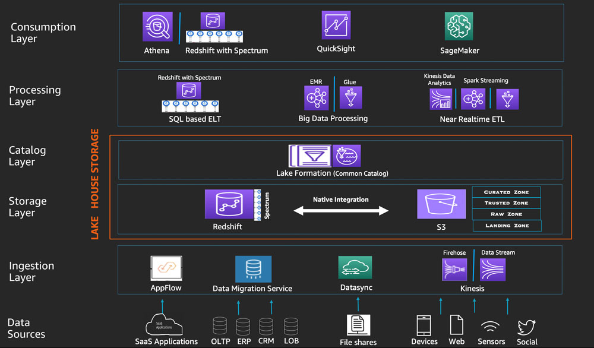

# 1. 数据湖

**本文来源微信公众号：大鱼的数据人生**

转载自：[到底什么是数据湖？全面解读数据湖的缘起、特征、技术、案例和趋势](https://blog.csdn.net/qq_36213530/article/details/121360407)

数据湖近几年迅速蹿红，今天笔者做一个综述，包括数据湖的缘起、数据湖的定义、数据湖的特征、数据湖的技术、数据湖的趋势和数据湖的案例六大部分，如果你要入门数据湖，一定要看一看。

注：文末列出了所有参考文献，方便你拓展阅读，并附有**《阿里云原生数据湖解决方案蓝皮书》**、**《华为DLI数据湖探索产品介绍》**PDF下载。

## 一、数据湖的缘起

10年前，Pentaho公司（一家开源BI公司）的CTO詹姆斯·迪克森在他的博客中第一次提出“数据湖”（Data Lake）的概念；10年后的今天，在业界“数据中台”大火的时代背景下，再来讨论“数据湖”，应该别有一番韵味。

1、从事务系统到数据仓库

要了解数据湖的来龙去脉，首先得提数据仓库的缘起[1][2]。

“数据仓库”，由比尔·恩门（Bill Inmon）于1990年提出，其被广泛接受的定义是，一个**面向主题的**、**集成的**、**相对稳定的**、**反映历史变化**的**数据集合**，用于支持管理决策，通常也被认为是决策支持型应用的必要条件。

此处的定义大多都是针对事务型数据系统而制定的。所谓事务型数据系统，是指记录业务交易的系统，这个名词先是在金融业，特别是银行实施信息化IT系统时使用的。例如银行的交易流水数据库，每分每秒都有大量的交易被数据库所记录并持久化的保存下来，其最小的颗粒度就是一笔“交易”。

但事务性数据系统存在诸多**劣势**：试想，如果一个银行的分行长想知道今天到目前为止共有多少现钞存款入账，那么系统就需要遍历今天截止到目前的所有交易行为，并筛选其中的存款行为进行汇总。查询交易的行为需要遍历当前系统的所有记录，因此当这一行为频率变高时，会对数据系统造成巨大的读取压力。

除开查询或分析任务对事务型数据系统造成的资源压力外，系统执行任务时，返回的结果只代表着任务开始运行那一刻的数据状态，假设执行查询任务消耗了1分钟，这1分钟内很有可能发生多次的交易撤销、额度修改，增加交易等行为。有些数据系统允许在读取数据的同时写入数据，那么**查询任务返回的结果并不能代表最新的状态**；有些数据系统则有“读锁”，即在读取数据的时候不允许写入数据，那么这个长达1分钟的查询任务会使得业务交易失败或者暂缓进入数据系统，如果其中发生业务中断，这些交易数据可能面临丢失的风险。

**当然，我们可以通过技术手段来避免或缓解事务型数据系统的不足，因此事务型的数据库并不是不能做业务分析，只是当决策者需要进行经营性的分析和决策时，大多数时候它并非最优方案。此时，数据仓库面向主题且便于分析的优势就体现出来了**：

数据仓库是面向分析的集成化数据平台，分析的结果给企业提供决策支持。企业中一般先有数据库，然后有数据仓库；可以没有数据仓库，但是不能没有数据库。

- **数据仓库本身不生产数据**

> 其分析的数据来自于企业各种数据源
> 企业中常见的数据源
> RDBMS关系型数据库--->业务数据
> log file--->日志文件数据
> 其他数据

**数据仓库本身也不消费数据**，其分析的结果给外部各种数据应用（`Data application`）来使用。

> `Data visualization （DV）`数据可视化
> `Data Report` 数据报表
> `Data Mining（DM）`数据挖掘
> `Ad-HOC` 即席查询

**数据仓库的特征**：

- **数据仓库是面向主题的**。相对于事务型系统将交易类型（存款）、交易币种（人民币或外币）、交易数值（存款额）以一条事务（Transcation）的方式存储，数据仓库通常会将一条事务中的不同信息拆分到不同的主题域中分别存储，例如交易类型表、交易币种表和交易额度表等。

  **理解**：

  > 面向主题性：在数仓中开展分析，首先确定分析的主题，然后基于主题寻找，采集跟主题相关的数据，一个分析的主题可以对应多个数据源。
  >
  > **例子**：
  >
  > 如果"产品分析"是一个分析领域，"产品分析"所涉及到的分析对象为商品、地域、时间、类别等，那么数仓的主题可以确定为商品主题、地域主题、时间主题、类别主题，"产品分析"可以作为一个**主题域**。
  >
  > 所以，这里的主题我觉的可以理解成一个分析的维度，比如商品主题就是以商品为维度来分析商品的，比如销售总额，销售量，等等。
  >
  > 

  **主题和主题域**：

  > 主题上面讲了，这里主要讲主体域。
  >
  > 我理解就是将多个不同的主题划分到一类。这一类主题就属于这一主题域。
  >
  > 主题域的划分方法：
  >
  > - 按照所属业务系统划分
  >
  >   
  >
  > - 按照业务(功能模块/业务线)或业务过程划分
  >
  >   
  >
  > - 按照部门划分
  >
  >   

  数据域：

  > 数据域是指面向业务分析，将业务过程或者维度进行抽象的集合。为保障整个体系的生命力，数据域需要抽象提炼，并长期维护更新。在划分数据域时，既能涵盖当前所有的业务需求，又能让新业务在进入时可以被包含进已有的数据域或扩展新的数据域。数据域的划分工作可以在业务调研之后进行，需要分析各个业务模块中有哪些业务活动。我个人理解其实主题域和数据域差异不大，在实际过程中可以把主题域和数据域都当做一种域来处理了，不必纠结。
  >
  > 

- **数据仓库是集成的**。不同主题域中的信息之间以统一的ID，如交易流水号为标识进行链接。这样的好处是当分行长想知道今天到目前为止一共有多少人民币存款入账时，只需要先筛选出交易类型为存款，交易币种为人民币的交易流水号，再基于这些流水号去汇总交易额度，比起原先需要遍历全部交易记录后才能汇总的方式大大节约了系统资源的开销。

  理解：

  > 集成性：确定主题之后，需要把和主题相关的数据从各个数据源集成过来。因为同一个主题的数据可能来自不同的数据源，它们之间会存在着差异（异构数据）诸如字段同名不同意、单位不统一、编码不统一；因此在集成的过程中需要进行ETL（抽取、转换、加载）

- **数据仓库是相对稳定的**。数据仓库通常以时间窗口作为数据批量导入的分区，例如每一小时或一天从事务型系统导入一次数据，在下一次数据导入任务开始之前，系统处于一个相对稳定的状态，有利于进行经营性的业务分析。

  理解：

  > 

- **数据仓库是反映历史变化的**。正是由于通常数据仓库中的数据是基于预先设定好的时间窗口从事务型系统中获取数据，无论是一分钟、一小时还是一天、一周，它都是可以反映数据整体历史变化的，分行长可以清楚地知道今天银行的人民币存款入账环比昨天增长或减少了多少，同比上个月的今天又发生了什么变化。

  理解：

  > 时变性：数仓是一个持续维护建设的东西。站在时间的角度，数仓的数据成批次变化更新。一天一分析（T+1）、一周一分析（T+7）等（上述所讲的更多偏向于离线数仓，当下还有比较火的实时数仓）

- 不可更新性：数仓上面的数据几乎没有修改操作，都是分析的操作。数仓是分析数据规律的平台，不是创造数据规律的平台。（注意：改指的数据之间的规律不能修改。当下发现有些时间也是需要修改的，数据校正。数据缓慢变化）

因此，比起事务型的数据系统，数据仓库能更有效地对业务数据进行统计分析，无论是在提高效率、稳定性还是降低资源成本上都有其优势，所以被广为接受而大行其道。

2、从数据仓库到数据集市

后来，数据仓库领域的大师Ralph Kimball又演化出“维度建模”的概念，认为数据仓库是一系列数据集市的集合。**如果说数据仓库中包含着许多不同的主题域，那么数据集市可以理解为主要面向业务应用的单一主题域**。

比如，分行长可以建设面向存储部门的、专门提供存款数据的“存款数据集市”，面向商业贷款部门的“贷款数据集市”，面向信用卡部门的“信用卡数据集市”等，其数据都源自数据仓库，但数据集市的汇总程度更高、更注重业务表示。例如“环比存款增长率”这个指标在数据仓库中可能表示为“上月存款额”和“本月存款额”两个不同的数值，而在数据集市或者数据仓库的“集市层”中，就表示为计算后的一个数值，可以直接被业务所用而无需再做多余的计算。

3、数据湖的由来

数据湖最早是由Pentaho的创始人兼CTO， 詹姆斯·迪克森，在2010年10月纽约Hadoop World大会上提出来的。当时Pentaho刚刚发布了Hadoop的第一个版本。在这样的一个大背景下，可以合理的猜测，当时James Dixon提出数据湖的概念，是为了推广自家的Pentaho产品以及Hadoop的。

Pentaho是个BI分析组件。当时的BI分析主要是基于数据集市（Data Mart）的。数据集市的建立需要事先识别出感兴趣的字段、属性，并对数据进行聚合处理。这样BI分析面临两个问题：

（1）只使用一部分属性，这些数据只能回答预先定义好（pre-determined）的问题。

（2）数据被聚合了，最低层级的细节丢失了，能回答的问题被限制了。

而基于Hadoop的BI分析，可以解决这个问题——把所有数据都原样存在Hadoop中，后面需要的时候再来取用。**如果说数据集市、数据仓库里面是瓶装的水——它是清洁的、打包好的、摆放整齐方便取用的；那么数据湖里面就是原生态的水——它是未经处理的，原汁原味的。数据湖中的水从源头流入湖中，各种用户都可以来湖里获取、蒸馏提纯这些水（数据）**。

接下来发生的事件让数据湖的内涵获得了拓展，这是詹姆斯·迪克森没想到的。

2011年，福布斯在文章《Big Data Requires a Big, New Architecture》中报道了“data lake”这个词，并给出了数据仓库与数据湖的对比：**数据仓库的数据在被集成时就会被预先分类，并以最优的方式进行存储，以支撑特定的分析；但在大数据时代，我们从源系统抽取数据时可能无法明确知道这些数据的价值，因此无法给出一个最优的存储方式**。

例如，分行长从交易系统中将所有的数据都抽取过来，但并不知道业务部门想做什么类型反映业务历史的变化。因此建议将这些数据先保存在一个海量的数据库中。由于数据来源的格式五花八门而且会越存越多，因此这个数据库需要具备容易访问且存储成本低（允许硬件资源扩容的成本而尽可能降低其他成本，例如软件使用费用、人工维护费用等）的特性，需要进行分析时，再来组织和筛选所需数据，这个数据库就是数据湖（Data Lake）。

彼时的数据湖概念更多地是关于当企业在处理海量异构的数据时，如何在数据产生实际的应用价值之前，为海量数据构建一个易访问且成本低的存储方式，和数据资产化、资产服务化等当下热点名词并没有太大关系。

2014年，福布斯杂志上刊登了一篇名为《The Data Lake Dream》的文章，文章作者EddDumbill描述了数据湖的愿景：

（1）融合所有数据，解决系统间数据孤岛、各类应用统一访问问题；

（2）数据可获取性提高，应用部署时间缩短；

（3）具有弹性的分布数据处理的平台，能同时支撑批量和实时数据操作处理和分析；

（4）数据湖增加安全和管控层面的功能；

（5）重视集中、自动的元数据管理和入湖标准，避免成为没有价值的数据。

数据湖可以解决数据孤岛问题这种特性似乎也挺符合数据湖的理念的。各种数据源都汇聚到一个湖里，自然就解决了数据孤岛问题，但这应该并不是James的本意。从他后来的blog中可以看出，他所认为的数据湖是这样的：

（1）数据湖应该是来源于单一的数据源；

（2）你可以有多个数据湖；

（3）如果存储来自多个系统的数据并对他们进行关联，那么这不是数据湖，而是由多个数据湖填充而成的水上花园（Water Garden）

不过，创始人怎么想已经不重要了……目前大家普遍认为，解决数据孤岛是数据湖的一大特点，毕竟这是一个看上去很美好的事。

然后云计算的“XaaS”的风潮助推了数据湖的兴起，例如软件即服务（SaaS，Software as a Service），平台即服务（PaaS，Platform as a Service），基础设施即服务（Iaas，Infrastructure as a Service）。从这个时候开始，单纯的数据湖就朝向一个“平台级的方案”而演进。

数据湖从本质上来讲，是一种企业数据架构方法。物理实现上则是一个数据存储平台，用来集中化存储企业内海量的、多来源，多种类的数据，并支持对数据进行快速加工和分析。

**目前Hadoop是最常用的部署数据湖的技术，以前这个概念国内谈的少，但绝大部分互联网公司都已经有了，国内一般把整个HDFS叫做数据仓库（广义），即存放所有数据的地方，而国外一般叫数据湖（data lake）。**

真正将数据湖推而广之的是亚马逊[AWS](https://so.csdn.net/so/search?q=AWS&spm=1001.2101.3001.7020)。AWS 构筑了一套以 S3 为中心化存储、Glue 为元数据服务，E-MapReduce、Athena 为引擎的开放协作式的产品解决方案，AWS 之后，各个云厂商也纷纷跟进数据湖的概念，并在自己的云服务上提供类似的产品解决方案。

2014年6月26日，西瓜哥在“高端存储知识”公众号发表了一篇文章”你知道数据湖泊（DATA LAKE)吗?”一文，首次把数据湖这个概念引入中国。由于那时还没有标准的翻译，为了和数据仓库术语字数对齐，翻译成数据湖泊。

现在，数据湖已经得到快速发展，很多厂商都推出了自己的解决方案。当前商业的数据湖产品包括**AWS数据湖、华为数据湖、阿里云数据湖、Azure数据湖，开源的数据湖产品包括delta、iceberg和hudi等等**。

## 二、数据湖的定义

下面是维基等组织给出的数据湖的早期定义，随着数据湖的发展，其实数据湖早已不是原来的“湖”的概念了：

Wikipedia：

数据湖是一类存储数据自然/原始格式的系统或存储，通常是对象块或者文件。数据湖通常是企业中全量数据的单一存储。全量数据包括原始系统所产生的原始数据拷贝以及为了各类任务而产生的转换数据，各类任务包括报表、可视化、高级分析和机器学习。

数据湖中包括来自于关系型数据库中的结构化数据（行和列）、半结构化数据（如CSV、日志、XML、JSON）、非结构化数据（如email、文档、PDF等）和二进制数据（如图像、音频、视频）。

数据沼泽是一种退化的、缺乏管理的数据湖，数据沼泽对于用户来说要么是不可访问的要么就是无法提供足够的价值。

AWS：

数据湖是一个集中式存储库，允许您以任意规模存储所有结构化和非结构化数据。您可以按原样存储数据（无需先对数据进行结构化处理），并运行不同类型的分析 – 从控制面板和可视化到大数据处理、实时分析和机器学习，以指导做出更好的决策。

微软：

Azure的数据湖包括一切使得开发者、数据科学家、分析师能更简单的存储、处理数据的能力，这些能力使得用户可以存储任意规模、任意类型、任意产生速度的数据，并且可以跨平台、跨语言的做所有类型的分析和处理。数据湖在能帮助用户加速应用数据的同时，消除了数据采集和存储的复杂性，同时也能支持批处理、流式计算、交互式分析等。

数据湖能同现有的数据管理和治理的IT投资一起工作，保证数据的一致、可管理和安全。它也能同现有的业务数据库和数据仓库无缝集成，帮助扩展现有的数据应用。

Azure数据湖吸取了大量企业级用户的经验，并且在微软一些业务中支持了大规模处理和分析场景，包括Office 365, Xbox Live, Azure, Windows, Bing和Skype。Azure解决了许多效率和可扩展性的挑战，作为一类服务使得用户可以最大化数据资产的价值来满足当前和未来需求。

## 三、数据湖的特征

笔者结合多方的观点[2][3][4][5][6][7]，给出数据湖的六大核心特征，从这些特征看，数据湖更是一种企业数据架构方法：

（1）“保真性”。数据湖中对于业务系统中的数据都会存储一份“一模一样”的完整拷贝。与数据仓库不同的地方在于，数据湖中必须要保存一份原始数据，无论是数据格式、数据模式、数据内容都不应该被修改。在这方面，数据湖强调的是对于业务数据“原汁原味”的保存。同时，数据湖应该能够存储任意类型/格式的数据，包括结构化、半结构化和非结构化数据。

（2）“灵活性”：如果数据仓库属于计划经济，那数据湖就属于市场经济[7]，数据仓库强调“写入型schema”，  “写入型schema”背后隐含的逻辑是数据在写入之前，就需要根据业务的访问方式确定数据的schema，然后按照既定schema，完成数据导入，带来的好处是数据与业务的良好适配；但是这也意味着数仓的前期拥有成本会比较高，特别是当业务模式不清晰、业务还处于探索阶段时，数仓的灵活性不够。数据湖强调的是“读取型schema”，背后的潜在逻辑则是认为业务的不确定性是常态：我们无法预期业务的变化，那么我们就保持一定的灵活性，将设计去延后，让整个基础设施具备使数据“按需”贴合业务的能力。

（3）“可管理”：数据湖应该提供完善的数据管理能力。既然数据要求“保真性”和“灵活性”，那么至少数据湖中会存在两类数据：原始数据和处理后的数据。数据湖中的数据会不断的积累、演化。因此，对于数据管理能力也会要求很高，至少应该包含以下数据管理能力：数据源、数据连接、数据格式、数据schema（库/表/列/行）。同时，数据湖是单个企业/组织中统一的数据存放场所，因此，还需要具有一定的权限管理能力。

（4）“可分析”：从批处理、流式计算、交互式分析到机器学习，各类计算引擎都属于数据湖应该囊括的范畴。一般情况下，数据的加载、转换、处理会使用批处理计算引擎；需要实时计算的部分，会使用流式计算引擎；对于一些探索式的分析场景，可能又需要引入交互式分析引擎。随着大数据技术与人工智能技术的结合越来越紧密，各类机器学习/深度学习算法也被不断引入，例如TensorFlow/PyTorch框架已经支持从HDFS/S3/OSS上读取样本数据进行训练。因此，对于一个合格的数据湖项目而言，计算引擎的可扩展/可插拔，应该是一类基础能力。

（5）“可追溯”：数据湖是一个组织/企业中全量数据的存储场所，需要对数据的全生命周期进行管理，包括数据的定义、接入、存储、处理、分析、应用的全过程。一个强大的数据湖实现，需要能做到对其间的任意一条数据的接入、存储、处理、消费过程是可追溯的，能够清楚的重现数据完整的产生过程和流动过程。

（6）“可存储”：数据湖需要提供足够用的、可扩展的统一数据存储能力，理论上，数据湖本身应该内置多模态的存储引擎，以满足不同的应用对于数据访问需求（综合考虑响应时间/并发/访问频次/成本等因素）。但是，在实际的使用过程中，数据湖中的数据通常并不会被高频次的访问，而且相关的应用也多在进行探索式的数据应用，为了达到可接受的性价比，数据湖建设通常会选择相对便宜的存储引擎（如S3/OSS/HDFS/OBS），并且在需要时与外置存储引擎协同工作，满足多样化的应用需求。

## 四、数据湖的技术

数据湖要解决的核心问题是高效的存储各类数据并支撑上层应用，传统的数据湖一般采用HDFS为存储引擎，但在实际应用中面临着难以克服的问题，这直接催生了**delta**、**iceberg**和**hudi**[11]三大开源数据湖方案，虽然它们开始的时候是为了解决特定的应用问题的，但最终促成了数据湖特征的统一。

1、Delta

以Databricks推出的delta为例，它要解决的核心问题基本上集中在下图：

在没有delta数据湖之前，Databricks的客户一般会采用经典的lambda架构来构建他们的流批处理场景。以用户点击行为分析为例，点击事件经Kafka被下游的Spark Streaming作业消费，分析处理（业务层面聚合等）后得到一个实时的分析结果，这个实时结果只是当前时间所看到的一个状态，无法反应时间轴上的所有点击事件。所以为了保存全量点击行为，Kafka还会被另外一个Spark Batch作业分析处理，导入到文件系统上（一般就是parquet格式写HDFS或者S3，可以认为这个文件系统是一个简配版的数据湖），供下游的Batch作业做全量的数据分析以及AI处理等。

**这套方案其实存在很多问题** :

第一、批量导入到文件系统的数据一般都缺乏全局的严格schema规范，下游的Spark作业做分析时碰到格式混乱的数据会很麻烦，每一个分析作业都要过滤处理错乱缺失的数据，成本较大；

第二、数据写入文件系统这个过程没有ACID保证，用户可能读到导入中间状态的数据。所以上层的批处理作业为了躲开这个坑，只能调度避开数据导入时间段，可以想象这对业务方是多么不友好；同时也无法保证多次导入的快照版本，例如业务方想读最近5次导入的数据版本，其实是做不到的。

第三、用户无法高效upsert/delete更新历史数据，parquet文件一旦写入HDFS文件，要想改数据，就只能全量重新写一份的数据，成本很高。事实上，这种需求是广泛存在的，例如由于程序问题，导致错误地写入一些数据到文件系统，现在业务方想要把这些数据纠正过来；线上的MySQL binlog不断地导入update/delete增量更新到下游数据湖中；某些数据审查规范要求做强制数据删除。

第四、频繁地数据导入会在文件系统上产生大量的小文件，导致文件系统不堪重负，尤其是HDFS这种对文件数有限制的文件系统。

在Databricks看来，以下四个点是数据湖必备的：

事实上, Databricks在设计delta时，希望做到流批作业在数据层面做到进一步的统一(如下图)。业务数据经过Kafka导入到统一的数据湖中（无论批处理，还是流处理），上层业务可以借助各种分析引擎做进一步的商业报表分析、流式计算以及AI分析等等。

2、Hudi

Uber的业务场景主要为：将线上产生的行程订单数据，同步到一个统一的数据中心，然后供上层各个城市运营同事用来做分析和处理。在2014年的时候，Uber的数据湖架构相对比较简单，业务日志经由Kafka同步到S3上，上层用EMR做数据分析；线上的关系型数据库以及NoSQL则会通过ETL（ETL任务也会拉去一些Kakfa同步到S3的数据）任务同步到闭源的Vertica分析型数据库，城市运营同学主要通过Vertica SQL实现数据聚合。当时也碰到数据格式混乱、系统扩展成本高（依赖收Vertica商业收费软件）、数据回填麻烦等问题。后续迁移到开源的Hadoop生态，解决了扩展性问题等问题，但依然碰到Databricks上述的一些问题，其中最核心的问题是无法快速upsert存量数据。

如上图所示，ETL任务每隔30分钟定期地把增量更新数据同步到分析表中，全部改写已存在的全量旧数据文件，导致数据延迟和资源消耗都很高。此外，在数据湖的下游，还存在流式作业会增量地消费新写入的数据，数据湖的流式消费对他们来说也是必备的功能。所以，他们就希望设计一种合适的数据湖方案，在解决通用数据湖需求的前提下，还能实现快速的upsert以及流式增量消费。

Uber团队在Hudi上同时实现了Copy On Write和Merge On Read 的两种数据格式，其中Merge On Read就是为了解决他们的fast upsert而设计的。简单来说，就是每次把增量更新的数据都写入到一批独立的delta文件集，定期地通过compaction合并delta文件和存量的data文件。同时给上层分析引擎提供三种不同的读取视角：仅读取delta增量文件、仅读取data文件、合并读取delta和data文件。满足各种业务方对数据湖的流批数据分析需求。

最终，我们可以提炼出Uber的数据湖需求为如下图，这也正好是Hudi所侧重的核心特性。

3、Iceberg

Netflix的数据湖原先是借助Hive来构建，但发现Hive在设计上的诸多缺陷之后，开始转为自研Iceberg，并最终演化成Apache下一个高度抽象通用的开源数据湖方案。Netflix用内部的一个时序数据业务的案例来说明Hive的这些问题，采用Hive时按照时间字段做partition，他们发现仅一个月会产生2688个partition和270万个数据文件。他们执行一个简单的select查询，发现仅在分区裁剪阶段就耗费数十分钟。

他们发现Hive的元数据依赖一个外部的MySQL和HDFS文件系统，通过MySQL找到相关的parition之后，需要为每个partition去HDFS文件系统上按照分区做目录的list操作。在文件量大的情况下，这是一个非常耗时的操作。同时，由于元数据分属MySQL和HDFS管理，写入操作本身的原子性难以保证。即使在开启Hive ACID情况下，仍有很多细小场景无法保证原子性。另外，Hive Memstore没有文件级别的统计信息，这使得filter只能下推到partition级别，而无法下推到文件级别，对上层分析性能损耗无可避免。最后，Hive对底层文件系统的复杂语义依赖，使得数据湖难以构建在成本更低的S3上。

于是，Netflix为了解决这些痛点，设计了自己的轻量级数据湖Iceberg。在设计之初，作者们将其定位为一个通用的数据湖项目，所以在实现上做了高度的抽象。虽然目前从功能上看不如前面两者丰富，但由于它牢固坚实的底层设计，一旦功能补齐，将成为一个非常有潜力的开源数据湖方案。

总体来说，Netflix设计Iceberg的核心诉求可以归纳为如下：

**因此，数据湖并不是炒作的新概念，而是来源于应用的驱动，delta、iceberg和hudi这类新技术实际是介于上层计算引擎和底层存储格式之间的一个中间层，我们可以把它定义成一种“数据组织格式”**，Iceberg 将其称之为“表格式”也是表达类似的含义。它与底层的存储格式（比如 ORC、Parquet 之类的列式存储格式）最大的区别是，它并不定义数据存储方式，而是定义了数据、元数据的组织方式，向上提供统一的“表”的语义。它构建在数据存储格式之上，其底层的数据存储仍然使用 Parquet、ORC 等进行存储。

delta、iceberg和hudi诞生于不同公司，需要解决的问题存在差异，Iceberg 在其格式定义和核心能力上最为完善，但是上游引擎的适配上稍显不足；Hudi 基于 Spark 打造了完整的流式数据落地方案，但是其核心抽象较弱，与 Spark 耦合较紧；Delta Lake 同样高度依赖于 Spark 生态圈，与其他引擎的适配尚需时日，**虽然这三个方案在设计初衷上稍有不同，但实现的思路和提供的能力却非常相似，我们可以总结出数据湖技术需要具备的能力**：

（1）同时支持流批处理

（2）支持数据更新

（3）支持事务（ACID）

（4）可扩展的元数据

（5）支持多种存储引擎

（6）支持多种计算引擎

不同公司根据不同需求选择了不同的数据湖产品，比如阿里云的 DLA 团队选择 hudi 作为其底层数据湖存储引擎；腾讯选择了 iceberg 作为他们的数据湖存储引擎,比如文章《基于 Flink+Iceberg 构建企业级实时数据湖》[12]就介绍了腾讯的企业实时数据湖方案。

五、数据湖的趋势

1、服务模式演进趋势

下面是阿里云[3]给出的数据湖服务架构的演进过程，整体上可分为三个阶段：

**第一阶段：自建开源Hadoop数据湖架构**，原始数据统一存放在HDFS系统上，引擎以Hadoop和Spark开源生态为主，存储和计算一体。缺点是需要企业自己运维和管理整套集群，成本高且集群稳定性差。

**第二阶段：云上托管Hadoop数据湖架构（即EMR开源数据湖）**，底层物理服务器和开源软件版本由云厂商提供和管理，数据仍统一存放在HDFS系统上，引擎以Hadoop和Spark开源生态为主。这个架构通过云上 IaaS 层提升了机器层面的弹性和稳定性，使企业的整体运维成本有所下降，但企业仍然需要对HDFS系统以及服务运行状态进行管理和治理，即应用层的运维工作。同时因为存储和计算耦合在一起，稳定性不是最优，两种资源无法独立扩展，使用成本也不是最优。

**第三阶段：云上数据湖架构（无服务器）**，即云上纯托管的存储系统逐步取代HDFS，成为数据湖的存储基础设施，并且引擎丰富度也不断扩展。除了Hadoop和Spark的生态引擎之外，各云厂商还发展出面向数据湖的引擎产品。如分析类的数据湖引擎有AWS Athena和华为DLI，AI类的有AWS Sagemaker。

这个架构仍然保持了一个存储和多个引擎的特性，所以统一元数据服务至关重要，如AWS推出了Glue，阿里云EMR近期也即将发布数据湖统一元数据服务。该架构相对于原生HDFS的数据湖架构的优势在于：

（1）帮助用户摆脱原生HDFS系统运维困难的问题。HDFS系统运维有两个困难：1）存储系统相比计算引擎更高的稳定性要求和更高的运维风险 2）与计算混布在一起，带来的扩展弹性问题。存储计算分离架构帮助用户解耦存储，并交由云厂商统一运维管理，解决了稳定性和运维问题。

（2）分离后的存储系统可以独立扩展，不再需要与计算耦合，可降低整体成本

（3）当用户采用数据湖架构之后，客观上也帮助客户完成了存储统一化（解决多个HDFS数据孤岛的问题）

2、技术架构演进趋势

**第一阶段：以Hadoop为代表的离线数据处理基础设施**。如下图所示，Hadoop是以HDFS为核心存储，以MapReduce（简称MR）为基本计算模型的批量数据处理基础设施。

第二阶段：lambda架构。随着数据处理能力和处理需求的不断变化，越来越多的用户发现，批处理模式无论如何提升性能，也无法满足一些实时性要求高的处理场景，流式计算引擎应运而生，例如Storm、Spark Streaming、Flink等，如下图所示，整个数据流向自左向右流入平台。进入平台后一分为二，一部分走批处理模式，一部分走流式计算模式。无论哪种计算模式，最终的处理结果都通过服务层对应用提供，确保访问的一致性。

第三阶段：Kappa架构。Lambda架构解决了应用读取数据的一致性问题，但是“流批分离”的处理链路增大了研发的复杂性。因此，有人就提出能不能用一套系统来解决所有问题。目前比较流行的做法就是基于流计算来做。流计算天然的分布式特征，注定了他的扩展性更好。通过加大流计算的并发性，加大流式数据的“时间窗口”，来统一批处理与流式处理两种计算模式。

3、湖仓一体的演进趋势

数据仓库的设计强调计划，而数据湖强调市场，更具灵活性，因此对于处于不同阶段的企业的效用是不一样的：

1、当企业处于初创阶段，数据从产生到消费还需要一个创新探索的阶段才能逐渐沉淀下来，那么用于支撑这类业务的大数据系统，灵活性就更加重要，数据湖的架构更适用。

2、当企业逐渐成熟起来，已经沉淀为一系列数据处理流程，问题开始转化为数据规模不断增长，处理数据的成本不断增加，参与数据流程的人员、部门不断增多，那么用于支撑这类业务的大数据系统，成长性的好坏就决定了业务能够发展多远。数据仓库的架构更适用。

对企业来说，数据湖和数据仓库是否必须是一个二选一的选择题？是否能有一种方案同时兼顾数据湖的灵活性和云数据仓库的成长性，将二者有效结合起来为用户实现更低的总体拥有成本？阿里云提出了大数据架构新概念：湖仓一体。

何谓湖仓一体？

（1）湖和仓的数据/元数据无缝打通，互相补充，数据仓库的模型反哺到数据湖（成为原始数据一部分），湖的结构化应用知识沉淀到数据仓库

（2）湖和仓有统一的开发体验，存储在不同系统的数据，可以通过一个统一的开发/管理平台操作

（3）数据湖与数据仓库的数据，系统可以根据自动的规则决定哪些数据放在数仓，哪些保留在数据湖，进而形成一体化

六、数据湖的案例

1、AWS数据湖

AWS数据湖[8]基于AWS Lake Formation构建，AWS Lake Formation本质上是一个管理性质的组件，它与其他AWS服务互相配合，来完成整个企业级数据湖构建功能。上图自左向右，体现了数据沉淀、数据流入、数据计算、数据服务等步骤。

（1）**数据沉淀**：采用Amazon S3作为整个数据湖的集中存储，包含结构化和非结构化的数据，按需扩展/按使用量付费

（2） **数据流入**：元数据抓取、ETL和数据准备AWS将其单独抽象出来，形成了一个产品叫AWS GLUE，GLUE基本的计算形式是各类批处理模式的ETL任务，任务的出发方式分为手动触发、定时触发、事件触发三种

（3）**数据处理**：利用AWS GLUE进行批处理计算模式之外，也可以使用Amazon EMR进行数据的高级处理分析，或者基于Amazon EMR、Amazon Kinesis来完成流处理任务

（4）**数据分析**：数据通过Athena/Redshift来提供基于SQL的交互式批处理能力，通过 Amazon Machine Learning、Amazon Lex、Amazon Rekognition进行深度加工

2、华为数据湖

华为数据湖基于DLI Serverless[9]构建，DLI完全兼容Apache Spark、Apache Flink生态和接口，是集实时分析、离线分析、交 互式分析为一体的Serverless大数据计算分析服务。可以看到，DLI相当于是AWS的Lake Formation、GLUE、EMR（Flink&Spark）、Athena等的集合，承担了所有的数据湖构建、数据处理、数据管理、数据应用的核心功能。

为了更好的支持数据集成、规范设计、数据开发、数据质量监控、数据资产管理、数据服务等数据湖高级功能，华为云提供了DAYU智能数据湖运营平台[10]，DAYU涵盖了整个数据湖治理的核心流程，并对其提供了相应的工具支持，如下图所示。

3、阿里云数据湖

阿里云DLA数据湖解决方案[4]如上图所示，DLA 核心在于打造云原生的服务与引擎，端到端解决基于 OSS 的管理、分析、计算问题，核心关键点如下。

（1）**数据存储**：采用OSS作为数据湖的集中存储，可以支撑EB规模的数据湖，客户无需考虑存储量扩容，各类型数据可以统一存储

（2）**数据湖管理**：面对 OSS 数据开放性带来的管理及入湖困难，DLA的Formation组件具备元数据发现和一键建湖的能力，DLA提供Meta data catalog组件对于数据湖中的数据资产进行统一的管理，无论数据是在“湖中”还是在“湖外”，比如利用元数据爬取功能，可以一键创建 OSS 上的元数据信息，轻松自动识别 CSV/JSON/Parquet 等格式，建立好库表信息，方便后续计算引擎使用

（3）**数据分析和计算**：DLA提供了SQL计算引擎和Spark计算引擎两种。无论是SQL还是Spark引擎，都和Meta data catalog深度集成，能方便的获取元数据信息。基于Spark的能力，DLA解决方案支持批处理、流计算和机器学习等计算模式

（4）**在数据集成和开发上：**阿里云的数据湖解决方案提供两种选择：一种是采用dataworks完成；另一种是采用DMS来完成。无论是选择哪种，都能对外提供可视化的流程编排、任务调度、任务管理能力。在数据生命周期管理上，dataworks的数据地图能力相对更加成熟。

阿里云DLA解决方案的另一个特色在于“**基于云原生的湖仓一体化**”。传统的企业级数据仓库在大数据时代的今天，在各类报表应用上依然是无法替代的；但是数仓无法满足大数据时代的数据分析处理的灵活性需求。

因此，阿里云推荐数据仓库应该作为数据湖的上层应用存在：即数据湖是原始业务数据在一个企业/组织中唯一官方数据存储地；数据湖根据各类业务应用需求，将原始数据进行加工处理，形成可再次利用的中间结果；当中间结果的数据模式（Schema）相对固定后，DLA可以将中间结果推送至数据仓库，供企业/组织开展基于数仓的业务应用。阿里云在提供DLA的同时，还提供了云原生数仓（原ADB），DLA和云原生数仓在以下两点上深度融合。

（1） 使用同源的SQL解析引擎。DLA的SQL与ADB的SQL语法上完全兼容，这意味着开发者使用一套技术栈即能同时开发数据湖应用和数仓应用。

（2） 都内置了对于OSS的访问支持。OSS直接作为DLA的原生存储存在；对于ADB而言，可以通过外部表的能力，很方便的访问OSS上的结构化数据。借助外部表，数据可以自由的在DLA和ADB之间流转，做到真正的湖仓一体。

**结语**

在写这篇文章之前，笔者对于数据湖的理解是零碎的，不成体系的，通过这次归纳总结，我大致能理解数据湖的来龙去脉，希望对你也有所帮助。

## 五、参考文献：

[1]腾讯研究院  数据湖，比“数据中台”更需要重视的概念

https://www.huxiu.com/article/380785.html

[2]歌湾汐云 数据湖详解 

https://www.jianshu.com/p/dc510ec49f53

[3]阿里云 数据湖 VS 数据仓库之争？阿里提出大数据架构新概念：湖仓一体 

https://developer.aliyun.com/article/775390

[4]阿里云 “数据湖”：概念、特征、架构与案例 

https://zhuanlan.zhihu.com/p/145671783

[5]阿里云社区  数据湖 | 一文读懂Data Lake的概念、特征、架构与案例 

https://cloud.tencent.com/developer/article/1683057

[6]InfoQ AWS 数据湖十年，云计算老大哥的磨刀之路 

https://www.infoq.cn/article/0bpzikj7qgxst91khhue

[7]傅一平 与数据同行 数据湖与数据仓库的根本区别，在于前者是“市场经济”，而后者是“计划经济”  

https://mp.weixin.qq.com/s/N_K-Rqgmtok0hg-yPLHmcw

[8]石秀峰 谈数据 探秘亚马逊AWS数据湖 

https://zhuanlan.zhihu.com/p/257851584

[9]什么是DLI 

https://support.huaweicloud.com/productdesc-dli/dli_07_0001.html

[10]什么是智能数据湖运营平台

https://www.huaweicloud.com/zhishi/dayu2.html

[11]openinx 深度对比delta、iceberg和hudi三大开源数据湖方案 

https://zhuanlan.zhihu.com/p/110748218

[12]基于 Flink+Iceberg 构建企业级实时数据湖  

https://juejin.cn/post/6913805958360039437

# 2. 数据仓库

转载自：[数据仓库和数据集市详解：ODS、DW、DWD、DWM、DWS、ADS](https://blog.csdn.net/weixin_42526326/article/details/121633372)

数仓笔记

数据仓库和数据集市详解：ODS、DW、DWD、DWM、DWS、ADS：https://blog.csdn.net/weixin_42526326/article/details/121633372

尚硅谷数仓实战之1项目需求及架构设计：https://blog.csdn.net/weixin_42526326/article/details/121658388

尚硅谷数仓实战之2数仓分层+维度建模：https://blog.csdn.net/weixin_42526326/article/details/121658605

尚硅谷数仓实战之3数仓搭建：https://blog.csdn.net/weixin_42526326/article/details/121658635

尚硅谷数据仓库4.0视频教程

B站直达：2021新版电商数仓V4.0丨大数据数据仓库项目实战：https://www.bilibili.com/video/BV1rL411E7uz

百度网盘：https://pan.baidu.com/s/1FGUb8X0Wx7IWAmKXBRwVFg ，提取码：yyds

阿里云盘：https://www.aliyundrive.com/s/F2FuMVePj92 ，提取码：335o

## 2.1 数据流向

应用示例

## 2.2 何为数仓DW

**Data warehouse**（可简写为DW或者DWH）数据仓库，是在数据库已经大量存在的情况下，它是一整套包括了`etl`、`调度`、`建模`在内的完整的**理论体系**。

数据仓库的方案建设的目的，是为前端查询和分析作为基础，主要应用于**OLAP（on-line Analytical Processing）**，支持复杂的**分析**操作，侧重**决策支持**，并且提供直观易懂的查询结果。目前行业比较流行的有：**AWS Redshift**，**Greenplum**，**Hive**等。

**数据仓库并不是数据的最终目的地**，而是为数据最终的目的地做好准备，这些准备包含：**清洗**、**转义**、**分类**、**重组**、**合并**、**拆分**、**统计**等

### 2.2.1 主要特点

#### 2.2.1.1 面向主题

操作型数据库组织面向事务处理任务，而数据仓库中的数据是按照一定的主题域进行组织。
主题是指用户使用数据仓库进行决策时所关心的重点方面，一个主题通过与多个操作型信息系统相关。

#### 2.2.1.2 集成

需要对源数据进行加工与融合，统一与综合
在加工的过程中必须消除源数据的不一致性，以保证数据仓库内的信息时关于整个企业的一致的全局信息。（关联关系）

#### 2.2.1.3 不可修改

DW中的数据并不是最新的，而是来源于其他数据源
数据仓库主要是为决策分析提供数据，涉及的操作主要是数据的查询

#### 2.2.1.4 与时间相关

处于决策的需要数据仓库中的数据都需要标明时间属性

### 2.2.2 与数据库的对比

|                | DW                                                           | 数据库                                                       |
| -------------- | ------------------------------------------------------------ | ------------------------------------------------------------ |
|                | 专门为数据分析设计的，涉及读取大量数据以了解数据之间的关系和趋势 | 用于捕获和存储数据                                           |
| 特性           | 数据仓库                                                     | 事务数据库                                                   |
| 适合的工作负载 | 分析、报告、大数据                                           | 事务处理                                                     |
| 数据源         | 从多个来源收集和标准化的数据                                 | 从单个来源（例如事务系统）捕获的数据                         |
| 数据捕获       | 批量写入操作通过按照预定的批处理计划执行                     | 针对连续写入操作进行了优化，因为新数据能够最大程度地提高事务吞吐量 |
| 数据标准化     | 非标准化schema，例如星型Schema或雪花型schema                 | 高度标准化的静态schema                                       |
| 数据存储       | 使用列式存储进行了优化，可实现轻松访问和高速查询性能         | 针对在单行型物理块中执行高吞吐量写入操作进行了优化           |
| 数据访问       | 为最小化I/O并最大化数据吞吐量进行了优化                      | 大量小型读取操作                                             |

## 2.3 为何要分层

数据仓库中涉及到的问题：

为什么要做数据仓库？
为什么要做数据质量管理？
为什么要做元数据管理？
数仓分层中每个层的作用是什么？
……
在实际的工作中，我们都希望自己的数据能够有顺序地流转，设计者和使用者能够清晰地知道数据的整个生命周期。

但是，实际情况下，我们所面临的数据状况很有可能是复杂性高、且层级混乱的，我们可能会做出一套表依赖结构混乱，且出现循环依赖的数据体系。

**为了解决我们可能面临的问题，需要一套行之有效的数据组织、管理和处理方法，来让我们的数据体系更加有序，这就是数据分层**。

**数据分层的好处**：

- 清晰数据结构：让每个数据层都有自己的作用和职责，在使用和维护的时候能够更方便和理解
- 复杂问题简化：将一个复杂的任务拆解成多个步骤来分步骤完成，每个层只解决特定的问题
- 统一数据口径：通过数据分层，提供统一的数据出口，统一输出口径
- 减少重复开发：规范数据分层，开发通用的中间层，可以极大地减少重复计算的工作

## 2.4 数据分层

每个公司的业务都可以根据自己的业务需求分层不同的层次；目前比较成熟的数据分层：

- 数据运营层ODS
- 数据仓库层DW
  - DWD
  - DWM
  - DWS
- 数据服务层ADS(APP)。

### 2.4.1 数据运营层ODS

数据运营层：`Operation Data Store` 数据准备区，也称为**贴源层**。**数据源中的数据，经过抽取、洗净、传输，也就是ETL过程**之后进入本层。该层的主要功能：

- ODS是后面数据仓库层的准备区
- 为DWD层提供原始数据(ETL之后的原始数据)
- 减少对业务系统的影响

在源数据装入这一层时，要进行诸如**去噪**（例如有一条数据中人的年龄是 300 岁，这种属于异常数据，就需要提前做一些处理）、**去重**(例如在个人资料表中，同一 ID 却有两条重复数据，在接入的时候需要做一步去重)、**字段命名规范**等一系列操作。

但是为了考虑后续可能需要追溯数据问题，因此对于这一层就不建议做过多的数据清洗工作，原封不动地接入原始数据也可以，根据业务具体分层的需求来做。

这层的数据是后续数据仓库加工数据的来源。**数据来源的方式**：

- 业务库
  经常会使用sqoop来抽取，例如每天定时抽取一次。
  实时方面，可以考虑用canal监听mysql的binlog，实时接入即可。
- 埋点日志
  日志一般以文件的形式保存，可以选择用flume定时同步
  可以用spark streaming或者Flink来实时接入
  kafka也OK
- 消息队列：即来自ActiveMQ、Kafka的数据等。

### 2.4.2 数据仓库层

数据仓库层从上到下，又可以分为3个层：`数据细节层DWD`、`数据中间层DWM`、`数据服务层DWS`。

#### 2.4.2.1 数据细节层DWD

数据细节层：`data warehouse details`，DWD(数据清洗/DWI)

**该层是业务层和数据仓库的隔离层**，保持和ODS层一样的数据颗粒度；主要是对ODS数据层做一些数据的清洗和规范化的操作，比如去除空数据、脏数据、离群值等。

为了提高数据明细层的易用性，该层通常会才采用一些维度退化方法，将维度退化至事实表中，减少事实表和维表的关联。

#### 2.4.2.2 数据中间层DWM

数据中间层：`Data Warehouse Middle`，DWM

该层是在DWD层的数据基础上，对数据做一些**轻微的聚合操作**，生成一些列的中间结果表，提升公共指标的复用性，减少重复加工的工作。

简答来说，对通用的核心维度进行聚合操作，算出相应的统计指标

#### 2.4.2.3 数据服务层DWS

数据服务层：`Data Warehouse Service`，DWS(宽表-用户行为，轻度聚合)

该层是基于DWM上的基础数据，**整合汇总成分析某一个主题域的数据服务层**，一般是**宽表**，用于提供后续的业务查询，OLAP分析，数据分发等。

一般来说，该层的数据表会相对较少；一张表会涵盖比较多的业务内容，由于其字段较多，因此一般也会称该层的表为**宽表**。

用户行为，轻度聚合对DWD
主要对ODS/DWD层数据做一些轻度的汇总。

### 2.4.3 数据应用层ADS

数据应用层：`Application Data Service`，ADS(APP/DAL/DF)-**出报表结果**

该层主要是**提供给数据产品和数据分析使用的数据**，一般会存放在`ES`、`Redis`、`PostgreSql`等系统中供线上系统使用；也可能存放在`hive`或者`Druid`中，供数据分析和数据挖掘使用，比如常用的数据报表就是存在这里的。

### 2.4.4 事实表 Fact Table

事实表是指存储有事实记录的表，比如系统日志、销售记录等。事实表的记录在不断地增长，比如电商的商品订单表，就是类似的情况，所以事实表的体积通常是远大于其他表。

### 2.4.5 维表层Dimension（DIM）

维度表（`Dimension Table`）或维表，有时也称查找表（`Lookup Table`），是与事实表相对应的一种表；它保存了维度的属性值，可以跟事实表做关联，**相当于将事实表上经常重复出现的属性抽取、规范出来用一张表进行管理**。维度表主要是包含两个部分：

- **高基数维度数据**：一般是用户资料表、商品资料表类似的资料表，数据量可能是千万级或者上亿级别。高基数表示数据量较大
- **低基数维度数据**：一般是配置表，比如枚举字段对应的中文含义，或者日期维表等；数据量可能就是个位数或者几千几万。低基数表示数据量较小

### 2.4.6 临时表TMP

每一层的计算都会有很多**临时表**，专设一个DWTMP层来存储我们数据仓库的临时表。

## 2.5 数据集市

参考文章：https://www.oracle.com/cn/autonomous-database/what-is-data-mart/

**狭义ADS层； 广义上指hadoop从DWD DWS ADS 同步到RDS的数据。**

数据集市（`Data Mart`），也叫**数据市场**，**数据集市就是满足特定的部门**或者用户的需求，按照多维的方式进行存储，包括定义维度、需要计算的指标、维度的层次等，生成面向决策分析需求的数据立方体。

**Oracle官网对数据集市的解释**：

> [数据集市](https://www.oracle.com/cn/autonomous-database/departmental-data-warehouse/)是一种简单的数据仓库，专注于单个主题或业务线。借助数据集市，团队可以更快地访问数据并获取洞察，而不必花时间在更复杂的数据仓库中搜索或从不同的源手动汇总数据。
>
> **为什么要创建数据集市？**
>
> 数据集市可让您更轻松地访问组织内特定团队或业务线所需的数据。例如，如果您的营销团队需要数据来帮助改善假日季的营销活动绩效，筛选和组合分散在多个系统中的数据在时间、准确性和金钱上将涉及昂贵的成本。
>
> 团队被迫从各种来源查找数据，通常依赖电子表格来共享这些数据并开展协作。这通常会导致人为错误、混淆、复杂对账以及多个事实来源 — 就是所谓的“电子表格噩梦”。数据集市已成为创建报表、仪表盘和可视化之前，收集和组织必要数据的集中平台。
>
> **数据集市、数据湖和数据仓库之间的区别**
>
> 数据集市、数据湖和数据仓库满足不同的目的和需求。
>
> [**数据仓库**](https://www.oracle.com/cn/database/what-is-a-data-warehouse/)是一种数据管理系统，旨在为整个组织的商务智能和分析提供支持。数据仓库通常包含大量数据，包括历史数据。数据仓库中的数据一般来自应用日志文件和事务应用等广泛来源。数据仓库存储结构化数据，其用途通常已明确定义。
>
> [**数据湖**](https://www.oracle.com/cn/big-data/what-is-data-lake/)让组织存储大量结构化和非结构化数据（例如，来自社交媒体或点击流数据），并立即使其可用于实时分析、数据科学和机器学习用例。借助数据湖，无需进行更改，数据以原始形式摄取。
>
> 数据湖和数据仓库之间的主要区别在于，前者在没有预定义结构的情况下存储大量原始数据。组织不需要提前知道数据的用途。
>
> **[数据集市](https://www.oracle.com/cn/autonomous-database/departmental-data-warehouse/)**是一种简单的数据仓库形式，侧重于单个主题或业务线，例如销售、财务或营销。由于用途单一，数据集市从比数据仓库更少的来源中获取数据。 数据集市源可以包括内部操作系统、中央数据仓库和外部数据。数据集市源可以包括内部操作系统、中央数据仓库和外部数据。
>
> **我认为，数据集市可以看作是一个小的、简化的数据仓库，他只专注于单个主题，或主体域（例如按业务线划分主体域）。**

从范围上来说，数据是从企业范围的数据库、数据仓库，或者是更加专业的数据仓库中抽取出来的。数据中心的重点就在于它迎合了专业用户群体的特殊需求，在分析、内容、表现，以及易用方面。数据中心的用户希望数据是由他们熟悉的术语表现的。

带有数据集市的数据仓储结构

### 2.6 区别数据仓库

**数据集市就是企业级数据仓库的一个子集，它主要面向部门级业务，并且只面向某个特定的主题。为了解决灵活性与性能之间的矛盾，数据集市就是数据仓库体系结构中增加的一种小型的部门或工作组级别的数据仓库**。数据集市存储为特定用户预先计算好的数据，从而满足用户对性能的需求。数据集市可以在一定程度上缓解访问数据仓库的瓶颈。

理论上讲，应该有一个总的数据仓库的概念，然后才有数据集市。实际建设数据集市的时候，国内很少这么做。国内一般会先从数据集市入手，就某一个特定的主题（比如企业的客户信息）先做数据集市，再建设数据仓库。数据仓库和数据集市建立的先后次序之分，是和设计方法紧密相关的。而数据仓库作为工程学科，并没有对错之分。

在数据结构上，数据仓库是面向主题的、集成的数据的集合。而数据集市通常被定义为星型结构或者雪花型数据结构，数据集市一般是由一张事实表和几张维表组成的。

## 2.7 数仓建模

参考文章：https://blog.csdn.net/ytp552200ytp/article/details/124091557

推荐 https://mp.weixin.qq.com/s?__biz=MzIwNDI0ODY1OA==&mid=2655957891&idx=1&sn=bc83ec896f6397392f27ae2203c9d777&chksm=8d7910beba0e99a86e75655d1af7e0231e1fa2beef413657ccc5f07f3f6dae1aba8cb2ffc5ae&scene=27

常见的数仓命名规则：前缀（ODS/DWD/MID）+主题域（user/shp）+业务类型+自定义表名+后缀（dd/ds/pi）

### 2.7.1 建模方法论

> 数仓的建模或者分层，其实都是为了更好的去组织、管理、维护数据,所以当你站在更高的维度去看的话，所有的划分都是为了更好的管理。小到JVM 内存区域的划分，JVM 中堆空间的划分(年轻代、老年代、方法区等)，大到国家的省市区的划分，无一例外的都是为了更好的组织管理

- 访问性能：能够快速查询所需的数据，减少数据I/O。
- 数据成本：减少不必要的数据冗余，实现计算结果数据复用，降低大数据系统中的存储成本和计算成本。
- 使用效率：改善用户应用体验，提高使用数据的效率。
- 数据质量：改善数据统计口径的不一致性，减少数据计算错误的可能性，提供高质量的、一致的数据访问平台。

> 需要注意的建模其实是和公司的业务、公司的数据量、公司使用的工具、公司数据的使用方式密不可分的，因为模型是概念上的东西，需要理论落地至于落地到什么程度，就取决于公司的现状了

### 2.7.2 范式建模（关系型数据库）

范式建模法其实是我们在构建数据模型常用的一个方法，该方法的主要由Inmon所提倡，主要解决关系型数据库的数据存储，利用的一种技术层面上的方法，主要用于业务系统，所以**范式建模主要是利用关系型数据库进行数仓建设**

目前，**我们在关系型数据库中的建模方法，大部分采用的是三范式建模法**。

符合3NF要求的数据库设计，基本上解决了数据冗余过大，插入异常，修改异常，删除异常的问题。

**数据库三范式**：https://blog.csdn.net/qq_52797170/article/details/125115139

- `第一范式(1NF)`主要是保证数据表中的每一个字段的值必须具有原子性，也就是数据表中的每个字段的值是不可再拆分的最小数据单元
- `第二范式(2NF)`要求在满足第一范式的基础上，还要满足数据表里的每一条数据记录，都是可唯一标识的，而且所有的非主键字段，都必须完全依赖主键，不能只依赖主键的一部分。
- `第三范式(3NF)`建立在已经满足第二范式的基础上。数据表中的每一个非主键字段都和主键字段直接相关，也就是说数据表中的所有非主键字段不能依赖于其他非主键字段，这个规则的意思是所有非主属性之间不能有依赖关系，它们是互相独立的。

**三范式**
**第一范式(1NF)**

属性值不可再分，说直白点就是一列里面不能包含多个小列，就像下面这样

**1NF是所有关系型数据库的最基本要求**，你在关系型数据库管理系统（`RDBMS`），例如`SQL Server`，`Oracle`，`MySQL`中创建数据表的时候，如果数据表的设计不符合这个最基本的要求，那么操作一定是不能成功的。也就是说，只要在RDBMS中已经存在的数据表，一定是符合1NF的

**第二范式(2NF)**

这里我们先说一下，为什么有了第一范式，还需要第二范式，那是因为**第一范式，不能消除重复，存在数据冗余过大，导致插入异常，删除异常，修改异常的问题**

所以**要求每张表都要有一个主键，其它字段(列)完全依赖主键**，也就是说要求实体的属性完全依赖于主关键字。也就是说表只描述一个事实，因为这账号表描述了3个事实，学生、课程、和系

> 例如，如果花名册里只有名字，没有学号，则重名的话会很麻烦。
> **所谓完全依赖是指不能存在仅依赖主关键字一部分的属性**，如果存在，那么这个属性和主关键字的这一部分应该分离出来形成一个新的实体，新实体与原实体之间是一对多的关系，例如上面的系主任和系名 就是不依赖学号的，所以这里应该单独拆出来

**第三范式(3NF)**

**所有字段只能直接依赖主键**，不得依赖于其它字段(非主属性) 消除**依赖传递**。所谓传递函数依赖指的是如果存在"A-->B-->C"的决定关系，则C传递函数依赖于A。也就是说表中的字段和主键直接对应不依靠其他中间字段，说白了就是，**决定某字段值的必须是主键，而不是一个依赖于主键的其他字段**

**范式建模的优缺点**
优点:

- 节约存储(尤其是利用数据库进行数仓建设的时候)

- 规范化带来的好处是通过减少数据冗余提高更新数据的效率，同时保证数据完整性。
- 结构清晰，易于理解

缺点:

- 构建比较复杂
- 查询复杂(需要很多的关联)
- 不适合在大数据环境下构建(1 查询复杂  2 存储很便宜)

> 由于建模方法限定在关系型数据库之上，在某些时候反而限制了整个数据仓库模型的灵活性，性能等，特别是考虑到数据仓库的底层数据向数据集市的数据进行汇总时，需要进行一定的变通才能满足相应的需求。

**为什么要学习范式建模**

- 上游数据源往往是业务数据库，而这些业务数据库采用的是范式建模，所以了解范式建模可以帮助我们去合理的建设数仓
- 如果了解范式建模，从`ER模型`可以了解到数据架构，例如一个电商系统，从`ER模型`就可以知道哪些涉及到商品的管理、用户的管理、订单管理，拿到这些关系之后，我们就可以更好的进行数仓管理与建设
- 数据源的规范定义需要我们了解范式理论，可以更好的和业务系统进行对接
- 数仓的稀有系统，如报表系统设计的时候也会使用到范式建模
  

### 2.7.3 ER建模

将事物抽象为"实体"（Entity）、"属性"（Property）、"关系"（Relationship）来表示**数据关联和事物描述**，这种**对数据的抽象建模**通常被称为ER实体关系模型。

实体建模法并不是数据仓库建模中常见的一个方法，它来源于哲学的一个流派。

从哲学的意义上说，客观世界应该是可以细分的，**客观世界应该可以分成由一个个实 体，以及实体与实体之间的关系组成**。我们在数据仓库的建模过程中完全可以引入这个抽象的方法，**将整个业务也可以划分成一个个的实体，而每个实体之间的 关系**，以及针对这些关系的说明就是我们数据建模需要做的工作。

> 在日常建模中，"实体"用矩形表示，"关系"用菱形，"属性"用椭圆形。ER实体关系模型也称为`E-R关系图`
>
> 虽然实体法粗看起来好像有一些抽象，其实理解起来很容易。即我们可以**将任何一个业务过程划分成 3 个部分，实体，事件和说明**。

描述一个简单的事实：“小明开车去学校上学”。以这个业务事实为例，我们可以把“小明”，“学校”看成是一个实体， “上学”描述的是一个业务过程，我们在这里可以抽象为一个具体“事件”，而“开车去”则可以看成是事件“上学”的一个说明。

**应用场景**
ER模型是数据库设计的理论基础，当前几乎所有的`OLTP`系统设计都采用ER模型建模的方式。

Bill Inom提出的数仓理论，推荐采用ER关系模型进行建模。

**BI架构提出分层架构，数仓底层ods、dwd也多采用ER关系模型进行设计。**

>  由于实体建模法，能够很轻松的实现业务模型的划分，因此，在业务建模阶段和领域概念建模阶段，实体建模法有着广泛的应用。

**业务归纳**
使用的抽象归纳方法其实很简单，任何业务可以看成 3 个部分：

- 实体，主要指领域模型中特定的概念主体，指发生业务关系的对象

- 事件，主要指概念主体之间完成一次业务流程的过程，特指特定的业务过程

- 说明，主要是针对实体和事件的特殊说明
  

### 2.7.4 维度建模

维度模型是数据仓库领域大师`Ralph Kimball` 所倡导，他的《数据仓库工具箱》，是数据仓库工程领域最流行的数仓建模经典。维度建模以分析决策的需求出发构建模型，构建的数据模型为分析需求服务，因此它重点解决用户如何更快速完成分析需求，同时还有较好的大规模复杂查询的响应性能。

维度建模源自数据集市，**主要面向分析场景** **Ralph Kimball 推崇数据集市的集合为数据仓库**，同时也提出了对数据集市的维度建模，将数据仓库中的表划分为**事实表**、**维度表**两种类型。

一般也称之为**星型结构建模**，有时也加入一些**雪花模型**在里面。**维度建模是一种面向用户需求的、容易理解的、访问效率高的建模方法**

> 维度模型通常以一种被称为**星型模式**的方式构建。所谓星型模式，就是以一个事实表为中心，周围环绕着多个维度表。
>
> 还有一种模式叫做**雪花模式**，是对维度做进--星型模型做OLAP分析很方便

**为什么选择维度建模**

- 适配大数据的处理方式

  维度模型的非强范式的，可以更好的利用大数据处理框架的处理能力，避免范式操作的过多关联操作，可以实现高度的并行化。

  数据仓库大多数时候是比较适合使用星型模型构建底层数据Hive表，通过大量的冗余来提升查询效率，**星型模型对OLAP的分析引擎支持比较友好**，这一点在`Kylin`中比较能体现。

  **雪花模型**在关系型数据库中如MySQL，Oracle中非常常见，尤其像电商的数据库表。

- 自下而上的建设现状

  表已经存在，业务已经开发完毕，需求直接提过来了，这几乎是一个普遍现状，因为很少有公司会提前成立数据部门，让数据部门跟随着业务从头开始一直成长，都是当业务发展到一定的阶段了，想通过数据来提高公司的运营效果

- 简单的模型 使用简单

  这个模型相对来说是比较简单的，简单主要体现在两个方面

  - 维度建模非常直观，紧紧围绕着业务模型，可以直观的反映出业务模型中的业务问题。不需要经过特别的抽象处理，即可以完成维度建模。这一点也是维度建模的优势。

  - 星型结构的实现不用考虑很多正规化的因素，设计与实现都比较简单。

**分层和建模的关系**

- 明细层的范式模型

  明细层采用传统的三范式关系模型。这一层次的数据模型要将业务过程描述清楚，将源数据（即业务系统）中隐含的、有歧义的概念进行清晰化，如活跃用户、VIP用户等。该层次的数据模型追求的目标是灵活地表达业务过程，要保证数据一致性、唯一性、正确性，以尽量少的代价与源数据保持数据同步，同时该层次的数据模型不建议开给不懂技术的业务人员直接使用，因此，采用关系型的三范式模型是最佳的选择。

- 集市层的维度模型

  集市层是按照业务主题、分主题构建出来的、面向特定部门或人员的数据集合，该层次的数据模型会开放给业务人员使用，进行数据挖掘及业务分析。由于业务员多数不懂数据库技术，缺少将业务需求转换为关系型数据结构的逻辑思维，更写不出复杂的SQL语句，因此，越简单的数据模型，越能被他们所接受，因此，这个层次所构建出来的数据模型，要按照业务过程进行组织，每个事实表代表一个独立的业务过程，事实表之间不存在直接的依赖关系，这样业务人员可以很容易地将分析需求对应到事实表上，利用工具或手工写出简单的SQL，将统计数据提取出来进行分析。

**模型实现**
模型的实现主要指的是在维度建模过程中，需要对维度表和事实表进行关联设计，而这里我们对维度表的设计，就决定了我们最终与事实表关联的之后的形态。也就是说我们可以根据事实表和维度表的关系，又可将常见的模型分为**星型模型**和**雪花型模型**

星型模型和雪花模型的**主要区别在于对维度表的拆分，对于雪花模型，维度表的设计更加规范，一般符合3NF；而星型模型，一般采用降维的操作，利用冗余来避免模型过于复杂，提高易用性和分析效率。**

- **星型模型**

  核心是一个事实表及多个非正规化描述的维度表组成，**维度表之间是没有关联的，维度表是直接关联到事实表上的**，只**有当维度表极大，存储空间是个问题时，才考虑雪花型维度**，简而言之，最好就用星型维度即可

  当所有维表都直接连接到“ 事实表”上时，整个图解就像星星一样，故将该模型称为星型模型

  **星型架构是一种非正规化的结构，多维数据集的每一个维度都直接与事实表相连接，不存在渐变维度，所以数据有一定的冗余**，如在地域维度表中，存在国家 A 省 B 的城市 C 以及国家 A 省 B 的城市 D 两条记录，那么国家 A 和省 B 的信息分别存储了两次，即存在冗余。

  

- **雪花模型**

  **星形模式中的维表相对雪花模式来说要大，而且不满足规范化设计**。**雪花模型相当于将星形模式的大维表拆分成小维表**，满足了规范化设计。然而这种模式在实际应用中很少见，因为这样做会导致开发难度增大，而数据冗余问题在数据仓库里并不严重

  可以认为雪花模型是星型模型的一个扩展，每个维度表可以继续向外扩展，连接多个子维度。

  当有一个或多个维表没有直接连接到事实表上，而是通过其他维表连接到事实表上时，其图解就像多个雪花连接在一起，故称雪花模型

  

- **星座模型**

  **前面介绍的两种维度建模方法都是多维表对应单事实表，但在很多时候维度空间内的事实表不止一个，而一个维表也可能被多个事实表用到**。在业务发展后期，绝大部分维度建模都采用的是星座模式。

  可以认为是多个事实表的关联或者是星型模型的关联，其实到了业务发展后期都是星座模型

  

**应用场景**
**维度建模是面向分析场景而生，针对分析场景构建数仓模型，重点关注快速、灵活的解决分析需求，同时能够提供大规模数据的快速响应性能。**

针对性强，主要应用于数据仓库构建和OLAP引擎底层数据模型

**优点：**

- 方便使用，模型简单
- 适合大数据下的处理操作(其实就是`shuffle`)
- 适合OLAP操作(上钻下钻)
- 维度建模非常直观，紧紧围绕着业务模型，可以直观的反映出业务模型中的业务问题。不需要经过特别的抽象处理，即可以完成维度建模。
- 可扩展，维度模型是可扩展的。由于维度模型允许数据冗余，因此当向一个维度表或事实表中添加字段时，不会像关系模型那样产生巨大的影响，带来的结果就是更容易容纳不可预料的新增数据。

**缺点：**

- **数据冗余**，维度补全后造成的数据浪费
- 灵活性差，维度变化造成的数据更新量大(例如刷数据的时候，需要刷大量的表)
- 与典型的范式理论差异很大，如数据不一致，比如用户发起购买行为的时候的数据，和我们维度表里面存放的数据不一致

> 既然如此为什么还要使用范式建模呢，其实和我们使用的工具有关系

由于**在构建星型模式之前需要进行大量的数据预处理**，因此会导致大量的数据处理工作。而且，当业务发生变化，需要重新进行维度的定义时，往往需要重新进行维度数据的预处理。而在这些与处理过程中，往往会导致大量的数据冗余。

如果只是依靠单纯的维度建模，不能保证数据来源的一致性和准确性，而且在数据仓库的底层，不是特别适用于维度建模的方法。

**维度建模的领域主要适用于数据集市层，它的最大的作用其实是为了解决数据仓库建模中的性能问题**。维度建模很难能够提供一个完整地描述真实业务实体之间的复杂关系的抽象方法

### 2.7.4 总结

上述的这些方法都有自己的优点和局限性，在创建自己的数据仓库模型的时候，可以参考使用上述的三种数据仓库的建模方法，在各个不同阶段采用不同的方法，从而能够保证整个数据仓库建模的质量。

**方法论仅仅停留在理论层面上，落地实现的才真正决定了数仓设计的好坏**，当然再好的方法，只有在合适的阶段使用，才有意义，才能发挥它最大的价值。

### 附录

**数据仓库中的模式**

模式是数据库对象的集合，包括表、视图、索引和同义词。

应该根据数仓项目团队的需求和偏好来确定数仓应该使用哪个模式。

- `第三范式`

  经典的关系型数据库建模技术，通过规范化来最小化数据冗余。与星型模式相比，由于这种规范化过程3NF模式通常具有更多的表。例如，在图19-1中，orders和order items表包含的信息与图19-2中star模式中的sales表相似。

  **3NF模式通常用于大型数据仓库，特别是具有重要数据加载需求的环境，这些环境用于提供数据集市和执行长时间运行的查询。**

  3NF模式的主要优点是：

  - 提供中立的模式设计，独立于任何应用程序或数据使用注意事项
  - 可能比更规范化的模式（如星型模式）需要更少的数据转换

  图19-1给出了第三个标准格式模式的图形表示。

  

  

  ​																					图19-1第三范式模式

  **优化第三范式查询**

  对3NF模式的查询通常非常复杂，涉及大量的表。因此，在使用3NF模式时，大型表之间的连接性能是一个主要考虑因素。

  3NF模式的一个特别重要的特性是分区连接。**应该对3NF架构中最大的表进行分区，以启用分区连接**。**这些环境中最常见的分区技术是针对最大表的组合范围哈希分区，其中最常见的连接键被选为哈希分区键。**

  在3NF环境中，并行性经常被大量使用，通常应该在这些环境中启用并行性。

- `星型模式`

  **星型模式可能是最简单的数据仓库模式。之所以称之为星型模式，是因为该模式的实体关系图类似于星型，点从中心表辐射。星的中心由一个大的事实表组成，星的点是维度表。**

  星型查询是事实表和许多维度表之间的联接。每个维度表都使用主键到外键的联接连接到事实表，**但维度表不会彼此联接**。优化器识别星形查询并为它们生成高效的执行计划。

  典型的事实表包含键和度量。例如，在sh示例架构中，事实表sales包含度量quantity_salled、amount和cost，以及键cust_id、time_id、prod_id、channel_id和promo_id。维度表是customers、times、products、channels和promotions。例如，products维度表包含事实表中显示的每个产品编号的信息。

  星型联接是维度表与事实表的外键联接的主键。

  星型模式的主要优点是：

  - 在最终用户分析的业务实体和模式设计之间提供直接直观的映射。
  - 为典型的星形查询提供高度优化的性能。
  - 被大量的商业智能工具广泛支持，这些工具可能预期甚至要求数据仓库模式包含维度表。

  **星型模式用于简单的数据集市和非常大的数据仓库。**

  图19-2给出了星型模式的图形表示。

  

  ​																					图19-2 星型模式

- `雪花模式`

  **雪花模式是比星型模式更复杂的数据仓库模型，是星型模式的一种。它被称为雪花模式，因为模式的图表类似于雪花。**

  

  **雪花模式规范化维度以消除冗余**。也就是说，维度数据已分组到多个表中，而不是一个大表中。例如，星型架构中的产品维度表可以规范化为雪花架构中的产品表、产品类别表和产品制造商表。**虽然这样可以节省空间，但会增加维度表的数量，并需要更多的外键联接。结果是查询更加复杂，查询性能降低。**图19-3展示了雪花模式的图形表示。

  

  ​																							图19-3雪花模式

## 2.8 问题总结

### 2.8.1 ODS与DWD区别？

问：还是不太明白 ods 和 dwd 层的区别，有了 ods 层后感觉 dwd 没有什么用了。

答：嗯，我是这样理解的，站在一个理想的角度来讲，如果 ods 层的数据就非常规整，基本能满足我们绝大部分的需求，这当然是好的，这时候 dwd 层其实也没太大必要。 但是现实中接触的情况是 ods 层的数据很难保证质量，毕竟数据的来源多种多样，推送方也会有自己的推送逻辑，在这种情况下，我们就需要通过额外的一层 dwd 来屏蔽一些底层的差异。

问：我大概明白了，是不是说 dwd 主要是对 ods 层做一些数据清洗和规范化的操作，dws 主要是对 ods 层数据做一些轻度的汇总?

对的，可以大致这样理解。

### 2.8.2 APP层干什么的？

问：感觉DWS层是不是没地方放了，各个业务的DWS表是应该在 DWD还是在 app?

答：这个问题不太好回答，我感觉主要就是明确一下DWS层是干什么的，如果你的DWS层放的就是一些可以供业务方使用的宽表表，放在 app 层就行。如果你说的数据集市是一个比较泛一点的概念，那么其实 dws、dwd、app 这些合起来都算是数据集市的内容。

问：那存到 Redis、ES 中的数据算是 app层吗?

答：算是的，我个人的理解，app 层主要存放一些相对成熟的表，能供业务侧使用的。这些表可以在 Hive 中，也可以是从 Hive 导入 Redis 或者 ES 这种查询性能比较好的系统中。

## 附录

### ETL

ETL ：`Extract-Transform-Load`，用于描述将数据从来源端经过抽取、转换、加载到目的端的过程。

### 宽表

含义：指**字段比较多的数据库表**。通常是指业务主体相关的指标、纬度、属性关联在一起的一张数据库表。
特点：宽表由于把不同的内容都放在同一张表，**宽表已经不符合三范式的模型设计规范**。
坏处：**数据有大量冗余**
好处：查询性能的提高和便捷
宽表的设计广泛应用于数据挖掘模型训练前的数据准备，通过把相关字段放在同一张表中，可以大大提供数据挖掘模型训练过程中迭代计算的消息问题。

### 主题（Subject）

是在较高层次上将企业信息系统中的数据进行综合、归类和分析利用的一个抽象概念，每一个主题基本对应一个宏观的分析领域。在逻辑意义上，它是对应企业中某一宏观分析领域所涉及的分析对象。例如“销售分析”就是一个分析领域，因此这个数据仓库应用的主题就是“销售分析”。

# 3. 数据治理

参考文章：https://www.jianshu.com/p/8d33a37b79c6

## 背景

大数据平台早期是野蛮生长的，作业直接在终端提交运行，处于一种完全无管理的自由状态。在17年上线了内部的大数据平台后，用户开始逐渐在平台上进行数据管理，代码编写，作业管理等工作，但是资源治理依旧缺失。

随着业务及数据量的不断增加，集群扩容，存储和计算资源达到一定规模后，对大数据平台进行资源治理就非常必要了，

## 组件

### HDFS

#### 为什么需要治理

1. 财务预算高

   数据增长非常快，不干预的情况下日增能达到100T。在计算与存储没有分离的情况下，存储资源的不足就意味着需要购买新的机器，不仅成本非常高，还会造成计算资源使用率低下。

2. 集群负载高

   HDFS 虽然支持水平扩展，但是当集群到了一定规模，NameNode 就会成为瓶颈，其一为 NN 的内存瓶颈，其二为大量DN的心跳RPC请求带来的网络瓶颈，同时重启恢复时间也会变长。

3. 运维压力大

   频繁的扩容，即使有自动化工具的支持，也会给工程师带来一些低价值的工作。

#### 为什么难以推动

1. 在集群数据量级较小的情况下，以优先解决业务需求为主，增加机器远比开发一整套资源分析系统的成本要低。
2. 平台需要推动业务部门删除一些”僵尸数据“，但业务部门人数较多，以开发业务为核心，删除数据在他们看来优先级非常低。

#### 需要做什么

核心思想：控制增量，优化存量

1. 冷数据

   长期没有访问的数据，包括一些分析建模留下的中间数据，无用数据等。针对这部分数据，设计了一个资源浪费分的概念，根据数据目录大小绝对值和最后一次访问时间进行计算，该分数达到一定阈值后会对用户进行提醒，不操作则进行删除。

2. 碎片文件

   通过计算目录下每个文件的平均大小，平均大小小于某个阈值时会触发，进行合并压缩处理，可以参考 [Spark 小文件合并优化实践](https://links.jianshu.com/go?to=https%3A%2F%2Fblog.csdn.net%2Flsshlsw%2Farticle%2Fdetails%2F102718820)

3. 异常增长

   数据目录增长异常，可能是业务存在较大的变动或是用户的误操作导致，这种情况需要对用户进行预警。

4. 空间占用绝对值高

   使用更高压缩率的压缩算法，例如zstd。统计出日增长绝对值最高或者月环比 / 季环比较高的 team ，发送邮件给相应 team leader，要求给出解决方案。

5. 集群容量评估

   根据集群历史数据增长情况，评估目前的容量多久后需要进行扩容。

6. 数据生命周期

   所有的数据进行表化，上大数据平台，强制填写生命周期，例如物化的临时表生命周期为7天，到期后会自动删除，不需要主动进行管理。普通的数据表/分区生命周期到之前7天给用户发邮件/钉钉，用户可以选择续期或者直接过期删除。

#### 部分效果图

容量评估

2020042314233829.png

用户资源使用趋势

20200423213916347.png

用户数据日增量

20200423142316184.png

### SPARK & YARN

#### 为什么需要治理

1. #### 资源使用不平衡

   比较常见的情况是集群中内存被申请满了，但是 CPU 还有剩余。

2. 运行时间不稳定

   同个作业多次运行时间波动幅度大。

3. 资源滥用

   每个业务方都希望自己的作业能尽可能快的完成，导致资源被滥用，带来一些不必要的资源紧张。

#### 需要做什么

1. 作业资源统计分析

   现实的情况是大多数作业直接运行在大数据平台上，少数作业因为历史原因还在终端运行。

   - 终端的作业都是独享一个 Spark Application ，从 submit 到 shutdown 有一个完整的生命周期。
   - 大数据平台作业则分为独享和共享 Application 两种，独享和终端类似，共享的方式是一个作业由 Spark 的几个 job 组成。

   对于独享的任务，直接计算整个 application 运行期间消耗的 mem_seconds/core_seconds ，共享的任务资源使用则是通过该任务结束时间获得的 mem_seconds/core_seconds 减去开始时间的值获得。

   对于 Spark 作业，还可以通过 Listener 对 task 做进一步的分析，帮助优化应用资源使用。

2. 集群资源统计分析

   根据统计信息能获取当前 cpu/mem 使用较高的一些作业及用户，根据历史资源使用趋势可以更合理的安排作业的调度时间。

3. 内存及 cpu 使用控制
    [spark on yarn cgroup 资源隔离(cpu篇)](https://links.jianshu.com/go?to=https%3A%2F%2Fblog.csdn.net%2Flsshlsw%2Farticle%2Fdetails%2F81365050)
    [使用 jvm-profiler 分析 spark 内存使用](https://links.jianshu.com/go?to=https%3A%2F%2Fblog.csdn.net%2Flsshlsw%2Farticle%2Fdetails%2F83446951)

4. 作业数量/资源池限制

   在平台层面对用户/应用账号不同类型作业（schedule/dev/etc.）进行提交数量限制，对不同的应用分资源池进行约束。

#### 部分效果图

集群资源使用及作业 Top

20200423141941621.png

集群当前状态

2020042314184496.png

Spark任务诊断

20200423141331153.png

20200423141346851.png

### 计费

对于普通用户来说，提供诸如 core_hour / mem_gb_hour / disk_gb_day 之类的单位过于抽象，很难意识到自己真正使用了多少资源，所以根据算法直接将物理资源折算成人民币，可以具体到每个任务运行花了多少钱。

Spark 计算时会同时申请 mem 和 cpu 资源，如果一台物理机内存被申请完了，cpu 资源也是无法使用的，所以根据物理机的配置折算成计算单元更为合理 1cu = (1C,5G)，最后会根据 cu 和存储占用进行综合计费。

通过计费的方式可以对资源进行更直观的展现：

1. 从用户的角度，可以知道自己的某个任务计算花了多少钱，某个表存储花了多少钱。
2. 从公司的角度，能清晰的从报表上看到哪几个部门用了多少钱，哪个Team用了多少钱。
3. 从业务的角度，根据资源的使用可以更好的评估投入产出比以及业务价值，让其更有动力去优化业务代码。

任务维度的计费

任务维度的计费

### 后记

18年上线后进行了四个月的跟踪观察，存量数据绝对值降低了20%，文件数量降低了 35%，增量数据增速降低了80%，集群整体的内存使用率提升了20%，同一作业的多次运行时间波动范围下降了50%。

在整个治理过程中，技术只是其中的一小部分，同时还需要从行政上进行辅助，否则效果将会大打折扣。

# 4. 数据湖和数据仓库区别

参考文章：https://developer.aliyun.com/article/1115585

## 4.1 数据湖永久保留所有数据

在开发数仓的过程中，要花费大量的时间来分析数据源、了解业务流程，分析数据内容，**目的是设计可用于报告的高度结构化的数据类型**。

此过程决定了哪些数据放入数仓，而哪些数据不要。**目的是简化数据模型（用于提高数仓的性能）**，并节省昂贵的磁盘存储。

数据湖保留所有数据：

- 数仓正在使用的数据
- 以后可能会使用的数据
- 可能永远都不会使用的数据

某些情况下，比如个人私密信息，为满足安全条款，数据湖坑要对此类数据的保留和删策略做出额外的考量。

## 4.2 数据湖支持所有数据类型

数仓一般由从事务系统中抽取的数据组成，如web服务器日志、传感器数据、社交网络数据。非传统数据源的数据在数仓中很可能会被忽略，但可能现在发现这类数据也有新用途了，那就需要重新分析数据、抽取数据、建模等等。

在数据湖中，保留所有的数据，而不管源头和结构。保持数据的原始形式。不应该允许对原始数据的任何更改，原始数据被认为是不可变的，需确保：

- 所有从原始数据向下转换的数据都可以重新生成；
- 特定情况下可以访问原始数据，如数据科学家
- 可以重新处理随时间变化的转换或算法，从而提高历史数据的准确性
- 时间点分析可以实现，数据存储支持历史报告

## 4.3数据湖适应变化，支持对早期原始数据的探索

**数仓**：在开发数仓时，花费了很多时间来设计数仓的结果，但当心的需求来了，要让数仓适应此变化，需要花费许多DW/BI团队资源，因为很可能当前数仓中并没有相关的数据，需要对这部分数据从ETL、存储、数据建模和管理进行重新设计。

**数据湖**：所有数据都以原始形式存储在湖中，有新需求时，开发人员可立即从湖中获取到原始数据，进行早期分析。探索结果被证明有用之后，可以对数据进行正式建模，将数据清理、转换、标准化、可重用性、自动化结合起来，通过数仓或类似的数据区域将结果扩展给其他受众。

**数据湖中的区域概念**：

**在设计原始数据区域时，应关注最优写性能，在设计被管理的数据区域时，重点关注数据发现的便利性和最优数据检索。**

   **1 原始数据**

   在原始和策划区域内组织数据时，应注意以下事项:

   •安全边界

   •时间分区

   •主题域

   •保密级别

   •数据访问的概率

   •数据保留政策

   •业主/数据管家/主题专家

   **2 数据目录**

   利用数据目录，为整个企业的数据源和报告提供可发现性和探索性，包括::

   •元数据

   •数据标签

   •数据分类

   •数据沿袭

   一个技巧是尽可能在实际数据本身中包含数据沿袭和相关元数据。例如:表示数据来源的源系统的列。

   **3 数据格式**

   决定数据格式是一种选择，需要考虑的因素包括:

   •与上游或下游系统的兼容性

   •文件大小和压缩级别

   •支持的数据类型

   •随着时间的推移处理模式变化

   •方便，易于使用，人的可读性

## 4.4数据湖实现物联网和近实时数据

将数据加载到数仓的数据在批处理模式下性能最大。随着数仓系统扩展到更大的解决方案，MPP系统和分布式特性使得提供接近实时的数据变得更加困难。

数据湖具有轻松获取数据的能力，可用于物联网相关的用例等。

## 4.5数据湖支持所有用户（如业务运营用户（数仓的使用者）、数据科学和高级分析）

**数仓**：运行类用户，希望获得报告，查看关键指标，如果在数据湖中则需要时间转换数据以提高可用性。

**数据湖**：提供了原始的未清理的、未转换的数据；提供了对多种结构的数据的更容易访问。数据科学家使用先进的分析工具和功能，如统计分析和预测建模。不必花费大量时间在获取和导入数据上。

## 4.6 案例：基于Azure技术实现数据湖

数据湖非常适合云服务，比如微软Azure云平台。在本文中，主要关注体系结构的数据存储层和数据处理层。

   **1、数据湖存储服务**

   设计数据湖时，首先要考虑的是数据存储。在决定哪个服务最适合用于数据存储时，有相当多的考虑事项。在不同的场景中同时使用Azure存储和Azure数据湖存储是很常见的。

  **2、数据湖计算服务**

   一旦存储中的数据可用，就会有一定数量的计算服务可用。

   由于存储中的数据可以跨各种计算服务重用，因此选择一个计算服务进行处理并不是一个非此即彼的命题。例如，可能有一个集群每天运行特定时间来处理数据处理操作，而另一个集群每天24小时运行来处理用户查询。通常，**计算服务的成本远远超过数据存储的成本**。

   数据湖中的数据也可以与数据仓库一起使用。这可以通过一个成熟的第三方数据虚拟化提供商实现。还有许多方法可以在数据湖和关系数据库之间执行远程联邦查询。

   

## 4.7 云数据湖成功的因素

  云数据湖需要考虑的点：

- 存储类型
- 一个数据湖 VS 多个数据湖
- 安全功能
- 数据编目、元数据和标记
- 弹性
- 客户端工具访问
- 通用计算服务集成
- 数仓集成
- 灾难恢复

## 总结

**数仓**

**数仓具有的属性**：

- 代表抽象的业务主体域
- 数据经过高度转换、清理和结构化
- 在定义数据的用途之前，数据不会被添加数仓中
- 通常遵循数仓先去`Ralph Kimball`和`Bill Inmon`定义的方法

**数仓的特点**：

在业务用户可以使用数据进行分析之前，需要进行大量的发现、规划、数据建模和开发工作。这种为用户消费准备数据的预先工作为**写时模式((Schema on Write)**。因为必须在加载数据之前定义模式。

**数仓重点提供**：

- 经过清理的、用户友好的结构化数据
- 可靠准确的数据
- 流程标准化
- 预定义的数据结构

**数据湖**

数据湖可以广泛存各种格式的数据，这与传统的数据库中充满规则、高度结构化的存储有明显的不同。

**数据湖的理念**：

立即存储数据、很少的限制，然后在使用（或读取）数据时，应严格的业务逻辑、类型检查和数据治理，这是**读时模式(Schema on Read)**。与关系型数据库的**写时模式**正相反。

**数据湖专注于提供**：

- 一个架构平台，可以容纳任何类型的数据，如IOT数据、人工生成的数据、传统运营的数据等。
- 数据获取的障碍更少
- 降低了拥有成本、允许长期保存原始的、细粒度的数据
- 不用考虑数据分析工作，直到直到价值和确定的需求

**读时模式（Schema on Read）**：例如，Hive对数据的验证并在不加载数据时进行，而在查询时进行。这称为“读时模式”（schema on read）。

**写时模式（Schema on Read）**：在传统数据库里，表的模式是在数据加载时强制确定的。如果在加载时发现数据不符合模式，则被拒绝加载数据。因为数据是在写入数据库是对照模式进行检查，因此这一设计有时被称为“**写时模式**”（[schema](https://so.csdn.net/so/search?q=schema&spm=1001.2101.3001.7020) on write）。

通常，数据湖的存储成本比数仓的存储成本更低。

数据湖可以作为归档存储，当很少需要的旧数据从数仓转移到数据湖，通常被称为`DW`中的**热数据**和数据湖中的**冷数据**。

# 5. 湖仓一体

参考文章：https://cloud.tencent.com/developer/article/2066853

## 前言

这十多年大数据技术蓬勃发展，从市场的表现来看基于大数据的数据存储和计算是非常有价值的，其中以云数据仓库为主打业务的公司Snowflake市值最高（截止当前449亿美元），另一家以湖仓一体为方向公司Databricks估值或达380亿美元；各大伺机而动的云厂商也纷纷推出自己的数据湖、云数据仓库、湖仓一体产品。

大数据领域概念（术语）还是非常多的，大多数时候都是先射箭再画靶，先有的需求大家搞了一段时间，然后由一些权威人士提出一些概念（术语）用于描述，所以不能严格用数学的定义方式去框定这些概念（术语）的边界；且很多时候一个术语“形象”比“准确”更易传播，形象意味着易懂，准确意味着信息量巨大（参考数学定义）。建议可以从需求的角度去切入理解这些大数据概念和技术，不要过于追求准确的定义。

无论是数据湖还是数据仓库最后还是面向于解决用户的问题，用户要的其实是数据里的信息，依赖于湖和仓的**数据摄取**、**存储**、**计算**能力。主要是因为海量多元的数据，如果**用户数据小业务简单完全可以用本地Excel导入数据进行各种有效分析**。以下讨论数据湖、数据仓库、湖仓一体都是**基于用户的数据是海量且复杂多元的**。

​																										数据流程

如上图，在一个复杂场景里，数据分析人员需要进行业务建模、数据建模；技术人员需要进行数据架构的设计、开发、维护；用户可以使用业务模型、数据模型后产生业务价值；App根据算法、模型、用户画像等提供功能和推荐。

## What: 什么是数据湖、数据仓库？

**说明一下，当前主流的数据湖技术对二进制数据（图片、音频等）不友好，文章上下文说的都是分析型（结构化、半结构化）数据。**

只要业务场景复杂数据多元化，无论是你基于任何一个存储框架也得存储各种各样的数据，然后你得有计算引擎可以计算这些数据；同时由于业务要求，你需要对数据进行实时分析。数据湖技术把上述的过程集成化、标准化了；在数据入湖一开始就对数据按照指定标准进行组织，支持流批一体，不同框架有不同的组织方式（对特定场景有优化），但是目的都差不多；入湖后，提供标准化的数据读取方式，支持各种MPP引擎的计算；因为数据提前组织过，所以写入性能下降，查询性能提升。所以你可能之前一直在用数据湖，只是没用到数据湖技术。

数据仓库在入库之前，一般需要进行数据建模；接着按照表的格式对数据进行标准化和表指定的存储引擎进行数据组织，此时可能会损失掉一些信息；计算层通常都会对存储引擎的数据结构进行优化，以此来获得极致的查询体验。日常我们在进行大数据架构的设计实现时，一般会做的比数据仓库限定的范围多，但是我们还是称为数据仓库，所以还是再次提一下，不要太追求准确的定义。

​																											湖仓对比

以上图片来自阿里云

参考1 3 5 

## Why：业界为什么要做湖仓一体？

**我来形象地描述一下：集合两者的优势，像数据仓库一样管理的数据湖，像数据湖一样开放的数据仓库。**

从What描述中数据湖和数据仓库的描述可以看出，业内常用的大数据架构基本上就是湖仓一体，即拓宽的数据仓库的功能，也会主动的规范数据的存储和使用。业内目前分享出来的信息来看，主要还是为了替换掉老的**Lambda**和Kappa架构，想通过一个相对简单的架构进行降本提效。

​																									湖仓价值的交点

以上图片来自阿里云

参考6 8

## How：业界怎么做湖仓一体？

目前业内的湖仓一体的架构一般都叫基于某某数据仓库的湖仓一体架构，用户会把**热数据（频繁查询）放在数据仓库**中，无论在存储和计算上都有大量的优化，计算速度快、成本高；**冷数据放在数据湖中，计算慢、成本低**，当用户要查询时，直接通过数据仓库的计算层来远程访问数据湖格式的数据，许多架构中还会来临时扩容弹性计算节点来计算冷数据，避免热数据的高效查询受影响。

​																									湖仓一体冷热存储架构

如上图，近N天的热数据在常驻MPP计算层进行查询，数据变冷后转成数据湖存储格式入湖，后续由弹性MPP计算层对数据进行计算，一般冷数据次数频率较低。

​																									湖仓一体存算分离架构

如上图，所有数据异步入湖，数据仓库的元数据会更新，用户查询时会缓存需要扫描的原始数据，通过缓存淘汰机制清理计算频率较低的数据。

真实业务场景可能是同一套架构里面会支持上述两种实现。也有一些湖仓一体的架构中没有数据仓库产品，仅用了**Presto作为查询加速**（火山引擎、Bilibili），不过整体架构大致也差不多。

**以下列举了业界实现的方案**

[**阿里云 MaxCompute + Hologres**](https://help.aliyun.com/document_detail/205439.htm?spm=a2c4g.11186623.0.0.786829ecVEGTPA#task-2045385)

**阿里云 EMR + Starrocks**

[**华为云 湖仓一体**](https://developer.huaweicloud.com/exhibition/DAYU.html)

**字节跳动 基于Doris的湖仓一体探索**

[**字节跳动-火山引擎 湖仓一体云服务**](https://www.volcengine.com/product/las)

[**bilibili 湖仓一体架构**](https://cloud.tencent.com/developer/article/2023509)

[**Google BigLake**](https://cloud.google.com/bigquery/docs/biglake-intro)

[**Amazon Lake House**](https://aws.amazon.com/cn/blogs/big-data/build-a-lake-house-architecture-on-aws/)

[**Azure Lake House**](https://docs.microsoft.com/zh-cn/azure/architecture/solution-ideas/articles/azure-databricks-modern-analytics-architecture)

[SnowFlake Data Lake](https://www.snowflake.com/workloads/data-lake/)

## 总结

当前湖仓一体主要面向于解决用户数据量特别大且多元化的场景，**仓的作用在于提速**，**湖的作用在支持海量的数据并发写入和海量存储**；且设计者希望尽量降低架构的复杂度，提高效率。

以下个人评估，仅供参考：

1. SnowFlake在分析型数据场景下基本上就是天生的湖仓一体，优势巨大。
2. Doris/Starrocks的架构也会往Snowflake方向改进，潜力满满。
3. 基于Spark/Presto的湖仓一体，查询的效率会低于上述两种，但是可以作为补足上述的部分场景。

欢迎交流。

## 参考

1 多角度解析：数据湖 VS 数据仓库的根本区别。[链接](https://mp.weixin.qq.com/s/HOCb_-8m_fpvKyiLWXE5kA)

2 深度对比 Delta、Iceberg 和 Hudi 三大开源数据湖方案。[链接](https://cloud.tencent.com/developer/article/1936522)

3 2万字详解数据湖：概念、特征、架构与案例。[链接](https://mp.weixin.qq.com/s/0Iv2fUygX6b4uRqW_LeTrg)

4 详解数据湖，概念、特征、架构、方案、场景以及建湖全过程。[链接](https://mp.weixin.qq.com/s/KBZBybCNgCYv9H4BswUfjw)

5 4万字全面掌握数据库、数据仓库、数据集市、数据湖、数据中台。[链接](https://mp.weixin.qq.com/s/SQofNHNT5bKOhQOs_GgJSg)

6 大数据发展20年，“仓湖一体”是终局？[链接](https://mp.weixin.qq.com/s/eaGGMFDc-15rtNofKpWHFQ)

7 B站基于Iceberg的湖仓一体架构实践。[链接](https://mp.weixin.qq.com/s?__biz=Mzg3Njc0NTgwMg==&mid=2247484582&idx=1&sn=45d662b2cfb11dff8b1ea19be21ab963&chksm=cf2cc183f85b4895fd4bf429ea2d1d53d5090a3174b6ea93cda4af83e6ee14164af4c6ed8304&scene=178&cur_album_id=2329861166598127619#rd)

8 亚马逊湖仓一体。[链接](https://aws.amazon.com/cn/big-data/datalakes-and-analytics/?nc=sn&loc=1)

9 构建切实有效的湖仓一体架构。 [链接](https://cloud.tencent.com/developer/news/783255)