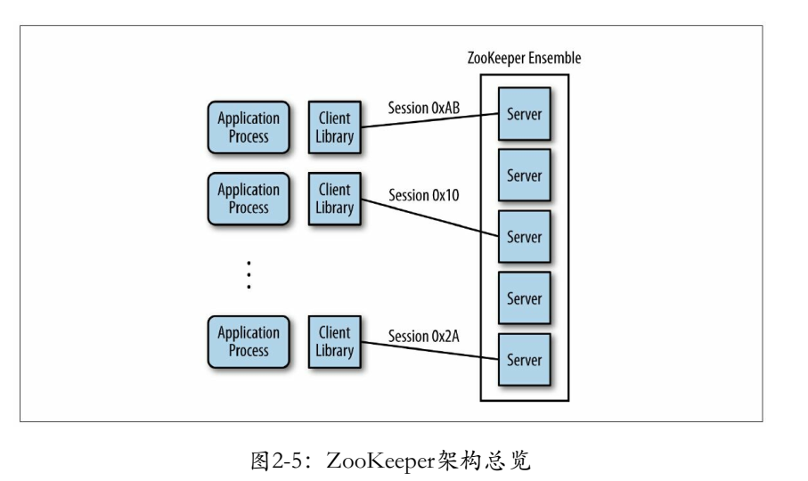

# 大数据

## 1. 概述

大数据主要技术如下：

1. **Hadoop**：大数据处理平台，核心组件为**HDFS**和**MapReduce**。部署方式有：单机、伪分布式（只有一个节点的分布式）和分布式；
2. **HDFS**：分布式文件系统，WORM数据一致性模型；
3. **MapReduce** 和 **YARN**： 离线计算，延时大；
4. **HBase**： 大数据的数据库，即Hadoop Database，非关系型数据库；
5. **Hive**： 数据仓库，结构化数据文件映射为数据库表，本质是**类SQL语句转换为MapReduce程序**;
6. **Sqoop** 和 **Loader**：数据转换，外部结构化数据 <--> Hadoop分布式文件系统；
7. **Flume**：**日志收集处理**；
8. **Spark Streaming** 和 **Storm** 和 **Flink**：实时计算，延时小；
9. **Zookeeper** 和 **Oozie**：**分布式协调服务**  和 **工作流调度服务**；
10. **Kerberos** 和 **LDAP**：**网络认证协议** 和 **轻量目录访问协议**；
11. **Impala** 和 **Solr**： **查询系统** 和 **搜索系统**；
12. **Kafka**： **大数据消息订阅组件**；

## HBase

如何解决HBase热点问题

如何基于源码自定义开发HBase的数据源

如何在数据源处进行剪枝和谓词下推

## Hadoop分布式文件系统

HDFS是如何实现有状态的高可用架构

HDFS是如何从架构上解决内存受限问题

深入理解HDFS的架构演变

解密HDFS如何能支撑亿级流量

## Hadoop最初要遵循“移动计算”准则的原因

网上搜不到答案。Hadoop主要的三大组件：`HDFS`、`YARN`、`MapReduce`

## 实时计算技术之SparkStreaming

SparkStreaming 应用场景、原理分析

SparkStreaming 集成Kafka讲解

SparkStreaming 如何实现Exactly-Once语义

## ZooKeeper

[ZooKeeper官网](https://zookeeper.apache.org/)

ZooKeeper的概念和基础

ZooKeeper的使命

分布式协作的难点

ZooKeeper的架构

ZooKeeper的原理

使用ZooKeeper进行开发

ZooKeeper的管理

​	

