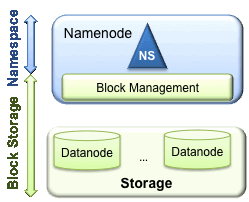
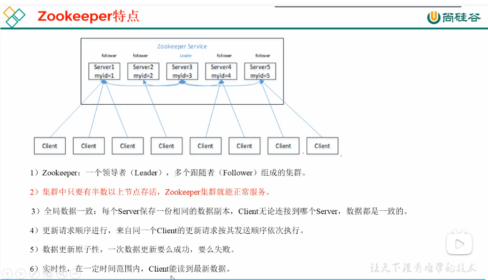
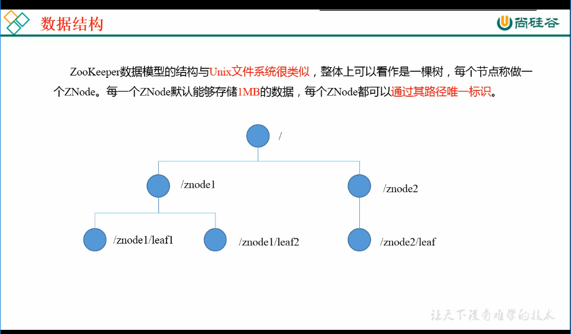

## 1. 概述

大数据主要技术如下：

1. **Hadoop**：大数据处理平台，核心组件为**HDFS**和**MapReduce**。部署方式有：单机、伪分布式（只有一个节点的分布式）和分布式；
2. **HDFS**：分布式文件系统，WORM数据一致性模型；
3. **MapReduce** 和 **YARN**： 离线计算，延时大；
4. **HBase**： 大数据的数据库，即Hadoop Database，非关系型数据库；
5. **Hive**： 数据仓库，结构化数据文件映射为数据库表，本质是**类SQL语句转换为MapReduce程序**;
6. **Sqoop** 和 **Loader**：数据转换，外部结构化数据 <--> Hadoop分布式文件系统；
7. **Flume**：**日志收集处理**；
8. **Spark Streaming** 和 **Storm** 和 **Flink**：实时计算，延时小；
9. **Zookeeper** 和 **Oozie**：**分布式协调服务**  和 **工作流调度服务**；
10. **Kerberos** 和 **LDAP**：**网络认证协议** 和 **轻量目录访问协议**；
11. **Impala** 和 **Solr**： **查询系统** 和 **搜索系统**；
12. **Kafka**： **大数据消息订阅组件**；

## Hadoop分布式文件系统-HDFS

HDFS是如何实现有状态的高可用架构

HDFS是如何从架构上解决内存受限问题，联邦啊。

解密HDFS如何能支撑亿级流量

http://hadoop.apache.org/docs/r2.6.0/hadoop-project-dist/hadoop-hdfs/HdfsUserGuide.html

[深入理解Hadoop HDFS【一篇就够】](https://blog.csdn.net/sjmz30071360/article/details/79877846)

HDFS不适用的场景

- 低延时的数据访问（ms级别）。HDFS 是为高吞吐数据传输设计的，牺牲了延时，若要低延时访问数据，可以用HBase。
- 大量小文件。文件的元数据保存在NN中的内存中，因此HDFS的文件数量受限于NN的内存大小，一个文件/目录/block约占150B的内存空间。
- 多方读写，需要对文件做任意位置的修改。HDFS采用追加（append-only）的方式写入数据，所以不支持对文件做任意位置的修改。同一时刻只能有一个writer进行写入操作。

### HDFS的架构

HDFS是master/slave的架构，如下图所示：

- Namenode：负责管理HDFS集群的文件系统命名空间（即元数据）。负责打开、关闭、重命名文件/文件夹等操作。
- DataNode：HDFS将文件分割成多个block，默认一个block的大小为64MB，这些block存储在DN中。负责处理客户端的读/写请求、创建block、删除block、复制block等操作。


#### 文件系统命名空间（file system namespace）

就类似与Unix中的文件系统，可以HDFS的文件/文件夹进行创建、删除、移动等操作。

#### NameNode和DataNode

- NameNode。NN存放HDFS集群中的所有文件、目录的元数据和block映射关系。NN会定期接受DN发过来的心跳数据和Blockreport数据。元数据的持久化方式有两种：fsimage和edit log。

  持久化的数据不包括“文件的block分布在集群中的哪些节点上”，这些信息是系统重启的时候，DN通过Blockreport传递过来的。

  seconday NN不提供读写，只做备份和checkpoint。

- DataNode。数据节点负责存储和提供Block，读写请求可能来自于NN，也可能直接来自于客户端。DN周期性地向NN汇报自己节点上所存储的Block相关信息。

#### Block cache

DN通常直接从磁盘读取数据，但是频繁使用的Block是可以缓存在内存中的，默认一个Block只有一个DN会缓存。

#### HDFS Federation

HDFS Federation是一种横向扩展HDFS的方式。因为之前的元数据都存储在一台NN的内存中，这限制了HDFS可存储的文件数量，因此才会出现HDFS Federation。这样，每个NN都只管理集群元数据的一部分。

#### HDFS HA（高可用）

因为secondary NN只是冷备，并不能做到高可用，需要手动切换，否则整个HDFS就不可用了。

HDFS的HA方案需要满足如下4点：

- 主备共享edit log。这可以通过QJM或NFS来实现。
- DN需要同时向所有NN发送心跳和Blockreport。
- 客户端需要配置failover模式。
- 用standby NN代替secondary NN。

#### HDFS 副本放置策略

HDFS的副本放置策略时可靠性、写带宽、读带宽之间的权衡。

默认策略是：

- 第一个副本放置在客户端所在机器上，若客户端机器不在HDFS集群内，则放在随机的一个Rack上的一个机器上（负载低的）。
- 第二个副本随机放在不同于第一个副本的rack的机器上。
- 第三个副本放在第二个副本同一rack上的不同机器上。

副本因子为x，则HDFS集群中同一个份数据有x个。


#### Hadoop中的节点距离

在读取和写入的过程中，namenode在分配Datanode的时候，会考虑节点之间的物理位置，即会考虑节点之间的距离。这是机架感知。


- 同一数据中心，同一机架，同一节点距离为0
- 同一数据中心，同一机架，不同节点距离为2
- 同一数据中心，不同机架，不同节点距离为4
- 不同数据中心，不同机架，不同节点距离为6

#### 副本选择

为了减少全局带宽的消耗和读写延时，HDFS会将最近的副本返回给reader，有限选择节点距离近的副本。

#### 安全模式

在启动时，NN会进入安全模式。当NN处于安全模式时，不会发生Block的复制。此时，NN从DN接受心跳和Blockreport。Blockreport中包括该DN锁托管的Block的列表。每个Block都有最小副本数。NN会检查每一个Block的最小副本数，以确定该Block是已被安全复制。当满足配置的安全复制的block的百分比后，NN就会退出安全模式。然后将少于指定最小副本的这些Block复制到其他DN。

#### 文件系统元数据持久化

NN存储了HDFS集群的命名空间。当每次文件系统元数据发生改变时，NN会将这些改变持久化到EditLog中（一个事务日志）（写一行记录）。HDFS将整个文件系统命名空间（block到文件的映射，文件系统属性等）持久化到fsimage文件中。

#### 检查点（checkpoint）

checkpoint是一个过程。当NN启动或触发checkpoint（edit log大小，或时间间隔）是，SNN从磁盘中读取fsimage和edit log，然后将edit log中的写操作应用到fsimage中，然后，让这个fsimage成为新的fsimage。

为什么不直接讲这些写入到edit log的操作直接应用到fsimage呢？

因为，这样效率会很低，假设同时有多个写操作，严重影响当时NN的性能。所以，这件事让SNN来做。

DN在启动时，会扫描本地fs，生成了此DN的block列表，然后报告给NN，这就是Blockreport。

HDFS采用了write-once-read-many这一数据存储技术，避免在磁盘寻址时出现大量的开销，因此不支持对文件进行任意位置的修改，而是创建和删除。

secondary NN的checkpoint的流程


#### 复制管道（Replication pipeline）

HDFS写流程中的将数据接入到DN列表中的所有DN的。在写操作的时候，NN会返回一个DN的列表，表示客户端需要将数据写入到这些DN中。

- 客户端先将block写入打第一个DN。
- 第一个DN传给第二个DN。
- 第二个DN传给第三个DN。

这就是pipeline 复制。

#### FS Shell

HDFS提供了一个命令行接口，用于交互式地进行HDFS操作。

#### DFSAdmin

DFSAdmin命令集是给HDFS管理员使用的。

#### 浏览器接口

默认端口是50070

#### 文件删除和取消删除

在HDFS中，删除文件后，并不会立即将其从HDFS中删除，而是放入回收站（/Trash目录），误删后还可以通过mv将其从/Trash中恢复出来，一定时间后/Trash中的文件会被删除，这是NN就会从HDFS的命名空间中删除该文件，然后与该文件相关的block都会被释放。

#### 减少副本因子

当副本因子减少后，NN会选择要删除哪些DN上的block副本，然后在下一次心跳时，讲这些信息传递给DN，DN在删除自己上的这些block，为集群腾出物理空间。

#### HDFS的读写流程

[HDFS读写数据流程](https://www.cnblogs.com/Java-Script/p/11090379.html)


### HDFS的HA

#### 使用Quorum Journal Manager（QJM）实现HA

QJM是用来在Active NameNode和 Standby NameNode之间共享 edit log的。

在Hadoop 2.0.0之前，NameNode都是单点故障的（single point of failure，SPOF），一旦NN所在的机器或进程出现问题，则整个HDFS集群就不可用了。

HDFS实现HA是通过运行两个冗余的NN来解决的，一个为Active，一个Standby，Standby是Active的热备，当Active出现故障时，故障转移到Standby，使之成为新的Active。

在任何时间点，只有一个 NameNode 处于 Active 状态，另一个处于 Standby 状态。 Active NameNode 负责集群中的所有客户端操作，而 Standby 只是充当从属节点，维护足够的HDFS状态以在必要时提供快速故障转移。==那么Active和Standby之前如何保持数据同步的呢？==

为了使主备的NN能够同步状态，运行了一组JournalNode（JN）。Active在执行任何命名空间修改的操作时，它会将修改写入到大多数的JN。Standby就能从JN中读取到edit log，并一致监视他们，然后将edit log中的写操作应用到自己的命名空间（fsimage）。当Active发生故障时，Standby确保在自己成为新的Active之前，读取了JN中的所有edit log，即保证Standby的命名空间与发生故障之前的Active状态一直。

为了缩短故障转移的时间，两个NN都应该持有HDFS集群中Block和DN的映射关系。这通过DN向两个NN都发送心跳和Blockreport来实现。

为了防止出现脑裂等情况，JN一次只允许一个NN称为writer，来写入edit log。

Standby NN也可以执行checkpoint等操作，因此，就不需要在运行Secondary NN，CheckpointNode或BackupNode了。

故障转移分为：

- 手动故障转移。通过DFSHAAdmin 的相关命令能够实现手动故障转移

- 自动故障转移。

  要实现自动failover，需要增加两个组件：一个Zookeeper quorum和一个ZKFailoverController进程（简称为ZKFC）。实现自动failover依赖于ZK的如下特性：

  - 故障检测。每个NN都与ZK建立了持久会话，当机器宕机时，ZK会话就会过期，然后通知其他NN，哪个NN出现问题了。
  - Active NN选举。HDFS在ZK中建立一个临时的znode，当Active NN故障后，这个znode就删除了，watch了这个事件的其他NN可以参与选举，选举出一个新的Active NN。（本质就是ZK的分布式锁）

ZKFC其实是一个ZK的客户端，它会监控和管理NN的状态。每个运行了NN的机器，都会运行一个ZKFC进程。ZKFC负责：

- 健康监控。ZKFC会周期性地ping其本地的NN，只要NN在规定时间内响应了健康状态,ZKFC就认为其实健康的。若该节点泵阔，僵死等，会将其标记为不健康。
- ZK会话管理。当本地NN是健康时，这个ZKFC会保持与ZK的会话，对应的其实就是某特定目录下的临时znode。
- 基于ZK的NN选举。多个NN去竞争着建立Active这个znode，谁先抢占成功，谁就是新的Active NN了。

配置自动故障转移

需要先停止HDFS集群再配置。

```xml
 <property>
   <name>dfs.ha.automatic-failover.enabled</name>
   <value>true</value>
 </property>

<property>
   <name>ha.zookeeper.quorum</name>
   <value>zk1.example.com:2181,zk2.example.com:2181,zk3.example.com:2181</value>
 </property>
```


#### 使用Network File System（NFS）实现HA

这是通过，Active NN 和Standby NN 之间共享一个目录。当Active NN 执行了修改命名空间的操作后，会将操作记录在edit log中，而edit log 就是存放在这个共享目录下的。这样Standby NN也就能看到edit log的更改了，然后将edit log 应用到自己的命名空间。当Active发生故障后，Standby NN 确保读取了共享目录下的所有的edit log后，才会成为新的Active NN。这就实现了NN之间的状态同步一致性。

同QJM一样，DN需要将心跳和Blockreport同时发送给所有NN，这样就能够实现更快速的故障转移。

同QJM一样，你可以使用一下两种方式来故障转移：

- 通过DFSHAAdmin 命令来手动failover。原理同QJM一样。
- 通过配置ZK, ZKFC来实现自动failover。原理同QJM一样。

### HDFS Federation（联邦）

可以将HDFS看做两层，命名空间和block存储。



联邦的意思是，有多个NN（而不只是两个），每个NN持有整个HDFS命名空间的一部分。


### ViewFs

View File System (ViewFs) 提供了一种管理多个 Hadoop 文件系统命名空间（或命名空间卷）的方法。  ViewFs 类似于某些 Unix/Linux 系统中的客户端挂载表。 ViewFs 可用于创建个性化的命名空间视图以及每个集群的公共视图。

在HDFS联邦之前，只有一个NN，这个NN提供了整个HDFS集群的命名空间。现在假设有多个HDFS集群，每个集群都有独立的命名空间，且存储的数据不跨集群。

下面这个图就是一个ViewFs文件系统的图。在这个图中有4个相互独立的命名空间：/data, /project, /user, /tmp。


### HDFS快照

HDFS快照是一个只读的，某特定时间的HDFS文件系统的副本。可以在文件系统的子树或整个文件系统上拍摄快照。 快照的一些常见用例是数据备份、防止用户错误和灾难恢复。

一旦目录被设置为可快照，就可以在任何目录上拍摄快照。 一个快照目录能够同时容纳 65,536 个快照。 可快照目录的数量没有限制。 管理员可以将任何目录设置为快照表。 如果snapshottable目录中有快照，则在删除所有快照之前，不能删除或重命名该目录。

当前不允许嵌套的快照目录。 换句话说，如果目录的祖先/后代之一是可快照目录，则不能将目录设置为可快照目录。即，对快照目录进行快照是不支持的。

```shell
# 假设/foo目录可以快照，/foo目录下有bar目录或文件，则对/foo进行快照如下所示
/foo/.snapshot/s0/bar
```

### 离线edits查看器

离线edits查看器是用来解析Edits log文件的一个工具，它不需要HDFS运行着，它是针对文件的操作。用法示例：

```shell
bash$ bin/hdfs oev -i edits -o edits.xml
```

### 离线Image查看器

离线Image查看器，是用来解析fsimage，使之以人类可读的方式呈现。

### HDFS权限

HDFS中文件和目录的权限类似于Unix系统中的文件和目录的权限，都是分为3个权限：文件/目录所有人，文件/目录所属组，其他用户。

从Hadoop 0.22开始，Hadoop支持两种不同的操作模式来确定用户的身份：

- simple。在这种操作模式下，客户端进程的身份由主机操作系统确定。 在类 Unix 系统上，用户名相当于 `whoami`。
- kerberos。客户端进程的省份由kerberos凭证来决定。可以使用`kinit`工具来获取kerberos凭证，然后使用`klist`来查看当前的主体是谁。主体格式为：`todd/foobar@CORP.COMPANY.COM`，其表示对应的用户为`todd`。

#### 访问控制列表(ACL)

访问控制列表(ACL)是一种基于包过滤的[访问控制技术](https://baike.baidu.com/item/访问控制技术/5652430)，它可以根据设定的条件对接口上的数据包进行过滤，允许其通过或丢弃。访问控制列表被广泛地应用于[路由器](https://baike.baidu.com/item/路由器/108294)和[三层交换机](https://baike.baidu.com/item/三层交换机/816331)，借助于访问控制列表，可以有效地控制用户对网络的访问，从而最大程度地保障[网络安全](https://baike.baidu.com/item/网络安全/343664)。

### 配额

HDFS中有两种配额。

- name quota，名称配额。限制目录下的文件/目录的总数。超过配额，再创建文件/目录就会失败。目录重命名后，其配额仍然有效，新创建目录默认是没有设置配额的。配额的最大值为`Long.Max_Value`，如果目录的配额为0，则会强制让目录为空。配额信息持久化在fsimage中。
- space quota，空间配额。限制目录下的文件所能占用的总的字节数。每一个block的副本也都会算在空间配额里。其它与name quota类似的。

### HDFS常用命令

```shell
# 列出/目录下的文件和目录
hadoop fs -ls  /
# 递归列出
hadoop fs -ls  /
# 查看文件内容
hadoop fs -taif [-f] 路径
hadoop fs -text 路径
# 远程复制到本地，get
hadoop fs -get < hdfs file > < local file or dir>
hadoop fs -get < hdfs file or dir > ... < local  dir >
hadoop fs -copyToLocal < local src > ... < hdfs dst >
# 本地复制到远程，put
hadoop fs -put < local file > < hdfs file >
hadoop fs -put  < local file or dir >...< hdfs dir >
hadoop fs -moveFromLocal  < local src > ... < hdfs dst >
hadoop fs -copyFromLocal  < local src > ... < hdfs dst >
# 删除文件或目录
hadoop fs -rm < hdfs file > ...
hadoop fs -rm -r < hdfs dir>...
# 创建目录
hadoop fs -mkdir < hdfs path>
hadoop fs -mkdir -p < hdfs path> 
# 排序后合并到本地文件中
hadoop fs -getmerge < hdfs dir >  < local file >
hadoop fs -getmerge -nl  < hdfs dir >  < local file >
# 复制hdfs中的文件
hadoop fs -cp  < hdfs file >  < hdfs file >
hadoop fs -cp < hdfs file or dir >... < hdfs dir >
# 移动文件
hadoop fs -mv < hdfs file >  < hdfs file >
hadoop fs -mv  < hdfs file or dir >...  < hdfs dir >
# 统计目录数
hadoop fs -count < hdfs path >
# 统计文件，目录大小
hadoop fs -du < hdsf path> 
hadoop fs -du -s < hdsf path> 
hadoop fs -du - h < hdsf path> 
# 修改某路径下文件的副本因子
hadoop fs -setrep -R 3 < hdfs path >
# 查看某路径的状态信息
hdoop fs -stat [format] < hdfs path >
# 显示文件、目录的acl
hadoop fs -getfacl [-R] 路径
# 设置文件、目录的acl
hadoop fs -setfacl [-R] 路径
# 删除指定目录
hadoop fs -rmdir [-R] 路径
# hdfs系统容量，空闲空间，使用空间
hadoop fs -df [目录]
# 在hdfs中查某类文件
hadoop fs -find [目录] -name [表达式]

#
hadoop archive -archiveName name.har -p < hdfs parent dir > < src >* < hdfs dst >
# 进行重新平衡
hdfs balancer
# 管理员命令集
hdfs dfsadmin -help
# 用来在两个HDFS之间拷贝数据
distcp
# 其他
```


## HBase

如何解决HBase热点问题


如何基于源码自定义开发HBase的数据源


如何在数据源处进行剪枝和谓词下推


## Hadoop最初要遵循“移动计算”准则的原因

网上搜不到答案。Hadoop主要的三大组件：`HDFS`、`YARN`、`MapReduce`

## 实时计算技术之SparkStreaming

SparkStreaming 应用场景、原理分析

SparkStreaming 集成Kafka讲解

SparkStreaming 如何实现Exactly-Once语义


## ZooKeeper

[ZooKeeper官网](https://zookeeper.apache.org/)

### ZooKeeper的概念和基础

### ZooKeeper的使命

### 分布式协作的难点

### ZooKeeper的架构


### ZooKeeper的原理

### 使用ZooKeeper进行开发

### ZooKeeper的管理


### bilibili 视频

https://www.bilibili.com/video/BV1PW411r7iP?p=7&spm_id_from=pageDriver

#### Zookeeper概述


#### Zookeeper的特点



#### Zookeeper的数据结构



#### Zookeeper的应用场景


- **统一命名服务**。对应用/服务进行统一命名，方便识别。如用域名来作为多个IP的统一命名
- **统一配置管理**。将配置信息写入一个Znode，各个客户端watch这个Znode，配置信息发生改变则会通知这些客户端，实现配置文件的快速同步。
- **统一集群管理**。将节点信息写入一个Znode，监听这个Znode可以获取它的实时状态变化。
- **服务器节点动态上下线**。服务端的服务器节点上下线，通知设置了watch的客户端。
- **软负载均衡**。在ZK中记录每台服务器的访问数，让访问最少的服务器去处理最新的客户端请求

#### Zookeeper的下载和安装


两种安装方式：

1. 本地安装
2. 分布式安装

本地安装

安装前准备：

1. 安装jdk

2. 拷贝Zookeeper安装包到Linux系统中

3. 解压到指定目录

   ```shell
   tar -zxvf zookeeper-3.4.10.tar.gz -C /opt/module/
   ```

   


