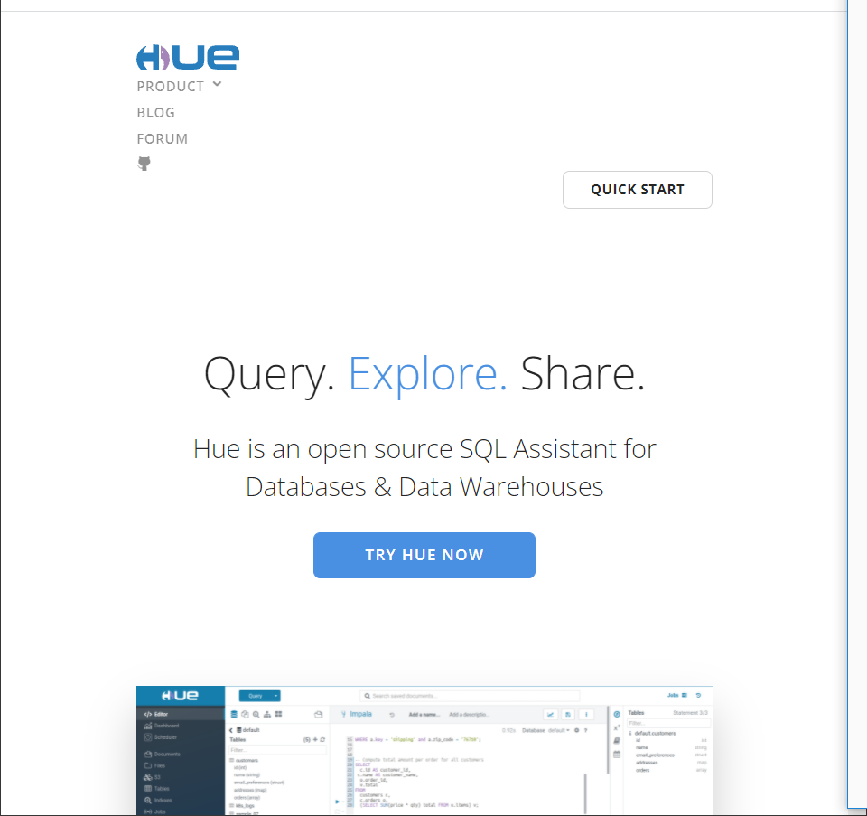
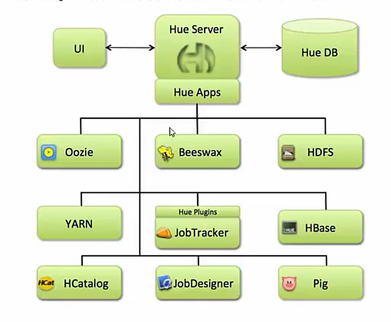
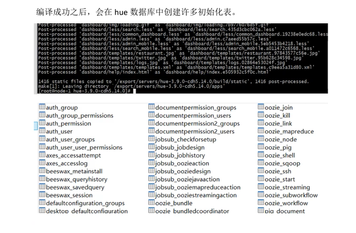

文档来源 [大数据Hue开发教程丨构建大数据可视化分析](https://www.bilibili.com/video/BV1TD4y1m7qe?p=12&spm_id_from=pageDriver)

# 1. Apache Hue介绍

## 1.1 Hue是什么

HUE = Hadoop User Experience

Hue是一个开源的Apache Hadoop UI 系统，由Cloudera Desktop演化而来，最好有Cloudera公司将其贡献给Apache基金会的Hadoop社区，它是基于Python web框架Django实现的。

通过使用Hue，可以在浏览器端的web控制台上与Hadoop集群进行交互，来分析处理数据，例如：操作HDFS上的数据，运行MapReduce Job，执行Hive的SQL语句，浏览HBase数据库等等。

[Hue官网](https://gethue.com/)



## 1.2 Hue能做什么

1. 访问HDFS和文件浏览
2. 通过web调试和开发Hive以及数据结果展示
3. 查询Solr和结果展示，报表生成
4. 通过web调试和开发Impala交互式SQL Query
5. Spark调试和开发
6. Pig调试和开发
7. Oozie任务的开发、监控和工作流协调调度
8. HBase数据查询和修改，数据展示
9. Hive的元数据（metastore）查询
10. MapReduce任务进度查看、日志追踪
11. 创建和提交MapReduce， Streaming，Java job任务
12. Sqoop2的开发和调试
13. Zookeeper的浏览和编辑
14. 数据库（MySQL，PostGres，SQlite，Oracle）的查询和展示

## 1.3 Hue的架构

Hue是一个优化的界面集成框架，可以集成各种大量的大数据体系软件框架，通过一个界面就可以做到查看以及执行所有的框架。

Hue提供的这些功能相比Hadoop生态各组件提供的界面更加友好，但是==一些需要debug的场景可能还是要使用原生系统才能更加深入地找到错误的原因。==



## 1.4 小结

- Hue是一个集成化的大数据可视化软件，可以通过Hue访问浏览、操作主流大数据生态圈软件；

- Hue本身来自于Cloudera，后来贡献给了Apache；

- Hue本身是一个web项目，基于Python实现，通过该web项目的UI集成了各个软件的UI；

# 2. Hue的安装

## 2.1 上传解压安装包

Hue的安装支持多种方式，包括rpm包的方式进行安装、tar.gz包的方式进行安装以及cloudera manager的方式来进行安装等，我们这里使用tar.gz包的方式来进行安装。

Hue的压缩包的下载地址：

http://archive.cloudera.com/cdh5/cdh/5/

我们这里使用过的是CDH5.14.0这个对应的版本，具体下载地址为

http://

```shell
cd /export/servers/
tar -zxvf hue-3.9.0-cdh5.14.0.tar.gz
```


## 2.2 编译初始化工作

### 2.2.1 联网安装各种必须的依赖包

```shell
yum install -y asciidoc cyrus-sasl-devel cyrus-sasl-gssapi cyrus-sasl-plain gcc gcc-c++ krb5-devel libffi-devel libxml2-devel libxslt-devel make openldap-devel python-devel sqlite-devel gmp-devel
```

### 2.2.2 Hue初始化配置

```shell
cd /export/servers/hue-3.9.0-cdh5.14.0/desktop/conf
vim hue.ini
```

通用配置

```ini
[desktop]
secret_key=xxxxxxxx
http_host=hadoop102
is_hue_4=true
time_zone=Asia/Shanghai
server_user=root
server_group=root
default_user=root
default_hdfs_superuser=root
# 配置使用MySQL作为Hue的存储数据库，大概在hue.ini的587行左右
[[database]]
engine=mysql
host=hadoop102
port=3306
user=root
password=Hadoop
name=hue
```

### 2.2.3 创建MySQLZ中Hue使用的DB

```shell
create database hue default character set utf8 default collate utf8_general_ci;
```


## 2.3 编译Hue

```shell
cd /export/servers/hue-3.9.0-cdh5.14.0
make apps
```

编译成功之后，会在MySQL中的对应数据库中创建很多初始化表。




## 2.4 启动Hue、Web UI的访问

前端启动Hue

```shell
cd /export/servers/hue-3.9.0-cdh5.14.0/
build/env/bin/supervisor
```

页面访问路径：http://hadoop102:8888


第一次访问的时候，需要设置hue的超级管理员用户


# 3.Hue与软件的集成

## 3.1 Hue集成HDFS

注意：修改完成HFDS相关配置后，需要把配置分发到集群中的每台机器，重启HDFS集群。

### 3.1.1 修改core-site.xml配置

```xml
<!-- 允许通过httpfs方式访问hfds的主机名 -->
<property>
	<name>hadoop.proxyuser.root.hosts</name>
    <value>*</value>
</property>
<!-- 允许通过httpfs方式访问hfds的用户组 -->
<property>
	<name>hadoop.proxyuser.root.groups</name>
    <value>*</value>
</property>
```


### 3.1.2 修改hdfs-site.xml配置

```xml
<property>
	<name>dfs.webhdfs.enabled</name>
    <value>true</value>
</property>
```

### 3.1.3 修改hue.ini

```shell
cd /export/servers/hue-3.9.0-cdh5.14.0/desktop/conf
vim hue.ini
```

修改

```ini
[[hdfs_cluster]]
	[[[default]]]
		fs_defaultfs=hfds://hadoop102:9000
		webhdfs_url=http://hadoop102:50070/webhdfs/v1
		hadoop_hdfs_home=/export/servers/hadoop-2.7.5
		hadoop_bin=/export/servers/hadoop-2.7.5/bin
		hadoop_conf_dir=/export/servers/hadoop-2.7.5/etc/hadoop
```


### 3.1.4 重启HDFS、Hue

```shell
start-dfs.sh

cd /export/servers/hue-3.9.0-cdh5.14.0/
build/env/bin/supervisor
```


## 3.2 Hue集成YARN

### 3.2.1 修改hue.ini

修改

```ini
[[yarn_cluster]]
	[[[default]]]
		resourcemanager_host=hadoop102
		resourcemanager_port=9032
		submit_to=True
		resourcemanager_api_url=http://hadoop102:8088
		history_server_api_url=http://hadoop102:19888
```

### 3.2.2 开启yarn日志聚集服务

MapReduce是在各个机器上运行的，在运行过程中产生的日志存在于各个机器上，为了能够同一查看各个机器的运行日志，将日志几种存在在HDFS上，这个过程就是`日志聚集`.

```xml
<property>
	<name>yarn.log-aggregation-enable</name>
    <value>true</value>
</property>
<property>
	<name>yarn.log-aggregation.retain-seconds</name>
    <value>106800</value>
</property>
```

### 3.2.3 重启YARN，hue

```shell
cd /export/servers/hue-3.9.0-cdh5.14.0/
build/env/bin/supervisor
```


## 3.3 Hue集成Hive

如果需要配置hue与hive 的集成，我们需要启动hive的metastore服务和hiveserver2服务（impala需要hive的metastore服务，hue需要hive的hiveserver2服务）。

### 3.3.1 修改hue.ini

```ini
[beeswax]
	hive_server_host=hadoop102
	hive_server_port=10000
	hive_conf_dir=/export/servers/hive
	server_conn_timeout=120
	auth_username=root
	auth_password=123456
[metastore]
	# 允许使用hive创建数据库表等操作
	enable_new_create_table=true
```


### 3.3.2 启动hive服务，重启hue

去hadoop102机器上启动hive的metastore和hiveserver2服务

```shell
cd /export/servers/hive

nohup bin/hive --service metastore &
nohup bin/hive --service hiveserver2 &
```

重启hue

```shell
cd /export/servers/hue-3.9.0-cdh5.14.0/
build/env/bin/supervisor
```


## 3.4 Hue集成MySQL

### 3.4.1 修改hue.ini

```ini
[[[mysql]]]
	nice_name="My SQLDB"
	engine=mysql
	host=hadoop102
	port=3306
	user=root
	password=hadoop

```


### 3.4.2 重启hue

```shell
cd /export/servers/hue-3.9.0-cdh5.14.0/
build/env/bin/supervisor
```


## 3.5 Hue集成Oozie

### 3.3.1 修改hue.ini

```xml
[liboozie]
	oozie_url=http://hadoop102:11000/oozie
	remote_deployment_dir=/user/root/oozie_works

[oozie]
	oozie_jobs_count=100
	enable_cron_scheduling=true
	enable_document_action=true
	enable_oozie_backend_filtering=true
	enable_impala_action=true

[filebroswer]
	archive_upload_tempdir=/tmp
	show_download_button=true
	show_upload_button=true
	enable_extract_uploaded_archive=true
```


### 3.5.2 重启hue，oozie

```shell
cd /export/servers/hue-3.9.0-cdh5.14.0/
build/env/bin/supervisor
```

### 3.5.3 使用hue配置oozie调度

### 3.5.4 利用hue调度shell脚本

### 3.5.5 利用hue调度hive脚本

### 3.5.6 利用hue调度MapReduce程序

### 3.5.7 利用hue配置定时调度任务

## 3.6 Hue集成HBase

### 3.6.1 修改hue.ini

在hbase-site.xml配置文件中，添加如下内容，开启hbase thrift服务。修改完成后，分发到其他机器上的hbase安装包的conf路径下。

```xml
<property>
	<name>hbase.thrift.supoort.proxyuser</name>
    <value>true</value>
</property>
<property>
	<name>hbase.regionserver.thrift.http</name>
    <value>true</value>
</property>
```

### 3.6.2 修改Hadoop配置

在core-site.xml中确保HBase被授权代理，添加下面内容。

把修改之后的配置文件分发到其他机器和hbase安装包的conf路径下。

```xml
<property>
	<name>hadoop.proxyuser.hbase.hosts</name>
    <value>*</value>
</property>
<property>
	<name>hadoop.proxyuser.hbase.groups</name>
    <value>*</value>
</property>
```


### 3.6.3 修改Hue配置

```ini
[hbase]
	hbase_clusters=(Cluster|hadoop102:9090)
	hbase_conf_dir=/export/servers/hbase-1.2.1/conf
	thrift_transport=buffered
```


### 3.6.4 启动hbase（包括thrift服务），hue

启动hdfs和hbase，hbase thrift

```shell
start-dfs.sh
start-hbase.sh
hbase-daemon.sh start thrift
```


重启hue

```shell
cd /export/servers/hue-3.9.0-cdh5.14.0/
build/env/bin/supervisor
```


## 3.7 Hue集成Impala

### 3.3.1 修改hue.ini

```ini
[impala]
	server_host=hadoop102
	server_port=21050
	impala_conf_dir=/etc/impala/conf
```


### 3.7.2 重启hue

```shell
cd /export/servers/hue-3.9.0-cdh5.14.0/
build/env/bin/supervisor
```

