文档来源：[大数据Impala教程丨构建高性能交互式SQL分析平台](https://www.bilibili.com/video/BV1AK411M7Gg?spm_id_from=333.999.0.0)

参考文献：["Impala: A Modern, Open-Source SQL Engine for Hadoop"](http://cidrdb.org/cidr2015/Papers/CIDR15_Paper28.pdf)

# 1. Apache Impala

## 1.1 Impala基本介绍

Impala是cloudera提供的一款高效率的<span style="color:red;">SQL查询工具</span>，提供<span style="color:red;">实时的查询</span>效果，官方测试性能比hive快10到100倍，其SQL查询比sparkSQL还要更加快速，号称是当前大数据领域最快的<span style="color:red;">SQL查询工具</span>。

Impala是参照谷歌的新三篇论文（`Caffeine`--网络搜索引擎，`Pregel`--分布式图计算，`Dremel`--交互式分析工具）当中的Dremel实现而来，其中旧三篇论文分别是`BigTable`，`GFS`，`MapReduce`分对应我们即将学的HBase和已经学过的HDFS以及MapReduce。

==Impala是<span style="color:red;">基于hive</span>并使用内存进行计算，兼顾数据仓库，具有实时，批处理，多并发等优点。==

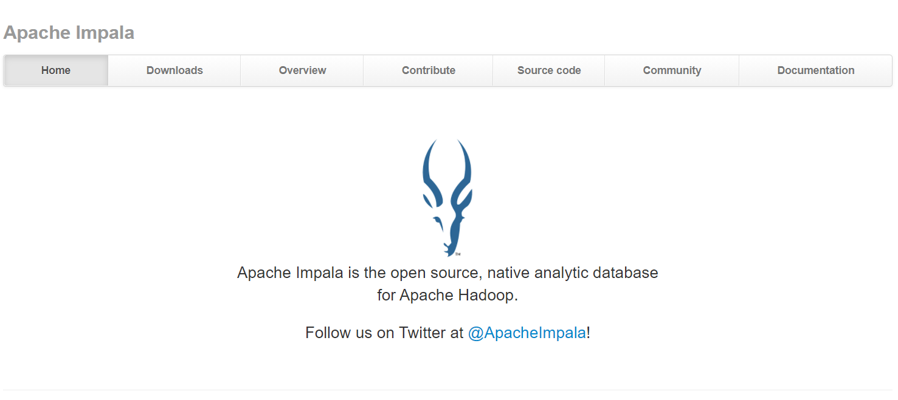

## 1.2 Impala与Hive关系

Impala是基于Hive的大数据分析查询引擎，直接<span style="color:red;">使用Hive的元数据库metastore</span>，意味着impala元数据都是存储在Hive的metastore当中，并且<span style="color:red;">impala兼容Hive的最大多数SQL语法</span>。所以需要安装impala的话，必须先安装Hive，保证hive安装成功，并且还需要==启动Hive的metastore服务==。

Hive元数据包含用Hive创建的database，table等元信息。元数据存储在关系型数据库中，如Derby，MySQL等。

客户连接metastore服务，metastore再去连接MySQL数据库来存取元数据。有了metastore服务，就可以有多个客户端同时连接，而且这些客户端不需要知道MySQL数据的用户名和密码，只需要连接metastore服务即可。

`nohup hive --service metastore >> ~/metastore.log  2>&1 $`

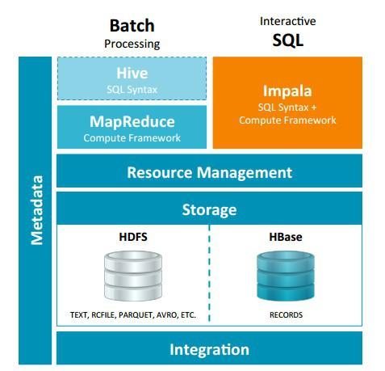

Hive适合于长时间的批处理查询分析，而Impala适合于实时交互式SQL查询。可以先试用Hive进行数据转换处理，之后使用Impala在Hive处理后的结果集上进行快速的数据分析。


## 1.3 Impala与Hive异同

Impala与Hive都是构建在Hadoop之上的数据查询工具，各有不同的侧重适用面，但从客户端使用来开Impala与Hive有很多的共同之处，如数据表元数据，ODBC/JDBC驱动，SQL语法，灵活的文件格式，存储资源池等。

但是Impala跟Hive最大的优化区别在于：<span style="color:red;">没有使用MapReduce进行并行计算</span>。虽然MapReduce是非常好的并行计算框架，但它更多的面向批处理模式，而不是面向交互式的SQL执行。与MpaReduce相比，==Impala把整个查询分成一个<span style="color:red;">执行计划树</span>，而不是一连串的MpaReduce任务，在分发执行计划后，Impala使用<span style="color:red;">拉式获取数据</span>的方式获取结果，把结果数据组成按执行计划树流式传递汇集，减少了把中间结果写入磁盘的步骤，再从磁盘读取数据的开销。==Impala使用服务的方式避免每次执行查询都需要启动的开销，即相比于Hive没有MapReduce启动时间。

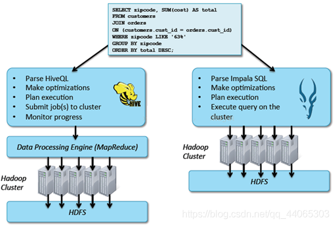

### 1.3.1 Impala使用的优化技术

- 使用LLVM产生运行代码，针对特定查询生成特定代码，同时使用Inline的方式减少函数调用的开销，加快执行效率。（`c++特性`）、

- 充分利用可用的硬件指令（SSE4.2)
- 更好的IO调度，Impala知道数据库所在的磁盘位置，能够更好的利用多磁盘的优势，同时Impala支持直接数据块读取和本地代码计算checksum。
- 通过选择合适数据存储格式可以得到最好性能（Impala支持多种存储格式）
- `最大使用内存`，中间结果不写磁盘，及时通过网络以stream的方式传递。

### 1.3.2 执行计划

**<span style="color:red;">Hive</span>**: 依赖于`MapReduce执行框架`，执行计划分成map->shuffle->reduce->map->shuffle-reduce...的模型。如果一个Query会被编译成多轮MapReduce，则会有更多的写中间结果。由于MapReduce执行框架本身的特点，过多的中间过程会增加整个Query的执行时间。

<span style="color:red;">**Impala**</span>: 把执行计划表现为一颗完整的`执行计划树`，可以更自然地分发执行计划到各个`Impalad`执行查询，而不用像Hive那样把它组合成管道型的map->reduce模式，以此保证Impala有更好的并发性和避免不必要的中间sort与shuffle。

### 1.3.3 数据流

**<span style="color:red;">Hive</span>**: 采用`push`的方式，每一个计算节点计算完成后将数据主动推给后续节点。

<span style="color:red;">**Impala**</span>: 采用`pull`的方式，后续节点通过`getNext`主动向前面节点要数据，以此方式数据可以流式的返回给客户端，且只要有1条数据被处理完，就可以立即展现出来，而不用等到全部处理完成，更符合SQL交互式查询使用。

### 1.3.4 内存使用

**<span style="color:red;">Hive</span>**: 在执行过程中如果`内存放不下所有数据，则会使用外存`，以保证Query能顺序执行完。每一轮MapReduce结束，中间结果也会写入HDFS中，同样由于MapReduce执行架构的特性，shuffle过程也会有写本地磁盘的操作。

<span style="color:red;">**Impala**</span>: 在遇到`内存放不下数据时，版本1.0.1是直接返回错误`，而不会利用外存，以后版本应该会进行改进。这使得Impala目前处理Query会受到一定的限制，最好还是与Hive配合使用。

### 1.3.5 调度

**<span style="color:red;">Hive</span>**: 任务调度`依赖于Hadoop`的调度策略。

<span style="color:red;">**Impala**</span>: 调度由`自己完成`，目前只有一种调度器==simple-schedule==，它会尽量满足数据的局部性，扫描数据的进程尽量靠近数据本身所在的物理机器。调度器目前还比较简单，在`SimpleScheduler::GetBackend`中可以看到，现在还没有考虑负载，网络IO状况等因素进行调度。但目前Impala已经有对执行过程的性能统计分析，应该以后版本会利用这些统计信息进行调度吧。

### 1.3.6 容错

**<span style="color:red;">Hive</span>**: `依赖于Hadoop`的容错能力。

<span style="color:red;">**Impala**</span>: 在`查询过程中，没有容错逻辑`，如果在执行过程中发生故障，则直接返回粗偶（这与Impala的设计有关，因为Impala定位与实时查询，一次查询失败，再查询一次就好了，再查一次的成本很低）。

### 1.3.7 适应面

**<span style="color:red;">Hive</span>**: 复杂的`批处理查询任务`，数据转换任务。

<span style="color:red;">**Impala**</span>: `实时数据分析`，因为不支持UDF，能处理的问题域有一定的限制，`与Hive配合使用`，对Hive的结果数据集进行实时分析。

## 1.4 Impala架构

Impala主要由<span style="color:red;">Impalad</span>、 <span style="color:red;">State Store</span>、<span style="color:red;">Catalogd</span>和<span style="color:red;">CLI</span>组成。


### 1.4.1 Impalad

<span style="color:red;">**Impalad**</span>：与DataNode运行在同一节点上，==由Impalad进程表示==，它`接收客户端的查询请求`（接收查询请求的Impalad为`Coordinator`，Coordinator通过JNI调用java前端解释SQL查询语句，生成查询计划树，再通过调度器把执行计划分发给具有相应数据的其它Impalad进行执行），`读写数据`，`并行执行查询`，并把结果通过网络流式的传送回给`Coordinator`，由`Coordinator`返回给客户端。同时Impalad也与State Store保持连接，用于确定哪个Impalad是健康和可以接受新的工作。

在Impalad中启动三个ThriftServer: `beeswax_server`（连接客户端），`hs2_server`（借用Hive元数据），` be_server`（Impalad内部使用）和一个`ImpalaServer`服务。

### 1.4.2 Impala State Store

<span style="color:red;">**Impala State Store**</span>: 跟踪集群中的Impalad的健康状态及位置信息，==由statestored进程表示==，它通过创建多个线程来处理Impalad的注册订阅和与各Impalad保持心跳连接，各Impalad都会缓存一份State Store中的信息，当State Store离线后（Impalad发现State Store处于离线时，会进入recovery模式，反复注册，当State Store重新加入集群后，自动恢复正常，更新缓存数据）因为Impalad有State Store的缓存仍然可以工作，但会因为有些Impalad失效了，而已缓存数据无法更新，导致把执行计划分配给了失效的Impalad，导致查询失败。

### 1.4.3 CLI

<span style="color:red;">**CLI**</span>:  提供给用户查询使用的命令行工具（`Impala Shell`使用python实现），同时Impala还提供了`Hue`，`JDBC`，` ODBC`使用接口。

### 1.4.4 Catalogd（目录）

<span style="color:red;">**Catalogd**</span>: 作为metadata访问网关，从Hive Metastore等外部catalog中获取元数据信息，放到impala自己的catalog结构中。impalad执行ddl命令时通过catalogd由其代为执行，该更新则由statestored广播。

## 1.5 Impala查询处理过程

Impalad分为Java前端与C++处理后端，接受客户端连接的Impalad即作为这次查询的`Coordinator`，`Coordinator`通过JNI调用Java前端对用户的查询SQL进行分析生成执行计划树。

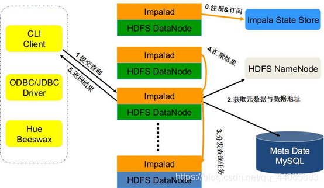

下图来源于：：["Impala: A Modern, Open-Source SQL Engine for Hadoop"](http://cidrdb.org/cidr2015/Papers/CIDR15_Paper28.pdf)

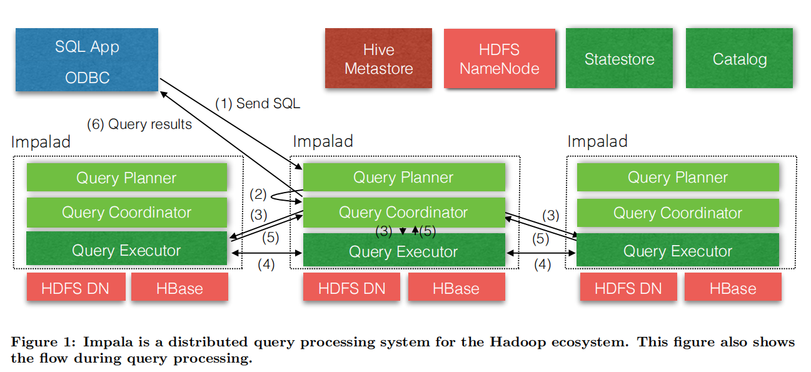

Java前端产生的执行计划树以Thrift数据格式返回给C++后端（Coordinator）（*执行计划分为多个阶段，每一个阶段叫做一个PlanFragment，每一个PlanFragment在执行时可以由多个Impalad实例并行执行(有些PlanFragment只能由一个Impalad实例执行,如聚合操作)，整个执行计划为一执行计划树*）。

Coordinator根据执行计划，数据存储信息（*Impala通过libhdfs与HDFS进行交互。通过hdfsGetHosts方法获得文件数据块所在节点的位置信息*），通过调度器（*现在只有simple-scheduler, 使用round-robin算法*）Coordinator::Exec对生成的执行计划树分配给相应的后端执行器Impalad执行（*查询会使用LLVM进行代码生成，编译，执行*），通过调用GetNext()方法获取计算结果。

如果是insert语句，则将计算结果通过libhdfs写回HDFS当所有输入数据被消耗光，执行结束，之后注销此次查询服务。


# 2. Impala安装部署

## 2.1 安装前提

==集群提前安装好Hadoop，Hive。==

==Hive安装包scp在所有需要安装Impala的节点上，因为Impala需要引用Hive的依赖包。==

==Hadoop框架需要支持C程序访问接口==，查看下图，如果该路径下有这些文件，就证明支持C接口。

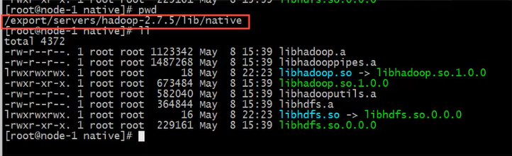

## 2.2 下载安装包、依赖包

由于Impala没有提供tarbao进行安装，只提供了rpm包。因此在安装Impala的时候，需要使用rpm包来进行安装。rpm包只有cloudera公司提供了，所以去cloudera公司网站进行下载rpm包即可。

但是另外一个问题，Impala的rpm包依赖非常多的其他rpm包，可以一个个的将依赖找出来，也可以将所有的rpm包下载下来，制作成我们本地yum源来进行安装。这里就选择制作本地的yum源来进行安装。

所有首先需要下载到所有的rpm包，下载地址如下：

http://archive.cloudera.com/cdh5/repo-as-tarball/5.14.0/cdh5.14.0-centos6.tar.gz

## 2.3 虚拟机新增磁盘（可选）

由于下载的cdh5.14.0-centos6.tar.gz 包非常大，大概5个G，解压之后最少需要5个G的空间。而我们的虚拟机磁盘有限，可能会不够用，所以可以为虚拟机挂载一块新的磁盘，专门用于存储的cdh5.14.0-centos6.tar.gz包。

注意事项：新增挂载磁盘需要==虚拟机保持在关机状态==。

==如果磁盘空间多余，那么本步骤可以省略不进行==。

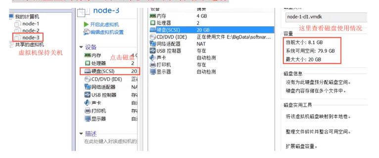

### 2.3.1 关机新增磁盘

虚拟机关机状态下，在VMware当中新增一块磁盘。

### 2.3.2 开机挂载磁盘

开启虚拟机，对新增的磁盘进行分区，格式化，并且挂载新磁盘到指定目录。

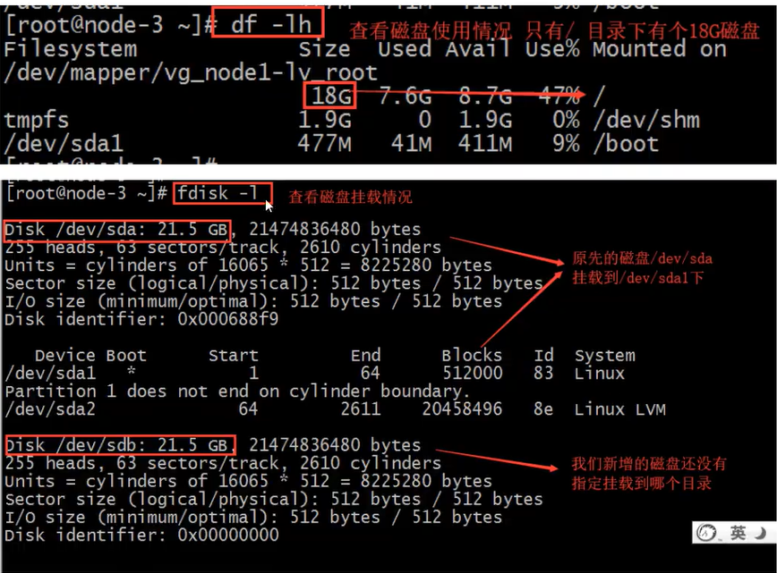

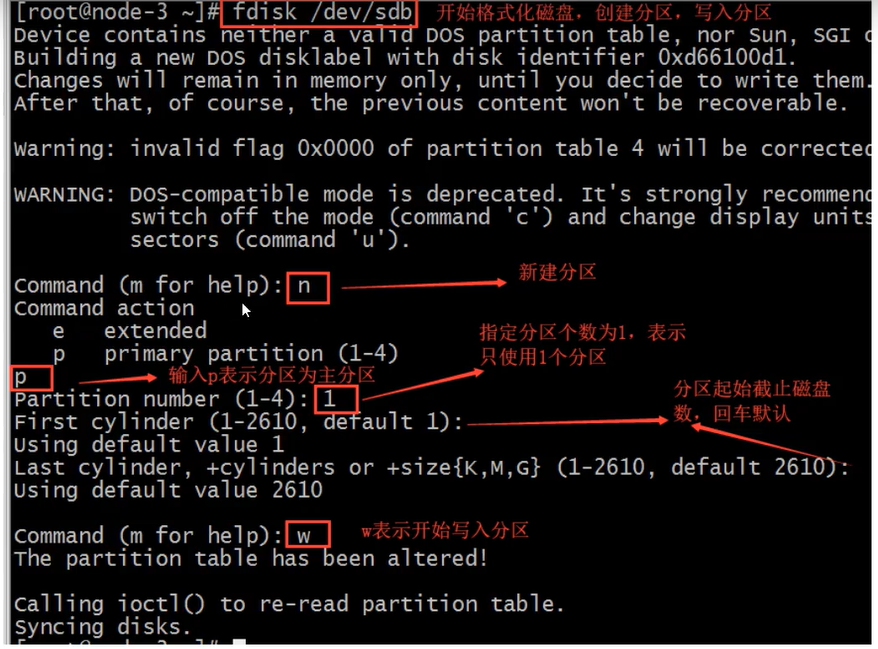

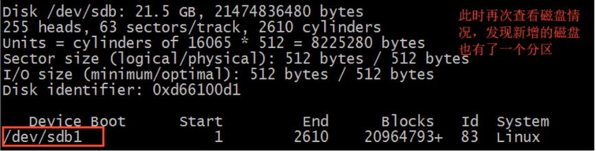

下面对分区进行格式化操作：

```shell
mkfs -t ext4 -c /dev/sdb1
```

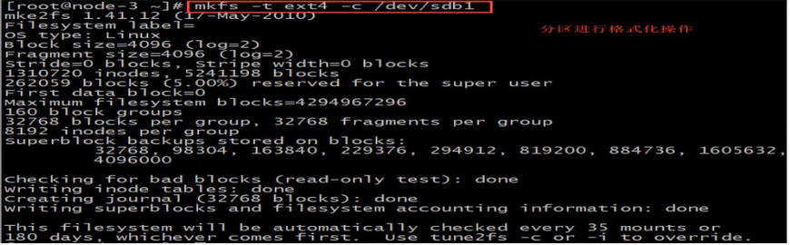

创建挂载目录：

```shell
mount -t ext4 /dev/sdb1 /cloudera_data/
```

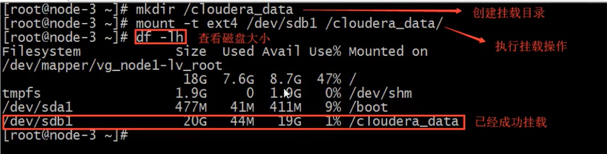

添加值开机自启

```shell
vim /etc/fstab
添加如下内容
/dev sdb1 /cloudera_data ext4 dfaults 0 0
```

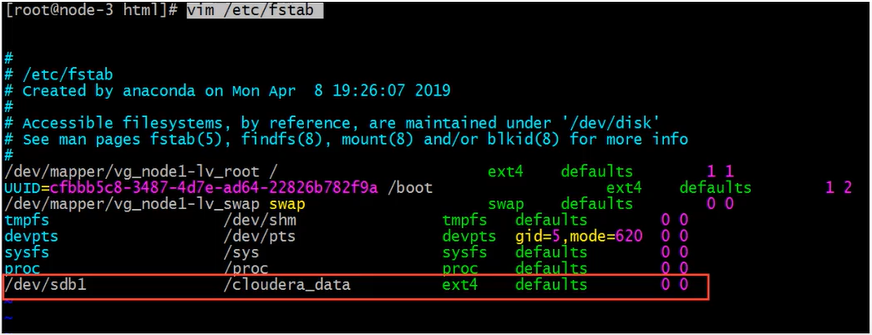

## 2.4 配置本地yum源

### 2.4.1 上传安装包解压

使用sftp的方式把安装包大文件上传到服务器/cloudera_data目录下。

```shell
cd /cloudera_data
tar -zxvf cdh5.14.0-centos6.tar.gz
```

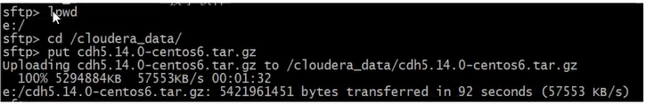

### 2.4.2 配置本地yum源信息

（1）安装Apache Server服务器

```shell
# 安装httpd
yum -y install httpd
# 启动httpd
service httpd start
# 配置httpd开机自启
chkconfig httpd on
```


（2）配置本地yum源的文件

```shell
cd /etc/yum.repos.d
vim localimp.repo
```

添加如下内容：

```shell
[localimp]
name=localimp
baseurl=http://node-3/cdh5.14.0/
gpgcheck=0
enabled=1
```

（3）创建 Apache httpd的读取链接

```shell
ln -s /cloudera_data/cdh/5.14.0 /var/www/html/cdh5.14.0
```

（4）查看配置的本地yum源是否可用了

```shell
yum repolist all
```

<span style="color:red;">确保linux的selinux关闭</span>

```shell
临时关闭:
[root@localhost ~] getenforce
Enforecing
[root@localhost ~] setenforce 0
[root@localhost ~] getenforce

Permissive
永久关闭：
[root@localhost ~] vim /etc/sysconfig/selinux
SELINUX=enforcing 改为 SELINUX=disabled

重启服务器reboot
```

通过浏览器访问本地yum源，如果出现下述页面则成功。

http://node-3/cdh5.14.0/


### 2.4.3


## 2.5 安装Impala

### 2.5.1 集群规划

| 服务名称                | 从节点 | 从节点 | 主节点 |
| ----------------------- | ------ | ------ | ------ |
| impala-catalog          |        |        | node-3 |
| impala-state-store      |        |        | node-3 |
| impala-server(ijmpalad) | node-1 | node-2 | node-3 |


### 2.5.2 主节点安装

在规划的<span style="color:red;">主节点node-3</span>上，执行以下命令进行安装：

```shell
yum install -y impala impala-server impala-state-store impala-catalog impala-shell
```

### 2.5.3 从节点安装

在规划的<span style="color:red;">node-1，node-2</span>上，执行以下命令进行安装：

```shell
yum install -y impala-server
```


## 2.6 修改Hadoop、Hive配置

需要在3台机器<span style="color:red;">整个集群上进行操作</span>，都需要修改。Hadoop、Hive是否正常服务并且配置好，是决定Impala是否启动成功并使用的前提。

### 2.6.1 修改Hive配置

可在node-1机器上进行配置，然后scp给其他2台机器：

```shell
vim /export/servers/hive/conf/hive-site.xml
```

修改如下内容：

```xml
<configuration>
	<property>
    	<name>javax.jdo.option.ConnectionURL</name>
        <value>jdbc:mysql://node-1:3306/hive?createDatabaseIfNotExist=true</value>
    </property>
    <property>
    	<name>javax.jdo.option.ConnectionDriverName</name>
        <value>com.mysql.jdbc.Driver</value>
    </property>
    <property>
    	<name>javax.jdo.option.ConnectionUserName</name>
        <value>root</value>
    </property>
    <property>
    	<name>javax.jdo.option.ConnectionPassword</name>
        <value>123456</value>
    </property>
    <property>
    	<name>hive.cli.print.current.db</name>
        <value>true</value>
    </property>
    <property>
    	<name>hive.cli.print.header</name>
        <value>true</value>
    </property>
<!-- 绑定运行hiveserver2的主机host，默认localhost -->
    <property>
    	<name>hive.server2.thrift.bind.host</name>
        <value>node-1</value>
    </property>
<!-- 指定运行hive metastore服务请求的uri地址 -->
    <property>
    	<name>hive.metastore.uris</name>
        <value>thrift://node-1:9083</value>
    </property>
    <property>
    	<name>hive.metastore.client.socket.timeout</name>
        <value>3600</value>
    </property>
</configuration>
```

将hive安装包scp给其他两个机器。

```shell
cd /export/servers/
scp -r hive/ node-2:$PWD
scp -r hive/ node-3:$PWD
```


### 2.6.2 修改Hadoop配置

所有节点创建下述文件夹

```shell
mkdir -p /var/run/hdfs-sockets
```

修改所有节点的hdfs-site.xml添加以下配置，修改完之后重启hdfs集群生效。

```shell
vim etc/hadoop/hdfs-site.xml
```

添加以下配置

```xml
<property>
	<name>dfs.client.read.shortcircuit</name>
    <value>true</value>
</property>
<property>
	<name>dfs.domain.socket.path</name>
    <value>/var/run/hdfs-sockets/dn</value>
</property>
<property>
	<name>dfs.client.file-block-storage-locations.timeout.millis</name>
    <value>10000</value>
</property>
<property>
	<name>dfs.client.file-blocks-metadata.enabled</name>
    <value>true</value>
</property>
```

`dfs.client.read.shortcircuit`打开DFSClient本地读取数据的控制，

`dfs.domain.socket.path`是Datanode和DFSClient之间沟通的Socket的本地路径。


### 2.6.3 重启Hadoop、Hive

在node-1上执行下述命令分别启动hive metastore服务和hiveserver2服务。

```shell
cd /export/servers/hive
nohup bin/hive --service metastore &
nohup bin/hive --service hiveserver2 &

cd /export/servers/hadoop-2.7.5/
sbin/stop-dfs.sh | sbin/start-dfs.sh
```


### 2.6.4 复制Hadoop、Hive配置文件

Impala的配置目录为/etc/impala/conf，这个路径下面需要把core-site.xml， hdfs-site.xml, hive-site.xml都cp过去。

==所有节点执行以下命令==：

```shell
cp -r /export/server2/hadoop-2.7.5/etc/hadoop/core-
site.xml /etc/impala/conf/core-site.xml
cp -r /export/server2/hadoop-2.7.5/etc/hadoop/hdfs-site.xml /etc/impala/conf/hdfs-site.xml
cp -r /export/server2/hive/conf/hive-site.xml /etc/impala/conf/hive-site.xml
```


## 2.7 修改Impala配置

### 2.7.1 修改Impala配置

==所有节点更改Impala默认配置文件==

```shell
vim /etc/default/impala

IMPALA_CATALOG_SERVICE_HOST=node-3
IMPALA_STATE_STORE_HOST=node-3
```


### 2.7.2 添加MySQL驱动

通过配置/etc/default/impala中可以发现已经指定了MySQL驱动的位置名字。

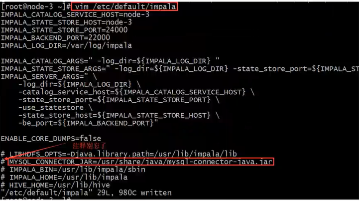

使用软连接指向该路径即可（3台机器都需要执行）

```shell
ln -s /export/servers/hive/lib/mysql-connector-java-5.1.32.jar /usr/share/java/mysql-connector-java.jar
```


### 2.7.3 修改bigtop配置

修改bigtop的JAVA_HOME（3台机器）

```shell
vim /etc/default/bigtop-utils

export JAVA_HOME=/export/servers/jdk1.8.0_65
```


## 2.8 启动、关闭Impala服务

主节点node-3启动以下三个服务进程

```shell
service impala-state-store start
service impala-catalog start
service impala-server start
```

从节点node-1与node-2启动impala-server

```shell
service impala-server start
```

查看impala进程是否存在

```shell
ps -ef |grep impala
```


启动之后所有关于==impala的日志默认都在/var/log/impala==

关闭impala的服务

```shell
service impala-state-store stop
service impala-catalog stop
service impala-server stop
```

注意，如果关闭之后进程依然驻留，可以采取下述方式删除。正常情况下是随着关闭消失的。

解决方式：

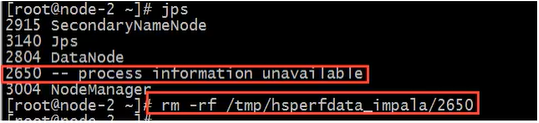

### 2.8.1 Impala web UI

访问impalad的管理界面：http://node-3:25000/

访问statestored的管理界面：http://node-3:25010

# 3. Impala-shell命令参数

## 3.1 Impala-shell外部命令

所谓的外部命令指的是==不要进入到impala-shell交互命令行当中即可执行的命令参数==。impala-shell后面执行的时候可以带很多参数。你可以在==启动impala-shell时设置，用于修改命令执行环境==。

`impala-shell -h`可以帮助我们查看帮助手册。

`impala-shell -r`刷新impala元数据，与建立连接执行REFRESH语句效果相同

`impala-shell -f 文件路径`执行指定的SQL查询文件

`impala-shell -i` 指定连接哪一个impalad。默认端口是21000。你可以连接到集群中运行impalad的任意主机。

`impala-shell -o` 保存执行结果到文件当中。

## 3.2 Impala-shell内部命令

所谓内部命令是指，==进入impala-shell命令行之后可以执行的语法==。

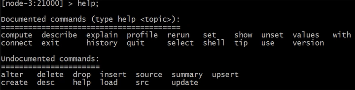

`connect hostname`连接到指定的机器的impalad上去执行。

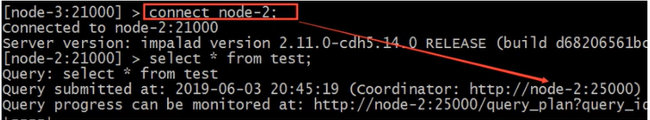


`refresh dbname.tablename`增量刷新，刷新某一张表的元数据，主要用于刷新Hive当中数据表里的数据改变的情况。

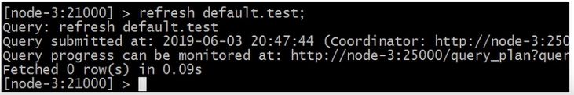

`invalidate metadata` 全量刷新，性能消耗较大，主要用于hive当中新建数据库或者数据库表的时候来进行刷新。

`quit命令` 从Impala shell中退出。

`exit命令` 从Impala shell中退出。

`explain命令` 用于查看SQL语句的执行计划。explain的值可以设置成0,1,2,3等几个值，其中3级别最高，可以打印出最全的信息。

```sql
set explain_level=3;
```

`pronfile命令` 执行==SQL语句之后执行==，可以打印出更加详细的执行步骤，主要用于查询结果的查看，集群的调优等。

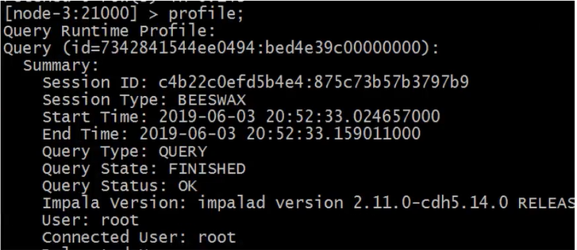

# 4. Impala SQL 语法

## 4.1 数据库特定语言

### 4.1.1 创建数据库

CREATE DATABASE语句用于在Impala中创建数据库。

```sql
CREATE DATABASE IF NOT EXISTS database_name；
```

这里，`IF NOT EXISTS`是一个可选的子句。如果我们要使用此子句，则只有在此名称的数据库不存在时，才会创建此数据库。

Impala默认使用impala用户执行操作，会报权限不足问题。

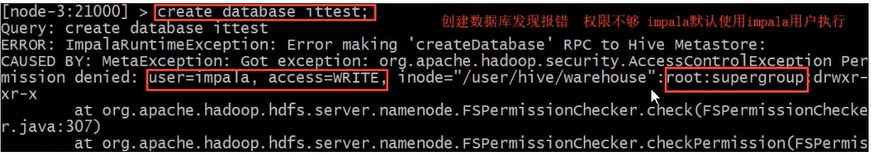

解决办法：

（1）给HDFS指定文件夹授予权限

```shell
hadoop fs -chmod -R 777 hdfs://node-1:9000/user/hive
```

（2）Hadoop配置文件中hdfs-site.xml中设置权限非false

```xml
<property>
	<name>dfs.permissions.enabled</name>
    <value>false</value>
</property>
```

上述两种方式都可以。


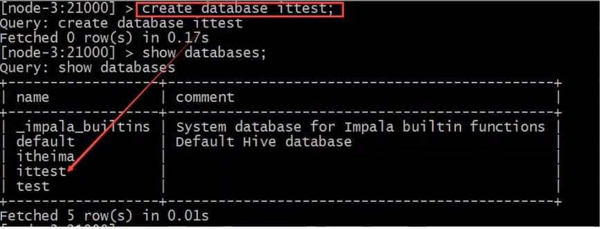默认会在Hive的数仓路径下创建新的数据库名文件夹`/user/hive/warehouse/ittest.db`

也可以在创建数据库的时候指定hdfs路径。==需要注意该路径的权限。==

`hadoop fs -mkdir -p  /input/impala`

`hadoop fs -chmod -R 777 /input/impala`

```sql
CREATE EXTERNAL TABLE t3(
    id int,
    name string,
    age int
)
ROW FORMAT DELIMITED FIELDS TERMINATED BY '\t' 
LOCATION '/input/impala/external';
```


### 4.1.2 删除数据库

Impala的`DROP DATABASE`语句用于从Impala中删除数据库。在删除数据库之前，建议删除所有表。

如果使用级联删除，Impala会在删除指定数据库中的表之前删除它

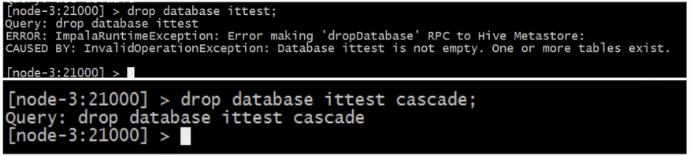

`DROP DATABASE sample CASCADE;`

## 4.2 表特定语言

### 4.2.1 create table语句

`CREAT TABLE`语句用于在Impala中的所需数据库中创建新表。

Impala支持的数据里类型和Hive类似，除了SQL类型外，还支持Java类型。

```sql
CREATE TABLE IF NOT EXISTS database_name.table_name(
	column1 data_type,
	column2 data_type,
    column3 data_type,
    ......
    columnN data_type,
)
```

默认建表的数据存储路径跟Hive一致。也可以在建表的时候通过`localtion`关键字指定具体路径，需要注意hdfs权限问题。

### 4.2.2 insert语句

Impala的`INSERT`语句有两个子句：`into`和`overwrite`。into用于插入新纪录数据，overwrite用于覆盖已有的记录。

```sql
insert into table_name(column1, column2, column3, ......, columnN)
values(value1, value2,value3,......,valueN);

insert into table_name values(value1, value2,value3,......,valueN);
```

`overwrite`子句会覆盖表当中==全部记录==。覆盖的记录将从表中永久删除。

### 4.2.3 select语句

Impala的`SELECT`语句用于从数据库中的一个或多个表中提取数据。此查询以表的形式返回数据。

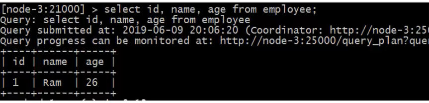

### 4.2.4 describe语句

Impala中的`DESCRIBE`语句用于提供表的描述。此语句的结果包含有关表的信息，例如列名称及其数据类型。

`describe [formatted] table_name`

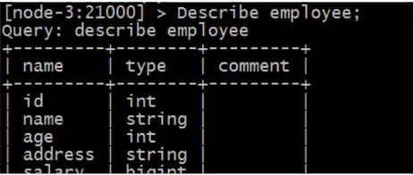

### 4.2.5 alter table语句

Impala中的`ALTER TABLE`语句用于对给定表执行更改，修改表结构。使用此语句，我们可以添加、删除或修改现有表中的列，也可以重命名它们。

`表重命名`：`ALTER TABLE [old_dbname.]old_table_name RENAME TO [new_dbname.]new_table_name`

`向表中添加列`: `ALTER TABLE table_name ADD COLUMNS (col_spec[,col_spec...])`

`从表中删除列`: `ALTER TABLE table_name DROP [COLUMN] column_name`

`更改列的名称和类型`:  `ALTER TABLE table_name CHANGE old_column_name new_column_name new_type`

### 4.2.6 delete、truncate table

Impala的`DROP TABLE`语句用于删除Impala中的现有表。此语句还会删除内部表底层的HDFS文件。

==注意：使用此命令时必须小心，因为删除表后，表中可用的所有信息也将永久丢失。==

```sql
DROP TABLE database_name.table_name;
```


Impala的`TRUNCATE TABLE` 语句用于从现有表中==删除所有记录，但保留表结构==。您可以使用DROP TABLE命令删除一个完整的表，但它会从数据库中删除整个表的表结构。

```sql
TRUNCATE TABLE table_name;
```

### 4.2.7 view视图

视图仅仅是存储在数据库中具有关联名称的Impala查询语言的语句。它是以预定义的SQL查询形式的表的组合。（我觉得是虚拟的表）。

视图可以包含表的所有行或选定的行。

```SQL
CREATE VIEW IF NOT EXISTS view_name AS SELECT语句
```

创建视图view

```sql
CREATE VIEW IF NOT EXISTS employee_view AS 
SELECT name, age FROM employee;
```

查询视图view

```sql
SELECT * FROM employee_view;
```

修改视图

```sql
ALTER TABLE database_name.view_name AS 
SELECT 语句
```

删除视图

```sql
DROP VIEW database_naem.view_name;
```


### 4.2.8 order by子句

Impala的`ORDER BY`子句用于根据一个或多个列以升序或降序对数据进行排序。

默认情况下，一些数据库按升序对查询结果进行排序。

```sql
SELECT * FROM table_name ORDER BY col_name [ASC|DESC] [NULLS FIRST |NULLS LAST]
```

可以使用关键字`ASC`或`DESC`分别按升序或降序排列表中的数据。

如果我们使用`NULLS FIRST`，表中的所有空值都排列在顶行；如果我们使用`NULLS LAST`，包含空值的行将排在最后。

### 4.2.9 group by子句

Impala中的`GROUP BY`子句与`SELECT`语句相协作使用，以将相同的数据排列到组中。

```SQL
SELECT data FROM table_name GROUP BY col_name;
```


### 4.2.10 having子句

Impala中的`HAVING`子句允许你指定过滤哪些组结果显示在最终结果中的条件。

一般来说，`HAVING`子句与`GROUP BY`子句一起使用；它将条件放置在由`GROUP BY`子句创建的组上。

### 4.2.11 limit、offset

Impala中的`LIMIT`子句用于将结果集的行数限制为所需的数，即查询的结果集不包含超过指定限制的记录。

一般来说，SELECT查询的resultset中的行从0开始。使用`OFFSET`子句，我么可以决定从哪里开始考虑输出。

### 4.2.12 with子句

如果查询太复杂，我们可以为复杂部分定义别名，并使用Impala的`WITH`子句将它们包含在查询中。

```SQL
WITH x AS (SELECT 1), y AS (SELECT 2)(SELECT * FROM x UNION y);
```

例如：使用`WITH`子句显示年龄大于25的员工和客户的记录。

```SQL
WITH t1 AS (SELECT * FROM customers WHERE age>25),
	t2 AS (SELECT * FROM employee WHERE age>25)
	(SELECT * FORM t1 UNION 
    	SELECT * FROM t2);
```

### 4.2.13 distinct

Impala中的`DISTINCT`运算符用于通过删除重复值来获取唯一值。

```SQL
SELECT DISTINCT colunms ... FROM table_name;
```


# 6.  Impala数据导入方式

## 6.1 load data

首先创建一个表：

```sql
create table user(
	id int,
    name string,
    age int
)
row format delimited fields terminated by '\t';
```

准备数据user.txt并上传到hdfs的/user/impala路径下


加载数据

```sql
load data inpath '/user/impala' into table user;
```

查询加载的数据

```sql
select * from user;
```

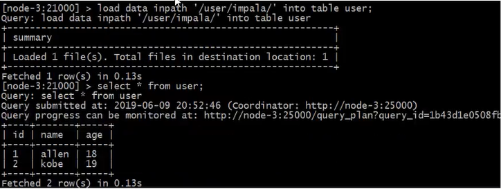

如果查询不到数据，那么需要刷新一遍数据表。

```sql
refresh user;
```

## 6.2 insert into values

这种方式非常类似于RDBMS的数据插入方式。

```sql
create table t_test2(
	id int,
	name string
);

insert into t_test2 values(1, "zhangsan");
```

## 6.3 insert into select

插入一张表的数据来自于后面的select查询语句返回的结果。

```sql
create table t_test3(
	id int
);

insert into table t_test3 select id from t_test2;
```

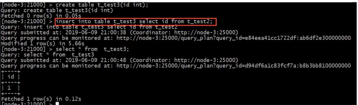

## 6.4 create as select

建表的字段个数、类型、数据来自于后序的select查询语句。

```sql
create table t_test4 as select name from t_test2;
```

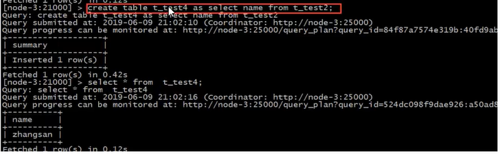

# 7. Impala的Java开发

在实际工作当中，因为Impala的查询比较快，所以可能有会使用Impala来做数据库查询的情况，可以通过java代码来进行操作impala的查询。

## 7.1 下载impala jdbc依赖

下载路径：

https://www.cloudera.com/downloads/connectors/impala/jdbc/2-5-28.html

因为cloudera属于商业公司性质，其提供的jar并不会出现在开源的maven仓库中，如果在企业中需要使用，请添加到企业maven私服。

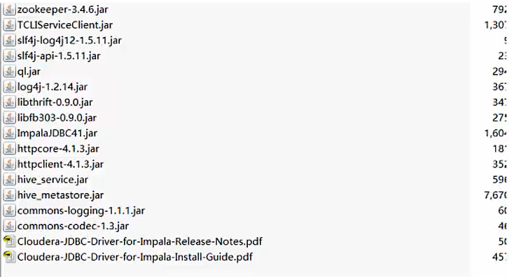

## 7.2 创建java工程

创建普通java工程，把依赖添加到工程。

pass

## 7.3 java api

pass

# **小结**：

- Impala是个实时的SQL查询工具，类似于Hive的操作方式，只不过执行的效率极高，号称当下大数据生态圈中执行效率最高的SQL类软件
- Impala来自于cloudera公司，后来贡献给了apache
- Impala工作 底层执行依赖于Hive，与Hive公用一套元数据存储。在使用Impala的时候，必须保证Hive服务是正常可靠的，至少metastore开启
- Impala最大的跟Hive的不同之处在于，不再把SQL 编译成MR程序执行，而是编译成执行计划树。
- Impala的SQL语法几乎兼容Hive的SQL语句

Impala是一个适用于实时交互查询的SQL软件，Hive是一个适用于批处理查询的SQL软件，通常是两者配合使用。

- Impala 可以集群部署
  - Impalad（impala server）：可以部署多个不同机器上，通常与datanode部署在同一个节点方便数据本地计算，负责具体执行本次查询SQL的impalad称之为Coordinator。每个impalaserver都可以对外提供服务。
  - Impala state store：主要保存impalad的状态信息，监视其健康状态。
  - Impala catalogd：metastore维护的网关，负责跟hive的metastore进行交互，同步Hive的元数据到Impala自己的元数据中。
  - CLI： 用户操作Impala的方式（Impala shell， JDBC, Hue）

- Impala查询处理流程
  - Impalad分为Java前端（接受解析SQL编译成执行计划树），C++后端（负责具体的执行计划树操作）
  - Impala SQL ---> Impalad（Coordinator）---> 调用Java前端编译SQL成计划树 ---> 以Thrift数据格式返回给C++后端 ---> 根据执行计划树，数据位于的路径（libhdfs和hdfs交互），Impalad状态分配执行计划，查询 ---> 汇总查询结果 ---> 返回给Java前端 ---> 用户CLI
  - 跟Hive的不同就在于真个执行中已经没有了MapReduce程序的存在。

- Impala集群安装规划

  - node-3：impalad、impala state store、impala catalogd、impala-shell
  - node-2：impalad
  - node-1：impalad

- Impala安装

  - Impala没有提供tar包，只有rpm包，这个rpm包只有cloudera公司
  - 要么自己去官网下载Impala rpm包和其相关依赖，要么自己制作本地yum源
  - 特别注意本地yum源的安装，需要Apache server对外提供web服务，使得各个机器都可以访问下载yum源

- Impala集群的启动关闭

  - 主节点 按照顺序启动服务

    ```shell
    service impala-state-store start
    service impala-catalog start
    service impala-server start
    ```

  - 从节点

    ```shell
    service impala-server start
    ```

  - 如果需要关闭impala，将上述命令中的start改为stop

  - 通过ps -ef |grep impala判断启动的进程是否正常，如果出错，日志是你解决问题的唯一一句。

    ```shell
    /var/log/impala
    ```

    

    

  