文档来源：[尚硅谷大数据技术之Ranger（Apache版）](https://www.bilibili.com/video/BV1g54y1W7E9?p=2&spm_id_from=pageDriver)


# 1. Ranger概述

## 1.1 什么是Ranger

Apache Ranger是一个用来在Hadoop平台上进行监控，启用服务，以及全方位数据安全访问管理的安全框架。

Ranger的愿景是在Apache Hadoop生态系统中提供全面的安全管理。随着企业业务的拓展，==企业可能在多用户环境中运行多个工作任务，这就要求Hadoop内的数据安全性需要扩展为同时支持多种不同的需求进行数据访问，同时还需要提供一个可以对安全策略进行集中管理，配置和监控用户访问的框架==。Ranger由此产生！

Ranger的官网：https://ranger.apache.org/

## 1.2 Ranger的目标

- 允许用户使用UI或REST API对所有和安全相关的任务进行集中化管理
- 允许用户使用一个管理工具对操作Hadoop体系中的组件和工具的行为进行细粒度的授权
- 支持Hadoop体系中各个组件的授权认证标准
- 增强了对不同业务场景需求的授权方法支持，例如基于角色的授权或基于属性的授权
- 支持对Hadoop组件所有色剂安全的审计行为的集中化管理

## 1.3 Ranger支持的框架

- Apache Hadoop
- Apache Hive
- Apache HBase
- Apache Storm
- Apache Knox
- Apache Solr
- Apache Kafka
- YARN
- NIFI

## 1.4 Ranger的架构

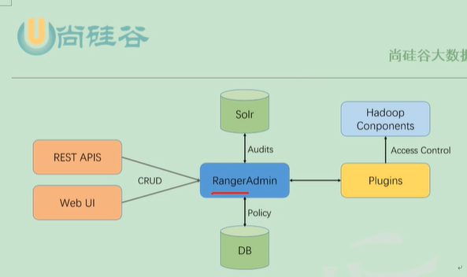


## 1.5 Ranger的工作原理

Ranger的核心是web应用程序，也成为RangerAdmin模块，此模块由管理策略，审计日志和报告等三部分组成。

管理员角色的用户可以通过RangerAdmin提供的web界面或REST APIS来定制安全策略。这些策略会由Ranger提供的轻量级的针对不同Hadoop体系中组件的插件来执行。插件会在Hadoop中的不同组件的核心进程启动后，启动对应的插件进程来进行安全管理！

# 2. Ranger的安装

## 2.1 环境准备

==Ranger2.0要求对应的Hdoop版本为3.x以上，Hive为3.x以上版本，JDK为1.8以上版本！==

## 2.2 安装RangerAdmin

### 2.2.1 数据库环境准备

在MySQL数据库中创建Ranger存储数据的数据库：

```sql
mysql> create database ranger;
```

创建用户：

```sql
mysql> grant all privileges on ranger.* to ranger@'%' identified by 'ranger';
```


### 2.2.2 安装RangerAdmin

解压软件：

```shell
tar -zxvf ranger-2.0.0admin.tar.gz -C /opt/module/ranger
```

进行配置：

```shell
vim install.properties
```

修改以下配置内容：

```properties
#mysql驱动
SQL_CONNECTOR_JAR=/opt/software/mysql-connector-java-5.1.27-bin.jar
#mysql的主机名和root用户的用户密码
db_root_user=root
db_root_password=00000000
db_host_=hadoop103
#ranger需要的数据库名和用户信息，和2.2.1创建的信息要一一对应
db_name=ranger
db_user=ranger
db_password=ranger
#其他ranger admin需要的用户密码
rangerAdmin_password=atguigu123
rangerTagsync_password=atguigu123
rangerUsersync_password=atguigu123
keyadmin_password=atguigu123
#ranger存储审计日志的路径，默认为solr，这里为了方便暂时不设置
audit_store=
#策略管理器的url，rangeradmin安装在哪台机器，主机名就位对应的主机名
policymgr_external_url=http://hadoop103:6080
#启动ranger admin进程的linux用户信息
unix_user=atguigu
unix_user_password=atguigu
unix_group=atguigu
#hadoop的配置文件目录
hadoop_conf=/opt/module/hadoop-3.1.3/etc/hadoop
```

==之后切换到root用户，执行安装==

```shell
./setup.sh
```

出现以下信息，说明安装完成

```shell
2020-04-30 13:58:18,051 [I] Ranger all default password change reqeust processed successfully.
Installation of Ranger PlicyManager Web Application is completed.
```


同步配置文件

```shell
./set_globals.sh
```


### 2.2.3 启动RangerAdmin

```shell
ranger-admin start
```

浏览器查看ranger admin UI界面是否可以正常访问。

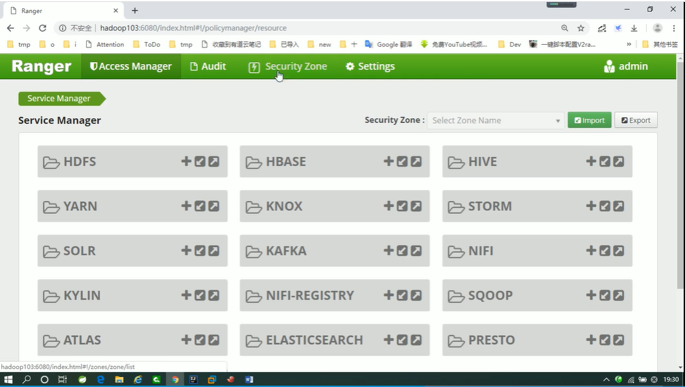

# 3. 安装RangerUsersync

## 3.1 RangerUsersync简介

==RangerUsersync作为Ranger提供的一个管理模块，可以 将Linux机器上的用户和组信息同步到RangerAdmin的数据库中进行管理！==

## 3.2 RangerUsersync安装

解压软件：

```shell
tar -zxvf /opt/software/apache-ranger-2.0.0/target/ranger-2.0.0-usersync.tar.gz -C /opt/moudle/ranger/
```

配置软件：

```shell
vim install.properties
```

修改以下配置信息：

```properties
#rangeradmin的url
POLICY_MGR_URL=http://hadoop103:6080
#同步间隔时间，单位（分钟）
SYNC_INTERVAL=1
#运行此进程的linux用户
unix_user=atguigu
unix_group=atguigu
#rangerUsersync的用户密码，参考rangeradmin中的install.properties的配置
rangerUsersync_password=atguigu123
#hadoop的配置文件目录
hadoop_conf=/opt/module/hadoop-3.1.3/etc/hadoop
```

==使用root用户进行安装==

```shell
./setup.sh
```

出现以下信息，说明安装完成

```shell
ranger.usersync.policymgr.password has been successfully created.
Provider jceks://file/etc/ranger/usersync/conf/rangerusersync.jceks was updated.
[I] Successfully updated password of rangerusersync user
```


### 3.3 RangerUsersync启动

启动之前，在ranger admin的web UI界面，查看用户信息如下：

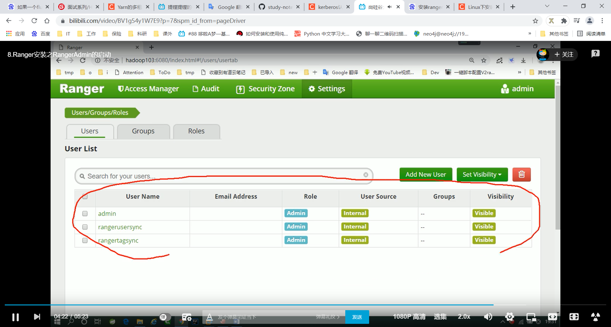

启动rangerUsersync

```shell
ranger-usersync start
```

浏览器中登录range admin UI界面，查看Linux系统中的那些用户是否同步过来了。

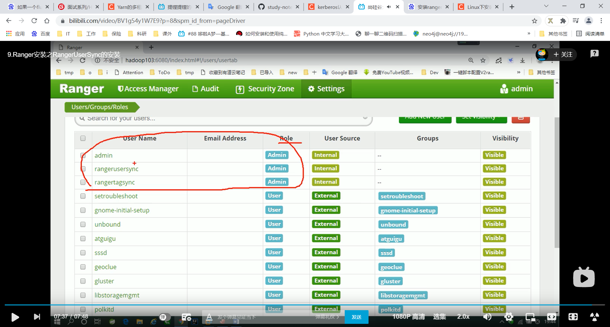


# 4. 安装Ranger Hive-plugin

## 4.1 Ranger Hive-plugin简介

Ranger Hive-plugin是Ranger对Hive进行权限管理的插件。==Ranger Hive-plugin只能对使用jdbc方式访问Hive的请求进行权限管理，hive-cli并不受限制！==

## 4.2 Ranger Hive-plugin安装

解压软件：

```shell
tar -zxvf /opt/software/apache-ranger-2.0.0/target/ranger-2.0.0-hive-plugin.tar.gz -C /opt/module/ranger/
```

配置软件：

```properties
vim install.properties

# 策略管理器的url地址
POLICY_MGR_URL=http://hadoop103:6080
# 组件名称可以自定义，需要与ranger admin UI界面中hive的服务名一致
REPOSITORY_NAME=hivedev
# hive的安装目录
COMPONENT_INSTALL_DIR_NAME=/opt/module/hive
# hive组件的启动用户，即ranger-hive-plugin用哪个用户去访问hiveserver2
CUSTOM_USER=atguigu
```


## 4.3 在ranger admin上配置hive

按照如下内容在ranger admin UI界面上配置一个名为hivedev的hive服务。

设置hive服务名为hivedev

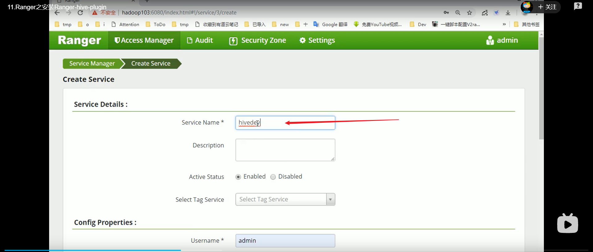


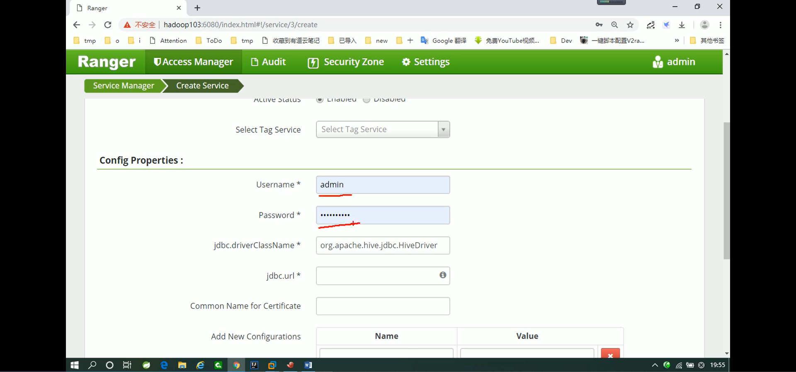

设置连接hiveserver2的jdbc url

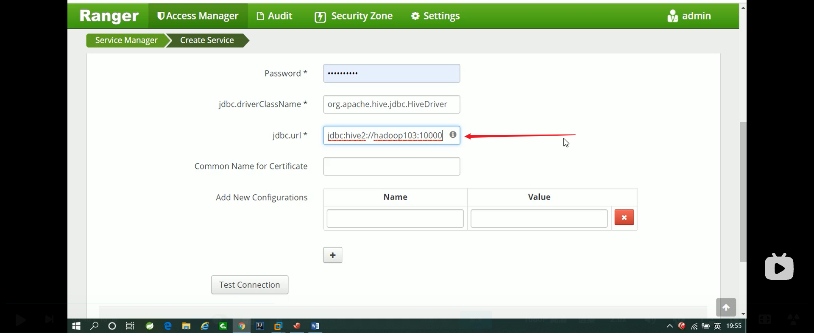

## 4.4测试连接hiveserver2

点击 Test Connection，测试是否能正常连接到hiveserver2

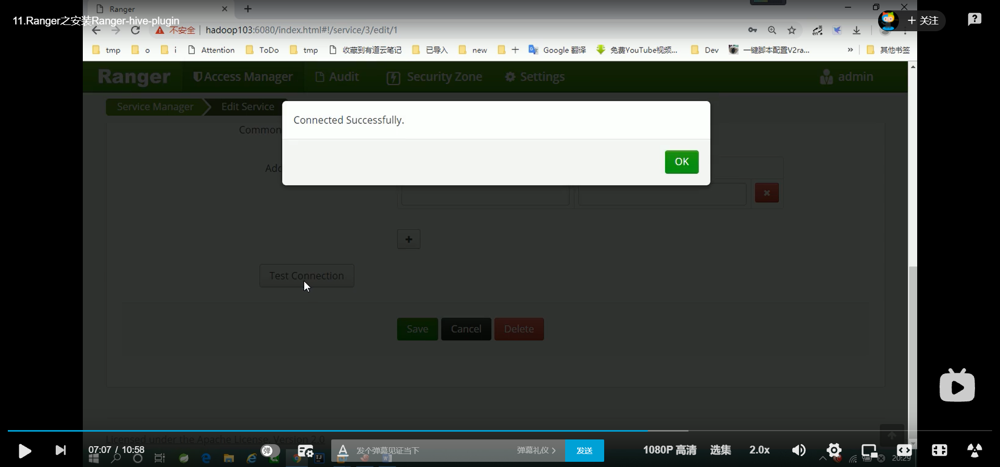

OK

# 5. 使用Ranger对Hive进行权限控制

## 5.1 权限控制初体验

查看默认的访问策略，此时只有admin用户拥有对所有库、表和函数的访问权限。

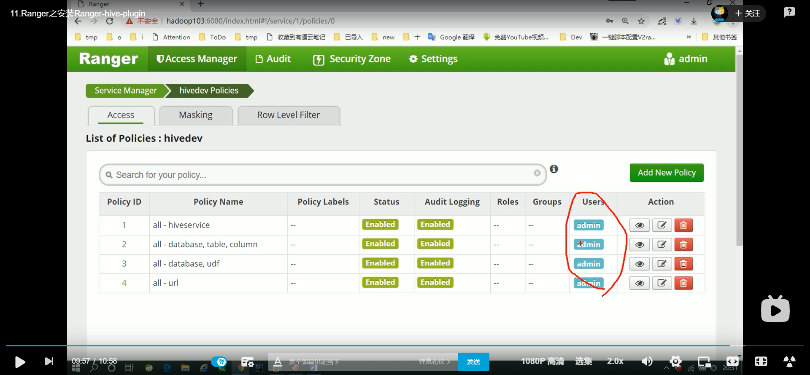

## 5.2 为用户配置权限

例如，为atguigu用户配置default库emp和dept表的所有列的读权限，为jack用户配置default库emp和dept表的所有列的读写权限。

点击Add New Policy按钮：

按照下图内容进行配置：

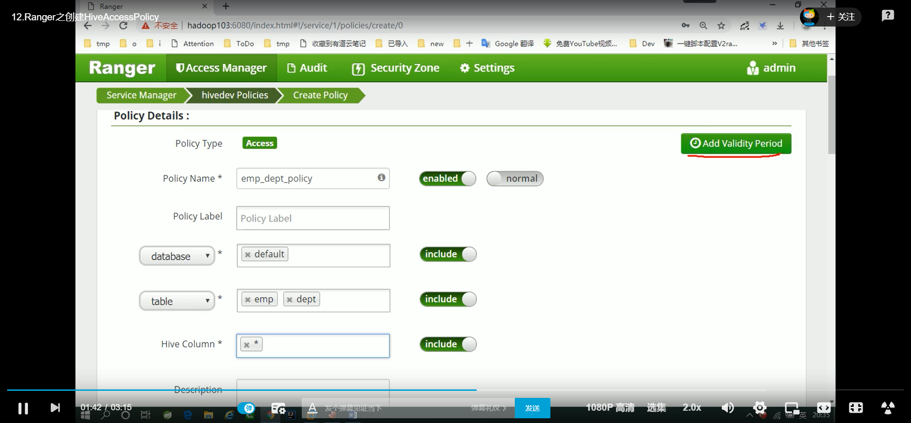


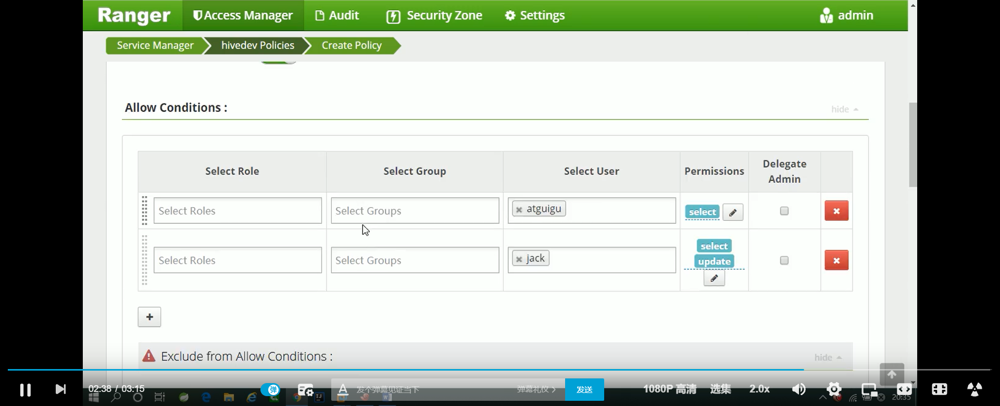


配置完成后，可以看到在访问权限策略界面多了一个emp_dept_plicy的策略。

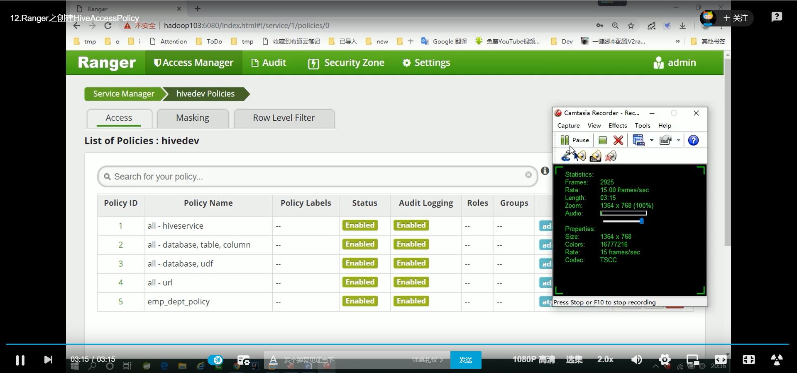

通过beeline连接hive进行访问权限测试。

## 5.3 脱敏操作

通过脱敏操作可以限制用户对某一列的访问，将敏感数据不暴露给用户！

案例：

指定atguigu用户在查询emp表时，对hiredate的年月部分脱敏！

==首先需要保证用户对指定的列有访问权限==，可以参考5.2进行配置！


没有进行脱敏操作前的查询结果，如下图所示：

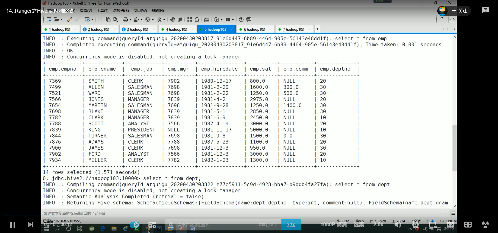

点击Masking标签，再点击Add New Policy

按照下图中内容进行配置

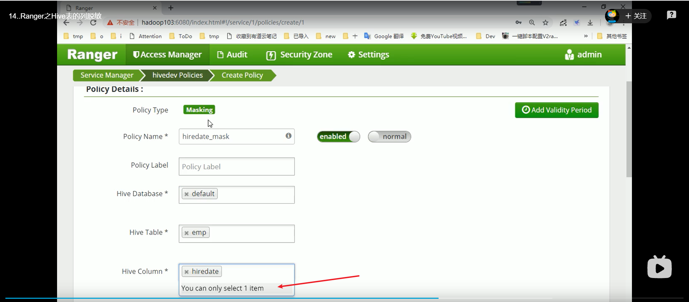


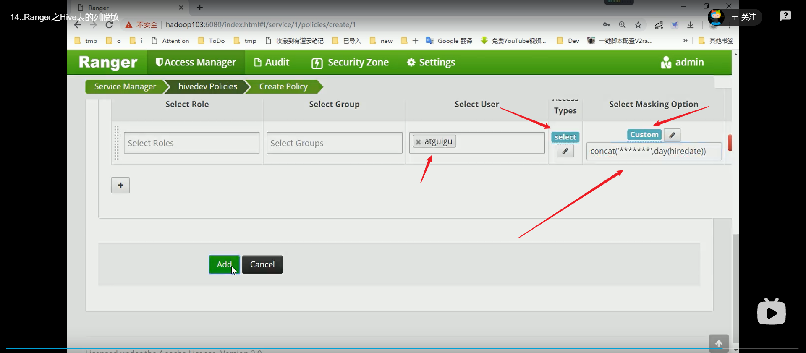

验证是否能对emp的hiredate字段进行脱敏。

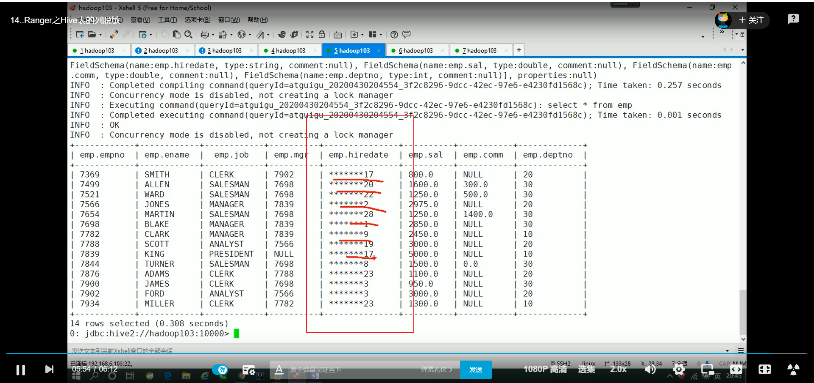

OK

## 5.4 行级别过滤

在没有设置行级别过滤前，使用atguigu用户查询default.emp表中的数据，结果如下所示：

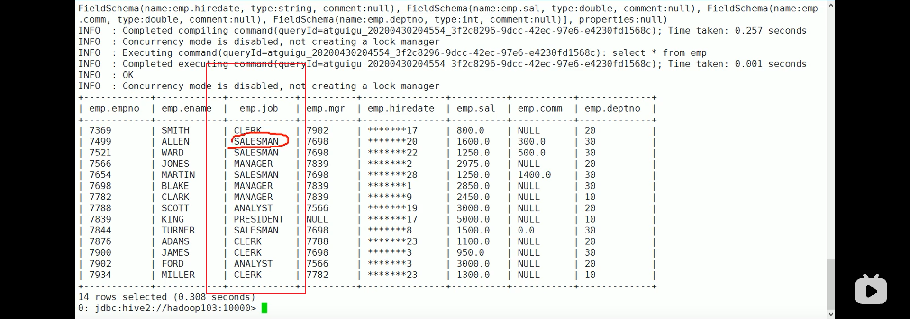

从上图，可以看到，现在atguigu用户可以查看到default.emp表中的所有行。

现在我们来添加一个行过滤策略：让atguigu用户只能访问job为SALESMAN的行。

点击Row Level Filter标签，再点击Add New Policy

按照下图中内容进行配置

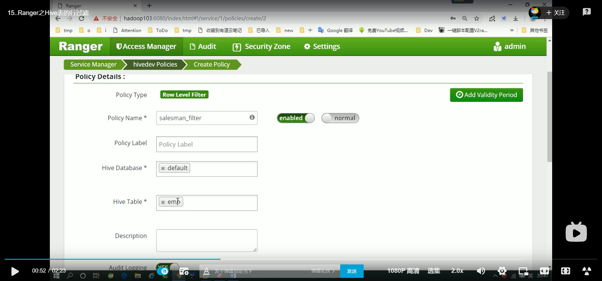


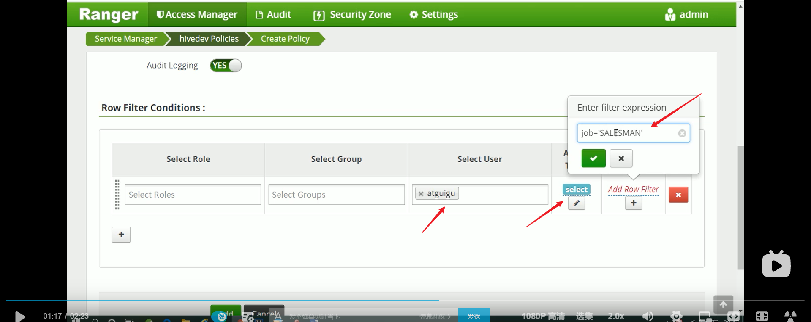


验证我们设置的行级别过滤策略是否生效了。

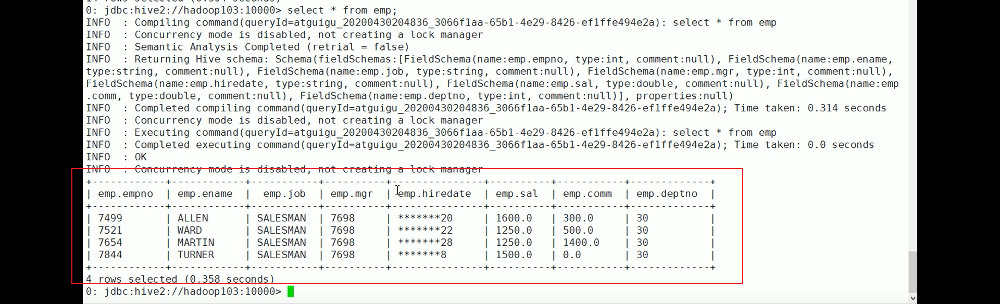

OK