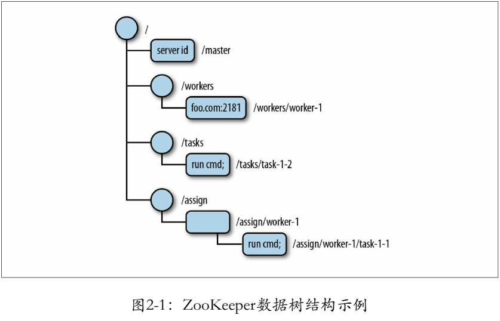
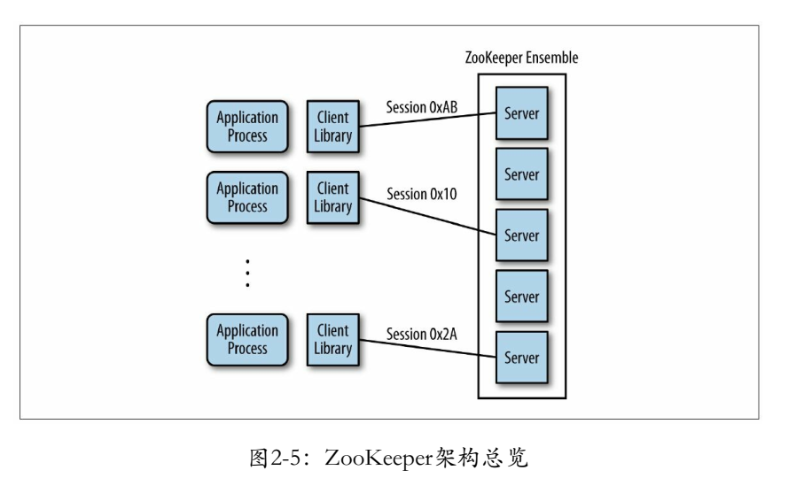
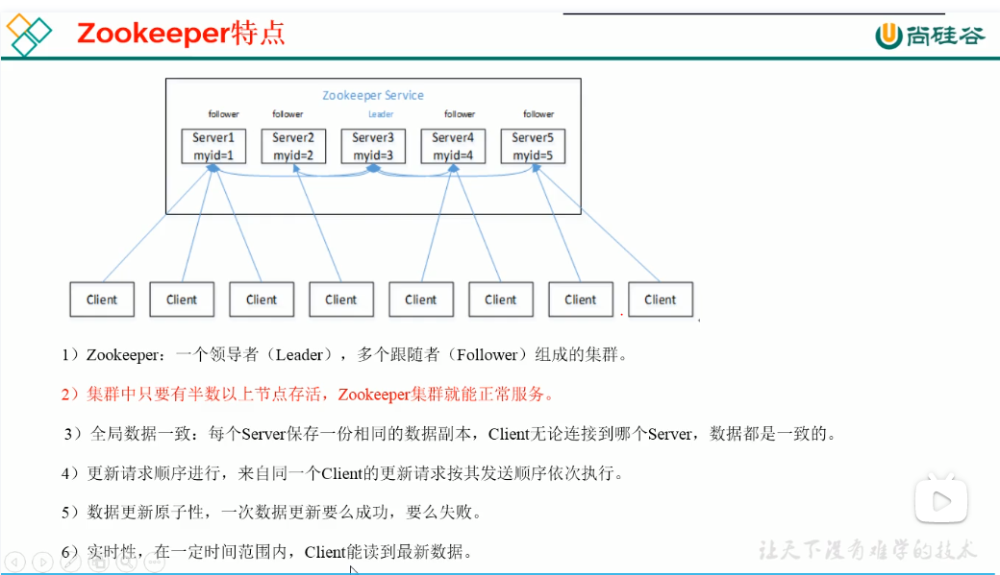
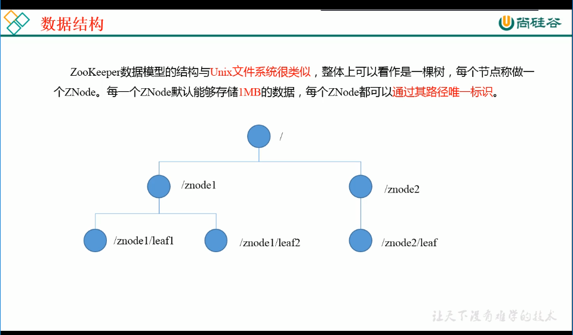
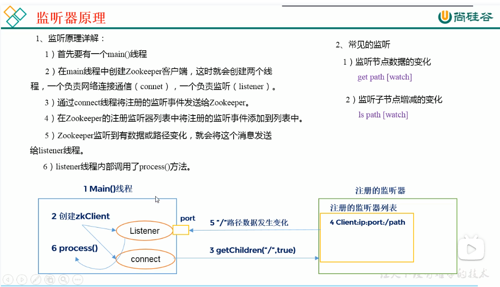
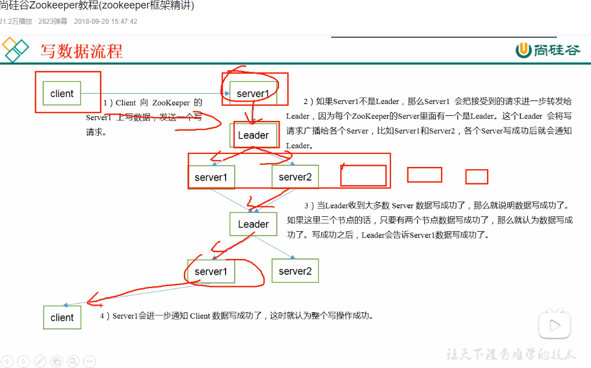

## ZooKeeper

[ZooKeeper官网](https://zookeeper.apache.org/)

### ZooKeeper的概念和基础

### ZooKeeper的使命

### 分布式协作的难点

### ZooKeeper的架构






### ZooKeeper的原理

### 使用ZooKeeper进行开发

### ZooKeeper的管理


### bilibili 视频

https://www.bilibili.com/video/BV1PW411r7iP?p=7&spm_id_from=pageDriver

### Zookeeper概述


### Zookeeper的特点



### Zookeeper的数据结构



### Zookeeper的应用场景


- **统一命名服务**。对应用/服务进行统一命名，方便识别。如用域名来作为多个IP的统一命名
- **统一配置管理**。将配置信息写入一个Znode，各个客户端watch这个Znode，配置信息发生改变则会通知这些客户端，实现配置文件的快速同步。
- **统一集群管理**。将节点信息写入一个Znode，监听这个Znode可以获取它的实时状态变化。
- **服务器节点动态上下线**。服务端的服务器节点上下线，通知设置了watch的客户端。
- **软负载均衡**。在ZK中记录每台服务器的访问数，让访问最少的服务器去处理最新的客户端请求

### Zookeeper的下载和安装

两种安装方式：

1. 本地安装
2. 分布式安装

#### 本地安装

安装前准备：

1. 安装jdk

2. 拷贝Zookeeper安装包到Linux系统中

3. 解压到指定目录

   ```shell
   tar -zxvf zookeeper-3.4.10.tar.gz -C /opt/module/
   ```

修改配置

```shell
# 1. 将/opt/module/zookeeper-3.4.10/conf这个路径下的zoo_sample.cfg修改为zoo.cfg
cp zoo_sample.cfg zoo.cfg
# 2. 打开zoo.cfg，修改配置
vim zoo.cfg
dataDir=/opt/module/zookeeper-3.4.10/zkData
# 3. 在/opt/module/zookeeper-3.4.10/目录创建zkData目录
mkdir zkData
```

操作ZK

```shell
# 1. 启动ZK
[root@agent apache-zookeeper-3.5.9-bin]# bin/zkServer.sh start
/usr/bin/java
ZooKeeper JMX enabled by default
Using config: /opt/module/apache-zookeeper-3.5.9-bin/bin/../conf/zoo.cfg
Starting zookeeper ... STARTED

# 2. 查看zk是否已启动
[root@agent apache-zookeeper-3.5.9-bin]# jps -ml

# 3. 查看状态
[root@agent apache-zookeeper-3.5.9-bin]# bin/zkServer.sh status
/usr/bin/java
ZooKeeper JMX enabled by default
Using config: /opt/module/apache-zookeeper-3.5.9-bin/bin/../conf/zoo.cfg
Client port found: 2181. Client address: localhost. Client SSL: false.
Mode: standalone

# 4. 启动zk客户端
[root@agent apache-zookeeper-3.5.9-bin]# bin/zkCli.sh
# 5. 退出zk客户端
[zk: localhost:2181(CONNECTED) 0] quit
# 6. 退出zk服务端
[root@agent apache-zookeeper-3.5.9-bin]# bin/zkServer.sh stop
```

配置参数解读

```yml
tickTime=2000 # zk中的时间以tickTime为单位，1个tickTime现在为2000ms
initLimit=10 # 即10个tickTime，表示在启动zk时，leader和follower，observer之间的状态同步的最长时间为10*2tickTime（请求和响应）
syncLimit=5 # 即5个tickTime，表示zk启动后，leader和follower，observer之间同步状态的最长时间为5*2个tickTime（请求和响应）
dataDir=/tmp/zookeeper # 存储zk数据的目录
clientPort=2181 # 监听客户端连接的端口
```

#### 分布式部署zk

##### 集群规划

在三个节点上部署zk。

##### 解压安装

```shell
tar -zxvf zookeeper-3.4.10.tar.gz -C /opt/module/
```

##### 配置服务器编号

```shell
[root@agent apache-zookeeper-3.5.9-bin]# mkdir/opt/module/zookeeper-3.4.10/zkData
[root@agent apache-zookeeper-3.5.9-bin]# cd /opt/module/zookeeper-3.4.10/zkData
[root@agent apache-zookeeper-3.5.9-bin]# echo 3 > myid
```

分别修改hadoop01，hadoop02，hadoop03这上台机器上的myid为1， 2， 3。

##### 配置zk

```shell
[root@agent apache-zookeeper-3.5.9-bin]# cp conf/zoo_sample.cfg conf/zoo.cfg
[root@agent apache-zookeeper-3.5.9-bin]# vim conf/zoo.cfg
# 增加如下内容
server.1=hadoop01:2888:3888
server.2=hadoop01:2888:3888
server.3=hadoop01:2888:3888
```

##### 配置解读

集群模式下，有一个文件`myid`，这个文件在dataDir配置的目录下，这个文件里的数字就是A的值。

```shell
# A是当前zk服务器的myid，
# B是服务器的ip地址，
# c是leader和follower的通信端口，
# D是选举时，进行通信的端口
server.A=B:C:D 
```

##### 启动zk集群

```shel
# 第一台机器
[root@agent apache-zookeeper-3.5.9-bin]# bin/zkServer.sh start
# 第二台机器
[root@agent apache-zookeeper-3.5.9-bin]# bin/zkServer.sh start
# 第三台机器
[root@agent apache-zookeeper-3.5.9-bin]# bin/zkServer.sh start
```


### ZK的内部原理

##### 选举机制（面试重点）

半数机制：集群中半数以上的机器存活，则集群就是可用的。所以使用奇数台服务器。

> 选举机制
>
> zk在配置文件中，并没有指定谁是leader，谁是follower。==observer不参与选举。==
>
> 假设五台服务器组成的zk集群，myid为1-5，都是新启动的，没有历史数据，所以zxid都是一致的，都为0。假设我们从1-5的顺序来启动zk集群，看看其选举leader的过程是什么样的。
>
> 1. server-1启动，它投给自己，并将此投票通知广播出去，但此时只有一台服务器，它发出的投票通知没有相应，所以它一直处于LOOKING状态；
> 2. server-2启动，它投给自己，它与server-1通信，分别交换自己的投票通知，server-2的zxid与server-1的zxid相同，但其myid大，所以server-1和server-2都投票给server-2了，但是不满足半数以上，所以server-2没有成为leader，server-1和server-2都LOOKING；
> 3. server-3启动，它投给自己，它与server-1，server-2通信，交换投票通知，由于zxid都相同，所以server-1，server-2，server-3都投给server-3，此时server-3成为leader；
> 4. server-4启动，发现已经有leader了，server-4成为follower；
> 5. server-5启动，发现已经有leader了，server-4成为follower；

##### 节点类型

- 持久节点（persistent）。客户端和服务端断开连接后，创建的额znode不删除。
- 临时节点（ephemeral）。客户端和服务端断开连接后，创建的额znode删除。
- 有序节点。在分布式系统中，顺序号可以被用于为所有的事件进行全局排序，这样客户端可以通过顺序号推断事件的顺序。
  - 持久有序节点，持久节点的基础上，该节点名会被编号。如，/test-per_001
  - 临时有序节点，临时节点的基础上，该节点名会被编号。如，/test-eph_001


#### stat结构体

```shell
czxid： 创建接地那的事务zxid
ctime： znode被创建的毫秒数
mzxid： znode最后更新的事务zxid
mtime： znode最后修改的毫秒数
pzxid： znode最后更新的子节点的zxid
cversion： znode子节点的版本号
dataversion：znode数据的版本号
aclversion：znode访问控制列表的版本号
ephemeralOwner：如果是临时节点，则是znode拥有者的session id，如果不是临时节点，则是0
```

#### 监听器原理（面试重点）



#### 写数据流程



好奇的是，zk中如何保证leader和follower之前数据一致的？