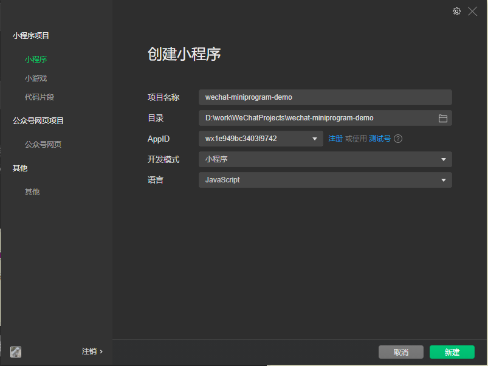
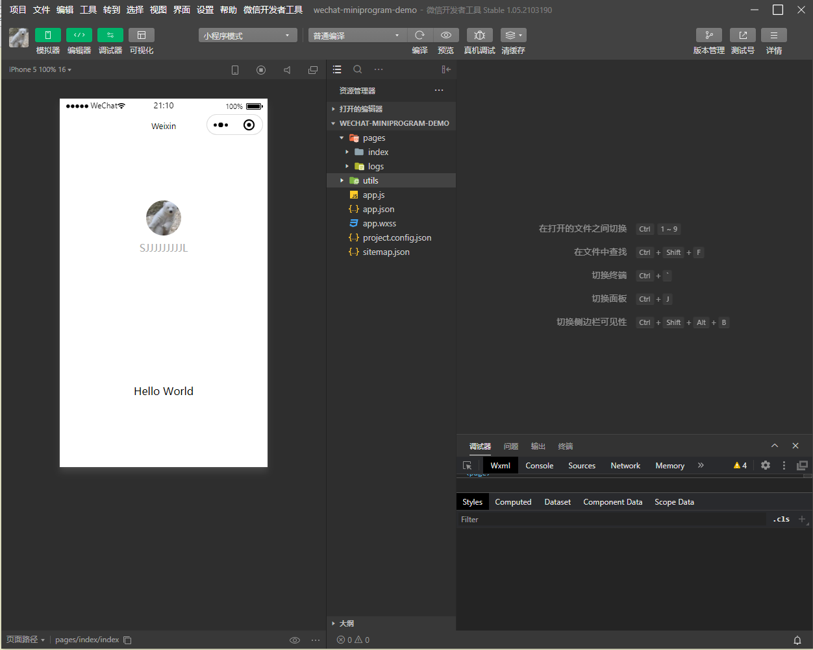

# 微信小程序

[微信小程序入门教程](http://www.ruanyifeng.com/blog/2020/10/wechat-miniprogram-tutorial-part-one.html)

[微信官方文档](https://developers.weixin.qq.com/miniprogram/dev/framework/)

### 1. 录[微信公众平台](https://mp.weixin.qq.com/)，注册小程序


```shell
开发者ID
开发者ID	
AppID(小程序ID)wx1e949bc3403f9742	
AppSecret(小程序密钥)89070a8818b5a84b8d14d0c0b1b0b14a
```


### 2. 下载微信提供的[小程序开发工具](https://developers.weixin.qq.com/miniprogram/dev/devtools/download.html)

使用这个小程序开发工具才能**运行**和**调试**小程序源代码。

安装好打开这个软件，会要求你使用微信扫描二维码登录。


登录进去后，界面如下所示：








