# 1. 前言

在项目中接触到迁移FTP服务器，由于对FTP服务器不太了解，因此在网上学习了一下FTP服务器的安装、配置和使用。

我们使用的是腾讯云的`go2tencentcloud` 迁移工具，具体使用方式见腾讯云官方文档：https://cloud.tencent.com/document/product/213/32961

## 1.1 FTP和SFTP

参考自 [FTP与SFTP两者有什么区别](https://network.51cto.com/article/603552.html)

在实际项目开发中最常使用的文件传输的方式有ftp和sftp两种，但是这两个传输方式各有什么特点呢?本文接下来将讨论SFTP、FTP的区别。

FTP服务器使用的是FTP协议（**File Transfer Protocol**）进行数据传输，SFTP使用的是ssh协议（Secure Socket Layer）进行数据传输。

FTP仅支持TCP协议不支持UDP协议。

### 1.1.1 FTP

不管FTP是什么模式，都有两个端口：

- **命令端口**，在FTP服务器和FTP客户端之间传输命令，进行登录认证等。
- **数据端口**，在FTP服务器和FTP客户端之间传输数据。

FTP有两种传输模式：

- 主动模式。（图片来自互联网）

  

  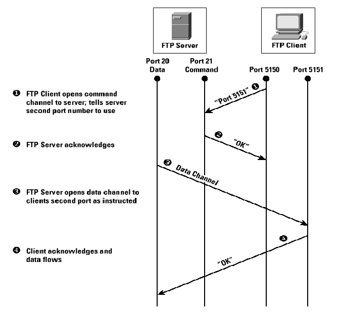

  下文引用自 [vsftpd 配置详解](https://www.cnblogs.com/rongkang/p/10005775.html)

  > **主动方式的FTP是这样的**：
  >
  > 客户端从一个任意的非特权端口N（N>1024）连接到FTP服务器的命令端口，也就是21端口。然后客户端开始 监听端口N+1， 并发送FTP命令“port N+1”到FTP服务器。接着服务器会从它自己的数据端口（20）连接到客户端指定的数据端口（N+1）。 针对FTP服务器前面的防火墙来说，必须允许以下通讯才能支持主动方式FTP：
  >
  > 1. 任何大于1024的端口到FTP服务器的21端口。（客户端初始化的连接）
  >
  > 2. FTP服务器的21端口到大于1024的端口。 （服务器响应客户端的控制端口） 
  > 3. FTP服务器的20端口到大于1024的端口。（服务器端初始化数据连接到客户端的数据端口）
  > 4.  大于1024端口到FTP服务器的20端口（客户端发送ACK响应到服务器的数据端口） 
  >
  > **简明概括**： 
  >
  > PORT（主动）方式的连接过程是：客户端向服务器的FTP端口（默认是21）发送连接请求，服务器接受连接，建立一条命令链路。当需要传送数据时， 客户端在命令链路上用PORT命令告诉服务器：“我打开了XXXX端口，你过来连接我”。于是服务器从20端口向客户端的XXXX端口发送连接请求， 建立一条数据链路来传送数据。 
  >
  > **开启主动模式**：
  >
  >  pasv_enable=no 若设置为YES，则使用PASV工作模式；若设置为NO，则使用PORT模式。默认值为YES，即使用PASV工作模式。 
  >
  > **主动模式下**：
  >
  >  SecureFX工具去连接ftp，客户没有允许开放端口，服务器没法与客户端相连接，关闭客户端防火墙*

  

- 被动模式，默认为被动模式。（图片来自互联网）

  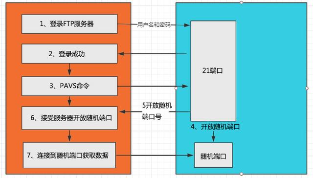

  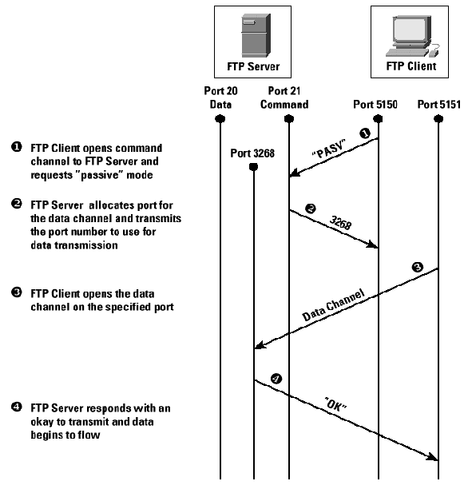

  

  下文引用自 [vsftpd 配置详解](https://www.cnblogs.com/rongkang/p/10005775.html)

  > 为了解决服务器发起到客户的连接的问题，人们开发了一种不同的FTP连接方式。这就是所谓的被动方式，或者叫做PASV，**当客户端通知服务器它处于 被动模式时才启用**。 **在被动方式FTP中，命令连接和数据连接都由客户端发起**，这样就可以解决从服务器到客户端的数据端口的入方向连接被防火墙过滤掉的问题。 
  >
  > 当开启一个 FTP连接时，客户端打开两个任意的非特权本地端口（N > 1024和N+1）。第一个端口连接服务器的21端口，但与主动方式的FTP不同， 客户端不会提交PORT命令并允许服务器来回连它的数据端口，而是提交 PASV命令。这样做的结果是服务器会开启一个任意的非特权端口（P > 1024） ，并发送PORT P命令给客户端。然后客户端发起从本地端口N+1到服务器的端口P的连接用来传送数据。 
  >
  > 
  >
  > **对于服务器端的防火墙来说，必须允许下面的通讯才能支持被动方式的FTP:** 
  >
  > 1. 从任何大于1024的端口到服务器的21端口 （客户端初始化的连接） 
  > 2.  服务器的21端口到任何大于1024的端口 （服务器响应到客户端的控制端口的连接） 
  > 3.  从任何大于1024端口到服务器的大于1024端口 （客户端初始化数据连接到服务器指定的任意端口） 
  > 4.  服务器的大于1024端口到远程的大于1024的端口（服务器发送ACK响应和数据到客户端的数据端口） 
  >
  > **简明概括：**
  >
  >  PASV（被动）方式的连接过程是：客户端向服务器的FTP端口（默认是21）发送连接请求，服务器接受连接，建立一条命令链路。当需要传送数据时， 服务器在命令链路上用PASV命令告诉客户端：“我打开了XXXX端口，你过来连接我”。于是客户端向服务器的XXXX端口发送连接请求，建立一条数据 链路来传送数据。 
  >
  > **开启被动模式:** 
  >
  > 默认是开启的，但是要指定一个端口范围，打开vsftpd.conf文件，在后面加上 pasv_enable=yes 若设置为YES，则使用PASV工作模式；若设置为NO，则使用PORT模式。默认值为YES，即使用PASV工作模式。 
  >
  > pasv_min_port=30000 在PASV工作模式下，数据连接可以使用的端口范围的最大端口，0 表示任意端口。默认值为0。 pasv_max_port=30999 在PASV工作模式下，数据连接可以使用的端口范围的最小端口，0 表示任意端口。默认值为0。 
  >
  > 表示端口范围为30000~30999，这个可以随意改。改完重启一下vsftpd 。

关于这部分可以看 [vsftpd 配置详解](https://www.cnblogs.com/rongkang/p/10005775.html)，我觉得这个文章讲得很好。

**FTP在以前都是默认为主动模式的，为什么现在改成了被动模式呢？主动模式有什么缺点呢？**

思考了一下，以下情景：

客户端通过NAT网关访问公网，FTP服务器通过公网给客户端提供服务。那么如果使用主动模式就有一个问题。在客户端发送的报文中携带的数据端口和ip信息都是客户端的内网地址，FTP服务器无法访问的。只有当客户端侧的NAT网关对客户端的这些端口做了映射之后才能实现FTP服务器与客户端之间数据能正常传输。

而通过被动模式，可以通过vsftp.conf配置文件中的pasv_address=FTP服务器的公网地址，来正常进行数据通信。

### 1.1.2 SFTP

SFTP是（**SSH File Transfer Protocol**）的缩写，安全文件传送协议。SFTP与FTP有着几乎一样的语法和功能。SFTP为SSH的其中一部分，是一种传输档案至 Blogger 服服器的安全方式。其实在SSH软件包中，已经包含了一个叫作SFTP的安全文件信息传输子系统，SFTP本身没有单独的守护进程，它必须使用sshd守护进程(**端口号默认是22**)来完成相应的连接和答复操作，所以从某种意义上来说，SFTP并不像一个服务器程序，而更像是一个客户端程序。

### 1.1.3 FTP与SFTP的区别

- 连接方式：FTP使用**TCP端口21**上的控制连接建立连接。而，SFTP是在客户端和服务器之间通过SSH协议(**TCP端口22**)建立的安全连接来传输文件。
- 安全性：SFTP使用加密传输认证信息和传输的数据，所以使用**SFTP相对于FTP是非常安全**。
- 效率：SFTP这种传输方式使用了加密解密技术，所以**SFTP的传输效率比普通的FTP要低得多**。

# 2. 安装FTP

## 2.1 Linux系统中安装FTP

### 2.1.1 Linux系统安装FTP服务端

参考自 [Linux下搭建FTP服务器的方法](https://www.linuxprobe.com/linux-ftpserver.html)

#### 2.1.1.1 检查安装`vsftp`

```shell
rpm -qa |grep vsftpd
```

上述命令可以检测出是否安装了`vsftpd`软件，如果没有安装，使用YUM[命令](https://www.linuxcool.com/)进行安装

```shell
yum install vsftpd -y

[root@hadoop001 ~]# yum install -y vsftpd
Loaded plugins: fastestmirror, langpacks
Loading mirror speeds from cached hostfile
 * base: mirrors.aliyun.com
 * extras: mirrors.aliyun.com
 * updates: mirrors.aliyun.com
Resolving Dependencies
--> Running transaction check
---> Package vsftpd.x86_64 0:3.0.2-29.el7_9 will be installed
--> Finished Dependency Resolution

Dependencies Resolved

=============================================================================================================================================================================================
 Package                                    Arch                                       Version                                             Repository                                   Size
=============================================================================================================================================================================================
Installing:
 vsftpd                                     x86_64                                     3.0.2-29.el7_9                                      updates                                     173 k

Transaction Summary
=============================================================================================================================================================================================
Install  1 Package

Total download size: 173 k
Installed size: 353 k
Downloading packages:
vsftpd-3.0.2-29.el7_9.x86_64.rpm                                                                                                                                      | 173 kB  00:00:00     
Running transaction check
Running transaction test
Transaction test succeeded
Running transaction
  Installing : vsftpd-3.0.2-29.el7_9.x86_64                                                                                                                                              1/1 
  Verifying  : vsftpd-3.0.2-29.el7_9.x86_64                                                                                                                                              1/1 

Installed:
  vsftpd.x86_64 0:3.0.2-29.el7_9                                                                                                                                                             

Complete!

```

#### 2.1.1.2 启动服务

使用vsftpd软件，主要包括如下几个命令：

```
#查看ftp服务状态
systemctl status vsftpd
#启动ftp命令
systemctl start vsftpd
#停止ftp命令
systemctl stop vsftpd
#重启ftp命
systemctl restart vsftpd
```

#### 2.1.1.3 vsftpd的配置

 [vsftpd 配置详解](https://www.cnblogs.com/rongkang/p/10005775.html)

[vsftpd.conf.5配置文件手册（中文版）](https://blog.csdn.net/m0_37355951/article/details/76974622)

[vsftpd 配置:chroot_local_user与chroot_list_enable详解](https://blog.csdn.net/bluishglc/article/details/42398811)

[ftpd服务常见配置总结（/etc/vsftpd/vsftpd.conf）](https://blog.csdn.net/han156/article/details/78386406)

[vsftpd配置文件参数详解](https://www.cnblogs.com/miclesvic/articles/10437213.html)

ftp的配置文件主要有三个，位于/etc/vsftpd/目录下，分别是：

```
/etc/vsftpd/ftpusers 该文件用来指定那些用户不能访问ftp服务器。
/etc/vsftpd/user_list 如果userlist_deny=NO,则只允许此文件中的用户访问FTP服务器；userlist_deny=YES (default)，则不允许此文件中的用户访问FTP服务器。
/etc/vsftpd/vsftpd.conf vsftpd的主配置文件
```


```shell
# 是否允许匿名用户登录FTP,用户ftp和您们都会作为匿名登录
# 匿名用户使用的登陆名为ftp或anonymous，口令为空；匿名用户不能离开匿名用户家目录/var/ftp,且只能下载不能上传。
anonymous_enable=YES

# 是否允许本地用户登录FTP，为NO则无法在服务器本地 ftp ip地址进行登录ftp服务器
# 本地用户的登录名为本地用户名，口令为此本地用户的口令；本地用户可以在自己家目录中进行读写操作；本地用户可以离开自家目录切换至有权限访问的其他目录，并在权限允许的情况下进行上传/下载。
local_enable=YES

# 是否允许在FTP中执行写命令。这些命令是：STOR，DELE，RNFR，RNTO，MKD，RMD，APPE和SITE。
write_enable=YES

# 本地用的权限掩码，默认为077。一般建议为022
local_umask=022

# 是否允许匿名FTP用户上传文件。需要write_enable=YES。
anon_upload_enable=NO

# 是否允许匿名FTP用户能创建新目录
anon_mkdir_write_enable=NO

# 当远程用户进入指定目录时，是否为其显示目录信息
dirmessage_enable=YES

# 上传/下载文件是否记录日志
xferlog_enable=YES

# 确保主动模式时，数据端口传输连接来自FTP服务器的20端口（FTP-DATA）。
#connect_from_port_20=YES

# 是否让上传的匿名文件属于不同的用户，不推荐上传文件的从属用户为root
chown_uploads=NO

# 指定匿名用户上传文件的所属者是谁
#chown_username=whoever

# 文件上传/下载的日志记录路径
xferlog_file=/var/log/vsftpd.log

# 是否使用ftpd 标准格式进行xferlog日志记录，该xferlog默认存储位置为/var/log/xferlog
xferlog_std_format=YES

# 如果启用，则会并行生成两个日志文件，默认情况下为 /var/log/xferlog 和 /var/log/vsftpd.log。前者是一个wu-ftpd样式的传输日志，可以通过标准工具解析。后者是vsftpd自己的样式日志。
dual_log_enable=YES

# 会话无命令操作超时时长
idle_session_timeout=600

# 数据连接无数据输超时时长
data_connection_timeout=120

# vsftpd服务指定用户身份运行
nopriv_user=ftpuser

# 启用此功能后，FTP服务端能够识别异步ABOR请求。从安全角度不推荐启用此功能。但不启用此功能，某些版本较老的FTP客户端的请求可能会被拒绝
async_abor_enable=YES

# 当设置为YES，ASCII模式数据传输数据上传。
ascii_upload_enable=YES

# 当设置为YES，ASCII模式数据传输数据下载
ascii_download_enable=YES

# 登录提示信息
#ftpd_banner=Welcome to blah FTP service.

#  是否不允许某些匿名email地址，默认禁止的email文件是/etc/vsftpd.banned_emails。常用于防止DOS攻击
#deny_email_enable=YES

# 记录禁止匿名email地址登录ftp的文件
#banned_email_file=/etc/vsftpd/banned_emails

# 是否将所有用户限制在主目录,YES为启用 NO禁用.(该项默认值是NO,即在安装vsftpd后不做配置的话，ftp用户是可以向上切换到主目录之外的)
#chroot_local_user=YES

# 是否启动限制用户的名单 YES为启用  NO禁用(默认)
chroot_list_enable=NO
#  是否限制在主目录下的用户名单，至于是限制名单还是排除名单，这取决于chroot_local_user的值，我们可以这样记忆： chroot_local_user总是一个全局性的设定，其为YES时，全部用户被锁定于主目录，其为NO时，全部用户不被锁定于主目录。那么我们势必需要在全局设定下能做出一些“微调”，即，我们总是需要一种“例外机制"，所以当chroot_list_enable=YES时，表示我们“需要例外”。而”例外“的含义总是有一个上下文的，即，当”全部用户被锁定于主目录“时（即chroot_local_user=YES），"例外"就是：不被锁定的用户是哪些；当"全部用户不被锁定于主目录"时（即chroot_local_user=NO），"例外"“就是：要被锁定的用户是哪些。这样解释和记忆两者之间的关系就很清晰了！

#chroot_list_file=/etc/vsftpd/chroot_list

# 是否允许 "ls -R"。默认禁用，避免远程用户在对大型FTP服务器使用"ls -R"时占用过多的I/O
ls_recurse_enable=NO

# 是否启用"listen"指令。启用之后，vsftpd以standalone模式运行，并监听IPv4 sockets。与listen_ipv6互斥，不能同时启用。
listen=YES

# 命令端口，前提是vsftpd以standalone模式运行。
listen_port=21021

# 是否启用 监听IPv6 sockets。
listen_ipv6=NO

# 使用pam(Pluggable Authentication Modules)完成用户认证
pam_service_name=vsftpd

# 是否启用控制用户登录的列表文件（/etc/vsftpd/user_list）。如果userlist_deny=NO,则只允许此文件中的用户访问FTP服务器；userlist_deny=YES (default)，则不允许此文件中的用户访问FTP服务器。
userlist_enable=YES

# 这个不知道
tcp_wrappers=YES

# 是否开启虚拟用户
guest_enable=YES

# 映射虚拟用户为guest_username用户，配合上面选项生效；即访客用户映射到的FTP服务器所在的真实系统用户名
guest_username=ftpuser

# 如果启用，虚拟用户将使用与本地用户相同的权限。默认情况下，虚拟用户将使用与匿名用户相同的权限，这往往更具限制性（特别是在写访问方面）。
virtual_use_local_privs=YES

# 设置虚拟用户的配置文件目录，用哪个帐户登陆就用哪个帐户命名。FTP服务器会在此目录下找对应用户的文件，应用该文件中的配置。
user_config_dir=/etc/vsftpd/userlocal

# 是否启用FTP的被动模式
pasv_enable=YES

# 确保主动模式时，数据端口传输连接来自FTP服务器的20端口（FTP-DATA）。
connect_from_port_20=YES

# 被动模式数据端口最小值
pasv_min_port=33000

# 被动模式数据端口最大值
pasv_max_port=34000

# 是否屏蔽对pasv进行安全检查。
pasv_promiscuous=YES

# pasv模式中服务器传回的ip地址，告诉客户端应该去连哪个ip的数据端口，根据需要填写FTP服务器的内网/公网地址
pasv_address=47.99.33.60

# 被动模式数据连接超时时长
accept_timeout=10

# 主动模式数据连接超时时长
connect_timeout=5
```


#### 2.1.1.4 登录方式

```
1. 浏览器上输入
ftp://vsftp所在机器ip/

2. 文件管理器输入
ftp://vsftp所在机器ip/ ；
 右键可以选择登录
 
3. 其他FTP客户端
```

### 2.1.2 Linux系统安装FTP客户端

```shell
yum install -y ftp
```


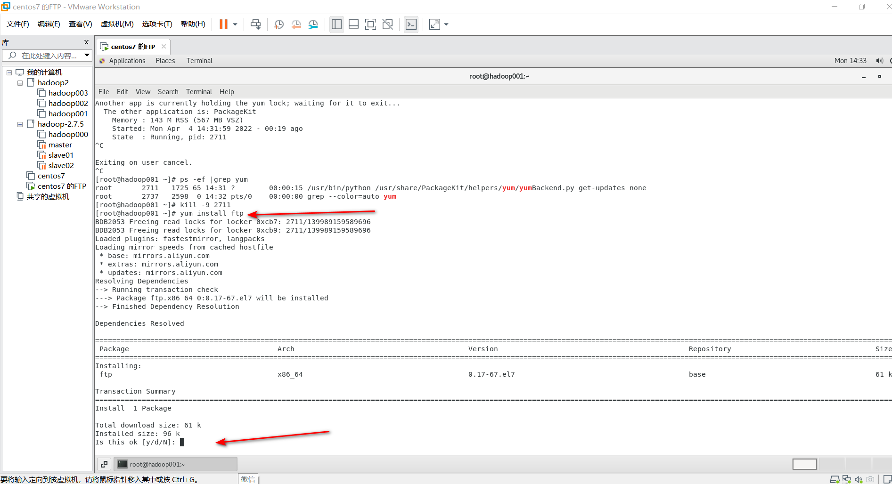

安装完成之后，验证下ftp是否是安装成功了

```shell
[root@hadoop001 ~]# ftp -help

	Usage: { ftp | pftp } [-Apinegvtd] [hostname]
	   -A: enable active mode
	   -p: enable passive mode (default for ftp and pftp)
	   -i: turn off prompting during mget
	   -n: inhibit auto-login
	   -e: disable readline support, if present
	   -g: disable filename globbing
	   -m: don't force data channel interface to the same as control channel
	   -v: verbose mode
	   -t: enable packet tracing [nonfunctional]
	   -d: enable debugging
```

### 

## 2.2 Windows系统中安装FTP

### 2.2.1 安装FTP服务器

TODO

### 2.2.2 安装FTP客户端

#### 2.2.2.1 下载Filezila：[*FileZilla*中文网](https://www.filezilla.cn/download/client)

我下载的是免安装版，如下图所示。

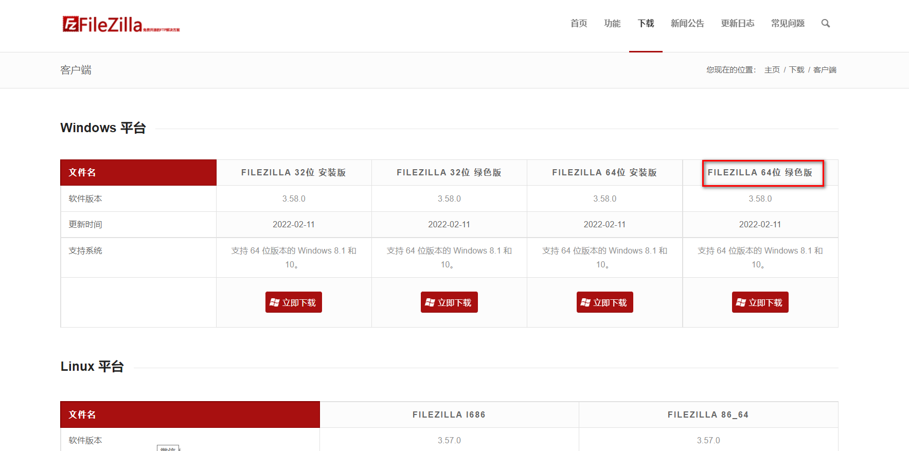

#### 2.2.2.2 下载之后，解压

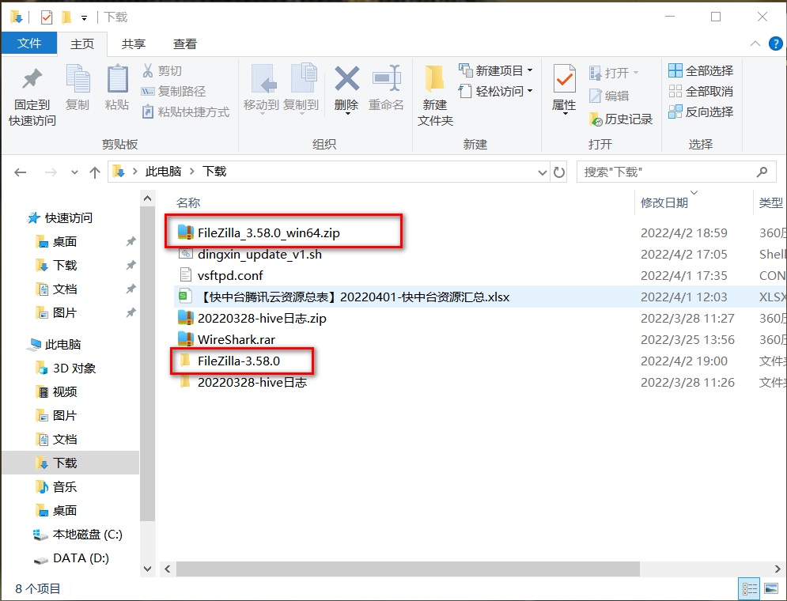

解压后，目录内容如下所示：

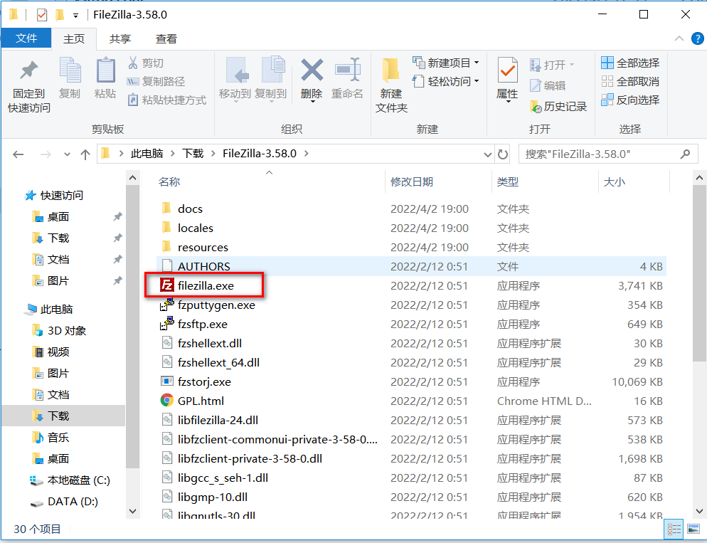

#### 2.2.2.3 使用Filezila

按照下图所示填写正确的主机、用户名、密码和FTP端口就可以连接到FTP服务器了。

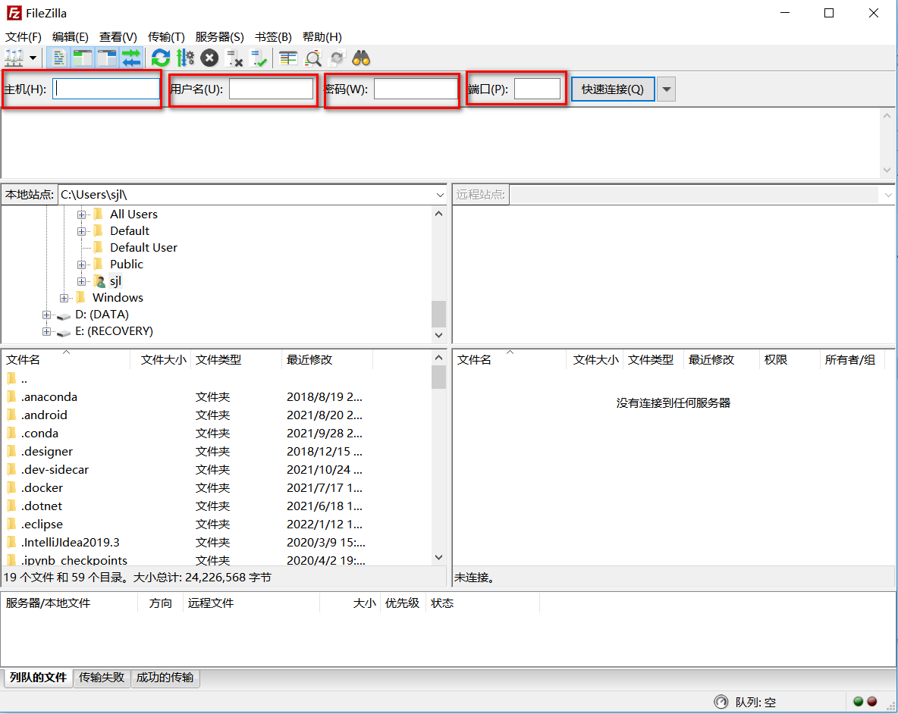

# 3. FTP基础使用

VMWare虚拟机中的Linux系统安装了一个vsftpd服务器，通过windows宿主机的文件管理器以匿名用户形式访问ftp服务器。

地址栏 输入ftp://192.168.61.129:21，回车，就会得到如下界面

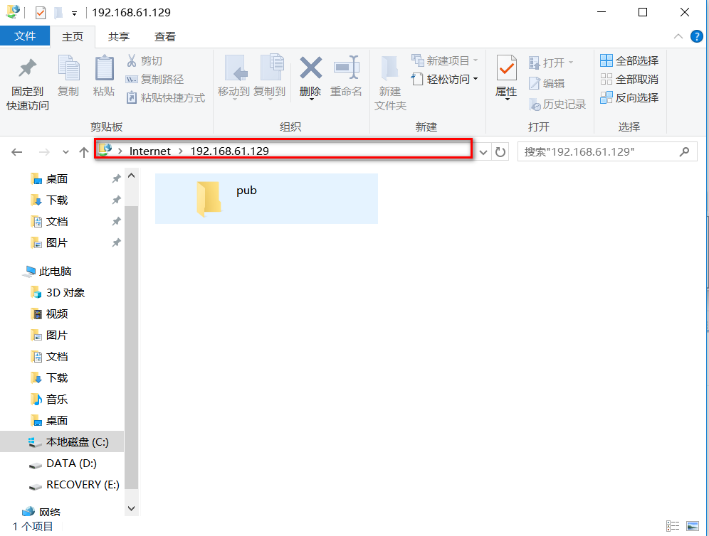

通过Filezila访问虚拟机的FTP服务器

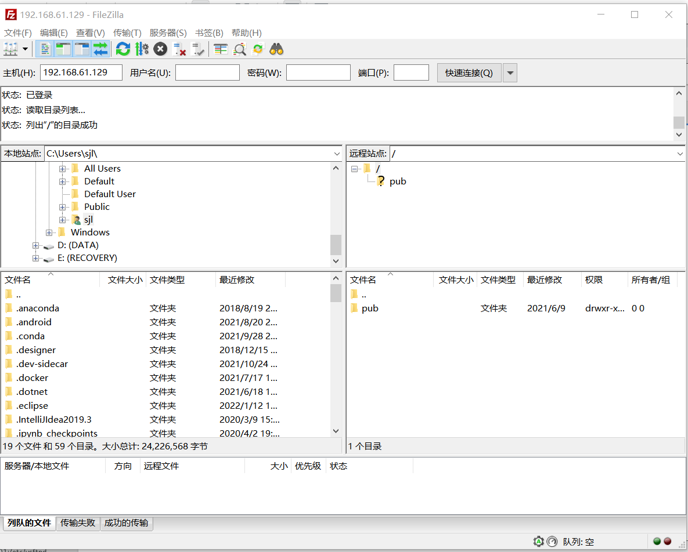


在linux系统中通过命令行访问虚拟机的FTP服务器

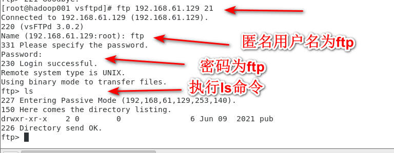

当以匿名用户访问FTP服务器时，匿名用户的根目录默认为`/var/ftp/`，如下图所示。

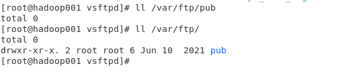

**下面以linux命令行访问FTP服务器为例，介绍ftp客户端的基础命令。**

1 连接FTP服务器

```shell
# 需要先在linux系统中安装ftp客户端，yum install -y ftp
ftp <ip> [port]
ftp 192.168.61.129 21
ftp ftp服务器域名

[root@hadoop001 vsftpd]# ftp
ftp> open 192.168.61.129 21
onnected to 192.168.61.129 (192.168.61.129).
220 (vsFTPd 3.0.2)
Name (192.168.61.129:root): 
```

打印目录列表

```shell
ls
```

改变目录

```shell
cd /path/to/directory
```

创建目录

```shell
mkdir /path/to/directory
```

下载文件

```shell
# 指定下载目录，不指定的话文件将会下载到你登录 FTP 时候的工作目录。
lcd /home/user/yourdirectoryname

# 使用命令 get 来下载单个文件
# 文件会保存在使用lcd命令设置的目录位置。
get /path/to/filename

# 下载多个文件
mget *.xls
```

上传文件

```shell
# 上传单个文件
put /path/to/filename

# 上传多个文件
mput *.xls
```

关闭FTP连接

```shell
bye
exit
quit
均可
```

查看更多命令

```shell
建立ftp连接后，执行help
```


登录FTP服务器的用户需要对`/var/ftp`目录有`x`权限，有此权限才能执行`ls`等命令。

```shell
# 未给/var/ftp目录赋予x权限
chmod -R 766 /var/ftp

ftp> ls
227 Entering Passive Mode (192,168,61,129,221,127).
150 Here comes the directory listing.
226 Transfer done (but failed to open directory).

# 给/var/ftp目录赋予x权限
chmod -R 777 /var/ftp

ftp> ls
227 Entering Passive Mode (192,168,61,129,36,70).
150 Here comes the directory listing.
drwxrwxrwx    2 0        0               6 Jun 09  2021 pub
226 Directory send OK.
```


# 4. 我的ftp被动模式+用户映射的配置示例

本段参考自：[FTP原理和虚拟用户映射登录-2019.2.8](https://www.cnblogs.com/legenidongma/p/10356555.html)

a、先安装虚拟用户需要的安装的软件包

```shell
yum install pam* libdb-utils libdb* --skip-broken -y 
```

b、 创建虚拟用户文件` /etc/vsftpd/ftpusers.txt`,新建虚拟用户和密码，奇数行是账号偶数行是密码。

```shell
nihao1
123456
nihao2
123456
```

c、生成vsftpd虚拟用户数据认证文件，设置权限600。

```shell
#将明文密码转换 
db_load -T -t hash -f /etc/vsftpd/ftpusers.txt /etc/vsftpd/vsftpd_login.db 
chmod 700 /etc/vsftpd/vsftpd_login.db /etc/vsftpd/ftpusers.txt 
```

d、配置PAM认证文件，编辑`/etc/pam.d/vsftpd` ，注释原始内容，新增如下两行。需要注意的是，注释原来的`/etc/pam.d/vsftpd`的内容之后，linux本地用户就无法登录ftp服务器了，只有`/etc/vsftpd/ftpusers.txt中`的虚拟用户可以登录。pam的认证机制决定了什么样的用户可以登录ftp服务器。

```shell
auth required pam_userdb.so db=/etc/vsftpd/vsftpd_login 
account required pam_userdb.so db=/etc/vsftpd/vsftpd_login
```

要想让原来的linux本地系统用户可以登录ftp服务器，则使用最开始`/etc/pam.d/vsftpd`的内容，我的`/etc/pam.d/vsftpd`原始内容如下：

```shell
#%PAM-1.0
session    optional     pam_keyinit.so    force revoke
auth       required     pam_listfile.so item=user sense=deny file=/etc/vsftpd/ftpusers onerr=succeed
auth       required     pam_shells.so
auth       include      password-auth
account    include      password-auth
session    required     pam_loginuid.so
session    include      passwo rd-auth
```

e、所有vsftp虚拟用户需要映射到一个系统用户，该系统用户不需要密码，也不需要登录，主要是用于虚拟用户映射使用，创建命令如下：

```shell
#创建ftpuser用户组
groupadd ftpuser
#创建ftpuser, -g指定用户组，-M不创建家目录，-s指定shell，/sbin/nologin表示ftpuser不能登录此linux系统
useradd -g ftpuser -M -s /sbin/nologin ftpuser
```

f、完整vsftpd.conf配置创建代码

```shell
pam_service_name=vsftpd #虚拟用户启用pam认证

guest_enable=YES #启用虚用户

guset_username=ftpuser #映射虚拟用户至系统用户ftpuser

user_config_dir=/etc/vsftpd/vsftpd_user_conf #设置虚拟用户配置文件目录

virtual_use_local_privs=YES #虚拟用户使用与本地用户相同的权限
```

g、所有虚拟用户共同基/home/ftpuser 主目录实现上传和下载，可以在/etc/vsftpd/vsftpd_user_conf目录创建虚拟用户各自的配置文件，创建虚拟用户配置文件主目录

```shell
mkdir -p /etc/vsftpd/vsftpd_user_conf
```

h、为虚拟用户创建配置文件 nihao1 、nihao2

创建每个用户自己的ftp主目录：

```shell
mkdir -p /home/ftpuser/{nihao1.nihao2}
chown -R ftpuser.ftpuser /home/ftpuser
```

`vim /etc/vsftpd/vsftpd_user_conf/nihao1` 同时创建私有的虚拟目录，代码如下：

```shell
local_root=/home/ftpuser/nihao1

write_enable=YES

anon_world_readable_only=YES

anon_upload_enable=YES

anon_mkdir_write_enable=YES

anon_other_write_enable=YES
```

`/etc/vsftpd/vsftpd.conf`配置示例（被动模式+用户映射）

```python
# Example config file /etc/vsftpd/vsftpd.conf
#
# The default compiled in settings are fairly paranoid. This sample file
# loosens things up a bit, to make the ftp daemon more usable.
# Please see vsftpd.conf.5 for all compiled in defaults.
#
# READ THIS: This example file is NOT an exhaustive list of vsftpd options.
# Please read the vsftpd.conf.5 manual page to get a full idea of vsftpd's
# capabilities.
#
# Allow anonymous FTP? (Beware - allowed by default if you comment this out).
anonymous_enable=NO
#
# Uncomment this to allow local users to log in.
# When SELinux is enforcing check for SE bool ftp_home_dir
local_enable=YES
#
# Uncomment this to enable any form of FTP write command.
write_enable=YES
#
# Default umask for local users is 077. You may wish to change this to 022,
# if your users expect that (022 is used by most other ftpd's)
local_umask=022
#
# Uncomment this to allow the anonymous FTP user to upload files. This only
# has an effect if the above global write enable is activated. Also, you will
# obviously need to create a directory writable by the FTP user.
# When SELinux is enforcing check for SE bool allow_ftpd_anon_write, allow_ftpd_full_access
anon_upload_enable=NO
#
# Uncomment this if you want the anonymous FTP user to be able to create
# new directories.
anon_mkdir_write_enable=NO
#允许匿名用户进行删除或者改名等操作
anon_other_write_enable=NO
#
# Activate directory messages - messages given to remote users when they
# go into a certain directory.
dirmessage_enable=YES
#
# Activate logging of uploads/downloads.
xferlog_enable=YES
#
# Make sure PORT transfer connections originate from port 20 (ftp-data).
connect_from_port_20=YES
#
# If you want, you can arrange for uploaded anonymous files to be owned by
# a different user. Note! Using "root" for uploaded files is not
# recommended!
chown_uploads=YES
chown_username=ftpuser
#
# You may override where the log file goes if you like. The default is shown
# below.
#xferlog_file=/var/log/xferlog
#
# If you want, you can have your log file in standard ftpd xferlog format.
# Note that the default log file location is /var/log/xferlog in this case.
xferlog_std_format=YES
#
# You may change the default value for timing out an idle session.
idle_session_timeout=600
#
# You may change the default value for timing out a data connection.
data_connection_timeout=120
#
# It is recommended that you define on your system a unique user which the
# ftp server can use as a totally isolated and unprivileged user.
nopriv_user=ftpuser
#
# Enable this and the server will recognise asynchronous ABOR requests. Not
# recommended for security (the code is non-trivial). Not enabling it,
# however, may confuse older FTP clients.
#async_abor_enable=YES
#
# By default the server will pretend to allow ASCII mode but in fact ignore
# the request. Turn on the below options to have the server actually do ASCII
# mangling on files when in ASCII mode. The vsftpd.conf(5) man page explains
# the behaviour when these options are disabled.
# Beware that on some FTP servers, ASCII support allows a denial of service
# attack (DoS) via the command "SIZE /big/file" in ASCII mode. vsftpd
# predicted this attack and has always been safe, reporting the size of the
# raw file.
# ASCII mangling is a horrible feature of the protocol.
#ascii_upload_enable=YES
#ascii_download_enable=YES
#
# You may fully customise the login banner string:
ftpd_banner=Welcome to blah FTP service.
#
# You may specify a file of disallowed anonymous e-mail addresses. Apparently
# useful for combatting certain DoS attacks.
#deny_email_enable=YES
# (default follows)
#banned_email_file=/etc/vsftpd/banned_emails
#
# You may specify an explicit list of local users to chroot() to their home
# directory. If chroot_local_user is YES, then this list becomes a list of
# users to NOT chroot().
# (Warning! chroot'ing can be very dangerous. If using chroot, make sure that
# the user does not have write access to the top level directory within the
# chroot)
#chroot_local_user=YES
#chroot_list_enable=YES
# (default follows)
#chroot_list_file=/etc/vsftpd/chroot_list
#
# You may activate the "-R" option to the builtin ls. This is disabled by
# default to avoid remote users being able to cause excessive I/O on large
# sites. However, some broken FTP clients such as "ncftp" and "mirror" assume
# the presence of the "-R" option, so there is a strong case for enabling it.
#ls_recurse_enable=YES
#
# When "listen" directive is enabled, vsftpd runs in standalone mode and
# listens on IPv4 sockets. This directive cannot be used in conjunction
# with the listen_ipv6 directive.
listen=NO
#
# This directive enables listening on IPv6 sockets. By default, listening
# on the IPv6 "any" address (::) will accept connections from both IPv6
# and IPv4 clients. It is not necessary to listen on *both* IPv4 and IPv6
# sockets. If you want that (perhaps because you want to listen on specific
# addresses) then you must run two copies of vsftpd with two configuration
# files.
# Make sure, that one of the listen options is commented !!
listen_ipv6=YES

pam_service_name=vsftpd
userlist_enable=YES
tcp_wrappers=YES

guest_enable=YES
guest_username=ftpuser
virtual_use_local_privs=YES
user_config_dir=/etc/vsftpd/vsftpd_user_conf
pasv_enable=YES
connect_from_port_20=YES
pasv_min_port=33000
pasv_max_port=34000
pasv_promiscuous=YES
pasv_address=192.168.61.129
accept_timeout=10
connect_timeout=5
```


## 为什么pasv模式数据端口要设置为一个范围，而不能是确定端口

我认为是每一个ftp客户端都需要占用一个数据端口，为了能同时让多个ftp客户端访问ftp服务端，所以要指定一个端口范围作为ftp的数据端口。

**TODO 待验证**

# 5. 常见问题

## 5.1 500 OOPS: vsftpd: refusing to run with writable root inside chroot ()

需要明确的是`/var/ftp`是ftp服务端的根目录。

> 从2.3.5之后，[vsftpd](https://so.csdn.net/so/search?q=vsftpd&spm=1001.2101.3001.7020)增强了安全检查，如果用户被限定在了其主目录下，则该用户的主目录不能再具有写权限了！如果检查发现还有写权限，就会报该错误。
>
> 500 OOPS: vsftpd: refusing to run with writable root inside chroot ()
>
> 要修复这个错误，可以用命令chmod o-w /var/ftp去除ftp服务端用户主目录的写权限，注意把目录替换成你自己的。或者你可以在vsftpd的配置文件中增加下列一项：
>
>  
>
> allow_writeable_chroot=YES
>
> **匿名用户即使添加了上述配置仍会有此问题**

## 5.2 匿名用户无法上传/创建目录

匿名用户默认只能下载，不能上传和创建目录

要让匿名用户能够上传/创建目录需要满足以下条件：

1. `/etc/vsftpd/vsftpd.conf`修改`anon_upload_enable`=YES

2. `/etc/vsftpd/vsftpd.conf`修改`anon_mkdir_write_enable`=YES

3. 匿名用户不能在ftp服务器的根目录下创建目录和上传，

   查看`/var/ftp`目录的权限（我之前已经手动设为777了，默认为755）。因为匿名用户不能在ftp服务器的根目录下创建目录和上传，所以设成777也是没用的，而且还可能出现`500 OOPS: vsftpd: refusing to run with writable root inside chroot ()`的问题

   ```shell
   [root@hadoop001 var]# ll /var
   total 12
   drwxr-xr-x.  2 root root   19 Jan 15 13:23 account
   drwxr-xr-x.  2 root root    6 Apr 11  2018 adm
   drwxr-xr-x. 12 root root  141 Jan 15 13:29 cache
   drwxr-xr-x.  2 root root    6 Apr  2  2020 crash
   drwxr-xr-x.  3 root root   34 Jan 15 13:23 db
   drwxr-xr-x.  3 root root   18 Jan 15 13:23 empty
   drwxrwxrwx.  3 root root   49 Apr  7 17:39 ftp
   drwxr-xr-x.  2 root root    6 Apr 11  2018 games
   drwxr-xr-x.  2 root root    6 Apr 11  2018 gopher
   drwxr-xr-x.  3 root root   18 Jan 15 13:20 kerberos
   drwxr-xr-x. 58 root root 4096 Jan 15 13:29 lib
   drwxr-xr-x.  2 root root    6 Apr 11  2018 local
   lrwxrwxrwx.  1 root root   11 Jan 15 13:18 lock -> ../run/lock
   drwxr-xr-x. 18 root root 4096 Apr  7 17:27 log
   lrwxrwxrwx.  1 root root   10 Jan 15 13:19 mail -> spool/mail
   drwxr-xr-x.  2 root root    6 Apr 11  2018 nis
   drwxr-xr-x.  2 root root    6 Apr 11  2018 opt
   drwxr-xr-x.  2 root root    6 Apr 11  2018 preserve
   lrwxrwxrwx.  1 root root    6 Jan 15 13:18 run -> ../run
   drwxr-xr-x. 12 root root  140 Jan 15 13:23 spool
   drwxrwxrwt.  8 root root 4096 Apr  7 17:51 tmp
   drwxr-xr-x.  2 root root    6 Apr 11  2018 yp
   ```

   在`/var/ftp/`下创建一个`putDir`，所属人为`ftp`。

   ```shell
   [root@hadoop001 ftp]# mkdir putDir && chown ftp putDir
   [root@hadoop001 ftp]# ll
   total 8
   -rwxr-xr-x. 1 root root 17 Apr  6 08:42 0001.txt
   -rwxr-xr-x. 1 root root 12 Apr  7 17:39 0002.txt
   drwxr-xr-x. 2 root root  6 Jun 10  2021 pub
   drwxr-xr-x. 2 ftp  root  6 Apr  7 18:02 putDir
   ```

   **或者**

   让`/var/ftp/pub`对于other有写权限。

   ```shell
   chmod o+w /var/ftp/pub
   [root@hadoop001 var]# ll /var/ftp
   total 8
   -rw-r--r--. 1 root root 17 Apr  6 08:42 0001.txt
   -rw-r--r--. 1 root root 12 Apr  7 17:39 0002.txt
   drwxr-xrwx. 2 root root  6 Jun 10  2021 pub
   drwxr-xr-x. 2 ftp  root  6 Apr  7 18:02 putDir
   ```

   

   **测试后发现，在`/var/ftp`目录下，还是在`var/ftp/putDir`目录下，还是在`var/ftp/pub`目录下仍然都不能创建目录。**

4. 关闭linux系统的selinux。

   ```shell
   vi /etc/sysconfig/selinux
   将SELINUX=enforcing 改为SELINUX=disabled
   ```

重启vsftpd

```shell
systemctl restart vsftpd
```

**验证**

```shell
ftp> cd putDir
250 Directory successfully changed.
ftp> pwd
257 "/putDir"
ftp> mkdir test
257 "/putDir/test" created
ftp> ls
227 Entering Passive Mode (127,0,0,1,150,215).
150 Here comes the directory listing.
-rw-r--r--    1 14       0               6 Apr 07 10:07 0001_put.txt
drwx------    2 14       50              6 Apr 07 12:14 test
226 Directory send OK.
ftp> cd ..
250 Directory successfully changed.
ftp> ls
227 Entering Passive Mode (127,0,0,1,250,240).
150 Here comes the directory listing.
-rwxr-xr-x    1 0        0              17 Apr 06 00:42 0001.txt
-rwxr-xr-x    1 0        0              12 Apr 07 09:39 0002.txt
drwxr-xr-x    2 0        0               6 Jun 09  2021 pub
drwxr-xr-x    3 14       0              38 Apr 07 12:14 putDir
226 Directory send OK.
ftp> mkdir test1
550 Create directory operation failed.
ftp> cd pub
250 Directory successfully changed.
ftp> pwd
257 "/pub"
ftp> mkdir test001
257 "/pub/test001" created
ftp> ls
227 Entering Passive Mode (127,0,0,1,11,184).
150 Here comes the directory listing.
-rw-------    1 1001     50             15 Apr 08 13:32 put001.txt
drwx------    2 14       50              6 Apr 08 13:36 test001
```

**结论**：

> 做了以上4步之后，只要不是在`/var/ftp`（ftp服务器的根目录）下，
>
> 在`/var/ftp/pub`和`/var/ftp/putDir`目录（ftp用户具有写权限的目录）都可以创建目录/上传文件。

## 5.3 匿名用户无法删除文件

要保证匿名用户能够删除文件，需要保证：

1. `/etc/vsftpd/vsftpd.conf`修改`anon_other_write_enable=YES`=YES,允许匿名用户进行删除或者改名等操作

2. 关闭linux系统的selinux

   ```shell
   vi /etc/sysconfig/selinux
   将SELINUX=enforcing 改为SELINUX=disabled
   ```

**验证**

```shell
ftp> cd putDir
250 Directory successfully changed.
ftp> ls
227 Entering Passive Mode (127,0,0,1,78,97).
150 Here comes the directory listing.
-rw-r--r--    1 14       0               6 Apr 07 10:07 0001_put.txt
drwx------    2 14       50              6 Apr 07 12:14 test
226 Directory send OK.
ftp> rm 0001_put.txt
550 Remove directory operation failed.
ftp> delete 0001_put.txt
250 Delete operation successful.
ftp> cd ..
250 Directory successfully changed.
ftp> ll
?Invalid command
ftp> ls
227 Entering Passive Mode (127,0,0,1,164,37).
150 Here comes the directory listing.
-rwxr-xr-x    1 0        0              17 Apr 06 00:42 0001.txt
-rwxr-xr-x    1 0        0              12 Apr 07 09:39 0002.txt
drwxr-xr-x    2 0        0               6 Jun 09  2021 pub
drwxr-xr-x    3 14       0              18 Apr 07 14:57 putDir
226 Directory send OK.
ftp> rm 0001.txt
550 Remove directory operation failed.
ftp> delete 0001.txt
550 Delete operation failed.
```

**结论**

> 经过上述配置后，只要ftp用户对文件有权限，就可以删除该文件了。

## 5.4 pam_unix(vsftpd:auth): check pass; user unknown

配置了ftp虚拟用户映射之后，使用上面的`/etc/vsftpd/ftpusers.txt`中的用户/密码仍然无法登录。`tail -f /var/log/secure`查看pam的日志，发现有如下报错:

```shell
Apr  9 16:48:01 hadoop001 vsftpd[14884]: pam_userdb(vsftpd:auth): user 'nihao1' granted access
Apr  9 16:48:01 hadoop001 vsftpd[14884]: pam_unix(vsftpd:auth): check pass; user unknown
Apr  9 16:48:01 hadoop001 vsftpd[14884]: pam_unix(vsftpd:auth): authentication failure; logname= uid=0 euid=0 tty=ftp ruser=nihao1 rhost=::ffff:192.168.61.129
Apr  9 16:57:23 hadoop001 vsftpd[15091]: pam_userdb(vsftpd:auth): user 'nihao1' granted access
Apr  9 16:57:23 hadoop001 vsftpd[15091]: pam_unix(vsftpd:auth): check pass; user unknown
Apr  9 16:57:23 hadoop001 vsftpd[15091]: pam_unix(vsftpd:auth): authentication failure; logname= uid=0 euid=0 tty=ftp ruser=nihao1 rhost=::ffff:192.168.61.129
Apr  9 16:57:41 hadoop001 vsftpd[15091]: pam_userdb(vsftpd:auth): user 'nihao1' granted access
Apr  9 16:57:41 hadoop001 vsftpd[15091]: pam_unix(vsftpd:auth): check pass; user unknown
Apr  9 16:57:41 hadoop001 vsftpd[15091]: pam_unix(vsftpd:auth): authentication failure; logname= uid=0 euid=0 tty=ftp ruser=nihao1 rhost=::ffff:192.168.61.129
```

**问题原因：**

> `/etc/pam.d/vsftpd`中配置的认证是用户linux系统中本地用户认证的，而我们使用的是虚拟用户，因此要修改`/etc/pam.d/vsftpd`中的内容。
>
> 你可以试试，用你的linux系统本地用户来登录ftp服务器是不是可以呢？
>
> 注释掉原来的`/etc/pam.d/vsftpd`
>
> 文件里只保存如下两行内容：
>
> auth required pam_userdb.so db=/etc/vsftpd/vsftpd_login 
> account required pam_userdb.so db=/etc/vsftpd/vsftpd_login

本段参考自：

[VSFTP服务报错，pam_unix(vsftpd:auth): authenticatio，pam_unix(vsftpd:auth): check pass； user unknown pam_](https://blog.csdn.net/BryantJamesHua/article/details/107317848)

[Centos7 搭建FTP服务详细过程](https://blog.csdn.net/lqy971966/article/details/107726253)

# 6. 参考文献

[1] [FTP与SFTP两者有什么区别](https://network.51cto.com/article/603552.html)

[2] [Linux下搭建FTP服务器的方法](https://www.linuxprobe.com/linux-ftpserver.html)

[3] [FileZilla中文网](https://www.filezilla.cn/download/client)

[4] [vsftpd 配置详解](https://www.cnblogs.com/rongkang/p/10005775.html)

[5] [vsftpd.conf.5配置文件手册（中文版）](https://blog.csdn.net/m0_37355951/article/details/76974622)

[6] [FTP原理和虚拟用户映射登录-2019.2.8](https://www.cnblogs.com/legenidongma/p/10356555.html)

[7] [如何在命令行中使用 ftp 命令上传和下载文件](https://linux.cn/article-6746-1.html)

[8] [VSFTP服务报错，pam_unix(vsftpd:auth): authenticatio，pam_unix(vsftpd:auth): check pass； user unknown pam_](https://blog.csdn.net/BryantJamesHua/article/details/107317848)

[9] [Centos7 搭建FTP服务详细过程](https://blog.csdn.net/lqy971966/article/details/107726253)


