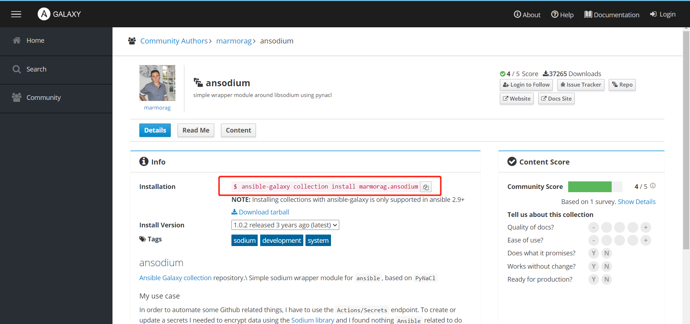

# 1. 前言

ansible是一种基于python开发的自动化运维工具，它只需要在服务端安装ansible，无需在每个客户端安装客户端程序，通过ssh的方式来进行客户端服务器的管理，基于模块来实现批量数据配置、批量设备部署以及批量命令执行。

Ansible的主要目标是简单易用。ansible适用于几个~几千个实例的环境。ansible使用无agent的方式来管理机器，所以**不会出现如何升级远程agent的问题**，也**不会出现因为卸载了远程agent而导致无法管理某机器的问题**。此外，由于Ansible使用`OpenSSH`（一种使用SSH（安全外壳）协议进行远程登录的开源连接工具），因此大大降低了安全风险。

Ansible是**去中心化的**——它依赖于现有的操作系统凭据来控制对远程机器的访问。Ansible也可以与Kerberos、LDAP和其他集中式身份验证管理系统连接。

ansible现在有两个版本：

- 社区版: [Ansible community](https://docs.ansible.com/)
- 红帽版：[Red Hat Ansible Automation Platform](https://access.redhat.com/documentation/en-us/red_hat_ansible_automation_platform/2.3)

## 概念

ansible中有3个主要组成部分：

- `Control node`：安装ansible的节点，可以使用`ansible`，`ansible-inventory`命令去控制某些节点

- `Managed node`：被ansible所控制的远程节点

- `Inventory`：`Managed node`的列表。告诉anbile主要控制哪些主机。

  

- `Playbooks`

  包含一个或多个play的列表，play是Ansible执行的基本单元。格式通常为`YAML`。

  - `Plays`

    有顺序的需要执行的Task的列表。play可以包含role、variable、task。

    - `Roles`

      可在Play内部使用的Ansible内容（task、handler、variable、plugin、template和file）的有限分发。若要使用任何role资源，必须将role本身导入到play中。

    - `Tasks`

      task是指在managed node上要执行的"动作"。task必须在play中定义（可以直接定义task，也可是通过role，imported/included task）

      task包含一个或多个module的列表，module定义了ansible要执行的操作。
    
    - `Handlers`
    
      task的特殊形式，只有前面的task的状态是`changed`之后，前面的task会告知此handler进行执行。

- `Modules`

  ansible将要在`managed node`上运行的code单元或binary单元。`module`在`collections`中进行了分组。

- `Plugins`

  扩展Ansible核心功能的代码片段，它们可以控制如何连接到托管节点（连接插件）、操作数据（过滤插件），甚至控制console中显示的内容（回调插件）。

- `Collections`

  分发ansible内容的一种格式，可以包含playbook、role、module和plugin。可以通过`ansible galaxy`安装和使用collection。

- `AAP`

  Ansible Automation Platform的简称。

# 2. 安装ansible

## 通过pip安装ansible

### 确认pip可用

不同版本的python都有自己的pip命令。假设我们用Python3来安装ansible

```bash
python3 -m pip -V
pip 21.0.1 from /usr/lib/python3.9/site-packages/pip (python 3.9)
```

### 指定用户下安装ansible

在ansible用户下安装ansible。`https://pypi.tuna.tsinghua.edu.cn/simple`为清华大学的Python Package Index镜像站。速度更快。

```bash
python3 -m pip install -i https://pypi.tuna.tsinghua.edu.cn/simple --user ansible

# 安装指定版本的ansible
python3 -m pip install -i https://pypi.tuna.tsinghua.edu.cn/simple --user ansible-core==2.12.3
```

### 升级ansible

将已安装的ansible升级到最新发行版。

```bash
python3 -m pip install -i https://pypi.tuna.tsinghua.edu.cn/simple --upgrade --user ansible
```

### 验证安装

```bash
ansible --version
或者
python3 -m pip show ansible
```

## ubuntu安装ansible

```bash
#$ sudo apt update
#$ sudo apt install software-properties-common
#$ sudo add-apt-repository --yes --update ppa:ansible/ansible
#$ sudo apt install ansible
sudo apt update
sudo apt install ansible
```

## centos安装ansible

root用户下执行，

```bash 
yum install epel-release
yum install ansible
```

<font color="red">注意：不要使用pip3 install --user，这样会在当前用户，如hadoop用户，下安装包，安装的位置为 /home/hadoop/.local/bin, /home/hadoop/.local/lib。然后其他用户是无法使用此种方式安装的包的。</font>
要卸载可以通过 pip3 freeze 列出所有的包

```bash
pip3 uninstall 包1 包2 ...

pip3 uninstall -y ansible ansible-core cffi cryptography Jinja2 MarkupSafe packaging pycparser pyparsing PyYAML resolvelib
python3 -m pip uninstall pip
```


# 3. 配置ansible

## ansible配置

ansibled配置文件分为两个：

- `/etc/ansible/ansible.cfg` 全局配置文件。
- `~/ansible.cfg` 用户级别的配置文件。

详细配置项见官方文档：https://docs.ansible.com/ansible/latest/reference_appendices/config.html

## 编写inventory

inventory文件支持`INI`和`YAML`格式（不一定要求是`.ini`和`.yaml`，只要格式符合就可以）。默认的inventory为`/etc/ansible/hosts`。

通常将SSH用户的信息卸载inventory中，就可以不必使用`-u`来指定SSH用户了。

如果在inventory中并没有定义group，ansible也会创建两个默认的group：`all`和`ungrouped`。

- `all`：包括了所有的主机。
- `ungrouped`：包括了没有指定group的那些主机。

任何一个主机至少属于两个组，要么是`all`和`ungrouped`，要么是`all`和其他自定义的组。一个host可以同时属于多个group。

### 将主机分组

**inventory的ini模板**

```ini
mail.example.com

[workers11]
vm01
vm02
vm03
```

**inventory的yaml模板**

```yaml
all:
  hosts:
		mail.example.com
	children:
		workers11:
  		hosts:
				192.0.2.50
				192.0.2.51
				192.0.2.52
    dbservers:
      hosts:
        one.example.com:
        two.example.com:
        three.example.com:
```

也可以使用这个形式：

```yaml
all:
  hosts:
		mail.example.com:
	children:
		workers11:
  		hosts:
  			vm01:
  				ansible_host: 192.0.2.50
  			vm02:
  				ansible_host: 192.0.2.51
  			vm03:
					ansible_host: 192.0.2.52
    dbservers:
      hosts:
      	one.example.com:
      	two.example.com:
        three.example.com:
```

- workers11为组名
- vm01此组中的主机名
- ansible_host指定了主机的ip

### group再分组

group之间也有父子关系。父group可以包含多个子group。


**模板二、使用metagroup，将多个组再划到一个大组**

```yaml
leafs:
  hosts:
    leaf01:
      ansible_host: 192.0.2.100
    leaf02:
      ansible_host: 192.0.2.110

spines:
  hosts:
    spine01:
      ansible_host: 192.0.2.120
    spine02:
      ansible_host: 192.0.2.130

network:
  children:
    leafs:
    spines:

webservers:
  hosts:
    webserver01:
      ansible_host: 192.0.2.140
    webserver02:
      ansible_host: 192.0.2.150

datacenter:
  children:
    network:
    webservers:
```

- network这个`metagroup`包含leafs、spine组。
- datacenter这个`metagroup`包含network、webservers组。

### 主机名有规律

**ini格式**，效果为01,02,03.。。。。

```ini
[webservers]
www[01:50].example.com
```

**yaml格式**

```yaml
...
  webservers:
    hosts:
      www[01:50].example.com:
```

还可以设定步长。效果为01，03,05，。。。。

```ini
[webservers]
www[01:50:2].example.com
```

yaml

```yaml
...
  webservers:
    hosts:
      www[01:50:2].example.com:
```

连续字母

```ini
[databases]
db-[a:f].example.com
```


### 指定多个inventory

某些情况下，可能想要为不同环境的主机执行同样的操作。例如，对staging环境和production环境的主机执行相同的操作，那么可以使用如下命令，同时指定多个inventory文件。

<font color="red">注意：当指定多个inventory文件时，且有同名的变量，且应用到了同一个主机上，则后面的inventory的优先级高于前面的。</font>

```bash
ansible-playbook get_logs.yml -i staging -i production
```

### 指定inventory目录

假设inventoryDir目录下有多个inventory文件。

```bash
inventoryDir/
  openstack.yml          # configure inventory plugin to get hosts from OpenStack cloud
  dynamic-inventory.py   # add additional hosts with dynamic inventory script
  on-prem                # add static hosts and groups
  parent-groups          # add static hosts and groups
```

使用如下方式在inventoryDir目录下的inventory中的所有主机执行操作。

```bash
ansible-playbook example.yml -i inventoryDir
```

### inventory加载顺序

默认情况下，ansible按照ASCII码顺序加载inventory文件。

假设，在inventory01文件中定义了parent_group，包含child_group01, child_group02，那么要求child_group01,child_group02的inventory文件必须先于inventory01文件加载，否则报错`Unable to parse /path/to/source_of_parent_groups as an inventory source`.

要避免此问题，可以在inventory文件的名字前加上前缀01,02.。。手动指定inventory的加载顺序。

### 在inventory中使用变量

<font color="red">注意：</font>

<font color="red">`key=value`定义的变量，其值别解析为python iteral structure（如strings, numbers, tuples, lists, dicts, booleans, None）。</font>

<font color="red">`:vars`定义的变量，其值都被解析为字符串。</font>

在inventory文件中有几种变量：

- `host variable`

  **为单个host定义变量**，然后在playbook中可以使用此变量。

  ini格式

  ```ini
  [atlanta]
  host1 http_port=80 maxRequestsPerChild=808
  host2 http_port=303 maxRequestsPerChild=909
  ```

  yaml格式

  ```yaml
  atlanta:
    hosts:
      host1:
        http_port: 80
        maxRequestsPerChild: 808
      host2:
        http_port: 303
        maxRequestsPerChild: 909
  ```

  如果**远程主机的SSH端口不是标准的22端口**，那么可以将SSH端口加载主机名后面，如下所示：

  ```bash
  badwolf.example.com:5309
  ```

  **connection variable也可以在host级别进行定义**：

  ```bash
  [targets]
  localhost              ansible_connection=local
  other1.example.com     ansible_connection=ssh        ansible_user=myuser
  other2.example.com     ansible_connection=ssh        ansible_user=myotheruser
  ```

  **为主机定义别名**

  ini格式

  ```ini
  jumper ansible_port=5555 ansible_host=192.0.2.50
  ```

  yaml格式

  ```yaml
  ...
    hosts:
      jumper:
        ansible_port: 5555
        ansible_host: 192.0.2.50
  ```

  在连接主机别名jumper时，ansible会连接192.0.2.50:5555。

- `group variable`

  在同一个group中的主机都可以使用定义的这些变量。在执行之前，Ansible总是将变量（包括inventory变量）设置到主机级别。

  ini格式

  ```ini
  [atlanta]
  host1
  host2
  
  [atlanta:vars]
  ntp_server=ntp.atlanta.example.com
  proxy=proxy.atlanta.example.com
  ```

  yaml格式

  ```yaml
  atlanta:
    hosts:
      host1:
      host2:
    vars:
      ntp_server: ntp.atlanta.example.com
      proxy: proxy.atlanta.example.com
  ```

  **子group从父group中继承 group变量**。

  ini格式

  ```ini
  [atlanta]
  host1
  host2
  
  [raleigh]
  host2
  host3
  
  [southeast:children]
  atlanta
  raleigh
  
  [southeast:vars]
  some_server=foo.southeast.example.com
  halon_system_timeout=30
  self_destruct_countdown=60
  escape_pods=2
  
  [usa:children]
  southeast
  northeast
  southwest
  northwest
  ```

  yaml格式

  ```yaml
  all:
    children:
      usa:
        children:
          southeast:
            children:
              atlanta:
                hosts:
                  host1:
                  host2:
              raleigh:
                hosts:
                  host2:
                  host3:
            vars:
              some_server: foo.southeast.example.com
              halon_system_timeout: 30
              self_destruct_countdown: 60
              escape_pods: 2
          northeast:
          northwest:
          southwest:
  ```

  如果子group和父group有相同的变量，则子group的变量优先级更高。

host变量和group变量可以单独写在一个**YAML语法**的文件中（文件扩展名可以为`.yml`, `.yaml`, `.json`或没有扩展名），

假设在inventory文件中，有一个主机`foosball`，它属于两个group，`raleigh`和`webserver2`。

<font color="red">注意：`group_vars`，`host_vars`目录需要放在inventory/playbook的同级目录下，比如inventory文件为`/etc/ansible/hosts`，那么这两个目录的路径应为`/etc/ansible/group_vars`和`/etc/ansible/host_vars`。ansible和ansible-console会在inventory目录，ansible-playbook会在playbook目录下去读取group_vars和host_vars下的变量。或者使用`--playbook-dir`让ansible去加载该playbook目录下的group_vars和host_vars下的变量。playbook目录下的变量比inventory目录下的变量优先级高。</font>

```bash
/etc/ansible/group_vars/raleigh # can optionally end in '.yml', '.yaml', or '.json'
/etc/ansible/group_vars/webservers
/etc/ansible/host_vars/foosball
```

变量声明格式为：

```yaml
---
ntp_server: acme.example.org
database_server: storage.example.org
```

可以主机的group作为目录，然后ansible会按照字典顺序来读取该目录下所有文件中的变量：

```yaml
/etc/ansible/group_vars/raleigh/db_settings
/etc/ansible/group_vars/raleigh/cluster_settings
```

### ansible合并变量的机制

因为最终都是将变量映射到host上，所以可能会存在变量的合并。

**变量的优先级顺序（从低到高）：**

- all group (because it is the ‘parent’ of all other groups)
- parent group
- child group
- host

若为同级别的group，则按照ASCII码顺序优先级从低到高，如host1既在a_group，又在b_group，且group变量有相同的，则b_group中的变量会覆盖a_group中的同名变量。

### inventory的connection参数

**通用连接参数**：

- **ansible_host**：要连接的远程主机名，如果不同于host的alia，则需要指定此值。
- **ansible_port**：要连接的远程主机的端口号，SSH连接默认为22
- **ansible_user**：使用此用户连接到远程主机
- **ansible_password**：使用此密码连接到远程主机

**SSH连接参数**：

- **ansible_ssh_private_key_file**：设置SSH连接所用的私钥文件。
- **ansible_ssh_common_args**：设置添加到SFTP、SCP、SSH命令后的参数
- **ansible_sftp_extra_args**：设置添加到SFTP命令后的参数
- **ansible_scp_extra_args**：设置添加到SCP命令后的参数
- **ansible_ssh_extra_args**：设置添加到SSH 命令后的参数
- **ansible_ssh_pipelining**：是否使用SSH pipeline。
- **ansible_ssh_executable (added in version 2.2)**：

**其他参数**：

TODO

### 模板三、应用变量

```yaml
webservers:
  hosts:
    webserver01:
      ansible_host: 192.0.2.140
      http_port: 80
    webserver02:
      ansible_host: 192.0.2.150
      http_port: 443
  vars:
    ansible_user: my_server_user
```

上面的yaml与此ini配置是一样的意思：

```ini
[webservers]
webserver01 192.0.2.140 http_port=80 
webserver02 192.0.2.150 http_port=443
[webserver3:vars]
ansible_user=my_server_user
```


- vars表示将ansible_user=my_server_user应用到webservers组中的所有主机。也可以值在某主机应用变量。

  ```yaml
  webservers:
    hosts:
      webserver01:
        ansible_host: 192.0.2.140
        http_port: 80
      webserver02:
        ansible_host: 192.0.2.150
        http_port: 443
  ```

## 编写playbook

一个playbook由一个或多个play按顺序排列组成。

一个play由一个或多个task按顺序排列组成。

一个task可以调用一个ansible module。

play和task都是从上往下顺序执行。

例如，可以在webserver组中执行一个play，可以在dbserver组中执行另一个play。

由于在不同的collection中可能存在同名的module，因此建议是使用模块的全限定名称。

playbook关键字，参考：https://docs.ansible.com/ansible/latest/reference_appendices/playbooks_keywords.html#

```bash

register	将task的状态和module的返回值，保存在注册在此的变量中。
```


# 4. 使用ansible

## ansible的常用模块

有哪些模块，分别干啥用的，怎么用

参考文章：https://blog.csdn.net/m0_64496909/article/details/124913290

### ping模块

```bash
[root@server ~]# ansible client -m ping                      //检测主机组主机连通性
 
192.168.91.128 | SUCCESS => {
    "ansible_facts": {
        "discovered_interpreter_python": "/usr/libexec/platform-python"
    },
    "changed": false,
    "ping": "pong"
}
```

### command模块

```bash
[root@server ~]# ansible client -m command -a 'df -h'              //执行某个命令，不会通过shell进行处理，不支持管道
 
192.168.91.128 | CHANGED | rc=0 >>
Filesystem           Size  Used Avail Use% Mounted on
devtmpfs             362M     0  362M   0% /dev
tmpfs                392M     0  392M   0% /dev/shm
tmpfs                392M   26M  366M   7% /run
tmpfs                392M     0  392M   0% /sys/fs/cgroup
/dev/mapper/cl-root   17G  8.8G  8.3G  52% /
/dev/sda1           1014M  255M  760M  26% /boot
tmpfs                 79M   24K   79M   1% /run/user/1000
/dev/sr0             723M  723M     0 100% /run/media/wujw/CentOS-8-4-2105-x86_64-dvd
tmpfs                 79M     0   79M   0% /run/user/0
```

### shell模块

```bash
ansible client -m shell -a 'df -h|grep dev'           //万能模块，支持所有shell命令
 
192.168.91.128 | CHANGED | rc=0 >>
devtmpfs             362M     0  362M   0% /dev
tmpfs                392M     0  392M   0% /dev/shm
/dev/mapper/cl-root   17G  8.8G  8.3G  52% /
/dev/sda1           1014M  255M  760M  26% /boot
/dev/sr0             723M  723M     0 100% /run/media/wujw/CentOS-8-4-2105-x86_64-dvd
```


### copy模块

> 支持的参数：
>
> src　　　　被复制到远程主机的本地文件。可以是绝对路径，也可以是相对路径
> content　　用于替换"src"，可以直接指定文件的内容
> dest　　　  将源文件复制到的远程主机的绝对路径
> backup　　  当文件内容发生改变后，在覆盖之前把源文件备份
> force　　　当目标主机包含该文件，但内容不同时，设为"yes"，表示强制覆盖；设                                  为"no"，表示目标主机的目标位置不存在该文件才复制。默认为"yes"

```bash
[root@server ~]# ansible client -m copy -a 'src=mem.txt dest=/root'      //从当前设备拷贝文件至对端
 
192.168.91.128 | CHANGED => {
    "ansible_facts": {
        "discovered_interpreter_python": "/usr/libexec/platform-python"
    },
    "changed": true,
    "checksum": "321b4039b2d0805781db9c38df6ab75cc1a4fe32",
    "dest": "/root/mem.txt/192.168.91.128",
    "gid": 0,
    "group": "root",
    "md5sum": "fb3a8f8cafdeccd3312e69eb18b5c205",
    "mode": "0644",
    "owner": "root",
    "secontext": "system_u:object_r:admin_home_t:s0",
    "size": 333,
    "src": "/root/.ansible/tmp/ansible-tmp-1653312782.0254133-7348-72341069223651/source",
    "state": "file",
    "uid": 0
}
[root@server ~]# ansible client -m shell -a 'ls -l /root'    //查看文件已发送过来
 
192.168.91.128 | CHANGED | rc=0 >>
total 24
-rw-r--r--. 1 root    root     142 May 18 10:27 1.sh
drwxr-xr-x. 2 root    root       6 May  8 04:15 123
-rw-------. 1 root    root    1429 Aug 20  2021 anaconda-ks.cfg
-rw-r--r--. 1 root    root    1721 Aug 21  2021 initial-setup-ks.cfg
drwxr-xr-x. 2 root    root      28 May 23 09:33 mem.txt
-rw-r--r--. 1 root    root      53 May 18 10:54 temp.txt
drwxr-xr-x. 2 root    root      79 May  8 04:04 test
-rw-r--r--. 1 root    root     142 May 18 10:54 test.sh
-rw-r--r--. 1 tcpdump tcpdump   39 May 18 10:34 test.txt
```

### file模块

> 支持的参数：
> group　　定义文件/目录的所属组
> owner　　定义文件/目录的所属用户。后面必须跟上path：定义文件/目录的路径
> dest　　  被链接到的路径，只应用于state=link的情况
> state　　状态，有以下选项：
>
> directory：如果目录不存在，就创建目录
> file：即使文件不存在，也不会被创建
> link：创建软链接
> hard：创建硬链接
> touch：如果文件不存在，则会创建一个新的文件，如果文件或目录已存在，则更新其               最后修改时间
> absent：删除目录、文件或者取消链接文件

```bash
[root@server ~]# ansible client -m file -a 'path='/root/mem.txt' state=absent'
//删除文件/root/mem.txt
192.168.91.128 | CHANGED => {
    "ansible_facts": {
        "discovered_interpreter_python": "/usr/libexec/platform-python"
    },
    "changed": true,
    "path": "/root/mem.txt",
    "state": "absent"
}
[root@server ~]# ansible client -m shell -a 'ls -l /root'
//查看文件/root/mem.txt已被删除
192.168.91.128 | CHANGED | rc=0 >>
total 24
-rw-r--r--. 1 root    root     142 May 18 10:27 1.sh
drwxr-xr-x. 2 root    root       6 May  8 04:15 123
-rw-------. 1 root    root    1429 Aug 20  2021 anaconda-ks.cfg
-rw-r--r--. 1 root    root    1721 Aug 21  2021 initial-setup-ks.cfg
-rw-r--r--. 1 root    root      53 May 18 10:54 temp.txt
drwxr-xr-x. 2 root    root      79 May  8 04:04 test
-rw-r--r--. 1 root    root     142 May 18 10:54 test.sh
-rw-r--r--. 1 tcpdump tcpdump   39 May 18 10:34 test.txt
```


### fetch模块

> `dest`：用来存放文件的目录
> `src`：在远程拉取的文件，并且必须是一个file，不能是目录

```bash
[root@server ~]# ansible client -m fetch -a 'src=/root/test.sh dest=/root'
 
192.168.91.128 | SUCCESS => {
    "changed": false,
    "checksum": "061375bc913062287ccd658347e8575d38dfa857",
    "dest": "/root/192.168.91.128/root/test.sh",
    "file": "/root/test.sh",
    "md5sum": "35dcd724c02d10850a560df9129a1cf2"
}
```


### cron模块

>day：  每天应该运行的工作( 1-31)
>hour： 每小时 ( 0-23 )
>minute：每分钟( 0-59 )
>month：每月( 1-12 )
>weekday：每周 ( 0-6 for Sunda y-Saturday,, )
>job：指明运行的命令
>name：定时任务描述
>reboot ：任务在重启时运行，不建议使用，建议使用special_time
>special_time ：特殊的时间范围，参数：reboot（重启时），annually（每年），monthly（每月），weekly（每周），daily（每天），hourly（每小时）
>state：指定状态，present表示添加定时任务，也是默认设置，absent表示删除定时任务
>
>user ：以哪个用户的身份执行

```bash
[root@server ~]# ansible client -m cron -a 'name="restart httpd" hour=*/5 job="systemctl restart httpd"'
//每5小时重启httpd模块
192.168.91.128 | CHANGED => {
    "ansible_facts": {
        "discovered_interpreter_python": "/usr/libexec/platform-python"
    },
    "changed": true,
    "envs": [],
    "jobs": [
        "restart httpd"
    ]
}
[root@server ~]# ansible client -m shell -a 'crontab -l'
 
192.168.91.128 | CHANGED | rc=0 >>
#Ansible: restart httpd
* */5 * * * systemctl restart httpd
```

### yum模块

> 支持的参数：
>
> name：安装包名称
>
> state：
>
> - present：安装
>
> - latest：安装最新的
>
> - absent： 卸载软件

```bash
ansible client -m yum -a 'name=httpd state=present'
```

### service模块

> 支持的参数：
> enabled ：设置开机启动。
> name : 服务名称
> state ：四种状态
>
> - started：启动服务                 
> - stopped：停止服务
> - restarted：重启服务             
> - reloaded：重载配置

```bash
[root@server ~]# ansible client -m service -a 'name=httpd state=restarted'    //重启httpd服务
 
192.168.91.128 | CHANGED => {
    "ansible_facts": {
        "discovered_interpreter_python": "/usr/libexec/platform-python"
    },
    "changed": true,
    "name": "httpd",
    "state": "started",
    "status": {
        "ActiveEnterTimestamp": "Mon 2022-05-23 10:16:02 EDT",
        "ActiveEnterTimestampMonotonic": "134284476109",
        "ActiveExitTimestamp": "Mon 2022-05-23 10:16:01 EDT",
        "ActiveExitTimestampMonotonic": "134283332327",
        "ActiveState": "active",
    ........
        }
}
```

### user模块

> 支持的参数：
>
> `name：`指定用户名
>
> `group：`指定基本组
> `state：`设置帐号状态，不指定为创建，指定值为absent表示删除
> `system：`当创建一个用户，设置这个用户是系统用户。这个设置不能更改现有用户
> `uid：` 指定用户的uid
>
> `password：` 指定用户密码

```bash
[root@server ~]# ansible client -m user -a 'name=test uid=23'    //创建用户test，uid为23
 
192.168.91.128 | CHANGED => {
    "ansible_facts": {
        "discovered_interpreter_python": "/usr/libexec/platform-python"
    },
    "changed": true,
    "comment": "",
    "create_home": true,
    "group": 1001,
    "home": "/home/test",
    "name": "test",
    "shell": "/bin/bash",
    "state": "present",
    "system": false,
    "uid": 23
}
 
删除用户state=absent
```

### group模块

>  支持的参数：
>
> `gid：`设置组ID
> `name：`组的名称
> `state：`组的状态，默认为创建，设置值为`absent`为删除
> `system：`值为`yes`，表示创建为系统组

```bash
[root@server ~]# ansible client -m group -a 'name=test1 gid=233'     //创建组test1，gid为233
 
192.168.91.128 | CHANGED => {
    "ansible_facts": {
        "discovered_interpreter_python": "/usr/libexec/platform-python"
    },
    "changed": true,
    "gid": 233,
    "name": "test1",
    "state": "present",
    "system": false
}
```

### script模块

> 该模块用于将本地的一个脚本文件在管理设备上执行，脚本文件需有可执行权限

```bash
ansible client -m script -a '/root/192.168.91.128/test.sh'
```

### setup模块

> 该模块用于采集被管理设备信息并返回给服务端，后面跟--tree <目录>，可以将采集信息以ip为文件名保存至指定目录下

```bash
ansible client -m setup    //输出所有设备信息
 
输出内容较多，可通过过滤采集我们需要的设备信息，譬如只要内存信息
 
[root@server root]# ansible client -m setup -a 'filter=*mem*'
192.168.91.128 | SUCCESS => {
    "ansible_facts": {
        "ansible_memfree_mb": 55,
        "ansible_memory_mb": {
            "nocache": {
                "free": 216,
                "used": 566
            },
            "real": {
                "free": 55,
                "total": 782,
                "used": 727
            },
            "swap": {
                "cached": 56,
                "free": 1175,
                "total": 2047,
                "used": 872
            }
        },
        "ansible_memtotal_mb": 782,
        "discovered_interpreter_python": "/usr/libexec/platform-python"
    },
    "changed": false
}
 
 
再或者仅要ipv4地址：
 
[root@server root]# ansible client -m setup -a 'filter=*all_ipv4*'
 
192.168.91.128 | SUCCESS => {
    "ansible_facts": {
        "ansible_all_ipv4_addresses": [
            "192.168.122.1",
            "192.168.91.128"
        ],
        "discovered_interpreter_python": "/usr/libexec/platform-python"
    },
    "changed": false
}
```


## 使用ansible的步骤

- 在`control node`安装ansible

- 创建自定义的inventory文件，记录`managed node`

  如果没有使用`-i`指定inventory文件，则使用默认的inventory文件`/etc/ansible/hosts`。其格式如下所示：

  ```bash
  [myvirtualmachines]
  192.0.2.50
  192.0.2.51
  192.0.2.52
  ```

  假设有一个inventory文件，路径为`/home/hadoop/ansible_hosts`，其内容如下所示：

  ```bash
  [workers1]
  hadoop322-node01
  hadoop322-node02
  hadoop322-node03
  [workers2]
  hadoop322-node04
  hadoop322-node05
  hadoop322-node06
  ```

- 验证inventory文件是否正确

  ```bash
  # 列出inventory文件中的所有hosts
  ansible -i ~/ansible_hosts all --list-hosts
  # 列出inventory文件中workers1组中的hosts
  ansible -i ~/ansible_hosts workers1 --list-hosts
  # 列出inventory文件中workers2组中的hosts
  ansible -i ~/ansible_hosts workers2 --list-hosts
  
  或者
  
  ansible-inventory -i ~/ansible_hosts all --list
  类似......
  ```

- 配置SSH连接，已让ansible可以连接到`managed node`

  将`control node`的SSH公钥复制到所有`managed node`的`~/ssh/authorized_keys`中。

  <font color="red">注意：`~/ssh/authorized_keys`需要为用于SSH连接的用户的home目录。</font>

- Ping `managed node`，验证SSH配置正确

  ```bash
  # ping inventory文件中的所有主机
  ansible -i ~/ansible_hosts all -m ping
  # ping inventory文件中的workers1组中的主机
  ansible -i ~/ansible_hosts wokers1 -m ping
  # ping inventory文件中的workers1组中的主机
  ansible -i ~/ansible_hosts wokers2 -m ping
  ```

  

- 使用`ansible`，`ansible-inventory命`令来批量操作远程主机


## 通过ansible的ad hoc命令行工具使用

`ad hoc`即席，临时的。不用纠结于`ad hoc`的意思。

`ad hoc`命令适用于临时需要执行的场景。如果可能存在多次重复执行，则可以写playbook来执行更为合适。

ansible默认的module是[ansible.builtin.command module](https://docs.ansible.com/ansible/latest/collections/ansible/builtin/command_module.html#command-module)，即**command模块**。

<font color="red">注意：**command模块**不支持像管道和重定向这样的扩展shell语法。如果要使用管道和重定向等扩展shell语法，应该使用**shell模块**。</font>

命令格式如下：

```bash
$ ansible [pattern] -m [module] -a "[module options]"
```

假设存在一个inventroy文件，`test01`，其内容如下：

```ini
[atlanta]
192.168.2.1
192.168.2.2
192.168.2.3
```

需要实现配置好SSH免密登录。

### 重启服务器

```bash
$ ansible -i test01 atlanta -a "/sbin/reboot"
```

默认的并发为5。使用`-f`设置为10。

```bash
$ ansible -i test01 atlanta -a "/sbin/reboot" -f 10
```

`-u`表示远程SSH用户名，如下表示以username01来重启服务器

```bash
$ ansible -i test01 atlanta -a "/sbin/reboot" -f 10 -u username01
```

如下命令表示以username01来SSH登录到远程主机，然后以root用户来重启服务器。

`--ask-become-pass`或`-K`会要求你输入密码。

```bash
$ ansible -i test01 atlanta -a "/sbin/reboot" -f 10 -u username01 --become [--ask-become-pass]
```


### 管理文件

使用copy模块，**批量分发文件**到managed node。

```bash
$ ansible -i test01 atlanta -m ansible.builtin.copy -a "src=/etc/hosts dest=/tmp/hosts"

$ ansible -i test01 atlanta -m copy -a "src=/etc/hosts dest=/tmp/hosts"
```

使用file模块，**批量修改文件的所有人和权限**。

```bash
$ ansible -i test01 atlanta -m file -a "dest=/srv/foo/a.txt mode=600"
$ ansible -i test01 atlanta -m file  -a "dest=/srv/foo/b.txt mode=600 owner=mdehaan group=mdehaan"
```

使用file模块，**批量创建目录**

```bash
$ ansible -i test01 atlanta  -m file -a "dest=/path/to/c mode=755 owner=mdehaan group=mdehaan state=directory"
```

使用file模块，**批量删除目录**

```bash
$ ansible -i test01 atlanta  -m file -a "dest=/path/to/c state=absent"
```

### 管理包

要确保在不更新程序包的情况下安装程序包

```bash
$ ansible -i test01 atlanta -m yum -a "name=acme state=present"
```

yum安装指定版本的包

```bash
$ ansible -i test01 atlanta -m yum -a "name=acme-1.5 state=present"
```

yum安装最新版本的包

```bash
$ ansible -i test01 atlanta -m yum -a "name=acme state=latest"
```

yum移除包

```bash
$ ansible -i test01 atlanta -m yum -a "name=acme state=absent"
```

### 管理用户和组

批量创建用户

```bash
$ ansible -i test01 atlanta -m user -a "name=foo password=<crypted password here>"
```

批量删除用户

```bash
$ ansible -i test01 atlanta -m user -a "name=foo state=absent"
```

### 管理服务

批量启动服务

```bash
$ ansible -i test01 atlanta -m service -a "name=httpd state=started"
```

批量重启服务

```bash
$ ansible -i test01 atlanta -m service -a "name=httpd state=restarted"
```

批量停止服务

```bash
$ ansible -i test01 atlanta -m service -a "name=httpd state=stoped"
```

### 收集系统信息

输出系统相关的信息

```bash
$ ansible -i test01 atlanta -m setup
```


### patterns和ad-hc 命令


##  所有的ansible命令行工具

### ansible

针对一组主机执行单个play。官方文档：https://docs.ansible.com/ansible/latest/cli/ansible.html

```bash
usage: ansible [-h] [--version] [-v] [-b] [--become-method BECOME_METHOD]
            [--become-user BECOME_USER]
            [-K | --become-password-file BECOME_PASSWORD_FILE]
            [-i INVENTORY] [--list-hosts] [-l SUBSET] [-P POLL_INTERVAL]
            [-B SECONDS] [-o] [-t TREE] [--private-key PRIVATE_KEY_FILE]
            [-u REMOTE_USER] [-c CONNECTION] [-T TIMEOUT]
            [--ssh-common-args SSH_COMMON_ARGS]
            [--sftp-extra-args SFTP_EXTRA_ARGS]
            [--scp-extra-args SCP_EXTRA_ARGS]
            [--ssh-extra-args SSH_EXTRA_ARGS]
            [-k | --connection-password-file CONNECTION_PASSWORD_FILE] [-C]
            [-D] [-e EXTRA_VARS] [--vault-id VAULT_IDS]
            [--ask-vault-password | --vault-password-file VAULT_PASSWORD_FILES]
            [-f FORKS] [-M MODULE_PATH] [--playbook-dir BASEDIR]
            [--task-timeout TASK_TIMEOUT] [-a MODULE_ARGS] [-m MODULE_NAME]
            pattern
```

主要参数：

```bash
-a module的参数
-f 并行度
-i 使用的inventory文件
-m 用来执行的模块
-T 设置执行的超时时间
-t 输出log到此目录下
-u 使用此远程用户来SSH连接到远程主机

--become-user <BECOME_USER> 以此用户来执行。
--connection-password-file <CONNECTION_PASSWORD_FILE> 存放SSH连接的密码
--list-hosts 列出符合条件的所有主机
--private-key <PRIVATE_KEY_FILE> 用于认证SSH连接的密钥
--verion 查看版本
```

### ansible-config

查看ansible配置。https://docs.ansible.com/ansible/latest/cli/ansible-config.html

```bash
usage: ansible-config [-h] [--version] [-v] {list,dump,view,init} ...
```

主要参数：

```bash

```

ansible配置文件：

- `/etc/ansible/ansible.cfg`，全局配置文件。
- `~/ansible.cfg` 用户级别配置文件。

### ansible-console

用于执行Ansible任务的REPL控制台。

`REPL`：交互式解释器。

在交互式解释器中支持一下命令：

- `cd [pattern]`: change host/group (you can use host patterns eg.: app*.dc*:!app01*)
- `list`:  列出可用的主机，如果没有，则可以在进入ansible-console时增加-i参数指定inventory
- `list groups`: 列出可用的主机组。
- `become`: toggle the become flag
- `!`: 强制使用shell模块，而不是默认的ansible模块
- `verbosity [num]`: set the verbosity level
- `forks [num]`: 设置并行度
- `become_user [user]`: set the become_user
- `remote_user [user]`: set the remote_user
- `become_method [method]`: set the privilege escalation method
- `check [bool]`: toggle check mode
- `diff [bool]`: toggle diff mode
- `timeout [integer]`: set the timeout of tasks in seconds (0 to disable)
- `help [command/module]`: display documentation for the command or module
- `exit`: exit ansible-console


ansible-console支持如下选项。

```bash
usage: ansible-console [-h] [--version] [-v] [-b]
                    [--become-method BECOME_METHOD]
                    [--become-user BECOME_USER]
                    [-K | --become-password-file BECOME_PASSWORD_FILE]
                    [-i INVENTORY] [--list-hosts] [-l SUBSET]
                    [--private-key PRIVATE_KEY_FILE] [-u REMOTE_USER]
                    [-c CONNECTION] [-T TIMEOUT]
                    [--ssh-common-args SSH_COMMON_ARGS]
                    [--sftp-extra-args SFTP_EXTRA_ARGS]
                    [--scp-extra-args SCP_EXTRA_ARGS]
                    [--ssh-extra-args SSH_EXTRA_ARGS]
                    [-k | --connection-password-file CONNECTION_PASSWORD_FILE]
                    [-C] [-D] [--vault-id VAULT_IDS]
                    [--ask-vault-password | --vault-password-file VAULT_PASSWORD_FILES]
                    [-f FORKS] [-M MODULE_PATH] [--playbook-dir BASEDIR]
                    [-e EXTRA_VARS] [--task-timeout TASK_TIMEOUT] [--step]
                    [pattern]
```

主要参数：

### ansible-doc

插件文档工具。显示有关安装在Ansible库中的模块的信息。

用法：

```bash
usage: ansible-doc [-h] [--version] [-v] [-M MODULE_PATH]
                [--playbook-dir BASEDIR]
                [-t {become,cache,callback,cliconf,connection,httpapi,inventory,lookup,netconf,shell,vars,module,strategy,test,filter,role,keyword}]
                [-j] [-r ROLES_PATH]
                [-e ENTRY_POINT | -s | -F | -l | --metadata-dump]
                [--no-fail-on-errors]
                [plugin ...]
```

如：

```bash
ansible-doc shell
```

主要参数：

### ansible-galaxy

执行**Role and Collection**相关操作。管理Ansible roles and collections。

`Ansible Galaxy`是一个中央仓库。ansible-galaxy是与此中央仓库交互的CLI命令。

默认情况下，将`https://galaxy.ansible.com/`作为Ansible Galaxy server。对应配置为ansible.cfg中的`GALAXY_SERVER`。

用法:

```bash
usage: ansible-galaxy [-h] [--version] [-v] TYPE ...
```

主要参数：

```bash
ansible-galaxy collection download
ansible-galaxy collection init
ansible-galaxy collection build
ansible-galaxy collection install
ansible-galaxy collection list
ansible-galaxy collection verify

ansible-galaxy role init
ansible-galaxy role remove
ansible-galaxy role delete
ansible-galaxy role list
ansible-galaxy role search
ansible-galaxy role import
ansible-galaxy role setup
ansible-galaxy role info
ansible-galaxy role install
```

示例：



可以使用`requirements.yml`文件实现一个命令安装多个collection。参考：https://docs.ansible.com/ansible/latest/galaxy/user_guide.html#finding-collections-on-galaxy

### ansible-inventory

用于展示或dump ansible的inventory

用法：

```bash
usage: ansible-inventory [-h] [--version] [-v] [-i INVENTORY] [-l SUBSET]
                      [--vault-id VAULT_IDS]
                      [--ask-vault-password | --vault-password-file VAULT_PASSWORD_FILES]
                      [--playbook-dir BASEDIR] [-e EXTRA_VARS] [--list]
                      [--host HOST] [--graph] [-y] [--toml] [--vars]
                      [--export] [--output OUTPUT_FILE]
                      [host|group]
```

主要参数：

```bash
--list 显示所有符合条件的主机信息
--output <OUTPUT_FILE> 与--list一起使用可以将所有符合条件的主机信息写入文件而不是screen
-i 指定要使用的inventory文件
```

如：

```bash
[hadoop@hadoop322-node01 ~]$ ansible-inventory -i ansible_hosts3.yaml --host vm01
{
    "ansible_host": "192.168.61.129"
}

[hadoop@hadoop322-node01 ~]$ cat ansible_hosts3.yaml 
virtualmachines:
    hosts:
        vm01:
            ansible_host: 192.168.61.129
        vm02:
            ansible_host: 192.168.61.135
        vm03:
            ansible_host: 192.168.61.136

```

### ansible-playbook

运行ansible-playbook的工具。

用法：

```bash
usage: ansible-playbook [-h] [--version] [-v] [--private-key PRIVATE_KEY_FILE]
                     [-u REMOTE_USER] [-c CONNECTION] [-T TIMEOUT]
                     [--ssh-common-args SSH_COMMON_ARGS]
                     [--sftp-extra-args SFTP_EXTRA_ARGS]
                     [--scp-extra-args SCP_EXTRA_ARGS]
                     [--ssh-extra-args SSH_EXTRA_ARGS]
                     [-k | --connection-password-file CONNECTION_PASSWORD_FILE]
                     [--force-handlers] [--flush-cache] [-b]
                     [--become-method BECOME_METHOD]
                     [--become-user BECOME_USER]
                     [-K | --become-password-file BECOME_PASSWORD_FILE]
                     [-t TAGS] [--skip-tags SKIP_TAGS] [-C] [-D]
                     [-i INVENTORY] [--list-hosts] [-l SUBSET]
                     [-e EXTRA_VARS] [--vault-id VAULT_IDS]
                     [--ask-vault-password | --vault-password-file VAULT_PASSWORD_FILES]
                     [-f FORKS] [-M MODULE_PATH] [--syntax-check]
                     [--list-tasks] [--list-tags] [--step]
                     [--start-at-task START_AT_TASK]
                     playbook [playbook ...]
```

主要参数：

```bash
-i 使用 `my_inventory_file` 作为inventory。
-u 使用`my_connection_user`.作为SSH用户进行连接。
-k 在SSH认证时，要求输入密码
-f 分配多少个进程来执行task。
-T 设置执行的超时时间。
-t 仅运行标签为`my_tag`的task
-m 使用哪个模块。
-b 在执行时提升权限。
-K 提示用户输入become的用户的密码

--verbose 显式更为详细的信息。
--check 以check mode运行ansible
--diff  以diff mode运行ansible
```

### ansible-pull

从VCS仓库中拉取playbook，在每个managed node拉取ansile的远程副本，然后以`cron`的方式运行。

将ansbile默认的push架构，改为了pull架构，扩展性更好。

用法：

```bash
usage: ansible-pull [-h] [--version] [-v] [--private-key PRIVATE_KEY_FILE]
                 [-u REMOTE_USER] [-c CONNECTION] [-T TIMEOUT]
                 [--ssh-common-args SSH_COMMON_ARGS]
                 [--sftp-extra-args SFTP_EXTRA_ARGS]
                 [--scp-extra-args SCP_EXTRA_ARGS]
                 [--ssh-extra-args SSH_EXTRA_ARGS]
                 [-k | --connection-password-file CONNECTION_PASSWORD_FILE]
                 [--vault-id VAULT_IDS]
                 [--ask-vault-password | --vault-password-file VAULT_PASSWORD_FILES]
                 [-e EXTRA_VARS] [-t TAGS] [--skip-tags SKIP_TAGS]
                 [-i INVENTORY] [--list-hosts] [-l SUBSET] [-M MODULE_PATH]
                 [-K | --become-password-file BECOME_PASSWORD_FILE]
                 [--purge] [-o] [-s SLEEP] [-f] [-d DEST] [-U URL] [--full]
                 [-C CHECKOUT] [--accept-host-key] [-m MODULE_NAME]
                 [--verify-commit] [--clean] [--track-subs] [--check]
                 [--diff]
                 [playbook.yml ...]
```

主要参数：

```bash

```

TODO

### ansible-vault

vault：保险库。

ansible数据文件的encryption/decryption工具。可以加密Ansible使用的任何结构化数据文件。

用法：

```bash
usage: ansible-vault [-h] [--version] [-v]
                  {create,decrypt,edit,view,encrypt,encrypt_string,rekey}
                  ...
```

## playbook使用

用法示例：

```bash
ansible-playbook -i /path/to/my_inventory_file -u my_connection_user -k -f 3 -T 30 -t my_tag -m /path/to/my_modules -b -K my_playbook.yml
```

从当前工作目录加载 `my_playbook.yml` :

- `-i` - 使用 `my_inventory_file` 作为inventory。
- `-u` - 使用`my_connection_user`.作为SSH用户进行连接。
- `-k` - 在SSH认证时，要求输入密码
- `-f` - 分配多少个进程来执行task。
- `-T` - 设置执行的超时时间。
- `-t` - 仅运行标签为`my_tag`的task
- `-m` - 使用哪个模块。
- `-b` - 在执行时提升权限。
- `-K` - 提示用户输入become的用户的密码

### 验证task

ansible支持两种方式来验证task是否正确：

- `check mode`

  ansible以此模式运行不会在远程主机做任何变更。

  支持`check mode`的module会报告执行playbook后将会发生的结果；

  不支持`check mode`的module什么也不做，也不报告任何信息。

  使用方式：

  ```bash
  ansible-playbook foo.yml --check
  ```

  

- `diff mode`

  在diff模式下，Ansible提供前后比较。支持`diff mode`的模块会显示详细信息。

  `diff mode`可能会产生大量输出，我们可以指定只在某个主机上执行playbook以减少输出。

  ```bash
  ansible-playbook foo.yml --check --diff --limit foo.example.com
  ```

可以结合`check mode`和`diff mode`来详细验证playbook或role。

示例：

```yaml
tasks:
  - name: This task will always make changes to the system
    ansible.builtin.command: /something/to/run --even-in-check-mode
    check_mode: false

  - name: This task will never make changes to the system
    ansible.builtin.lineinfile:
      line: "important config"
      dest: /path/to/myconfig.conf
      state: present
    check_mode: true
    diff: false  # 不使用diff mode
    register: changes_to_important_config
```

- 在task中可以指定`check_mode: true`来指明此task需要使用`check mode`，而其他task可以`check_mode: false`。

### 调试playbook

playbook支持2种方式来调试：

- `start-at-task`

  从某个task出开始执行playbook，而不是从头开始。通常从执行失败的task处开始。

  ```bash
  ansible-playbook playbook.yml --start-at-task="install packages"
  ```

- `step mode`

  ansible每执行完一个task都会停下来，询问是否要执行下一个task。

  ```bash
  ansible-playbook playbook.yml --step
  ```

### 标签

场景：playbook比较大，但是只需要运行其中的某些play。通过标签来指定需要运行的task。

- 给task打标签

  - 给单个task打标签

    ```yaml
    ---
    # file: roles/common/tasks/main.yml
    
    - name: Install ntp
      ansible.builtin.yum:
        name: ntp
        state: present
      tags: ntp
    
    - name: Configure ntp
      ansible.builtin.template:
        src: ntp.conf.j2
        dest: /etc/ntp.conf
      notify:
      - restart ntpd
      tags: ntp
    ```

  - 给include打标签

    

  - 给一个`block`打标签

    ```yaml
    # myrole/tasks/main.yml
    - name: ntp tasks
      tags: ntp
      block:
      - name: Install ntp
        ansible.builtin.yum:
          name: ntp
          state: present
    
      - name: Configure ntp
        ansible.builtin.template:
          src: ntp.conf.j2
          dest: /etc/ntp.conf
        notify:
        - restart ntpd
    
      - name: Enable and run ntpd
        ansible.builtin.service:
          name: ntpd
          state: started
          enabled: true
    
    - name: Install NFS utils
      ansible.builtin.yum:
        name:
        - nfs-utils
        - nfs-util-lib
        state: present
      tags: filesharing
    ```

  - 给一个play打标签

    ```yaml
    - hosts: all
      tags: ntp
      tasks:
      - name: Install ntp
        ansible.builtin.yum:
          name: ntp
          state: present
    
      - name: Configure ntp
        ansible.builtin.template:
          src: ntp.conf.j2
          dest: /etc/ntp.conf
        notify:
        - restart ntpd
    
      - name: Enable and run ntpd
        ansible.builtin.service:
          name: ntpd
          state: started
          enabled: true
    
    - hosts: fileservers
      tags: filesharing
      tasks:
      ...
    ```

  - 给role打标签

  - 给import打标签

  - 特殊标签`always`，`never`

    - `always`： 总是会运行
    - `never`：从不运行

- 选择需要运行的标签的task

### debugger

ansible支持debugger以便排查错误。

支持多个级别的debugger：

- play级别
- task级别

```yaml
- name: Play
  hosts: all
  debugger: never
  tasks:
    - name: Execute a command
      ansible.builtin.command: "false"
      debugger: on_failed
```

debugger支持的取值，参考：https://docs.ansible.com/ansible/latest/playbook_guide/playbooks_debugger.html

### 异步

TODO

### 控制playbook如何执行：strategy

- `serial`关键字

  每次在多少个主机上执行，可用于滚动重启。

- `throttle`关键字

  限制task，或block下task的worker数。

- `order`关键字

  控制在哪些主机先执行，哪些主机后执行。

- `run_once`关键字

  task仅在一批主机中的第一台主机上运行。

# 常用命令

验证inventory内容：

```bash
# 列出inventory文件中的所有hosts
ansible -i ~/ansible_hosts all --list-hosts
# 列出inventory文件中workers1组中的hosts
ansible -i ~/ansible_hosts workers1 --list-hosts
# 列出inventory文件中workers2组中的hosts
ansible -i ~/ansible_hosts workers2 --list-hosts

或者

ansible-inventory -i ~/ansible_hosts all --list
ansible-inventory -i ~/ansible_hosts workers1 --list
ansible-inventory -i ~/ansible_hosts workers2 --list
```

# 5. 用例

## 官方最佳实践

github上的最佳实践：https://github.com/ansible/ansible-examples

官网的最佳实践：https://docs.ansible.com/ansible/latest/playbook_guide/playbooks.html

## ansible批量ping，并print "Hello World"

**创建ansible_host03.yaml的inventory文件**。内容如下所示：

```yaml
workers11:
  hosts:
    vm01:
    	# vm01主机对应的ip地址
      ansible_host: 192.0.2.50
    vm02:
      ansible_host: 192.0.2.51
    vm03:
      ansible_host: 192.0.2.52
```

**创建playbook01.yaml的playbook文件**。内容如下所示：

```yaml
- name: My first play			# play名
  hosts: workers11	# 需要再managed node组中的所有managed node执行如下task
  tasks:
   - name: Ping my hosts	# task名
     ansible.builtin.ping:
   - name: Print message	# task名
     ansible.builtin.debug:
       msg: Hello world
```

**运行playbook**

```bash
ansible-playbook -i ansible_host03.yaml playbook01.yaml
```

## Ansible 批量100台服务器添加 Crontab

### 创建 crontab 条目

使用 Ansible 创建 crontab 条目非常简单。你可以编写一个 Ansible playbook 文件，其中定义了你要创建的 crontab 条目。以下是一个示例 playbook 文件的内容：

```yaml
---
- name: Manage crontab
  hosts: your_target_hosts
  tasks:
    - name: Add crontab entry
      cron:
        name: "rsync backup"
        minute: "0"
        hour: "2"
        job: "/path/to/your/backup_script.sh"
```

保存为`crontab1.yaml`文件。

在这个示例中，`your_target_hosts` 是你要管理 crontab 的目标主机的列表。`name` 字段是 crontab 条目的名称，`minute` 和 `hour` 字段是定时任务的执行时间，`job` 字段是要执行的脚本或命令。

执行playbook，将在目标主机上创建一个新的 crontab 条目。

```bash
ansible-playbook crontab1.yml
```

### 修改和删除 crontab 条目

要修改或删除现有的 crontab 条目，你可以使用 Ansible 的 `cron` 模块的 `state` 参数。以下是一个示例 playbook 文件，演示如何修改和删除 crontab 条目：

```yaml
---
- name: Manage crontab
  hosts: your_target_hosts
  tasks:
    - name: Modify crontab entry
      cron:
        name: "My cron job"
        minute: "30"
        hour: "3"
        job: "/path/to/your/updated_script.sh"
        state: present

    - name: Remove crontab entry
      cron:
        name: "My cron job"
        state: absent
```

在这个示例中，`state: present` 表示修改 crontab 条目，`state: absent` 表示删除 crontab 条目。保存以上内容到一个 YAML 文件，然后运行 `ansible-playbook` 命令来执行 playbook

# 参考

[ansible官方文档](https://docs.ansible.com/ansible/latest/index.html)
