# Zabbix

[Zabbix产品手册 4.0](https://www.zabbix.com/documentation/4.0/zh/manual)

## 简介

Zabbix号称可以监控任何东西，基础资源、服务、应用、资源等。

Zabbix 是一个企业级分布式开源监控解决方案。

Zabbix 软件能够监控众多网络参数和服务器的健康度、完整性。Zabbix 使用灵活的告警机制，允许用户为几乎任何事件配置基于邮件的告警。这样用户可以快速响应服务器问题。Zabbix 基于存储的数据提供出色的报表和数据可视化功能。这些功能使得 Zabbix 成为容量规划的理想选择。

Zabbix 支持主动轮询（polling）和被动捕获（trapping）。Zabbix所有的报表、统计数据和配置参数都可以通过基于 Web 的前端页面进行访问。基于 Web 的前端页面确保您可以在任何地方访问您监控的网络状态和服务器健康状况。适当的配置后，Zabbix 可以在监控 IT 基础设施方面发挥重要作用。无论是对于有少量服务器的小型组织，还是拥有大量服务器的大企业而言，同样适用。

## Zabbix的架构

Zabbix由几个主要的功能组件构成：

- Zabbix server。是 Zabbix软件的核心组件，agent 向其报告可用性、系统完整性信息和统计信息。server也是存储所有配置信息、统计信息和操作信息的核心存储库。
- 数据库。所有配置信息以及 Zabbix 采集到的数据都被存储在数据库中。
- WEB界面。为了从任何地方和任何平台轻松访问 Zabbix ，我们提供了基于 web 的界面。该界面是 Zabbix server 的一部分，通常（但不一定）和 Zabbix server 运行在同一台物理机器上。
- zabbix proxy。[Zabbix proxy](https://www.zabbix.com/documentation/4.0/manual/concepts/proxy) 可以代替 Zabbix server采集性能和可用性数据。Zabbix proxy在Zabbix的部署是可选部分；但是proxy的部署可以很好的分担单个Zabbix server的负载。
- zabbix agents。[Zabbix agents](https://www.zabbix.com/documentation/4.0/manual/concepts/agent) 部署在被监控目标上，用于主动监控本地资源和应用程序，并将收集的数据发送给 Zabbix server。
- 数据流。如果您想要收到类似“X个server上CPU负载过高”这样的告警，您必须首先为 *Server X* 创建一个主机条目，其次创建一个用于监控其 CPU的监控项，最后创建一个触发器，用来触发 CPU负载过高这个动作，并将其发送到您的邮箱里。虽然这些步骤看起来很繁琐，但是使用模板的话，实际操作非常简单。

# Prometheus

[bilibibli上的prometheus视频教程](https://www.bilibili.com/video/BV16J411z7SQ?p=5)

[官方教程](https://prometheus.io/docs/introduction/overview/)

## 概述

prometheus是一个开源的系统监控和告警工具，它由Go语言开发。因为kubernetes的流行带火了prometheus。

**主要功能**

- 基于时间序列数据的多维数据模型
- PromSQL，


**架构**


## 安装prometheus


## 数据采集

prometheus中有许多的exporter，这些都是用来采集客户机数据的agent，针对不同的数据需要使用不同的exporter去采集数据，就像Elastic Stack一样有各种各样的beats负责采集数据。


## Prometheus/Grafana实战

分为三步：

- 安装和配置prometheus
- 安装和配置所需的xx_exporter
- 安装和配置Grafana

### 1. 安装和配置prometheus

下载地址：https://prometheus.io/download/

进入prometheus的官网，选择所需版本进行下载。

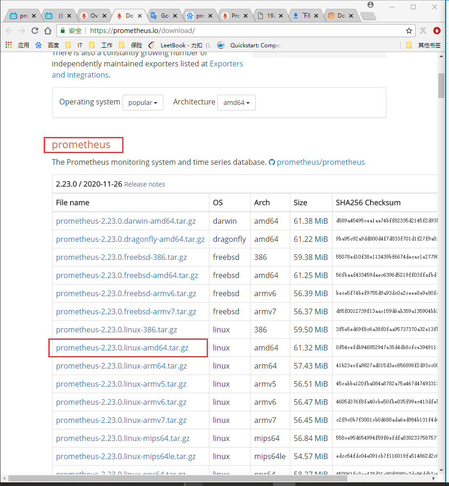

然后，上传到服务器

然后，解压

```sh
tar zxvf prometheus-2.16.0.linux-amd64.tar.gz -C /usr/local/
mv /usr/local/prometheus-2.16.0.linux-amd64/ /usr/local/prometheus

nohup /usr/local/prometheus/prometheus --config.file="/usr/local/prometheus/prometheus.yml" &
```

浏览器打开http://192.168.0.200:9090访问prometheus的web界面。

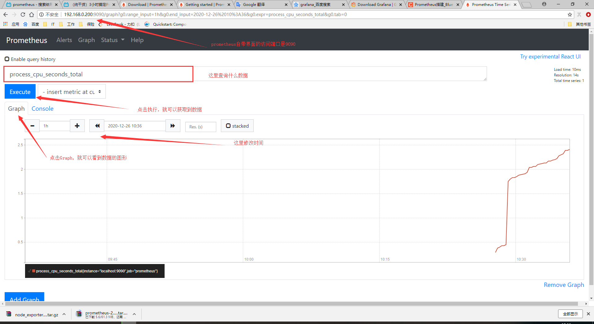

进入targets。

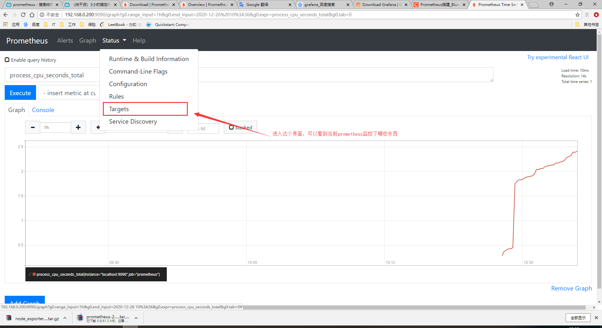

进入targets界面，可以看到，目前prometheus仅仅监控了它自己。

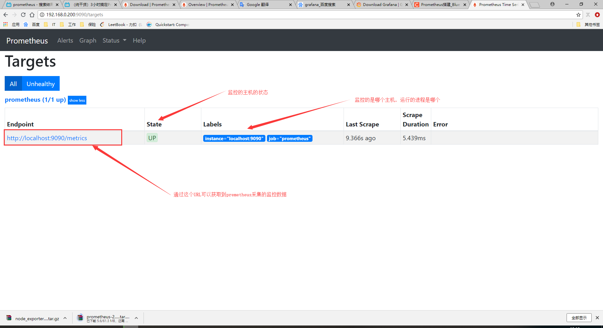

下面，添加更多个主机和服务，让prometheus来监控。

### 2. 安装和配置所需的xx_exporter

#### 2.1 监控Linux主机

##### 2.1.1 安装node_exporter

上官网下载node_exporter。选择图中的node_exporter版本。

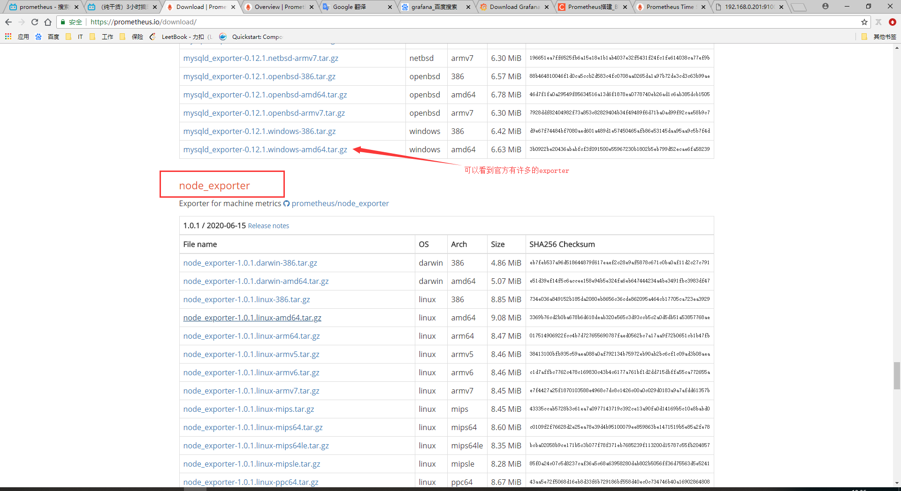

下载完成之后，上传到需要监控的linux主机。

```sh
tar zxvf node_exporter-1.0.1.linux-amd64.tar.gz -C /usr/local
mv /usr/local/node_exporter-1.0.1.linux-amd64/ /usr/local/node_exporter
```

后台运行node_exporter

```sh
nohup /usr/local/node_exporter/node_exporter &
```

通过==http://主机:9100/metrics/==，就可以获取到node_exporter所采集的数据了。

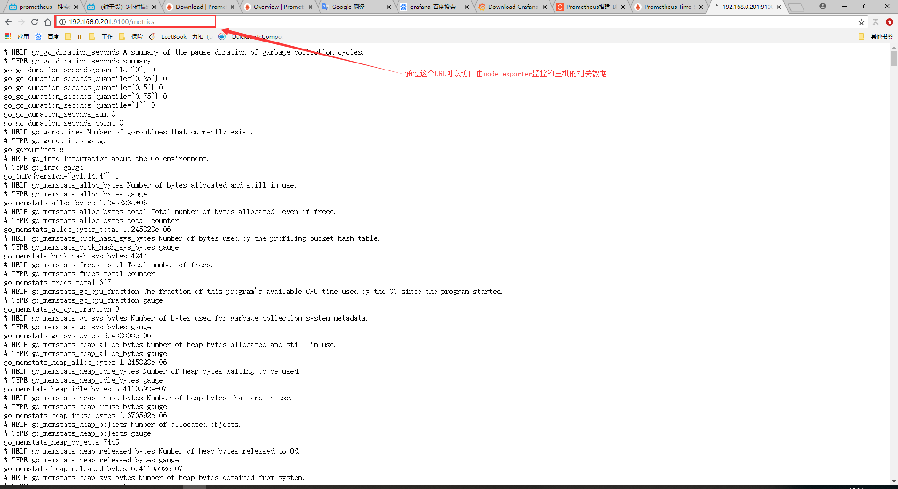

但是，这并没有集成到prometheus里去，而只是使用了一个prometheus的agent采集到了数据而已。

##### 2.1.2 让prometheus可以拉取node_exporter采集的节点信息

在prometheus的配置文件中添加被监控机器的配置段。prometheus的配置文件名为`prometheus.yml`，如下图所示。

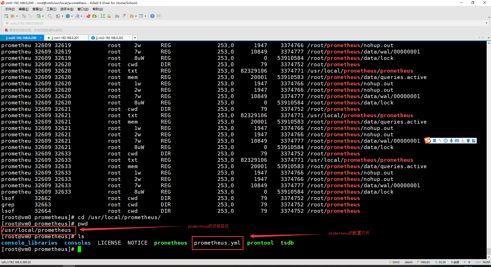

备份该配置文件，并添加如下内容：

```sh
cp prometheus.yml prometheus.yml.bak
vim prometheus.yml

- job_name: 'agent1'
  static_config:
  - targets: ['192.168.0.201:9100']
```

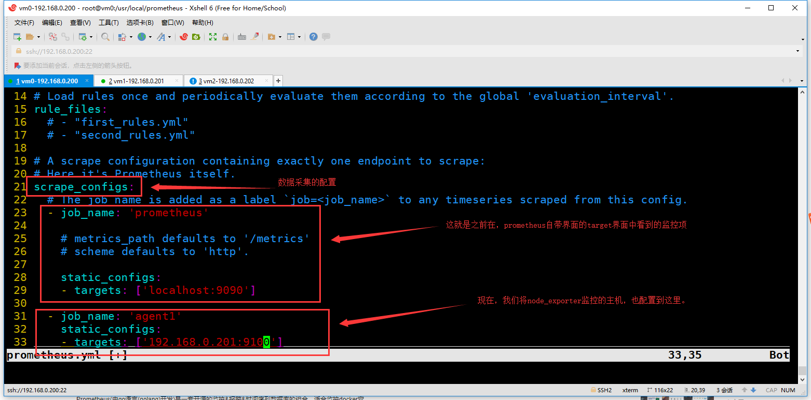

配置完成之后，重新启动prometheus。

```sh
pkill prometheus
# 查看是否杀掉了，9090端口应该没有被占用了。
lsof -i:9090
nohup /usr/local/prometheus/prometheus &
# 查看prometheus是否启动成功
ps -ef |grep prmetheus
```

prometheus就会从==192.168.0.201:9100==这个API接口去获取数据了。

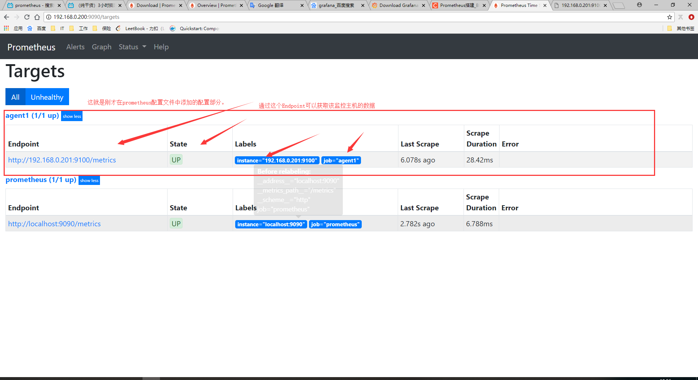

#### 2.2 监控远程MySQL

使用官方中的mysqld_exporter进行MySQL监控。

##### 2.2.1 安装mysqld_exporter

首先，从官方网站中下载所需版本的mysqld_exporter。

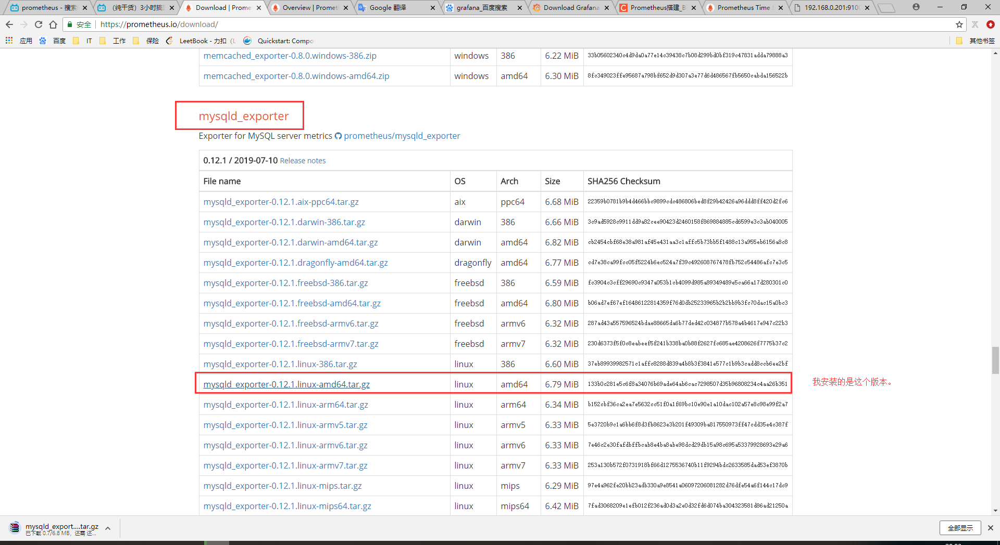

然后，上传到所要监控的MySQL所在的服务器。

然后，解压文件到指定位置即可

```sh
tar zxvf mysqld_exporter-0.12.1.linux-amd64.tar.gz -C /usr/local
mv /usr/local/mysqld_exporter-0.12.1.linux-amd64 /usr/local/mysqld_exporter
```

##### 2.2.2 安装MariaDB数据库

```sh
yum install mariadb\* -y
systemctl start mariadb
systemctl enable mariadb
mysql
```

##### 2.2.3 创建MySQL账号

```mysql
mysql> grant select, replicaion client,process ON *.* to 'mysql_monitor'@'localhost' identified by '123';
mysql> flush privileges;
mysql> exit;
```

##### 2.2.4 在mysqld_eporter中配置MySQL信息

```sh
vim /usr/local/mysqld_exporter/.my.conf
[client]
user=mysql_monitor
password=123

```

##### 2.2.5 运行mysqld_exporter

```sh
nohup /usr/local/mysqld_exporter --config.my-cnf=/usr/local/mysqld_exporter/.my.conf &
lsof -i:9104
```

##### 2.2.6 让prometheus可以拉取mysqld_exporter所采集的MySQL数据

```sh
vim /usr/local/prometheus/prometheus.yml
- job_name: 'mariadb'
  static_configs:
  targets: ['192.168.0.203:9104']
```

重启prometheus，以加载新配置

```sh
pkill prometheus
lsof -i:9090
nohup /user/local/prometheus/prometheus &
lsof -i:9090
```

在prometheus管理界面中的target中查看是否有了新添加的mysql监控信息。

### 3. 安装和配置Grafana

下载地址：https://grafana.com/grafana/download

```sh
wget https://dl.grafana.com/oss/release/grafana-7.3.6.linux-amd64.tar.gz
# 或 推荐这种方式
wget https://dl.grafana.com/oss/release/grafana-7.3.6-1.x86_64.rpm 
# 或
yum install grafana-xx.x86_64.rpm -y
systemctl start grafana-server
systemctl enable grafana-server
```

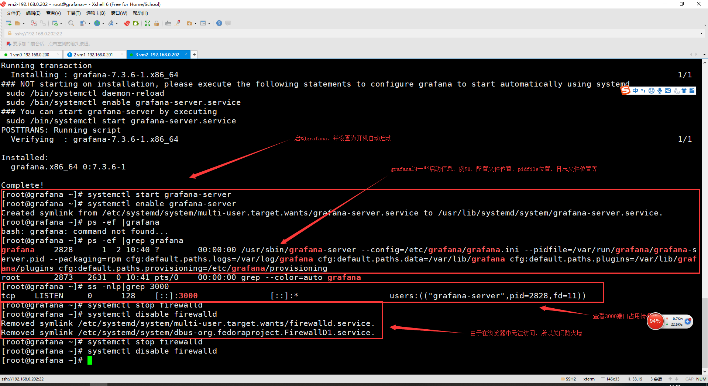

安装并启动grafana之后，在浏览器访问http://192.168.0.202:3000 发现不能访问，考虑可能是防火墙的问题。

```sh
# 关闭防火墙
systemctl stop firewalld
systemctl disable firewalld
```

再次尝试浏览器访问http://192.168.0.202:3000 成功。

grafana需要登录使用，默认的登录凭证是: admin/admin

进入grafana界面之后，主界面如下所示：

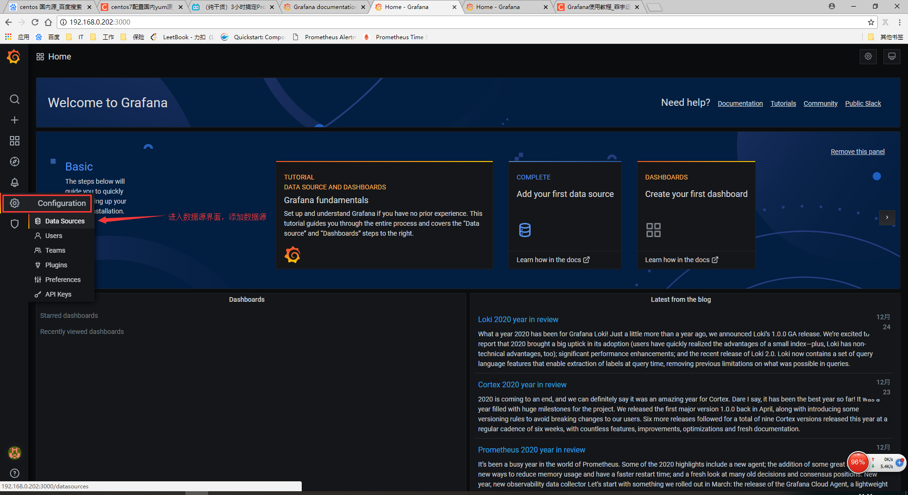

由于，现在我们并没有为grafana添加任何数据，所以一个图也没有。

第一步，添加数据源。configuration > Data sources。添加prometheus作为grafana的数据源。

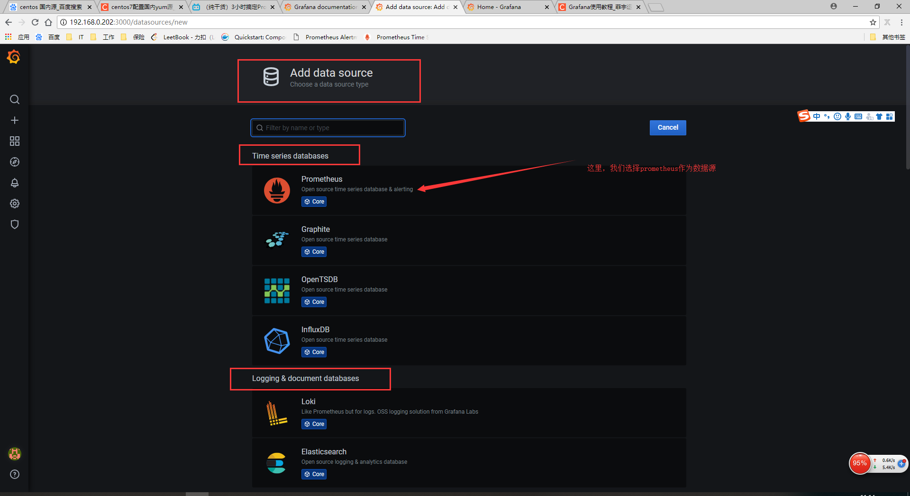

下面是对prometheus数据源的相关配置。配置完成后保存即可。

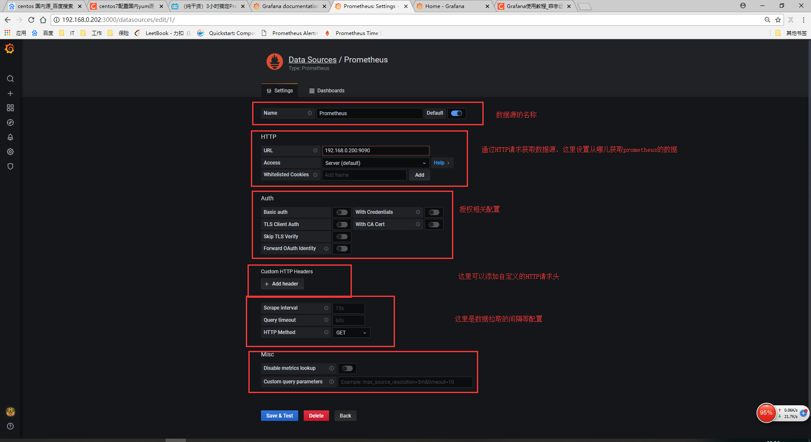

为添加好的数据源做图形展示

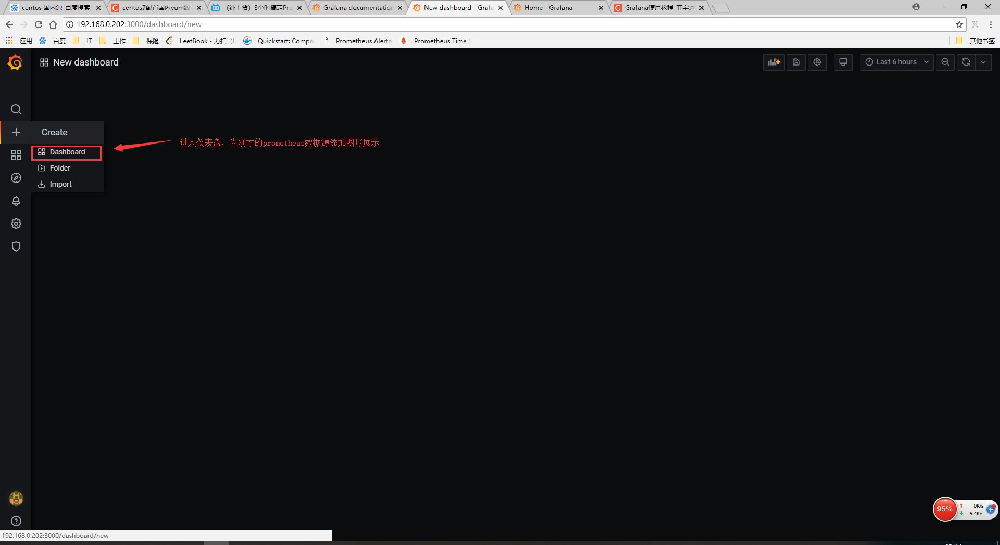

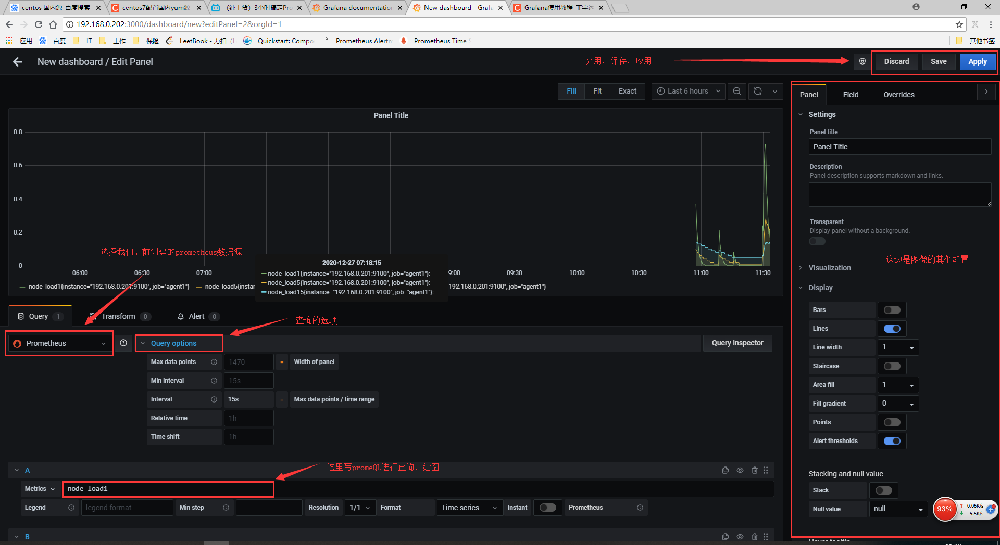

更好用的是直接通过导入dashboard模板，生成dashboard。

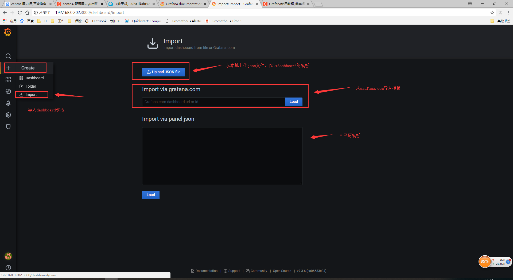

就问你牛逼不。

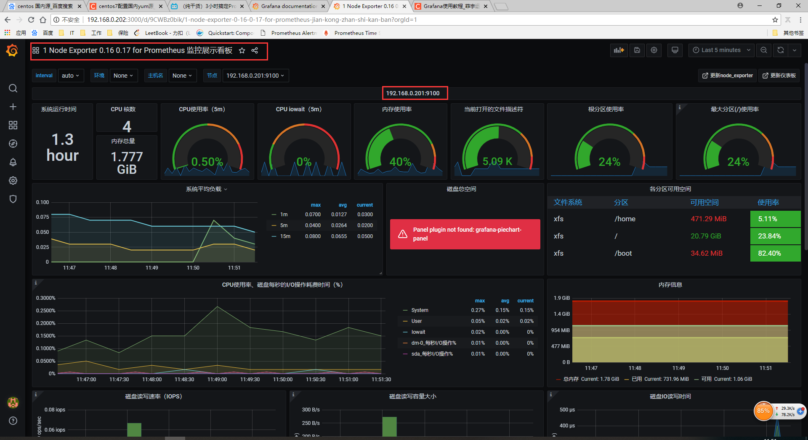


#### grafana+onealert实现告警

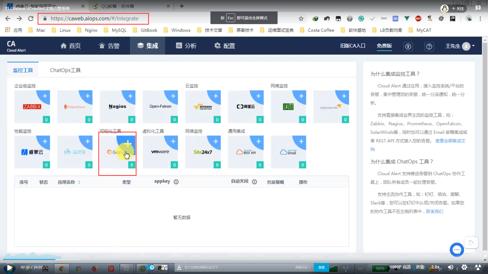

在grafana > alerting > notification channels创建一个信道，将告警信息推送给第三方，如邮件或其他网站等。

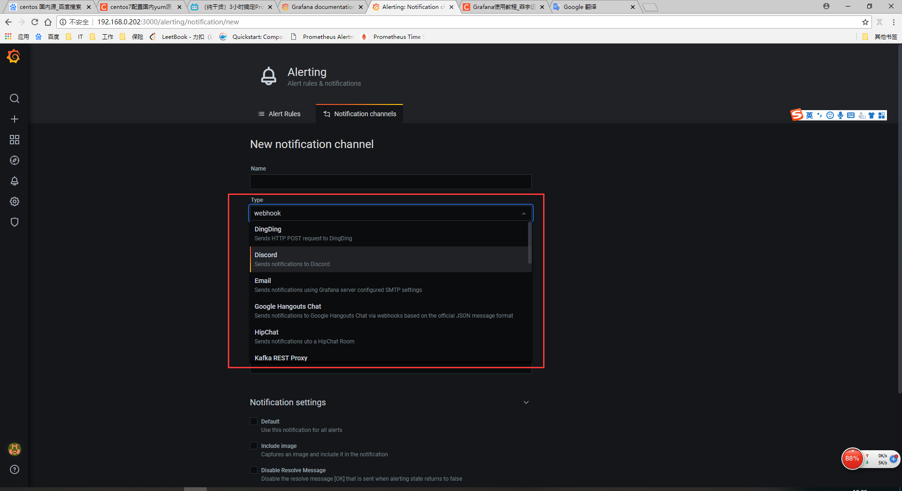

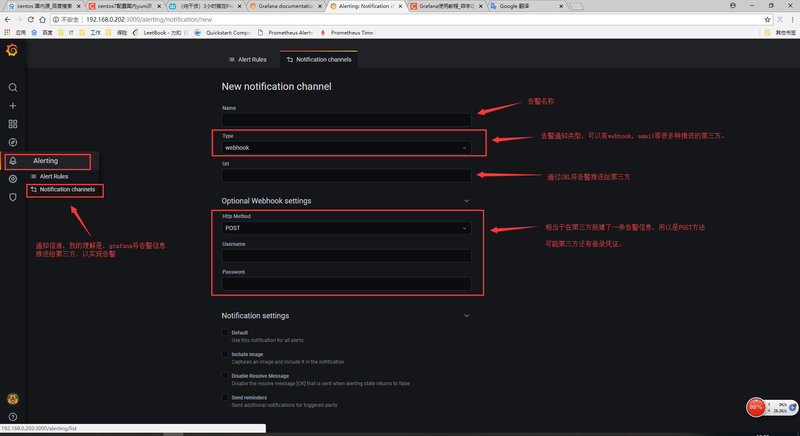

# Grafana

[grafana官网](https://grafana.com/)


## 概述

Grafana是一个开源的度量分析和可视化工具，可以将采集的数据进行分析，查询，然后进行可视化展示，并能实现告警功能。

# 4. 什么是SRE？

https://zhuanlan.zhihu.com/p/20695070

 

SRE是Site Reliability Engineering 的缩写。翻译过来为网站可靠性工程，对应的职位为网站可靠性工程师。Google在10多年前就创建了这样一个工种。

 

SRE 的首要工作任务是保证 SLA。SLA 是 service-level agreement 的缩写，没有贴切的中文翻译，我们继续用缩写好了。SLA 一般指的是系统的功能指标，比方说系统可用性（availability）达到 99.99%；对于 95% 的请求，响应延迟（latency）低于 200 毫秒等等。《SRE》第 4 章会具体讲 SLA、SLO、SLI 的含义及用法。

 

1.容量规划与实施

2.部署新的服务集群（serving cluster）

3.冗余与容错

4.负载均衡

5.上线新的服务（on-boarding service）

6.监控（Monitoring）

7.值班（on-call）

8.救火（Firefighting）

 

SRE 不是什么

SRE 不在数据中心上班，不搬机器。

SRE 不是系统管理员，不会帮你重置用户密码，也不安装操作系统或升级安全补丁。

SRE 不是测试工程师，不管持续集成和发布新版本。

SRE 不是运维，不过我其实不了解国内的运维具体是做什么的。