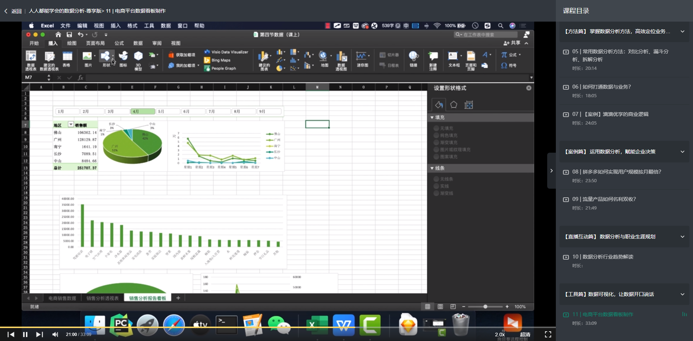
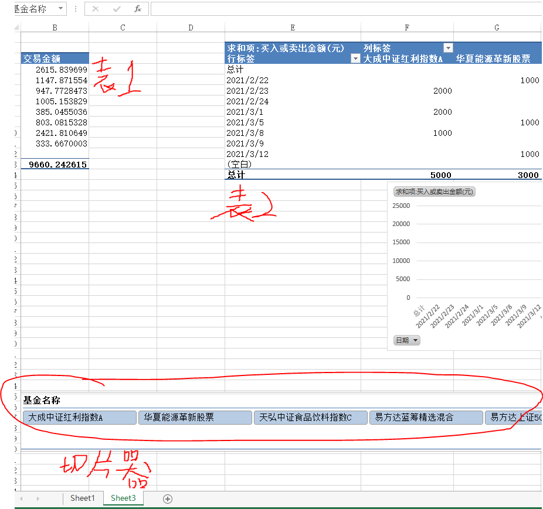

# 数据分析

## 1. 拉钩教育- 《人人都能学会的数据分析-尊享版》

这个课程共4天，其实讲得很基础，没有代码层面的东西。看来以前我是理解错了数据分析了。

最终就是通过那几种数据分析的工具，从多个维度将数据以可视化图表的方式呈现出来，显示某些规律、趋势。

> 简单介绍下：excel如何制作可视化图表
>
> 在`插入` > `数据透视表` > 可以根据数据新建数据透视表 > 选择所需的数据放入透视表中 > 创建数据透视图 > balabla > 创建另一张透视表> 创建对应的数据透视图 > ....

其中sheet1中是原始数据，然后创建的数据透视表放在了sheet3中。

### 1.1 什么是数据分析？

**需要注意的是区分数据分析与数据挖掘，前者偏向于业务分析，后者偏向于数据库算法**。

用一句话来说明数据分析：借助数据来指导决策，理性决策，而不是感性决策。

数据分析的常见流程：

1. 明确分析目标。通过这次的数据分析要解决什么问题？
2. 数据收集。数据是数据分析的基础，没数据咋个分析呢？
3. 数据清洗。补充缺失值，丢弃不符合的值，对数据归类，整合，归一化等等。
4. 数据分析，分析数据。从多个维度，也就是根据多个指标，来分析数据
5. 数据报告。现在，一般都是以可视化图形的方式报告，别只用表格了，直接把趋势，结果告诉领导就完事了，别让领导自己去发现，领导要干了这事儿，还要你干吗？
6. 执行与反馈。开始干活，干就完事了。

### 1.2 数据分析的目的

借助数据来指导决策

### 1.3 数据分析的手段

常见的数据分析工具：

1. Excel
2. sql
3. sas
4. IBM SPSS
5. R语言
6. Python

### 1.4 课程内容总结

#### a. 什么是数据思维？

通过客观数据来反映、说明、解决问题，而不是通过主观臆断。

​	

#### b. 数据分析能力是哪些？

​	描述现状

​	寻找规律

​	推动改进

#### c. 抖音高日活的秘密？

多个维度（即多个指标）来刻画用户，通过这些特征形成的特征向量来代表用户，反映用户的偏好，行为等。针对不同的用户，提供更合适的服务，如：推荐用户更喜欢的内容。

#### d. 常用的数据分析方法

**定位问题**：

​	对比分析法

​	漏斗分析法

​	拆解分析法

​	相关分析

**量化问题**：

​	统计推断

​	预测建模

​	实验评估

#### e. 数据与业务

前面也说了数据分析更偏向于业务分析，通过对数据的分析来解决当前业务中所遇到的问题，因此一定要对xx业务有一定的理解，哪些数据对这个业务的这些问题产生什么影响，一定要心里有数。

