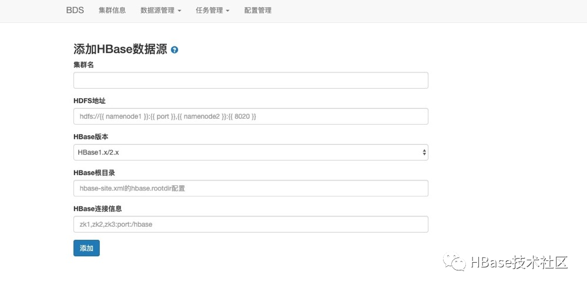

[开发者头条程序员分享平台](https://toutiao.io/)

[猜你喜欢](https://toutiao.io/explore/reco)[热门](https://toutiao.io/posts/hot/7)[分享](https://toutiao.io/contribute)[订阅](https://toutiao.io/account/subscriptions)[搜索](https://toutiao.io/search)[登录](https://toutiao.io/signin)[Java](https://toutiao.io/c/java)[架构](https://toutiao.io/c/arch)[前端](https://toutiao.io/c/fe)[更多 ](https://toutiao.io/posts/knac22o/preview)

## HBase TB 级数据规模不停机迁移最佳实践

#### 独家号 [大数据生态](https://toutiao.io/subjects/136176) 作者 侧田[原文链接](https://mp.weixin.qq.com/s/cqZxUmO_4koj_fke1rPLSQ)

**背景**

有关HBase集群如何做不停服的数据迁移一直都是云HBase被问的比较多的一个问题，目前有许多开源的工具或者HBase本身集成的方案在性能、稳定性、使用体验上都不是很好，因此阿里云提供了BDS迁移服务，可以帮助云上客户实现TB级数据规模不停机迁移

### **支持场景**

- HBase大版本升级， 1.x升级2.x
- 集群配置升级，8核16G升级为16核32G
- 集群网络环境变更，经典网络迁移到VPC
- 异地跨机房迁移
- HBase业务拆分

### **方案介绍**

#### **开源方案**

HBase不停机迁移主要包括三个部分：表结构的迁移、实时数据同步、历史全量数据迁移。

- #### **表结构迁移**

对于表结构迁移来说，开源的DataX还是HBase本身都不提供表结构迁移的功能，只能进行手动建表，手动建表会存在几个问题：

1. 如果源集群表数据较多，客户手动建表比较麻烦
2. 手动建表可能忽略表分区，导致目标表分区很不合理，迁移完之后影响请求RT

- #### **实时数据同步**

对于实时数据同步来说，有两种现有的方案：客户端应用双写、HBase Replication

1. 客户端应用双写需要业务方对客户端代码进行改造，并且双写会放大毛刺，只要有一个集群出现问题就会影响业务写入，对于实时要求性比较强的业务是不能接受的

2. HBase Replication 对于大集群或者写入压力比较大的集群来说，存在如下几个问题：

3. 1. 同步的逻辑集成在RegionServer当中，RegionServer读写和同步会相互影响
   2. 不同的RegionServer同步的压力可能是不同的，不抗热点
   3. 如果遇到同步积压，往往RegionServer的负载已经很高不太容易通过调整线程来解决，只能等低峰期慢慢消化或者增加RegionServer节点

- #### **全量数据迁移**

对于全量数据迁移来说，可以使用DataX、HBase CopyTable、HBase创建和导出快照

1. DataX走的API层面的迁移，对于源集群大表的全表Scan和目标表大量的Put都会对集群业务产生影响，增加业务的读写毛刺，另外API层面的迁移比文件层的拷贝会多占用50%以上的流量
2. HBase创建和导出快照，快照的创建和导出都是在源集群上完成，会影响源集群稳定性，创建快照会暂用源集群的存储资源，对一张大表创建完快照，然后进行major compaction可能会导致HDFS容量水位迅速上涨，可能会写满HDFS

####  

#### **阿里云的方案**

为了解决了开源方案存在的不足，支持TB、PB级别的数据迁移，我们阿里内部自研了一套迁移同步服务BDS，来满足阿里云上不同客户的需求。

对于HBase集群相互迁移，BDS支持表结构迁移、全量数据迁移以及增量数据同步

- **表结构迁移**

- - 自动创建目标表并保证分区一致，避免迁移后表单分区数据量过大，影响目标表读写RT
  - 以表级别为粒度，支持批量提交

- **全量数据迁移**

- - 走文件层的数据文件拷贝比通常API层的数据迁移通常能节省50%以上的流量
  - 自动处理Region Split、HFile Compaction
  - 单节点迁移速度可达到100MB/s，节点数支持水平扩展，能够满足支持TB、PB级别的数据迁移
  - 迁移速度可以动态配置

- 增量数据同步

- - 异步解析源集群HDFS上的WALs并在目标集群进行回放，增量同步不会和源集群HBase进行交互
  - 有完善的错误重试机制，实时监控任务速度和进度，支持任务失败报警
  - 同步吞吐动态可配

#### **稳定性保障**

BDS稳定性

1. BDS采用的是分布式的架构，master通过zk监听worker节点是否存活，如果节点宕机会对任务进行重分配，完善的failover机制
2. 完善的监控体系、报警机制，监控表迁移的进度，迁移了多大的数据量，迁移的速率，实时同步的延迟等信息，对于需要人为介入的异常进行报警
3. BDS支持任务断点续传

源集群业务稳定性

1. 对于实时的数据同步，开源的方案走的是HBase Replication，同步逻辑集成在RegionServer中，RegionServer本身的读写和数据同步相互影响。BDS和HBase集群解耦，独立部署，避免对HBase集群CPU、内存等机器资源的占用
2. 全量数据迁移、实时数据同步只访问源集群的HDFS，全程不会和HBase做交互，尽量避免对源集群业务产生的影响
3. 可以动态调整全量数据迁移和实时数据同步的迁移速率

#### 迁移步骤

下图为集群迁移的基本步骤

- 购买及环境准备

- - 购买BDS迁移服务
  - 不同网络环境需要打通BDS到各个集群的网络

- 提交迁移任务

- - 登陆BDS操作页面
  - 录入源集群和目标集群的信息
  - 开启增量同步通道，同步源集群实时写入数据到目标集群
  - 提交历史数据迁移任务，迁移历史存量数据文件

- 验证

- - 业务验证
  - 业务切换

### **案例**

#### **迁移规模**

网路环境：相同VPC
集群版本：自建HBase1.x迁移到云HBase1.x
集群规模：集群20台RegionServer
数据规模：数据总量30+T，迁移20+表，日增几百G
要求：不停服迁移，尽可能避免读在线业务的影响

#### **环境准备**

##### **步骤1：计算BDS服务的规模**

BDS单节点(4cores 8G)的迁移最大速度 50MB/s ~ 100MB/s，增量同步任务单机能最多处理5台RS的日志, 单节点日志迁移速度最大50 ~ 60MB/s。
源集群有20台节点， 日增数据几百G，写入量也不是很大，BDS每个节点同时能够处理5个RS的日志，因此，BDS至少需要4个Worker节点。

##### **步骤2：购买BDS集群**

详见《BDS服务开通》，开通了BDS之后，需要配置BDS访问的白名单，然后配置页面登陆的账户密码，进行BDS操作页面的登陆。

##### **步骤3：关联HBase集群**

购买BDS集群之后，需要关联源集群和目标集群。
对于目标云HBase集群来说，BDS控制台提供了自动关联集群的功能，不需要手动的录入集群的信息。

控制台点击关联集群会罗列出所有BDS所绑定的VPC下的云HBase集群，选择对应的目标集群进行绑定，绑定完成之后，可以在BDS HBase数据源页面看到绑定的集群信息。

对于自建HBase，需要绑定ip和hostname的映射关系并手动录入集群信息。自建HBase集群机器使用的主机名可能是BDS不识别的，因此在录入自建HBase集群信息之前，需要配置集群主机名和ip的映射关系到BDS。查看自建集群的/etc/hosts，将/etc/hosts信息copy到配置项中，在BDS上录入集群ip和hostname的映射关系。

回到HBase数据源页面，添加数据源。

录入自建集群的HDFS地址、HBase的版本、HBase根目录、HBase连接信息，点击添加会对网络连通性、HBase版本进行校验，源集群和目标集群都验证通过之后，就可以配置迁移任务。

### **配置迁移任务**

当上面的所有前置条件都配置完成后，就可以开始迁移任务配置。下面详细介绍下具体的迁移步骤。

##### **步骤1：创建实时数据同步通道**

首先登陆BDS界面，点击任务管理选择HBase实时数据同步，选择创建HBase同步通道，进入通道创建的页面。

选择源集群和目标集群，按照表为粒度批量提交要迁移的表，创建同步通道。BDS在提交同步通道的时候自动检测目标表是否存在，不过不存在创建目标表，保证原表和目标表完全一致。这里推荐使用BDS自动建表保证目标集群和源集群的分区一致。同步通道创建完成之后，我们查看同步通道的进度。

总结一项可以查看整个通道的总延迟，BDS处理的最大最小耗时，读写总流量和速率
表信息详情可以查看表put、delete操作总次数，表开始同步的时间点和最近更新的时间点。
日志信息详情主要罗列了各个日志同步的进度，点位和速率。

##### **步骤2：提交历史任务迁移**

增量数据同步通道完成之后，接下来提交全量数据迁移任务，在任务管理里面我们选择HBase历史数据批量迁移，进入历史数据管理页面，点击创建任务，进入全量数据创建页面，选择对应的源集群和目标集群，输入需要迁移的表，点击创建。

全量数据迁移任务提交后，BDS会去验证目标表是否存在，不存在就自动创建目标表，任务开始之后我们可以查看各个表迁移的进度和速率。

##### **步骤3：业务验证**

当全量数据迁移完成，实时同步的延迟在业务可控范围之内（比如源集群和目标集群同步延迟1秒以内），业务可以进行数据的抽样校验，以及开始部分业务灰度。

##### **步骤4：业务切流**

验证通过之后，找个业务低峰期进行业务切流，切流过程中可能遇到问题，回切流量到源集群，为了防止流量切回源集群出现源集群少数据情况，需要业务在切流之前开启目标集群到源集群的实时同步通道，将切流后的实时写入数据同步回源集群。

##### **步骤5：释放BDS资源**

业务稳定在新集群上运行了一段时间之后，没有发现问题，便可以中断BDS实时同步的通道，释放掉BDS资源。

大家工作学习遇到HBase技术问题，把问题发布到HBase技术社区论坛http://hbase.group，欢迎大家论坛上面提问留言讨论。想了解更多HBase技术关注HBase技术社区公众号(微信号:**hbasegroup**)，非常欢迎大家积极投稿。

本群为HBase+Spark技术交流讨论，整合最优质的专家资源和技术资料会定期开展线下技术沙龙，专家技术直播，专家答疑活动。点击链接钉钉入群：

https://dwz.cn/Fvqv066s或扫码进群

本群为Cassandra技术交流讨论，整合最优质的专家资源和技术资料会定期开展线下技术沙龙，专家技术直播，专家答疑活动。Cassandra 社区钉钉大群：

https://c.tb.cn/F3.ZRTY0o或扫码进群

Cassandra 技术社区微信公众号：

[HBase](https://toutiao.io/tags/HBase) [数据迁移](https://toutiao.io/tags/数据迁移)

独家号

### 大数据生态

stay hungry stay foolish

进入开发者头条，订阅我的独家号。
发现 > 搜索 **136176** 即可

扫描或长按识别二维码 下载开发者头条客户端

[关于我们](https://toutiao.io/about) [开发者头条客户端](https://toutiao.io/download) [合作伙伴](https://toutiao.io/partner) [IO币介绍](https://toutiao.io/about_coin) [码农周刊](http://weekly.manong.io/) [程序员招聘](http://job.manong.io/) [开发者头条知识库](https://toutiao.io/tags) [安装 Chrome 一键分享插件](https://toutiao.io/chrome)

© 2013-2020 南京无印信息技术有限公司 版权所有 [苏ICP备14017389号-2](http://www.beian.miit.gov.cn/)