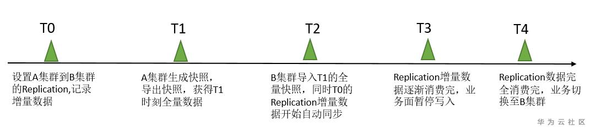

# 1. 概述

HBase数据迁移是很常见的操作，目前业界主要的迁移方式主要分为以下几类：


从上面图中可看出，目前的方案主要有四类，Hadoop层有一类，HBase层有三类。下面分别介绍一下。

- **distcp**

  直接拷贝HBase的`/hbase/data`目录下的数据，在目标端恢复.

  参考：https://blog.csdn.net/wypblog/article/details/108030883

- **copyTable**

  参考：https://blog.csdn.net/wypblog/article/details/108030883

  copyTable也是属于HBase数据迁移的工具之一，以**表级别**进行数据迁移。**copyTable的本质也是利用MapReduce进行同步的，与DistCp不同的时，它是利用MR去scan  原表的数据，然后把scan出来的数据写入到目标集群的表。**这种方式也有很多局限，如一个表数据量达到TB级，同时又在读写的情况下，全量scan表无疑会对集群性能造成影响。 来看下copyTable的一些使用参数：

  | 选项      | 含义                                                         |
  | :-------- | :----------------------------------------------------------- |
  | rs.class  | 对等集群的hbase.regionserver.class，指定是否与当前群集不同   |
  | rs.impl   | 对等集群 hbase.regionserver.impl 的实现类                    |
  | startrow  | 起始rowkey                                                   |
  | stoprow   | 终止rowkey                                                   |
  | starttime | 起始时间   (unix时间 ，单位 millis)                          |
  | endtime   | 如果没有则表示到最大    结束时间范围。 如果未指定启动时间，则忽略。 |
  | versions  | 要复制的单元(cells)版本数                                    |
  | new.name  | 新表的名字                                                   |
  | peer.adr  | 格式中给出的对等集群的地址: hbase.zookeeer.quorum:hbase.zookeeper.client.port:zookeeper.znode.parent |
  | families  | 以逗号分隔的要复制的族的列表                                 |
  | families  | To copy from cf1 to cf2, give sourceCfName:destCfName.       |
  | families  | To keep the same name, just give "cfName"                    |
  | all.cells | 同时复制删除标记和删除的单元格                               |

- **Export/Import**

  此方式与CopyTable类似，主要是将HBase表数据转换成Sequence  File并dump到HDFS，也涉及Scan表数据，与CopyTable相比，还多支持不同版本数据的拷贝，同时它拷贝时不是将HBase数据直接Put到目标集群表，而是先转换成文件，把文件同步到目标集群后再通过Import到线上表。

  ```bash
  #  output_hdfs_path可以直接是目标集群的hdfs路径，也可以是原集群的HDFS路径，如果需要指定版本号，起始结束时间
  hbase org.apache.hadoop.hbase.mapreduce.Export <tableName> <ouput_hdfs_path> <versions> <starttime> <endtime>
  
  #如果原数据是存在原集群HDFS，此处input_hdfs_path可以是原集群的HDFS路径，如果原数据存在目标集群HDFS，则为目标集群的HDFS路径
  hbase org.apache.hadoop.hbase.mapreduce.Import <tableName> <input_hdfs_path>
  ```

  参考：https://blog.csdn.net/wypblog/article/details/108030883

- **Snapshot+Replication（推荐）**

  快照就是一份元信息的合集，允许管理员恢复到表的先前状态，快照不是表的复制而是一个文件名列表*，*因不拷贝实际的数据，所以整个过程是比较快的，相当于对表当前元数据状态作一个克隆，snapshot的流程主要有三个步骤：

  

  

  **加锁**: 加锁对象是regionserver的memstore，目的是**禁止在创建snapshot过程中对数据进行insert,update,delete操作**

  **刷盘**：刷盘是针对当前还在memstore中的数据刷到HDFS上，保证快照数据相对完整，此步也不是强制的，如果不刷会，快照中数据有不一致风险

  **创建指针**: snapshot过程不拷贝数据，但会创建对HDFS文件的指针，snapshot中存储的就是这些指针元数据

  HBase提供了replication的方式，可以在将A集群的状态同步至B集群。原理是使用源端集群的WAL来传递状态的变化给其他集群。

  replication是列族级别的复制。

  前提：

  - 在启用replication之前，需要在目标HBase集群创建replication的表和replication的列族。
  - 源目HBase集群的机器网络互通
  - 如果源目HBase集群使用同一个zk集群，则`zookeeper.znode.parent`应为不同的值。
  - 在源集群使用`add_peer`添加目标集群为peer。
  - 在源集群使用`enable_table_replication`启用HBase表的replication。

  

# 2. snapshot+replication方式进行实操

## 2.1 实现的流程

大家都知道HBase有snapshot快照的功能，利用快照可以记录某个时间点表的数据将其保存快照，在需要的时候可以将表数据恢复到打快照时间时的样子。我们利用hbase的snapshot可以导出某个时间点的全量数据。

因为实际的业务还在不停的写入表中，除了迁移快照时间点之前的全量数据，我们还需要将快照时间点后源源不断的增量数据也迁移走，这里如果能采用双写的方式，将数据写入两个集群就好了，但是现实的业务不会这样做，如果这样做还得保证双写的事务一致性。于是可以利用HBase的replication功能，replication功能本身就是保留了源集群的WAL日志记录，去回放写入到目的集群，这样一来用户业务端->原始集群->目的集群便是个串形的数据流，且由HBase来保证数据的正确性。

所以这个迁移的方法就是利用snapshot迁移全量数据，利用replication迁移增量数据。



**T0：** 配置好老集群A集群到新集群B的Replication关系，Replication的数据由A集群同步到集群B，将表设置成同步，从此刻开始新写入A集群表的数据会保留在WAL日志中；

**T1：** 生成该时间点的全量数据，通过创建快照，以及导出快照数据的方式将该时间点的数据导出到新集群B；

**T2：** 新集群B将T1时刻的快照数据导入，此时新集群B中会由快照创建出表，此时老集群A集群上设置的Replication的关系会自动开始将T0时刻保留的WAL日志回放至新集群B的表中，开始增量数据同步。

**T3：** 由于从T0-T3之间的操作会花费一段时间，此时会积累很多WAL日志文件，需要一定的时间来同步至新集群，这里需要去监控一下数据同步情况，等老集群WAL被逐渐消费完，此时可以将老集群的写业务停止一下并准备将读写业务全部切到新集群B。

**T4：** T3-T4之间应该是个很短的时间，整个迁移也只有这个时间点会有一定中断，此时是将业务完全切到新集群B，至此迁移完成。

## 2.2 操作步骤

**环境准备**

将源目HBase集群创建在同一vpc下，以保证两个hbase集群的RegionServer节点都网络互通。

- **源HBase集群 （集群A）**

  ```bash
  腾讯云emr-hbase 3.3.0，对应HBase版本为2.4.5
  master节点：10.1.2.13
  core节点：10.1.2.3
  core节点：10.1.2.10
  zookeeper quorum为 `10.1.2.13:2181`
  hfds中`fs.defaultFS=hdfs://10.1.2.13:4007`
  hbase中`zookeeper.znode.parent=/hbase-emr-6l5i9inx`，注意不是默认的`/hbase`
  ```

- **目标HBase集群 （集群B）**

  ```bash
  腾讯云emr-hbase 3.1.0，对应HBase版本为2.3.3
  master节点：10.1.2.16
  core节点：10.1.2.8
  core节点：10.1.2.9
  zookeeper quorum为`10.1.2.16:2181`
  hfds中`fs.defaultFS=hdfs://10.1.2.16:4007`
  hbase中`zookeeper.znode.parent=/hbase-emr-nxvmqrkv`，注意不是默认的`/hbase`
  ```

- **测试数据准备**

  在源集群A的hbase shell中

  ```bash
  # 在集群A创建表，两个列族'info'和'study'
  create 'students', 'info', 'study'
  
  # 在集群A写入测试数据
  put 'students', 'rowkey00001', 'info:id', '3001001'
  put 'students', 'rowkey00001', 'info:name', 'zhangsan'
  put 'students', 'rowkey00001', 'info:age', '18'
  put 'students', 'rowkey00001', 'info:gender', '01'
  put 'students', 'rowkey00002', 'info:id', '3001002'
  put 'students', 'rowkey00002', 'info:name', 'lisi'
  put 'students', 'rowkey00002', 'info:age', '19'
  put 'students', 'rowkey00002', 'info:gender', '00'
  ```

### 2.2.1 设置集群A和集群B的peer关系

在源集群A的hbase shell中, 设定peer，**并disable 此peer**。表示先不进行复制，但是从此时开始监听WAL日志了。

**peer：指复制链路。**

```bash
add_peer '1', CLUSTER_KEY => "10.1.2.16:2181:/hbase-emr-nxvmqrkv", STATE => "DISABLED"
```

- `CLUSTER_KEY`为目标集群的`hbase-site.xml`中的`hbase.zookeeper.quorum`和`zookeeper.znode.parent`的值构成。
- `STATE`为DISABLED表示先不启用此peer，但是会开始监听WAL日志了。


### 2.2.2 在集群A的表中设置replication属性

在源集群A的hbase shell中

```bash
alter 'students',{NAME => 'info',REPLICATION_SCOPE => '1'}
```


<font color="red">注意：必须要将需要复制的表的列族的REPLICATION_SCOPE设为1，否则不会复制的。</font>

### 2.2.3 给集群A的表创建快照

在源集群A的hbase shell中

```bash
snapshot 'students','students_table_snapshot_20230717'
```

创建的snapshot放在目录`/hbase/.hbase-snapshot/`下， 元数据信息放在`/hbase/.hbase-snapshot/data.manifest`中

### 2.2.4 在集群A中导出快照到新集群

在源集群A的命令行中

```bash
hbase org.apache.hadoop.hbase.snapshot.ExportSnapshot -snapshot students_table_snapshot_20230717 -copy-to hdfs://10.1.2.16:4007/hbase -mappers 16 -bandwidth 20
```

导出到目标集群后，直接就出现了`/hbase/.hbase-snapshot/studetn_table_snapshot_20230717`目录，原本在目标集群是没有`/hbase/.hbase-snapshot`目录的。


<font color="red">注意：如果担心直接导出到目标集群的`/hbase`目录不安全（比如造成数据覆盖之类），那么可以先导出到一个事先不存在的目录，如`/snapshot-backup/students`，然后在mv 到`/hbase/.hbase-snapshot`目录下去。否则跳过**2.2.5**步</font>

```bash
hbase org.apache.hadoop.hbase.snapshot.ExportSnapshot -snapshot students_table_snapshot_20230717 -copy-to /snapshot-backup/students
```

### 2.2.5 将快照数据放置到集群B的对应的目录下

上面命令会导出2个目录，一个是快照元数据，一个是原始数据

- 将元数据放到`/hbase/.hbase-snapshot`中，

- 将原始数据放到`/hbase/archive`目录中

==由于hbase的archive目录会有个定时清理，这里可以提前将集群B的master的`hbase.master.cleaner.interval`值设置大点，避免拷贝过程中发生碰巧发生了数据清理。（考虑是否要修改，因为修改需要重启HMaster的）==

如果集群B中没有对应的目录，可以提前创建

```bash
hdfs dfs -mkdir -p /hbase/.hbase-snapshot
hdfs dfs -mkdir -p /hbase/archive/data/default/
```

移动导出的snapshot文件到snapshot目录

```bash
hdfs dfs -mv /snapshot-backup/students/.hbase-snapshot/students_table_snapshot_20230717 /hbase/.hbase-snapshot/
hdfs dfs -mv /snapshot-backup/students/archive/data/default/students /hbase/archive/data/default
```

### 2.2.6 在恢复快照前在集群A写入几条数据，模拟在快照恢复期间集群A写入了数据

在源集群A的命令行中

```bash
put 'students', 'rowkey00003', 'info:id', '3001003'
put 'students', 'rowkey00003', 'info:name', 'wangwu'
put 'students', 'rowkey00003', 'info:age', '20'
put 'students', 'rowkey00003', 'info:gender', '01'
put 'students', 'rowkey00001', 'info:age', '19'
```

### 2.2.7 在新集群B中恢复表的快照

在目标集群B的hbase shell中

```bash
# 若集群B中存在'students'表，则需要先disable再restore，不存在则可以直接restore_snapshot
disable 'stuents'
restore_snapshot 'students_table_snapshot_20230717'
```

==恢复完成后，记得将集群B的hmaster中`hbase.master.cleaner.interval`的值调整回来。（考虑是否要修改，因为修改需要重启HMaster的）==


### 2.2.8 指定要复制的表

在源集群A的hbase shell中

```bash
enable_table_replication 'students'
```


此时，`list_peers`会发现ID为1的peer的状态仍然是`DISABLED`。

### 2.2.9 打开集群A的ID为1的peer

在源集群A的hbase shell中

```bash
# 启用之前配置的peer
enable_peer '1'

# 查看replication的状态
status 'replication'
```

在目标集群B中验证增量数据是否复制过来了。


<font color='red'>注意：如果测试中操作有误，使用如下命令清楚测试数据和环境，然后重新准备测试数据</font>

```bash
# 在源集群A的hbase shell中
remove_peer '1'
delete_snapshot 'students_table_snapshot_20230717'
disable 'students'
drop 'students'

# 在目标集群B的hbase shell中
delete_snapshot 'students_table_snapshot_20230717'
disable 'students'
drop 'students'
```

### 2.2.10 数据验证

HBase提供了一个名为`VerifyReplication`的mapreduce job用于验证replication的数据。**源端集群执行**

```bash
$ HADOOP_CLASSPATH=`${HBASE_HOME}/bin/hbase classpath` "${HADOOP_HOME}/bin/hadoop" jar "${HBASE_HOME}/hbase-mapreduce-VERSION.jar" verifyrep --starttime=<timestamp> --endtime=<timestamp> --families=<myFam> <ID> <tableName>
```

- `<ID>` 指peer id
- `<tableName>`指需要校验的表
- `--families`指需要检验的cf
- `--starttime`, `--endtime` 指校验指定时间范围内的数据