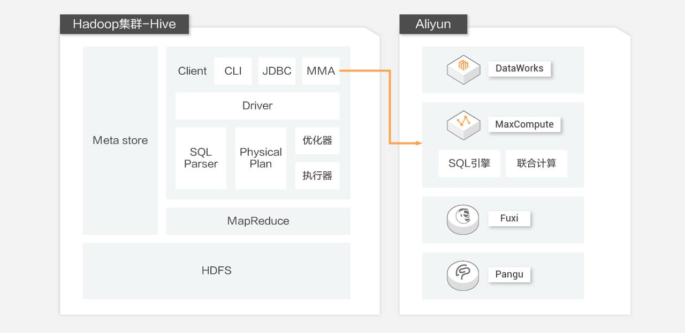
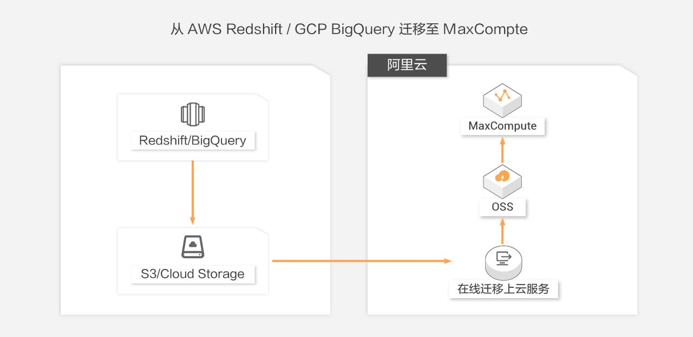
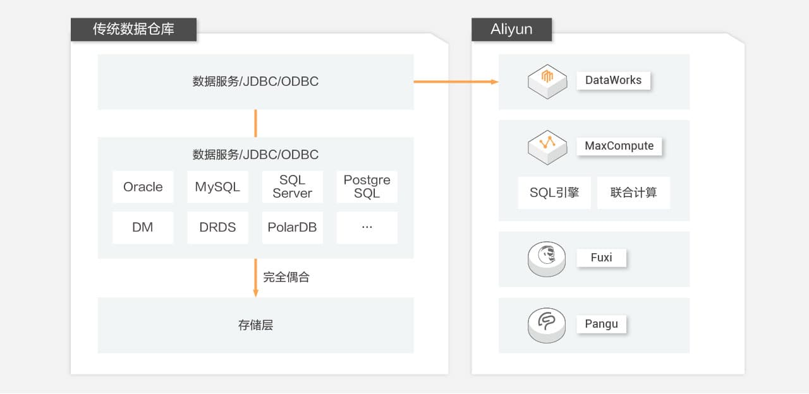

参考文章：https://www.aliyun.com/activity/bigdata/maxcompute-migration?spm=5176.7944453.J_7721567390.1.69ff5d53MNYUcX

## 从 Hadoop 迁移到 MaxCompute

现状调研
方案支持人员下发 Hadoop 调查表，由迁移客户方配合完成现状调研
内容包括：
1、集群规模：存储、计算、YARN 资源等维度信息梳理；
2、网络环境：如 IDC 内网出口带宽、专线连通 IDC 到阿里云；
3、常用组件、机器配制、现有数据架构图；
4、Hadoop 集群表/作业情况；
5、迁移后期望：如周期、成本。
方案评估
1、现有架构迁移阿里云的产品架构映射；
2、源数据流图架构到阿里云产品架构的解决方案；
3、数据验证方案；
4、其它类型作业迁移评估方案，如UDF、MapReduce、外表、Spark作业；
5、迁移过程及计划评估。
成本预估
包括产品、产品说明、配制报价、数量等。

## 从其它云迁移到 MaxCompute

现状调研

1、存储、计算资源等维度信息梳理；

2、常用组件、机器配制、现有数据架构图；

3、表/作业情况；

4、迁移后期望。

方案评估

1、现有架构迁移阿里云的产品架构映射；

2、数据流图架构到阿里云产品架构的解决方案；

3、数据验证方案；

4、迁移过程及计划评估。

成本预估

包括产品、产品说明、配制报价、数量等。

迁移通用架构图

## 从传统数仓迁移

现状调研

1、存储、计算资源等维度信息梳理；

2、常用组件、机器配制、现有数据架构图；

3、表/作业/存储过程情况；

4、迁移后期望。

方案评估

1、现有架构迁移阿里云的产品架构映射；

2、数据流图架构到阿里云产品架构的解决方案；

3、数据验证方案；

4、迁移过程及计划评估。

成本预估

包括产品、产品说明、配制报价、数量等。

迁移通用架构图

