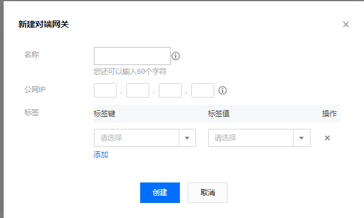
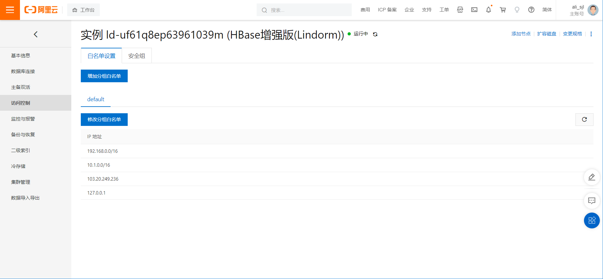
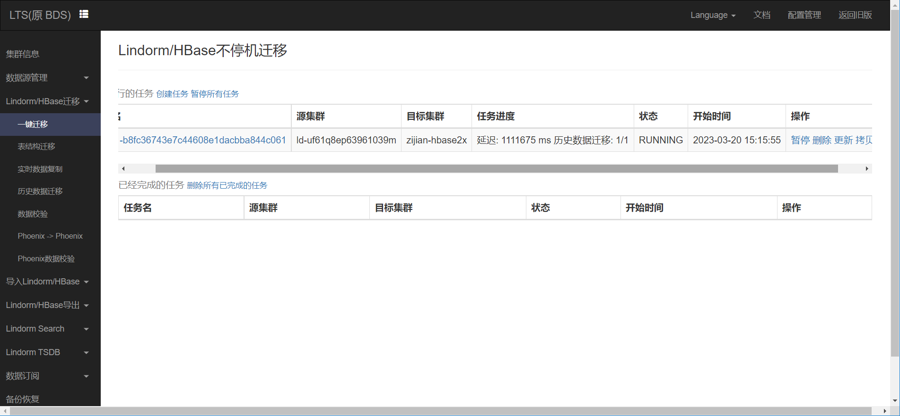

HBase TB 级数据规模不停机迁移最佳实践：https://toutiao.io/posts/knac22o/preview

**前提**

**云数据库HBase增强版（Lindorm）2.0集群信息**

> 阿里云saas数据库Hbase，
>
> 版本2.0增强版（版本lindorm:2.1.15） 
>
> master：8v32g高可用 
>
> core：16v64g，4个节点，本地HDD盘（双副本），单节点实际可用容量22T 
>
> 表数量：89

**EMR-HBase 2.3.0集群信息**

> hdfs-2.8.5
>
> yarn-2.8.5
>
> hbase-1.4.9
>
> zookeeper-3.5.5
>
> knox-1.2.0
>
> ranger-1.2.0

阿里云vpn：106.14.57.193
腾讯云VPN: 101.35.140.123

  *创建之后，vpc内的cvm直接ping 101.35.140.123不通的。忘记测试在腾讯云侧VPC的路由中配置了VPN作为下一跳之后是否能ping通了（我理解应该是可以的）。*


公司公网ip：103.20.249.236


# 1. 创建VPN打通腾讯云VPC - 阿里云VPC

由于阿里云侧的VPN网关只支持包年包月，这不利于测试。所以采用的是**阿里云云企业网 <--> 腾讯云VPN网关**的方式打通两端网络。

整个的网络架构如下图所示：


## 1.1 腾讯云侧


流程：创建VPN网关 > 创建对端网关 > 创建VPN通道，创建一个CVM测试

### 1.1.1 创建VPN网关


创建完成之后，会有一个VPN网关的公网IP（如101.35.140.123），如下图所示


### 1.1.2 配置VPN的路由

**VPN网关需要配置路由表**，目的端填写需要打通的阿里云侧的vpc网段（或子网网段）。


### 1.1.3 创建对端网关



输入对端（IDC或其他云）的VPN网关的公网IP（或者公网IPsec连接的公网IP）。

**注意：需要等到对端创建了VPN网关或者IPsec连接，拿到了公网IP之后才能创建对端网关。**

### 1.1.3 创建VPN通道


**VPN网关类型**选择"私有网络"表示，此VPN网关打通的是本端的VPC到对端。

**协商类型**通常选择"主动协商"

**预共享密钥**需要和对端的IPsec建立时的预共享密钥保持一致。


IKE配置中，需要保证

- **IKE的版本**与对端的IPsec连接中的配置一致
- **加密算法**与对端的IPsec连接中的配置一致
- **认证算法**与对端的IPsec连接中的配置一致
- **协商模式**与对端的IPsec连接中的配置一致
- **DH group**与对端的IPsec连接中的配置一致
- **IKE SA Lifetime**可不用填写，会有默认值


IPsec配置中，需要保证

- **加密算法**与对端的IPsec连接中的配置一致
- **认证算法**与对端的IPsec连接中的配置一致
- **PFS**与对端的IPsec连接中的配置一致
- **IPsec SA生存周期**不用填，会有默认值


创建成功


如上图所示，会显示VPN通道的联通状态，正常为"已联通"，不正常为"未联通"，可以查看"!"获取未联通的原因。

### 1.1.4 创建一个CVM用于ping测试

这个简单就不写了。

### 1.1.5 路由总结

**VPC路由**放通对端VPC的网段，下一跳类型为VPN网关。

**VPN网关路由**放通对端VPC的网段，下一跳类型为VPN通道。

## 1.2 阿里云侧

### 1.2.1 创建用户网关

专有网络 > 用户网关。IP地址处填写对端（如IDC，或其他云）的VPN网关的公网IP。


### 1.2.2 创建IPsec


**绑定资源**为"云企业网"，表示将此IPsec连接绑定到某云企业网（CEN）实例，实际是绑定到某CEN下的转发路由（TR）。

**网关类型**需要选择为"公网"，否则没有分配公网IP则无法实现打通阿里云-腾讯云。


**用户网关**选择为上面创建的对端公网IP的用户网关。

路由模式选择"目的路由模式"。

**立即生效**选择"是"。

**预共享密钥**可以自定义，但是要与腾讯云侧的预共享密钥保持一致。


IKE配置中，需要保证

- **IKE的版本**与腾讯云的VPN通道中的配置一致
- **加密算法**与腾讯云的VPN通道中的配置一致
- **认证算法**与腾讯云的VPN通道中的配置一致
- **协商模式**与腾讯云的VPN通道中的配置一致
- **DH 分组**与腾讯云的VPN通道中的配置一致
- **IKE SA生存周期**可不用填写，会有默认值


IPsec配置中，需要保证

- **加密算法**与对端的IPsec连接中的配置一致
- **认证算法**与对端的IPsec连接中的配置一致
- **DH分组**与腾讯云VPN通道中PFS的配置一致
- **IPsec SA生存周期**不用填，会有默认值

确定购买即可。

如果IPsec和对端还没有打通，则在此处可以看到报错信息。根据报错信息进行调整。


打通后，**连接状态**为"第二阶段协商成功"，应为如下：


### 1.2.3 配置IPsec的路由


目标网段为需要访问的对端的VPC网段，这里就是腾讯云侧的某VPC网段。

### 1.2.4 创建云企业网


只需要确定云企业网实例的名称即可。云企业网负责管理一批转发路由实例（TR）。

### 1.2.5 创建转发路由TR


需要为TR选择一个地址段。

### 1.2.6 创建网络实例连接

基于我们的目的，需要创建两个网络实例连接：

- VPN连接，作用是将IPsec关联到此TR
- VPC连接，作用是将某VPC关联到此TR

然后，就可以实现IPsec和此VPC通过TR来互通。

#### 1.2.6.1 创建VPN网络实例连接

由于上面在创建IPsec的时候已经关联到TR了，所以这里就不用在重复创建了。


若TR关联了IPsec应如下图所示，实例类型为VPN。且可看到关联上的实例的ID。


#### 1.2.6.2 创建VPC网络实例连接


VPC网络实例连接关联到TR之后，应如下图所示。一个为VPN网络实例连接，一个位VPC网络实例连接。


### 1.2.7 创建一个ECS测试

这个简单就不写了。

### 1.2.8 路由总结

最终都配置好之后，阿里云侧的路由分别如下：

#### 1.2.8.1 VPC路由

放通对端VPC的网段，下一条类型为TR。


#### 1.2.8.2 IPsec路由

放通对端VPC的网段，下一跳类型为IPsec连接


#### 1.2.8.3 转发路由器的路由

放通对端VPC，下一跳类型为TR

放通本端VPC，下一跳类型为TR


# 2. 云数据库HBase增强版(Lindorm) 2.0

## 2.1 创建云数据库HBase增强版(Lindorm) 2.0

这个比较简单，就按照提示选择好配置，创建即可。


## 2.2 访问集群管理页面（Lindorm insight）

需要按如下方式配置之后，方可登录集群。

- 已创建云数据库HBase增强版

- 已放通访问Lindorm insight的客户机的ip。**因为后面LTS还会访问云数据库HBase，因此，我也放通了LTS集群所在的网段**。

  

- 已重置过UI访问密码


登录Lindorm insight


## 2.3 hbaseue shell连接

第一步，数据库连接>申请外网地址


第二步，单击"HBaseue Shell下载"

第三步，解压hbaseue shell工具

第四步，修改hbase-site.xml配置（参考：https://help.aliyun.com/document_detail/119572.html），修改如下内容：

```xml
<configuration>        
   <!—    集群的连接地址，在控制台页面的数据库连接界面获得（注意公网地址和VPC内网地址） —>        
<property>       
     <name>hbase.zookeeper.quorum</name>        
     <value>ld-xxxx-proxy-hbaseue.hbaseue.xxx.rds.aliyuncs.com:30020</value>    
</property>    
<!—    设置用户名密码，默认root:root，可根据实际情况调整    —>        
<property>        
     <name>hbase.client.username</name>        
     <value>root</value>   
</property>    
<property>        
     <name>hbase.client.password</name>        
     <value>root</value>   
</property>
</configuration>  
```


第五步，在windows客户机，切换到`hbaseue shell`的根目录，启动hbaseue shell访问云数据库HBase(Lindorm)增强版

```powershell
bin\hbase shell
```

写入测试数据


# 3. LTS（原BDS）

## 3.1 创建LTS


## 3.2 访问LTS的Web UI

访问BDS UI的前提如下：

- 已创建BDS

- 重置UI密码

  在**基本信息**页面进行重置。

  

- 放通客户机的白名单

  


## 3.3 添加数据源

### 3.3.2 添加阿里云的云数据库HBase增强版作为数据源

**注意：需要在云数据库HBase增强版(Lindorm)中的白名单放通LTS的网段**。如10.100.1.0/24


点击确定


表示LTS正在关联这个数据源。需要大概1~2min。


### 3.3.2 添加自建的HBase作为数据源

**需要注意：自建的HBase需要到BDS UI上去添加。**


在BDS UI> 数据源管理，添加数据源


添加自建的HBase


数据源参数模板：

```json
{
  "clusterKey":"xxxzkhost1,xxxzkhost2,xxxzkhost3:2181:/xxxhbase",
  "hbaseDir":"/xxxhbase",
  "hdfsUri":"hdfs://xxxnn1:8020,xxxnn2:8020",
  "extraConf": {
    "hdfsUserName": "hadoop"
  }
}
```


修改数据源参数，需要根据具体集群的配置参数进行调整。

```json
{
  "clusterKey":"10.1.2.3:2181:/hbase-emr-i0alyqz9",
  "hbaseDir":"/hbase",
  "hdfsUri":"hdfs://10.1.2.3:4007",
  "extraConf": {
    "hdfsUserName": "hadoop"
  }
}
```

添加HBase集群的/etc/hosts。需要在自建HBase集群中`cat /etc/hosts`查看，core节点的ip和主机名

```bash
10.1.2.3 10.1.2.3
10.1.2.10 10.1.2.10
10.1.2.16 10.1.2.16
```


## 3.4 创建同步任务

如下图所示。BDS支持如下五种场景，这里我们选择`Lindorm/HBase不停机迁移`。


**注意：需要在目标端的HBase集群的安全组需要放通LTS的网段。**


在`同步/迁移的表`中，可以设置本次迁移任务需要迁移哪些namespace，迁移哪些表。


在`高级配置`中可以进行其他一些设置，如下图所示：


创建任务之后，可以看到任务状态为"RUNNING"，以及数据迁移的进度。

在目标端查看已经迁移过来了。NICE

测试发现。LTS支持：

- 数据的全量迁移

- 数据的增量迁移

- 表结构的全量迁移

- 表结构的增量迁移

  **注意：**

  1. **如果是表的cf发生了改变（增、删），则同步任务会报错，且阻塞后续数据的同步。解决方法：手动在目标端修改表的列族**

  2. **如果是新增了空的namespace，空的表，则同步任务并不会同步，但只要有数据同步了，就会将此新建的namespace，新的表和新的数据同步过来。**

- 阿里云 -> 腾讯云ok

- 腾旭云 -> 阿里云ok


## 3.5 数据校验

在`Lindorm/HBase迁移`中还支持数据校验，这会比对源目两端HBase集群的数据。比对结果如下图所示：


下载比对报告之后，其中内容如下：

```bash
35c5a28be5355839dcdc4163798458e2 B: row=510824118261011173, family=habit, qualifier=01, timestamp=1679297704849, type=4,  T: NULL
35c5a28be5355839dcdc4163798458e2 B: row=510824118261011173, family=habit, qualifier=02, timestamp=1679297704873, type=4,  T: NULL
35c5a28be5355839dcdc4163798458e2 B: row=510824118261011173, family=info, qualifier=name, timestamp=1679297704895, type=4,  T: NULL

```

比对报告中会输出不一致的行。

测试完之后，释放BDS集群。可能会报如下错误。


在释放BDS集群时失败，原因是需要先删除所有的迁移任务才能释放集群。


# 4. 总结

可以通过LTS集群将云数据库HBase增强版（Lindorm）中的表结构、全量数据、增量数据迁移到腾讯云的EMR-HBase。反向迁移也是支持的。

但是，如果增量同步过程中，源端表的列族发生了增删，会导致迁移任务报错。

**云数据库HBase增强版（Lindorm）取消了用户的`snapshot`权限，导致用户无法通过snapshot+replication的方式实现HBase数据的迁移。**


