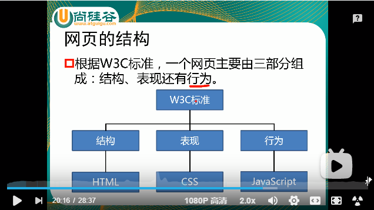
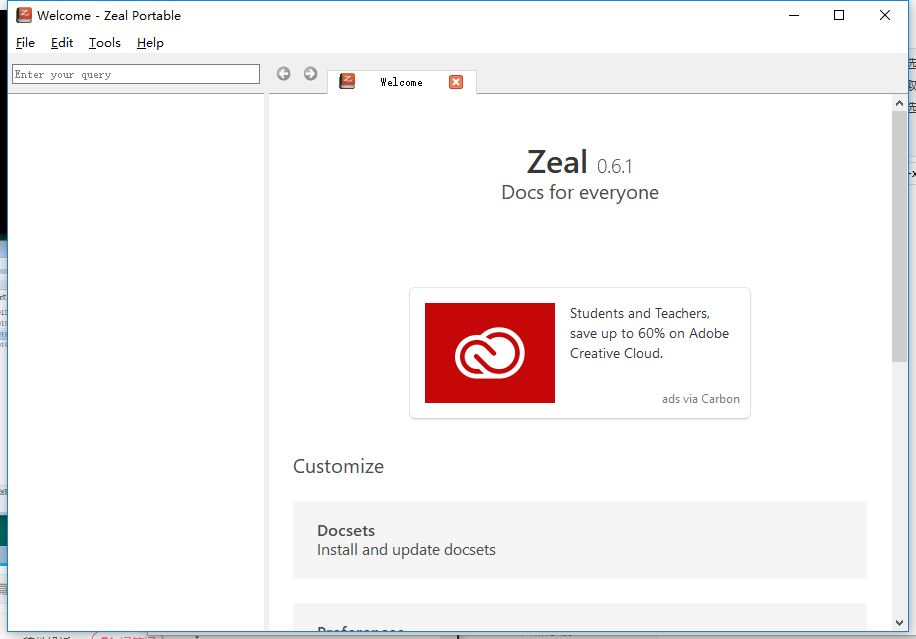
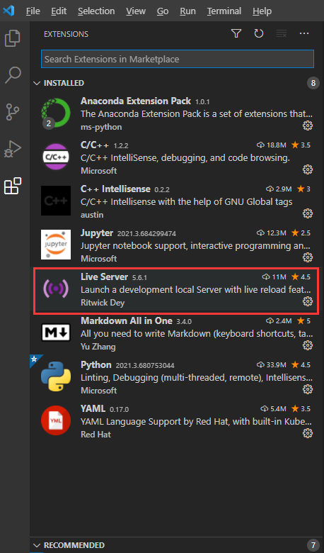
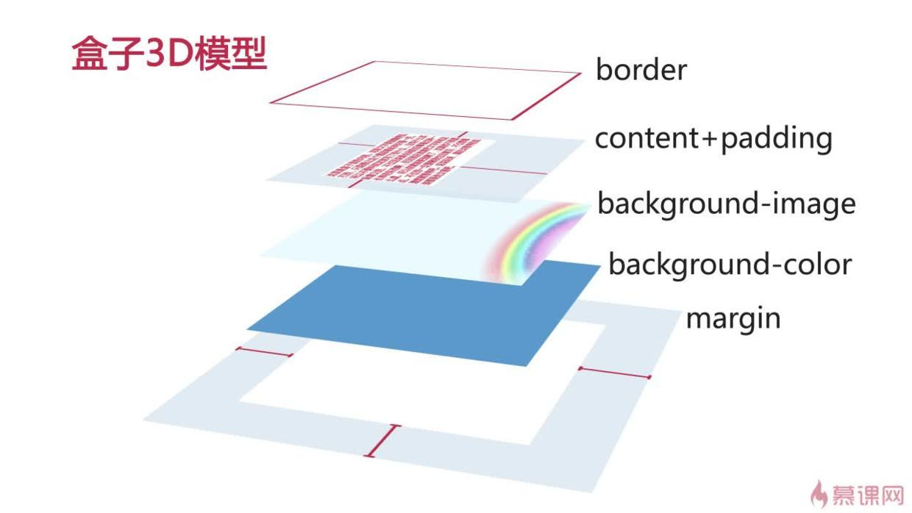

# Web前端HTML5&CSS3初学者零基础入门全套完整版-李立超

## 1. 前言

### 1.1 软件分类

1. 系统软件。 如：Windows，Linux，macOS
2. 应用软件。如：office，QQ，Wechat
3. 游戏软件。如：绝地求生，王者荣耀

C/S架构：Client/Server

B/S架构：Browser/Server，两者没有太大区别。

### 1.2 网页的发展史

蒂姆·伯纳斯·李爵士发明了万维网（World Wide Web）。1994年，伯纳斯李建立了万维网联盟（W3C），制订了网页开发的标准。

浏览器负责渲染网页。

>  根据W3C标准，一个网页主要右三部分组成：结构、表现和行为。



1. HTML用于描述页面的结构。就像人的骨架
2. CSS用于控制页面中元素的样式。就像人血肉，衣服
3. JavaScript用于响应用户操作。就像人的动作、行为

## 2. HTML

HTML（Hypertext Markup Language），超文本标记语言。HTML使用**标签**的形式来标识网页中的不同组成部分。所谓**超文本**指的是超链接，使用超链接可以让我们从一个页面跳转到另一个页面。

### 2.1 HTML的标签格式

主要为成对出现的标签和自结束标签。

```html
<p>
    这是一个段落。
</p>
<input> 这是一个自结束标签
```

### 2.2 HTML的注释

```html
<!-- 这是注释的内容 -->
```

### 2.3 HTML标签的属性

```html
<h1>
    <font color="red" size="3">我是一级标题</font>
</h1>
```

### 2.4 网页的基本结构

doctype 文档声明用来告诉浏览器，当前网页的版本是多少，因为HTML发展到现在有很多个版本，现在是HTML5，因此我们需要告诉浏览器，这个网页是html几的，浏览器才能更好地渲染它，就像在`.py文件的开头写`#!/usr/bin/python3或`#!/usr/bin/env python3`一样的道理（用来指定使用哪个解释器来运行此`.py`脚本）。

```html
<!DOCTYPE html>
<!-- 或者<!doctype html> 在HTML里，标签不区分大小写-->
<html>
    <head>
        <meta charset="utf-8">
        <title>这是网页的标题</title>
    </head>
    <body>
        这是网页的主体
    </body>
</html>
```

实际上在`VS Code`中，直接`!` + `tab`就能直接出来一个标准的html结构。`!5` + `tab`是标准的html5结构。如下所示。

```html
<!DOCTYPE html>
<html lang="en">
<head>
    <meta charset="UTF-8">
    <meta http-equiv="X-UA-Compatible" content="IE=edge">
    <meta name="viewport" content="width=device-width, initial-scale=1.0">
    <title>Document</title>
</head>
<body>
    
</body>
</html>

<!-- html5 -->
<!DOCTYPE html>
<html lang='en'>
<head>
    <meta charset='UTF-8'>
    <meta name='referrer' content='always'>
    <meta name='author' content='sjl'>
    <meta name='robots' content='none'>
    <meta name='keywords' content=''>
    <meta name='description' content=''>
    <meta name='renderer' content='webkit'>
    <meta name='revisit-after' content='7 days' >
    <meta http-equiv=widow-target Content=_top>
    <meta name='viewport' content='width=device-width, initial-scale=1,maximum-scale=1,minimum-scale=1,user-scalable=no, shrink-to-fit=no' viewport-fit=cover />
    <meta http-equiv='X-UA-Compatible' content='ie=edge,chrome=1'>
    <title></title>
    <style>
         *{
            margin:0;
            padding:0;
            box-sizing:border-box;
            -webkit-tap-highlight-color:transparent;
        }
    </style>
</head>
<body>
    
</body></html>
```

> 

### 2.5 离线文档查看器zeal

直接百度zeal，进入官网下载即可。运行之后的界面如下所示。点击`Docsets`,等待刷新出来文档，然后下载之后，即可离线使用了。



### 2.6 安装`VS Code`

使用VS Code作为ide编写代码。可以根据自己的需求安装一些插件，如：

1. chinese Language的插件，让界面变为中文。
2. live server插件，能够实时刷新html的变化。本地启动一个服务，用于加载html。



### 2.7 HTML中的实体

在网页中编写的多个空格，默认情况下会自动被浏览器解析为1个空格。在HTML中，有些时候我们不能直接书写一些特殊符号（如：连续的空格，字母两侧的大于号和小于号。这种情况下就需要用到html中的实体了（相当于其他语言中的转义字符）。

```html
实体的语法：
	&实体的名字, 例如：
	&nbsp; 表示 一个空格
	&gt; 表示 大鱼号
	&lt; 表示 小于号
	&copy; 表示 版权符号
	......
```

### 2.8 `<meta>`标签

主要作用为：

1. 声明html的编码
2. 声明html的一些元数据，如keywords，description等
3. 进行网页重定向。

```html
<!-- html5 -->
<!DOCTYPE html>
<html lang='en'>
<head>
    <meta charset='UTF-8'>
    <meta name='referrer' content='always'>
    <meta name='author' content='sjl'>
    <meta name='robots' content='none'>
    <meta name='keywords' content=''>
    <meta name='description' content=''>
    <meta name='renderer' content='webkit'>
    <meta name='revisit-after' content='7 days' >
    <meta http-equiv=widow-target Content=_top>
    <meta name='viewport' content='width=device-width, initial-scale=1,maximum-scale=1,minimum-scale=1,user-scalable=no, shrink-to-fit=no' viewport-fit=cover />
    <meta http-equiv='X-UA-Compatible' content='ie=edge,chrome=1'>
    <title></title>
    <style>
         *{
            margin:0;
            padding:0;
            box-sizing:border-box;
            -webkit-tap-highlight-color:transparent;
        }
    </style>
</head>
<body>
    
</body></html>
```

> 上面的一堆<meta>标签，设置了许多元数据，name的为元数据的键，content的为元数据的值。

```html
<meta http-equiv="refresh" content="3;url=https://www.mozilla.org"
<!-- 页面定向到指定url -->
```

> 上面这个表示页面在3秒后重定向到`https://www.mozilla.org`

### 2.9 语义化标签

> 即，**我们要关注的是html标签表达的含义（即语义），而不是所展现的样式**。重要的事情说三遍，关注标签的语义！关注标签的语义！关注标签的语义！

1. 块元素。在页面中独占一行的元素被称为**块元素（block element）**。如：`<h1></h1>`, `<p></p>`, `<blockquote></blockquote>`, `<div></div>`等。
2. 行内元素。在页面中不会独占一行的元素称为**行内元素（inline element）**。如：`<em></em>`, `<q></q>`, `<span></span>`, `<a></a>`等。


> 浏览器会对不符合规范的html写法进行修正，如：将标签写在了`<html></html>`标签之外，通过F12查看html在内存中的样子，可以看到，浏览器将之放到了`<html></html>`里面了。

`<div></div>`没有语义，就是用来表示一个区块。

`<span></span>`没有语义，就是用来表示网页中的文字。


### 2.10 html列表

在html中列表分为三种：

1. 有序列表。

   ```html
   <ol>
       <li></li>
       <li></li>
   </ol>
   ```

   

2. 无序列表。

   ```html
   <ul>
       <li></li>
       <li></li>
   </ul>
   ```

   

3. 定义列表

   ```html
   <dl>
       <dt></dt>
       <dd></dd>
       <dd></dd>
   </dl>
   ```

   

**需要注意的是，列表之间是可以相互嵌套的。**


### 2.11 html超链接

超链接可以让我们从一个页面跳转到其他页面，或当前页面的其他位置。

```html
<!-- 往外部页面跳转 -->
<a href="https://www.baidu.com">跳转到百度</a>

<!-- 往内部页面跳转 -->
<a href="/path/to/local/xx.html">跳转到xx页面</a>

<!-- 往当前页面其他位置跳转 -->
<a href="#">回到本页面的顶部</a>

<!-- 往当前页面其他位置跳转，
	根据标签的id或class来定位去到哪个位置
-->
<a href="#x-element-id">回到本页面的任意位置</a>

<!-- 在开发过程中，
使用#作为超链接的占位符，或
使用javascript:;作为超链接的占位符
-->
<a href="#">还没确定跳转到哪儿的超链接</a>
<a href="javascript:;">还没确定跳转到哪儿的超链接</a>

<!-- 在当前的页面打开超链接，
	target的默认值为_self，在当前页面打开超链接
-->
<a href="/path/to/local/xx.html" target="_self">跳转到xx页面</a>

<!-- 在一个新的页面打开超链接 -->
<a href="/path/to/local/xx.html" target="_blank">跳转到xx页面</a>
```


### 2.12 图片标签

``是图片标签，是一个自结束标签，img这种元素属于替换元素（块和行内元素之间，具有两种元素的特点）。

```html
<!-- 引入外部图片 -->


<!-- 引入本地图片 -->

```

> 搜索引擎会根据alt中的内容来识别图片。


图片格式

> jpeg(jpg)
>
> ​	支持的颜色比较吩咐，不支持透明效果，不支持动图
>
> ​	一般用来显示照片
>
> gif
>
> ​	支持的颜色比较少，支持简单透明，支持动图
>
> ​	颜色单一的图片，动图
>
> png
>
> ​	支持的颜色丰富，支持复杂透明，不支持动图
>
> ​	颜色丰富，复杂透明图片（转为页面而生）
>
> webp
>
> ​	这种格式是谷歌推出的专门用来表示网页中的图片的一种格式
>
> ​	它具备其他图片格式的所有优点，而且文件还特别的小。
>
> ​	缺点是，兼容性不好。
>
> base64
>
> ​	将图片使用base64编码，这样可以将图片转换为字符，通过字符的形式来引入图片
>
> ​	一般都是一些需要和网页一起加载的图片才会使用base64
>
> ​	可以在用`图片转base64`的工具，将图片转换为base64，然后在img标签的src属性中引入，来查看效果。
>
> 效果一样，用小的。
>
> 洗过不一样，用效果好的。

### 2.13 内联框架

内联框架用于向当前页面引入一个其他页面，

> src 指定要引入的网页的路径
>
> frameborder 指定内联框架是否有边框，0为没有，1为有

```html
<iframe src="https://www.qq.com" width="800" height="600" frameborder="0">
   
</iframe>
```


### 2.14 音视频标签

>  audio标签用来向页面中引入一个音频文件
>
>  音频文件引入时，默认情况下不允许用户自己控制播放/停止
>
>  属性：
>
>  ​	controls 是否允许用户控制播放
>
>  ​	autoplay 音频文件是否自动播放，如果设置了aotuplay，则音乐在打开页面时会自动播放，但是目前来讲大部分浏览器都不会自动对音乐进行播放。
>
>  ​	loop 是否循环播放此音乐。

```html
<audio src="./source/audio.mp3" controls autoplay loop></audio>

<！-- 对支持的浏览器就显示音频播放，对不支持的浏览器显示文本，提升用户体验 -->
<audio contols>
    对不起，您的浏览器不支持播放音频！请升级浏览器！
	<source src="./source/audio.mp3">
</audio>
```


> video 标签用来向页面中引入一个视频文件，使用方式与audio是一样的。

```html
<video contols>
	<source src="./source/flower.webm">
    <source src="./source/flower.mp4">
    <embed src="./source/flower.mp4" type="video/mp4">
</video>
```

### 2.15 表格

通过`<table>`标签来创建一个表格。

基本格式

```html
<table border="1" width="50%" align="center">
    <!-- 在table中，使用tr来表示表格中的一行，有几个tr就有几行 -->
    <tr>
        <!-- 在table中，使用td来表示一个单元格，有几个td就有几个单元格 -->
    	<td>A1</td>
        <td>B1</td>
        <td>C1</td>
        <td>D1</td>
    </tr>
    <tr>
    	<td>A2</td>
        <td>B2</td>
        <td>C2</td>
        <!-- rowspan 纵向合并单元格 -->
        <td rowspan="2">D2</td>
    </tr>
    <tr>
    	<td>A3</td>
        <td>B3</td>
        <td>C3</td>
    </tr>
    <tr>
    	<td>A4</td>
        <td>B4</td>
        <!-- colspan 横向合并单元格 -->
        <td colspan="2">C4</td>
    </tr>
</table>
```

**长表格**

可以将一个表格分为是三个部分：

```html

	<!-- 头部 -->
	<thead>
		<tr>
            <td></td>
        </tr>
	</thead>
	<!-- 主体 -->
	<tbody>
		<tr>
            <td></td>
        </tr>
	</tbody>
	<!-- 底部 --> 
	<tfoot>
		<tr>
            <td></td>
        </tr>
	</tfoot>
```

**表格的样式**

pass

### 2.16 表单

> 表单：
>
> - 在现实生活中表单用于提交数据
> - 在网页中也可以使用表单，网页中的表单用于将本地的数据提交给服务器
> - 使用form标签来创建一个表单

```html
<form action="target.html">
     <!-- 文本框，autocomplete on 自动补全开启 -->
    <input type="text" name="username" autocomplete="on">
     <!-- 密码框 -->
    <input type="password" name="password">
    <!-- 单选框，checked指定默认选择的单选框 -->
    <input type="radio" name="hello" value="a">
    <input type="radio" name="hell0" value="b" checked>
    <!-- 多选框，checked指定默认选择的多选框 -->
    <input type="checkbox" name="test" value="1">    
    <input type="checkbox" name="test" value="2">
	<input type="checkbox" name="test" value="3" checked>
     <!-- 下拉框 -->
	<select name="haha">
        <option value="i">选项一</option>
        <option value="ii">选项二</option>
        <option value="iii" selected>选项三</option>
        <option value="iiii">选项四</option>
    </select>
     <!-- 表单提交 -->
    <input type="submit" value="登录">
     <!-- 重置按钮 -->
    <input type="reset">
     <!-- 普通按钮 -->
    <input type="button" value="我是按钮">
     <!-- 选择颜色 -->
    <input type="color">
    <input type="email">
</form>
```

还有很多input标签，具体请上zeal的html文档中查看。


## 3. CSS

CSS，英文全称：Cascading Style Sheets，中文名为层叠样式表。网页实际上一个多层结构（可以看做三维结构），通过CSS可以分别为网页的每一层来设置样式，而最终我们能看到的只是网页最上边一层。

总之一句话，CSS是用来设置网页中元素的样式的。

使用CSS修改元素样式有三种方式：

1. **内联样式或行内样式。**在标签内部通过style属性来设置元素的样式。

   ```html
   <p stype="color: red; font-size: 60px;">
       少壮不努力，老大徒伤悲
   </p>
   ```

   缺点：样式只能对一个标签生效。而且这样将HTML和CSS紧密耦合在一起了，十分不便。

   注意：开发时绝对不要使用内联样式。

2. **内部样式表。**将样式编写到`<head>`中的`<style>`标签里。

   ```html
   <head>
       <style>
           p {
               color: red;
               font-size: 60px;
           }
       </style>
   </head>
   ```

   通过CSS的选择器来选中元素并为其设置各种样式，

   优点：方便在此HTML页面中重复使用。缺点是无法在其它HTML页面中复用。

3. **外部样式表。**将CSS编写在一个外部的.css文件中，然后通过`<head>`标签中的`<link>`标签来引入外部的css文件。可以在不同的HTML页面中复用。

   ```html
   <link rel="stylesheet" src="">
   ```

   

### 3.1 CSS的注释

在CSS中注释为`/* */`。

### 3.2 CSS的基本语法

**选择器**：通过选择器可以选中页面中的指定元素，比如`p`的作用就是选中页面中的所有`p`元素。

**声明块**：通过声明块来指定要为元素设置的样式，声明块由一个个的声明组成。键值对结构，键和值之间通过`:`分隔，以`;`结尾。


#### 3.2.1 选择器

1. 元素选择器

   > 作用：根据标签名来选中指定的元素
   >
   > 语法：标签名{}
   >
   > 例子：p{} h1{} div{}

2. id选择器

   > 作用：根据元素的id属性值选中一个元素
   >
   > 语法：#id属性值{}
   >
   > 例子：#box{} # red{}

3. 类选择器

   > 作用：根据元素的class属性值选中一个元素
   >
   > 语法：.class属性值{}
   >
   > 例子：.myclass{}

   可以为一个元素指定多个class，使用空格隔开。

4. 通配选择其器

   > 作用：选中页面中的所有元素
   >
   > 语法：*

5. 复合选择器

   > 交集选择器
   >
   > <br>
   >
   > 作用：选中同时符合多个条件的元素
   >
   > 语法：选择器1选择器2选择器3{}
   >
   > 注意点：交集选择器中如果有元素选择器，则必须使用元素选择器开头。
   >
   > <br>
   >
   > 并集选择器(选择器分组)
   >
   > <br>
   >
   > 作用：同时选择多个选择器对应的元素
   >
   > 语法：选择器1, 选择器2, 选择器3{}

6. 关系选择器

   > 子元素选择器
   >
   > <br>
   >
   > 作用：选中指定父元素的子元素
   >
   > 语法：父元素 > 子元素
   >
   > 例子： div.box > span {}
   >
   > 后代元素选择器
   >
   > <br>
   >
   > 作用：选择指定祖先元素的后代元素
   >
   > 语法： 祖先 后代
   >
   > 例子：div span {}
   >
   > 选择下一个兄弟元素：div + span {}
   >
   > 选择下边所有兄弟元素：div ~ span {}

7. 属性选择器

   > 作用：
   >
   > 语法：
   >
   > ​	[属性名] 选择含有指定属性的元素
   >
   > ​	[属性名=x] 选择指定属性值为x的元素
   >
   > ​	[属性名^=x] 选择指定属性值以x开头的元素
   >
   > ​	[属性名$=x] 选择指定属性值以x结尾的元素
   >
   > ​	[属性名*=x] 选择指定属性值包含x的元素
   >
   > 例子：

8. 伪类选择器 pseudo selector

   > 即不存在的类，特别的类
   >
   > **伪类用来描述一个元素的特殊状态**，比如：第一个子元素、被点击的元素、鼠标移入的元素。。。
   >
   > 伪类一般情况下都是使用 `:`开头
   >
   > ​	:first-child 第一个子元素
   >
   > ​	:last-child 最后一个子元素
   >
   > ​	:nth-child() 选中第n个子元素
   >
   > ​		特殊值：n 所有子元素
   >
   > ​						2n或even 表示选中偶数位的元素
   >
   > ​						2n+1或odd 表示选中奇数位的元素
   >
   > ​		以上这些伪类选择器都是根据所有的子元素进行排序
   >
   > ​	:first-of-type
   >
   > ​	:last-of-type
   >
   > ​	:nth-of-type()
   >
   > ​		这几个伪类的功能和上述的类似，不同点是她们是在同类型元素中进行排序
   >
   > ​	:not() 否定伪类
   >
   > ​		将符合条件的元素从选择器中去除

   **超链接的伪类**

   ```html
   <style>
       /* :link 用来表示没访问过的链接*/
       a:link {
           color: red;
       }
       /* 由于隐私的原因，:visited这个伪类只能修改链接的颜色*/
       a:visited {
           color: orange;
       }
       /* 表示鼠标移入的状态 */
       a:hover {
           color: aqua;
           font-size: 50px;
       }
       /* 表示鼠标点击 */
       a:active {
           color: yellowgreen;
       }
   </style>
   
   <a href="https://www.baidu.com">访问过的链接</a>
   <a href="https://www.qq.com">未访问过的链接</a>
   ```


#### 3.2.2 伪元素

> 伪元素，表示页面中一些特殊的并不真实存在的元素（特殊的位置）
>
> ​	伪元素使用 `::` 开头	
>
> ​	::first-letter 表示第一个字符
>
> ​	::first-line 表示第一行
>
> ​	::selection 表示选中的内容
>
> ​	::brefore 表示元素的开始
>
> ​	::after 表示元素的最后
>
> ​		::before 和 ::after必须结合content属性来使用
>
> ​		例子， p::before {content: 'abc'; color:red;}。。。效果是在p标签的最前面添加字符串'abc'且字体颜色为红色。


[选择器餐厅练习](https://flukeout.github.io/)


### 3.3 样式的继承

样式的继承，我们为一个元素设置的样式同时也会应用到它的后代元素上。

继承是发生在祖先和后代之间的

继承的设计是为了方便我们的开发，利用继承我们可以将一些通用的样式统一设置到共同的祖先元素上，这样只需要设置一次即可让所有的元素都具有该元素。

**注意：并不是所有的样式都会被继承，比如：背景相关的，布局相关等的样式都不会被继承。**

举个例子：

```html
<style>
    p{
        color: red;
    }
</style>

<p>
    我是一个p元素
    <span>我是p元素中的span</span>
</p>
```


### 3.4 选择器的权重

**样式的冲突**：当我们通过不同的选择器，选中相同的元素，并且为相同的样式设置不同的值时，此时就发生了样式冲突。

发生样式冲突时，应用哪个样式由选择器的权重（优先级）决定。

举个例子：

```html
<style>
    #box1{
        color: orange;
    }
    div#box1{
        color: skyblue;
    }
    div{
        color: yellow;
    }
    .red{
        color: red;
    }
</style>

<div id="box1" class="red">
    我是一个div
</div>
```

> 选择器的权重：
>
> ​	内联样式 1000
>
> ​	id选择器 100
>
> ​	类和伪类选择器 10
>
> ​	元素选择器 1
>
> ​	通配选择器 0
>
> ​	继承的样式 没有优先级
>
> <br>
>
> 比较元素优先级时，需要将所有的选择器的优先级进行相加计算，最后优先级越高，则越优先显示（分组选择器是单独计算的），选择器的累加不会超过其最大的数量级，即类选择器再高也不会超过id选择器。
>
> 如果优先级计算后相同，则优先使用最新定义的样式。

可以说，选择器越具体，则优先级越高。

**注意：可以在某一个样式的后边添加`!important`，则此时该样式会获取到最高的优先级，甚至超过内联样式的优先级。一般情况不要使用。**

### 3.5 像素和百分比

长度单位

> ​	像素 px：
>
> ​		屏幕（显示器）实际上是由一个一个的小正方形构成的
>
> ​		不同屏幕的像素大小是不同的，像素越小的屏幕显示的效果越清晰		所以同样的200px在不同的设备下的显示效果是不一样的
>
> <br>
>
> ​	百分比：
>
> ​		将属性值设置为相对于其父元素属性的百分比。
>
> ​		设置百分比可以使子元素跟随父元素的改变而改变
>
> <br>
>
> ​	em：
>
> ​		em是相对于当前元素的字体大小来计算的
>
> ​		1em = 1font-size
>
> ​		em会根据字体大小的改变而改变
>
> <br>
>
> ​	rem：
>
> ​		rem是相对于根元素（即，`<html>`标签的字体大小来计算。
>
> ​	

**注意点，CSS像素和物理像素的关系**

> 像素
>
> 	- 屏幕是由一个个发光的小点构成的， 这一个个的小点就是像素
> 	- 分辨率：1920 x 1080 说的就是屏幕中小点的数量
> 	- 在前端开发中像素要分成两种情况讨论：CSS像素和物理像素
> 	- 物理像素，上述所说的小点点就是物理像素
>  - CSS像素，在编写网页时，我们所用像素都是CSS像素
>    	- 浏览器在显式网页时，需要将CSS像素转换为物理像素，然后再呈现
>     - 一个CSS像素最终由几个物理像素显示，由浏览器决定：
>       	- 默认情况下在pc端，一个CSS像素 == 一个物理像素
>
> <br>
>
> 视口(viewport)
>
> 	- 视口就是屏幕中用来显示网页的区域
> 	- 可以通过查看视口的大小，来观察CSS像素和物理像素的比值
>  - 默认情况下
>     - 视口宽度1920p（CSS像素），1920px（物理像素），此时1:1
>     - 放大两倍的情况下：
>        - 视口宽度960px（CSS像素），1920px（物理像素），此时1:2
>    - 我们可以通过改变视口的大小，来改变像素和物理像素的比值。

**移动端的像素**

> 在不同的屏幕中，单位像素的大小是不同的，像素越小屏幕会越清晰
>
> ​	24寸 1920 x 1080
>
> ​	iphone6 4.7寸 750 x 1334
>
> ​	https://material.io/resources/devices/
>
> ​	智能手机的像素点远远小于计算机的像素点
>
> ​	**问题：一个宽度为900px的网页在iphone6中要如何显示？**
>
> ​		网页的900px说的是CSS像素，而iphone6的750px是物理像素，因此，需要看iphone6的视口大小是多少，就能知道在iphone6中CSS像素和物理像素的比值了。
>
> ​		默认情况下，移动端的网页都是将视口设置为980px（CSS像素）。以确保pc端的网页可以在移动端正常浏览，但是如果网页的宽度超过了980px，移动端的浏览器会自动对网页缩放以完整显示网页。所以，基本大部分的pc端网站都可以在移动端中正常浏览，但是往往都不会有一个好的体验。为了解决这个问题，大部分网站都会专门为移动端设计网页。


**完美视口**

> 移动端默认的视口大小是980px（CSS像素），
>
> 	- 默认情况下，移动端的像素比就是980/移动端宽度，如（iphone6是980/750）
> 	- 如果我们直接在网页中编写移动端代码，这样在980的视口下，像素比是非常不好的，导致网页中的内容在移动端看，会变得非常小。
> 	- 编写移动页面时，必须要确保有一个比较合理的像素比。
> 	- 可以通过meta标签来设置视口大小
>  - 每一款移动设备设计时，都会有一个最佳的像素比
>    	- 一般我们只需要将像素比设置为该值，即可得到一个最佳效果
>    	- 将像素比设置为最佳像素比的视口大小我们称其为完美视口
>    	- 但是，**不同的移动设备的完美视口是不一样**，所以不能直接写死meta标签，而应该是`<meta name="viewport" content="width=device-width, initial-scale=1.0">`

**vm**

> 不同设备的完美视口大小是不一样的
>
> ​	iphone6 375
>
> ​	ipone6plus 414
>
> 由于不同设备视口和像素比不同，所以同样的375px在不同的设备下意义是不一样的，比如在iphone6中 375px是全屏，而在ipone6plus中375就会缺一块
>
> 所以在移动端开发时，就不能再用px来进行布局了
>
> vm表示的是视口的宽度（viewport width）
>
> 	-	100vm  = 一个视口的宽度
> 	-	1vm = 1%视口宽度
> 	-	vm这个单位永远相当于视口宽度进行计算
> 	-	

### 3.6 RGB值

颜色单位

> 颜色名：
>
> ​	在CSS中可以直接使用颜色名来设置各种颜色，如：red、orange、green、blue、。。。
>
> ​	但颜色不太方便，因此常用RGB值来表示颜色。
>
> <br>
>
> RGB值：
>
> ​	RGB通过三种颜色的不同浓度来表示颜色
>
> ​	R-red，G-green，B-blue
>
> ​	每一种颜色的范围在 0 - 255
>
> ​	语法：RGB(红色，绿色，蓝色)
>
> <br>
>
> RGBA：
>
> ​	就是在RGB的基础上增加了一个a表示不透明度
>
> ​	需要四个值，前三个和RGB一样，第四个表示不透明度
>
> ​		1表示完全不透明， 0表示完全透明，.5表示半透明
>
> <br>
>
> 十六进制的RGB值：
>
> ​	语法：#红色绿色蓝色
>
> ​	颜色浓度通过 00-ff
>
> ​	如果颜色两位两位重复可以进行简写，如#aabbcc --> #abc
>
> <br>
>
> HSL值 HSLA值
>
> ​	H 表示色相，即什么色儿的，（0 - 360）
>
> ​	S表示饱和度，颜色的浓度，（0% - 100%）
>
> ​	L表示亮度，颜色的亮度，（0% - 100%）
>
> ​	A表示不透明度，（0% - 100%）


### 3.7 布局

#### 3.7.1 文档流

> 文档流（normal flow），
>
> - 网页是一个多层结构，一层摞这一层，
>
> - 通过CSS可以分别为每一层来设置样式，作为用户来讲只能看到最顶上的一层，
>
> - 这些层中，最底下的一层称为文档流，文档流是网页的基础，我们所创建的元素默认都是在文档流中进行排列的。
>
> - 对于我们来讲，元素主要有两个状态：在文档流中和不在文档流中（脱离文档流）
>
> 文档元素在文档流中有什么特点：
>
>  - 块元素
>    - 块元素默认会在页面中独占一行
>      - 默认宽度是父元素的全部（会把父元素撑满）
>       - 默认高度是被内容（子元素）撑开
> - 行内元素
>   - 行内元素不会独占页面的一行，只占自身的大小
>   - 行内元素在页面中从左向右水平排列，如果一行之中不能容纳下所有元素，则会换到第二行继续从左向右排列。
>   - 行内元素的默认宽度和高度都是被内容撑开的。

#### 3.7.2 盒子模型（重点嗷）

盒模型，盒子模型，框模型（box model）



> 盒子模型：
>
> - CSS将页面中的所有元素都设置为了一个矩形的盒子
>
> - 将元素设置为矩形的盒子后，对页面的布局就变成将不同的盒子拜访到不同的位置
>
> - 每个盒子都由以下几个部分组成：
>
>   - 内容区（content），元素中的所有的子元素和文本内容都在内容区中排列。	
>
>     - 内容区的大小由width和height两个属性来设置。
>
>   - 内边距（padding），内容区和边框之间的距离
>
>     - 一共有四个方向的内边距：
>       - padding-top
>       - padding-right
>       - padding-bottom
>       - padding-left
>     - 内边距的设置会影响到盒子的大小
>     - 背景颜色会延伸到内边距上
>     - 简写方式，padding: 10px 20px 30px 40px，上右下左
>
>   - 边框（border），边框属于盒子的边缘，边框里边属于盒子内部，边框外部属于盒子的外部，边框的大小会影响整个盒子的大小。
>
>     - 边框的宽度，border-width，可以用来指定四个方向的边框的宽度，上右下左
>     - 边框的颜色，border-color，可以用来指定四个方向的边框的颜色，上右下左
>     - 边框的样式，border-style，要用边框必须要设置，solid/dotted/dashed/double，上右下左
>     - 简写方式，border: solid 10px orange;
>
>   - 外边距（margin），盒子与其他盒子之间的间距
>
>     - 外边距不会影响盒子可见框的大小
>     - 但是外边距会影响盒子的位置
>     - 一共有四个方向的外边距：
>       - margin-top
>       - margin-right
>       - margin-bottom
>       - margin-left
>     - 简写方式，margin: 10px 20px 30px 40px，上右下左
>
>     

一个盒子的可见框的大小，由内容区，内边距和边框共同决定，所以在计算盒子大小的时候，需要将这三个区域加到一起。


##### 3.7.2.1 盒子的水平布局

元素的水平方向的布局

> - 元素在其父元素中水平方向的位置由以下几个属性共同决定：
>   - margin-left
>   - border-left
>   - padding-left
>   - width
>   - padding-right
>   - border-right
>   - margin-right
> - 一个元素在其父元素中，水平布局必须满足以下等式：
> - margin-left + border-left + padding-left + width + padding-right + border-right + marin-right = 其父元素内容区的宽度
> - 如果以上等式不成立，则称为**过度约束**，则浏览器会自动调整，以满足该等式。
>   - 如果这7个值没有为auto的情况，则浏览器会自动调整**margin-right**以使得等式成立。
>   - 这7个值中有三个值可以设置为auto：width，margin-left，margin-right。

##### 3.7.2.2 盒子的垂直布局

元素的垂直方向的布局

> 默认情况下父元素的高度被内容（子元素）撑开。
>
> 子元素是在父元素的内容区中排列的，如果子元素的大小超过了父元素，则子元素会从父元素中溢出。使用overflow属性来设置父元素如何处理溢出的子元素。
>
>  - 可选值：
>     - visible。默认值，子元素从父元素中溢出，在父元素外部显示
>     - hidden。溢出内容会被裁剪而不显示。
>     - scroll。生成两个滚动条，通过滚动条来查看完整内容。
>     - auto。根据需要生成滚动条。

垂直外边距的重叠（折叠）

> - 相邻的垂直方向外边距会发生重叠（折叠）
> - 兄弟元素，外边距都为正，外边距都为负，外边距一正一负
> - 父子元素，父子元素间相邻外边距，子元素的会传递给父元素(上外边距)


##### 3.7.2.3 行内元素的盒模型

> 行内元素的盒模型
>
>  - 行内元素不支持设置宽度和高度（即内容区）
>  - 行内元素可以设置padding，垂直方向的padding不会影响布局
>  - 行内元素可以设置border，垂直方向的border不会影响布局
>  - 行内元素可以设置margin，垂直方向的margin不会影响布局

##### 3.7.2.4 display属性和visibility属性设置元素类型和状态

> display 属性用来设置元素显示的类型（如：行内元素还是块元素）
>
> 可选值：
>
>  - inline， 将元素设置为行内元素
>  - block， 将元素设置为块元素
>  - inline-block， 将元素设置为行内块元素，即可以设置宽高，又不会独占一行
>  - table， 将元素设置为一个表格
>  - none， 元素不在页面中显示
>
> <br>
>
> visibility 属性用来设置元素的显示状态，是否可见
>
> 可选值：
>
>  - visible，默认值，元素在页面中正常显示
>  - hidden，元素在页面中隐藏，即不显示，但是依然占据页面的位置

##### 3.7.2.5 盒子的大小

默认情况下，盒子可见框的大小由内容区、内边距和边框共同决定。

> box-sizing，用来设置盒子尺寸的计算方式（设置width和height的作用）
>
> 可选值：
>
>  - content-box，默认值，宽度和高度用来设置内容区的大小
>  - border-box，宽度和高度用来设置整个盒子可见框的大小，即width/height为内容区、内边距和边框的总大小。

##### 3.7.2.6 轮廓，阴影和圆角

> 轮廓
>
> ​	outline，用来设置元素的轮廓线，用法和border一样，与边框的不同之处是，轮廓不会影响到可见框的大小。
>
> <br>
>
> 阴影
>
> ​	box-shadow，用来设置元素的阴影效果，阴影不会影响到页面的布局
>
>   -	第一个值，水平偏移量，设置阴影的水平位置
>   -	第二个值，垂直偏移量，设置阴影的垂直位置
>   -	第三个值，阴影的模糊半径，
>   -	第四个值，阴影的颜色，
>
> ​	例子：box-shadow: 20px 10px 50px red;
>
> <br>
>
> 圆角
>
> ​	border-radius，用来设置圆角，设置圆的半径大小。
>
> 

#### 3.7.3 浏览器的默认样式

> 默认样式
>
>  - 通常情况，浏览器都会为元素设置一些默认样式
>  - 默认样式的存在会影响到页面的布局
>     - 通常情况下编写网页时，必须要去除浏览器的默认样式（PC端的页面）

去除页面中所有默认样式

```html
* {
	margin: 0px;
	padding: 0px;
}
```

**网上有专门的去除浏览器样式的.css文件，通过`<link>`标签引入即可，方便复用，在真正开发中常用此种方式。**

https://meyerweb.com/eric/tools/css/reset/

https://github.com/sindresorhus/modern-normalize


#### 3.7.4 浮动

通过浮动，可以使一个元素向其父元素的左侧或右侧移动，使用`float`属性来设置元素的浮动。

> float的可选值：
>
>  - none，默认值，元素不浮动
>  - left，元素向左浮动，
>  - right，元素向右浮动，
>
> **注意：元素设置浮动后，水平布局的等式便不需要强制成立！元素设置浮动后，会完全从文档流中脱离，不再占用文档流的位置，所以元素下边的还在文档流中的元素会自动向上移动。**
>
> 浮动的特点：
>
>  - 浮动元素会完全脱离文档流，不再占据文档流中的位置
>  - 设置浮动以后元素会向父元素的左侧或右侧移动，
>  - 浮动元素默认不会从父元素中溢出
>  - 浮动元素向左或向右移动时，不会超过它前面的其他浮动元素
>  - 如果浮动元素的上边是一个没有浮动的块元素，则浮动元素无法上移
>  - 浮动元素不会超过它上边的浮动的兄弟元素，最多就是和它一样高。
>  - 浮动元素不会盖住文字，文字会自动环绕在浮动元素的周围，所以我们可以利用浮动来设置文字环绕图片的效果。
>
> 脱离文档流的特点：
>
>  - 块元素
>     - 块元素不再独占一行
>     - 脱离文档流之后，块元素的宽度和高度默认都被内容撑开，
> - 行内元素：
>   - 行内元素脱离文档流之后会变成块元素，特点和块元素一样，只是不独占一行。
> - 脱离文档流之后，不需要再区分块和行内了。


##### 3.7.4.1 高度塌陷

高度塌陷问题

> 在浮动布局中，父元素的高度默认是子元素撑开的，当子元素浮动后，其会完全脱离文档流，子元素从文档六中脱离，将会无法撑起父元素的高度，导致父元素的高度丢失。
>
> 父元素高度丢失后，其下的元素会自动上移，导致页面布局混乱，所以高度塌陷是浮动布局中比较常见的一个问题，这个问题我们必须要进行处理。


BFC（Block Formatting Context）块级格式化环境，BFC是一个CSS中的隐含属性，可以为一个元素开启BFC。开启BFC后该元素变为一个独立的布局区域。

> 元素开启BFC后的特点：
>
>  - 开启BFC的元素不会被浮动元素所覆盖
>  - 开启BFC的元素，子元素和父元素外边距不会重叠
>  - 开启BFC的元素，可以包含浮动的子元素
>
> <br>
>
> 通过一些特殊方式来开启元素的BFC：
>
> - 设置元素的浮动（不推荐）
> - 将元素设置为行内块元素（不推荐）
> - 将元素的overflow设置为一个非visible的值（推荐）
>   - 常用的方式是为元素设置 overflow:hidden开启其BFC，以使其开一包含浮动元素。
> - 其他

##### 3.7.4.2 clear属性

> clear
>
> ​	作用：清除浮动元素对当前元素所产生的影响
>
> ​	可选值：
>
>   - left，清除左侧浮动元素对当前元素的影响
>   - right，清除右侧浮动元素对当前元素的影响
>   - both，清除两侧中最大影响的那侧
>
> 原理：清除浮动以后，浏览器会自动为元素添加一个上外边距，以使其位置不受其他元素影响。

##### 3.7.4.3 使用伪类::after解决高度塌陷问题

```css
.box1::after{
	content:'';
	display: block;
	clear: both;
}
```


#### 3.7.5 定位（position）

定位是一种更加高级的布局手段，通过定位将元素摆放到页面的任意位置，使用position属性值来设置定位

> 可选值：
>
>  - static，默认值，元素是精致的，没有开启定位
>  - relative，开启元素的相对定位
>  - absolute，开启元素的绝对定位
>  - fixed，开启元素的固定定位
>  - sticky，开启元素的粘滞定位
>
> **1. 相对定位：**
>
> ​	当元素的position属性值设置为relative时，则开启了元素的相对定位。**这个相对是相对的该元素的原本位置。**
>
> ​	相对定位的特点：
>
>   - 元素开启相对定位后，如果不设置偏移量，则元素不会发生任何变化
>   - 相对定位是参照于元素在文档流中的位置进行定位的。
>   - 相对定位会提升元素的层级
>   - 相对定位不会使元素脱离文档流
>   - 相对定位不会改变元素的性质，块还是块，行内还是行内。
>
> **偏移量（offset）**
>
> ​	当元素开启了定位以后，可以通过偏移量来设置元素的位置
>
> ​	可选值：
>
>  -	top，定位元素和定位位置上边的距离
>  -	bottom，定位元素和定位位置下边的距离
>  -	left，定位元素和定位位置左边的距离
>  -	right，定位元素和定位位置右边的距离
>
> <br>
>
> **2. 绝对定位：**
>
> ​	当元素的position属性值设置为absolute时，则开启了绝对定位
>
> ​	绝对定位的特点：
>
>  - - 开启绝对定位后，如果不设置偏移量，元素的位置不会发生变化
>    - 开启绝对定位后，元素会从文档流中脱离
>    - 绝对定位会改变元素的性质，行内变为块，块的宽度被内容撑开
>    - 绝对定位会使元素提升一个层级。
>    - 绝对定位元素是相对于其包含块进行定位的
>
> 包含块（contianing block）
>
> ​	正常情况下，包含块就是离当前元素最近的祖先块元素。
>
> ​	绝对定位的包含块，就是离他最近的开启了定位的祖先元素。如果所有的祖先元素都没有开启定位，则包含块是根元素（`<html>`）
>
> <br>
>
> **3. 固定定位：**
>
> ​	将元素的position属性设置为fixed，则开启了元素的固定定位，
>
> ​	固定定位也是一种绝对定位，所以固定定位的大部分特点都和绝对定位一样，唯一不同之处是固定定位永远参照语浏览器的视口进行定位的。
>
> ​	**固定定位的元素不会随着网页的滚动条而滚动。**
>
> <br>
>
> **4. 粘滞定位：**
>
> ​	当元素的position属性设置为sticky，则开启了元素的粘滞定位，粘滞定位和相对定位的特点基本一致，**不同的是粘滞定位可以在元素到达某个位置时将其固定。**目前的兼容性还不太好，20210413

##### 3.7.5.1 绝对定位元素的位置

> **水平布局**
>
> ​	left + margin-left + border-left + width + border-right + margin-right + right = 包含块的宽度
>
> 当我们开启了绝对定位后：
>
> ​	水平方向的布局等式就需要添加left和right偏移量，此时规则和之前的水平布局等式一样，只是多了两个值
>
> ​		当发生过度约束时，如果9个值中没有auto，则自动调整right的值以满足等式；如果有auto，则自动调整auto的值以满足等式。
>
> ​		可设置auto的值：margin width left right
>
> ​		因为left和right的默认值的auto，所以如果不知道left和right，则等式不满足时，会自动调整这两个值。
>
> <br>
>
> **垂直布局**
>
> ​	top + margin-top/bottom + padding-top/bottom + border-top/bottom + height + bottom = 包含块的高度

**利用这个性质，可以实现元素的额水平/垂直居中。**

##### 3.7.5.2 元素的层级

>  对于开启了定位的元素，可以通过`z-index`属性来指定元素的层级，`z-index`需要一个整数作为参数，值越大，元素的层级越高，元素的层级越高越优先显示。
>
> 如果元素的层级一样，则优先显示靠下的元素。
>
> 祖先元素的层级再高，也不会盖住后代元素。

#### 3.7.6 弹性布局

**flex（弹性盒、伸缩盒），是CSS中的又一种布局手段，他主要用来代替浮动来完成页面的布局。flex可以使元素具有弹性，让元素可以跟随页面的大小的改变而改变。**


> **弹性容器**：要使用弹性盒，必须先将一个元素设置为弹性容器。
>
> - 我们通过`display`来设置弹性容器。
>
> - - display: flex，设置为块级弹性容器
>   - display: inline-flex，设置为行内的弹性容器
>
> - **flex-direction**，指定容器中弹性元素的排列方式
>
>   - 可选值：
>     - row，默认值，弹性元素在容器中水平排列（从左向右），主轴自左向右
>     - row-reverse，弹性元素在容器中水平排列（从右向左），主轴自右向左
>     - column，弹性元素在容器中垂直排列（从上向下）
>     - column-reverse，弹性元素在容器中垂直排列（从下向上）
>
>   **主轴**：弹性元素的排列方向称为主轴。
>
>   **侧轴**：与主轴垂直方向的称为侧轴。
>
> - **flex-wrap**，设置弹性元素是否在弹性容器中自动换行
>
>   - 可选值：
>     - nowrap，默认值，元素不会自动换行
>     - wrap，元素沿着辅轴方向自动换行
>     - wrap-reverse，元素沿着辅轴反方向换行
>
> - **justify-content**，如何分配主轴上的空白空间（主轴上的元素如何排列）
>
>   - 可选值：
>     - flex-start，默认值，元素沿着主轴起边排列
>     - flex-end，元素沿着主轴终边排列
>     - center，元素居中排列
>     - space-around，空白分布到每个元素的两侧
>     - space-between，空白均匀分布到元素之间
>     - space-evenly，空白分布到元素的单侧
>
> - **align-items**，元素在辅轴上如何对齐
>
>   - 元素间的关系，可选值：
>     - stretch，默认值，将元素的长度设置为相同的值，可能会拉伸
>     - flex-start，元素不会拉伸，沿着辅轴的起边对齐
>     - flex-end，元素不会拉伸，沿着辅轴的终边对齐
>     - center，居中对齐
>     - baseline，基线对齐
>
> - **align-content**，辅轴空白空间的分布
>
>   - 可选值与**justify-content**一样。
>
> <br>
>
> **弹性元素**：弹性容器的子元素是弹性元素（弹性项）
>
> - 弹性容器的直接子元素才是弹性元素。
> - 弹性元素可以同时是弹性元素。
> - 弹性元素的属性：
>   - **flex-grow**，指定弹性元素的伸展系数
>     - 当父元素有多余空间时，子元素如何伸展
>     - 父元素的剩余空间，会按照比例进行分配
>   - **flex-shrink**，指定弹性元素的收缩系数
>     - 当父元素中的空间不足以容纳所有的子元素时，如何对子元素进行收缩
>   - **flex-basis**，弹性元素的基础长度，指定元素在主轴上的基础长度。
>     - 如果主轴是横向的，则该值指定的就是元素的宽度
>     - 如果主轴是纵向的，则该值指定的就是元素的高度
>     - 默认值是auto，表示参考元素自身的高度或宽度
>     - 如果传递了一个具体的数据，则会覆盖之前设置的width或height。
>   - **flex**，可以设置弹性元素的所有三个样式
>     - flex 增长 缩减 基础，
>       - intital，即 "flex: 0 1 auto"
>       - auto，即 "flex: 1 1 auto"
>       - none，即 "flex 0 0 auto"，弹性元素没有弹性
>   - **align-self**，用来覆盖当前弹性元素上的**align-items**
>   - **order**，决定弹性元素的排列顺序

**能用flex就不要用浮动了。**

练习：会弹的W3school导航条

练习：淘宝移动端导航


### 3.8 字体

字体相关的样式：

> color：用来设置字体颜色
>
> font-size： 字体的大小
>
> font-family：字体族（字体的格式）
>
> ​	可选值：
>
> ​		serif， 衬线字体
>
> ​		sans-serif，非衬线字体
>
> ​		monospace，等宽字体，指定字体的类别，浏览器会自动使用该类别下的字体
>
> ​		font-family可以同时指定多个字体，多个字体间使用`,`隔开，字体生效时优先使用第一个，第一个无法使用时使用下一个，类推。


**图标字体（iconfont）**

> 在网页中经常需要使用一些图标，可以通过图片来引入图标。但是图片大小本身较大，并且非常不灵活，所以在使用图标时，我们还可以将图标直接设置为字体，然后通过font-face的形式来对字体进行引入。
>
> 这样我们就可以通过使用字体的形式来使用图标。

font awesome使用步骤：

1. 下载 https://fontawesome.com/
2. 解压
3. 将css和webfonts移动到项目中，这两个文件夹需要在同一级目录
4. 将all.css引入网页中。


**行高（line height）**

> 行高是指文字占有的实际高度，可以通过`line-heght`属性来设置行高。
>
> 行高可以指定一个大小（px, em, 整数），如果是整数，则行高是字体的指定倍数大小。
>
> 行高经常还用来设置文字的行间距。行间距 = 行高 - 字体大小。

**字体框**

> 字体框就是字体存在的格子，设置`font-size`实际上就是在设置字体框的高度。
>
> 行高会在字体框的上下平均分配。
>
> **可以将行高设置为和高度一样的值，使单行文字在一个元素中垂直居中。**


**字体的简写属性**

>font可以设置字体相关的所有属性。
>
>语法：
>
>​	font: 字体大小/行高 字体族
>
>​	行高可以省略不写


**文本水平对齐和垂直对齐**

> text-align，文本的水平对齐
>
> ​	可选值：
>
>  - - left，左对齐
>    - right，右对齐
>    - center，居中对齐
>    - justify，两端对齐
>
> vertical-align，文本的垂直对齐
>
> ​	可选值：
>
>  - - baseline，默认值，基线对齐
>    - top，顶部对齐
>    - bottom，底部对齐
>    - middle，居中对齐
>    - 其他

### 3.9 背景

> 1. background-color
>
>    设置背景颜色
>
> 2. background-image
>
>    设置背景图片。可以同时设置背景图片和背景颜色，这样背景颜色将会成为图片的背景。
>
>    如果背景图片小于元素，则背景图片会自动在元素中平铺
>
>    如果背景图片大于元素，则会有一部分图片无法完全显示
>
>    如果背景图片和元素一样大，则会正常显示
>
> 3. background-repeat
>
>    设置背景的重复方式。
>
>    repeat，默认值，背景沿着x轴，y轴双方向重复
>
>    repeat-x，沿着x轴方向重复
>
>    repeat-y，沿着y轴方向重复
>
>    no-repeat，背景图片不重复
>
> 4. background-position
>
>    设置背景图片的位置。通过top left right bottom center 几个表示方位的值来设置，使用方位词时必须要同时指定两个值，如果只写一个方位词，则第二个默认为center。
>
> 5. background-clip
>
>    设置背景的范围。
>
>    border-box，默认值，背景会出现在边框的下方
>
>    padding-box，背景不会出现在边框，只会出现在内边距和内容区
>
>    content-box，背景只会出现在内容区
>
> 6. background-origin
>
>    背景图片的偏移量计算的远点。
>
>    padding-box，默认值，background-position从内边距出开始计算
>
>    content-box，背景图片的偏移量从内容区处计算
>
>    border-box，背景图片的偏移量从边框处开始计算
>
> 7. background-size
>
>    设置背景图片的大小。第一个值表示宽度，第二个值表示高度。
>
>    cover 图片的比例不变，将元素铺满
>
>    contain 图片比例不变，将图片在元素中完全显示
>
> 8. background-attachment
>
>    背景图片是否跟随元素移动。
>
>    scroll，默认值，背景图片会跟随元素移动
>
>    fixed，背景会固定在页面中，不会随元素移动
>
> 9. background
>
>    背景相关的简写属性。

**通过背景图片实现动态的按钮效果**

```html
<html>
    <head>
        <style>
            a:link{
                display: block;
                width: 93px;
                height: 29px;
                backgroun-image: url("./img/link.png");
            }
            a:hover{
                backgroun-image: url("./img/hover.png");
            }
            a:active{
                backgroun-image: url("./img/active.png");
            }
        </style>
    </head>
    <body>
        <a href="javascript:;"></a>
    </body>
</html>
```

但这种方式会存在，能够感觉到图片切换的问题。

解决图片闪烁的问题：

> 将多个小图片同一保存到一个大图片中，然后通过调整background-position来显示的位置，这样图片会同时加载到网页中，就可以有效避免出现闪烁的问题
>
> 这个技术在网页中应用十分广泛，被称为CSS-Sprite，即**雪碧图**。
>
> **雪碧图的特点**：一次性将多个图片（多个图片合在一个图片中）加载进页面，降低请求次数，加快访问速度，提升用户的体验。**缺点是，只适用于背景图片。**


#### 3.9.1 线性渐变

线性渐变，颜色沿着一条直线发生变化

> background-image: linear-gradient(red, yellow) 红色在开头，黄色在结尾，中间是过度区域。
>
> 可以指定线性渐变的方向：
>
> ​	to left
>
> ​	to right
>
> ​	to bottom
>
> ​	to top
>
> ​	deg 表示读书
>
> ​	turn 表示圈
>
> 渐变可以同时指定多个颜色，多个颜色默认情况下平均分布，也可以手动指定渐变的分布情况

#### 3.9.2 径向渐变

径向渐变（放射性的效果）

> 默认情况下，径向渐变的形状根据元素的形状来计算的
>
> ​	正方形 --> 圆形
>
> ​	长方形 --> 椭圆形
>
> 我们也可以手动指定径向渐变的大小
>
> ​	circle
>
> ​	ellipse
>
> 也可以指定渐变的位置

### 3.10 动画

#### 3.10.1 过渡

过渡（transition），通过过渡可以指定一个属性发生变化时的切换方式，通过过渡可以创建一些非常好的效果，提升用户体验。

看zeal的css文档吧，自己试验下。

> 相关属性有：
>
> - transition-delay，延迟多长时间开始过渡
> - transition-duration，过渡动画多长时间完成
> - transition-property，应将过渡动画应用到哪些属性上。
> - transition-timing-function，受过渡动画影响的CSS属性应当如何计算其值。
> - transition，是简写属性。

#### 3.10.2 动画

动画（animation），动画和过渡类似，都是可以实现某一些动态的效果，**不同之处是，过渡需要在某个属性发生变化时才会触发，动画可以自动触发动态效果。**

> 设置动画效果，必须先要设置一个关键帧，关键帧设置了动画执行每一个步骤。


```html
<!DOCTYPE html>
<html lang="en">
<head>
    <meta charset="UTF-8">
    <meta http-equiv="X-UA-Compatible" content="IE=edge">
    <meta name="viewport" content="width=device-width, initial-scale=1.0">
    <title>Document</title>
    <style>
        .box1{
            width: 100px;
            height: 100px;
            background-color: orange;
            /* 要对当前元素生效的关键帧的名字 */
            animation-name: test;
            /* 动画运行完成所需时间 */
            animation-duration: 2s;
            /* 动画的延时 */
            animation-delay: .5s;
            /* 动画执行的次数 */
            animation-iteration-count: infinite;
            /* 动画运行的方向 */
            animation-direction: normal;
            /* 其他属性，看zeal中的CSS文档吧 */
        }

        /* 定义一个关键帧 */
        @keyframes test {
            /* 动画开始的位置，也可以使用 0% */
            from {
                margin-left: 0px;
            }
            /* 动画结束的位置，也可以使用 100% */
            to {
                margin-left: 700px;
            }
        }

    </style>
</head>
<body>
    <div class="box1"></div>
    <div class="box2"></div>
</body>
</html>
```


#### 3.10.3 变形和平移

> 变形就是指通过CSS来改变元素的额形状或位置
>
> 变形不会影响到页面的布局
>
> - transform 用来设置元素的变形效果
> - - 平移
>   - - translateX()，x轴方向平移
>     - translateY()，y轴方向平移
>     - translateZ()，z轴方向平移
>     - transfrom: translateY(-100px);

```html
<style>
    html{
        /* 设置当前网页的视距为800px，人眼距离网页的距离*/
        perspective: 800px;
    }
    
    .box1{
        width: 200px;
        height: 200px;
        background-color: #fba;
        margin: 200px auto;
        /*
        	z轴平移，调整元素在z轴的位置，正常情况就是调整元素和人眼之间的距离，距离越大，元素离人眼越远。
        	z轴平移属于立体效果（近大远小），默认情况下网页是不支持透视的，如果需要看见效果必须要设置网页的视距。
        */
        transition: 2s;
    }
    body:hover .box1{
        transform: tranlateZ(800px);
    }
</style>
```

#### 3.10.4 旋转

需要设置页面的视距。

> transform: rotateX(45deg)
>
> transform: rotateY(45deg)
>
> transform: rotateZ(45deg)

#### 3.10.5 缩放

可以不需要设置页面的视距。

> transform: scaleX(1.2)，水平方向缩放
>
> transform: scaleY(4)，垂直方向缩放
>
> transform: scale(10)，双方向缩放


### 3.11 响应式布局

> 响应式布局
>
> 	- 网页可以个根据不同的设备或窗口大小呈现出不同的效果
> 	- 使用响应式布局，可以使一个网页适用于所有设备
> 	- 响应布局的关键就是 **媒体查询（media queries）**，媒体查询时CSS3的特性
> 	- 通过媒体查询，可以为不同的设备，或设备不同状态来分别设置样式。

使用媒体查询

> 语法：@media 查询规则{}
>
>  - 媒体类型，可理解为设备类型
>
>    	- all，所有设备
>    	- print，打印设备
>    	- screen，带屏幕的设备
>     - speech，屏幕阅读器
>     - 可以使用`,`连接多个媒体类型，这样他们之间就是或的关系
>     - 可以在媒体类型前添加一个only，表示只有。only使用主要是为了兼容一些老版浏览器。`@media only screen{}`
>
> - 媒体特性：
>
>   - width，视口的宽度
>
>   - height，视口的高度，一般只考虑宽度
>
>   - min-width，视口的最小宽度（视口大于指定宽度时生效）
>
>   - max-width，视口的最大宽度（视口小于指定宽度时生效）
>
>     `@media (max-width:500px){}
>
> - 样式切换的分界点
>
>   - 我们称之为断点，也就是网页的样式会在这点时发生变化，
>   - 一般比较常用的断点
>     - 小于768，超小屏幕，max-width=768px
>     - 大于768，小屏幕，min-width=768px
>     - 大于992，中型屏幕，min-width=992px
>     - 大于1200，大屏幕，min-width=1200px

练习：美图手机导航结构

## 4. less

less是一门CSS的预处理语言，是CSS的增强版，通过less可以编写更少的代码实现更强大的样式。


某些情况下，在样式我们可能需要使用到变量，让我的样式设置更加灵活。这时就需要使用**变量**。在原生CSS中是支持变量的。

```css
html{
    /* css原生支持变量 */
    --color: #ff0;
    --length: 200px;
}

.box1{
    /* 使用之前定义的css变量 */
    width: var(--length);
    height: var(--length);
    /* calc函数进行计算 */
    border: calc(200/20);
    background-color: var(--color);
}
```

但CSS中的变量，calc之类的函数，这些新的特性的兼容性不太好，这是一个较为致命的缺点。因此，就设计了一门语言less。

在less中添加了许多的新特性，像对变量的支持、对mixin的支持......

less的语法大体上和css语法一致，但是less中增添了许多对css的扩展。**浏览器无法直接执行less代码，要执行必须先将less转换为css，然后再由浏览器执行**


```less
body{
    width: 200px;
    height: 200px;
    
  	div{
        width: 100px;
        height: 100px;
        color: red;
}
```


在`VS Code`中安装`easy less`插件，可以在保存`.less`文件的时候自动生成对应的`.css`文件，然后在使用的时候使用这个`.css`文件即可。

```less
// less中的单行注释
/*
	less中的多行注释
*/
.box1{
	background-color: #bfa;
    
    .box2{
        background-color: #ff0;
        
        .box4{
            color: red;
        }
    }
    
    .box3{
        background-color: #orange;
    }
}

// 声明变量，语法：@变量名
@a: 100px;
@b: #bfa;
@c: box6;

.box5{
    //直接使用变量时，则以 @变量名 的形式使用
    width: @a;
}

// 变量作为类名，属性名，或者一部分值使用时，则必须以 @{变量名} 的形式使用
.@{c}{
    width: @a;
    background-image: url("@{c}/1.png");
}
```


**具体的使用语法见zeal中的less文档。**

## 常见问题

1. 如何让文本上下居中？
2. 如何让文本水平居中？
3. 如何去掉超链接的下划线？
4. 