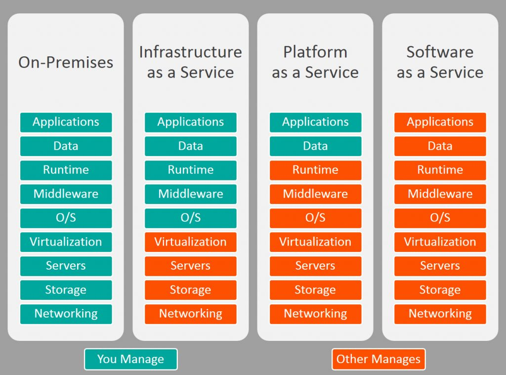
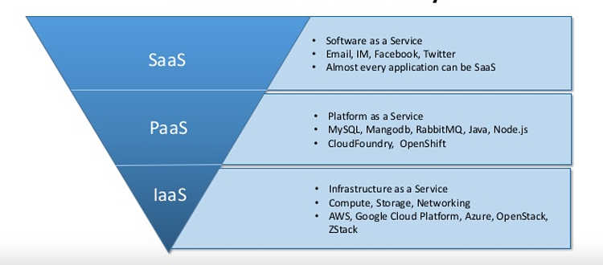

# 一张图看懂IaaS, PaaS和SaaS的区别

从小型企业到全球企业，云都是一个非常热门的话题，它是一个非常广泛的概念，涵盖了很多在线领域。 无论是应用程序还是基础架构部署，当您开始考虑将业务转移到云时，了解各种云服务的差异和优势比以往任何时候都更加重要。

 

通常有三种云服务模型：SaaS（软件即服务），PaaS（平台即服务）和IaaS（基础架构即服务）。 每个都有自己的好处和差异。为了您的组织能作出最佳选择，您有必要了解SaaS，PaaS和IaaS之间的差异。

 

下图总结了三种模型的主要差别：

