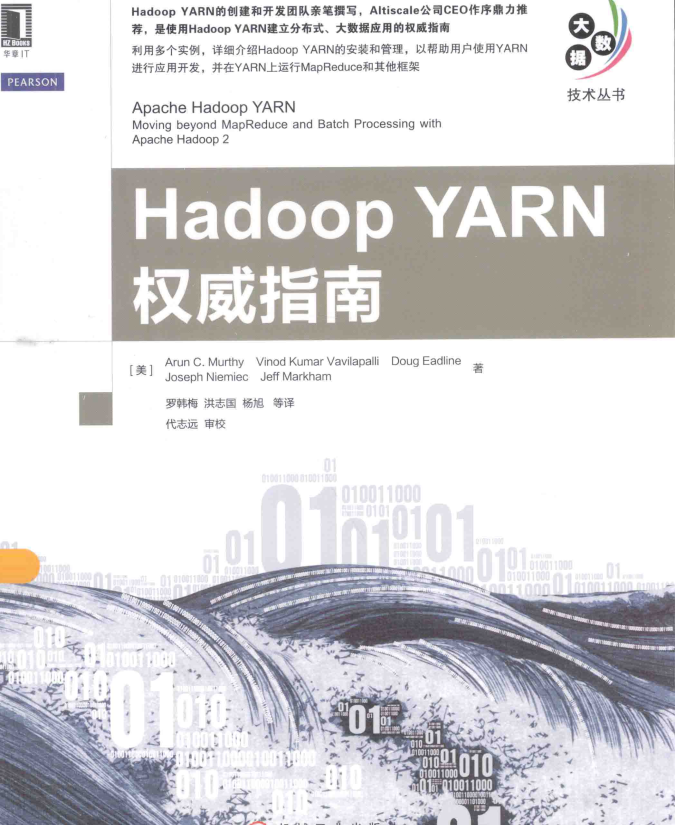
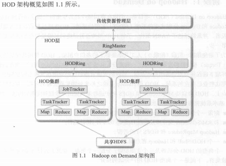
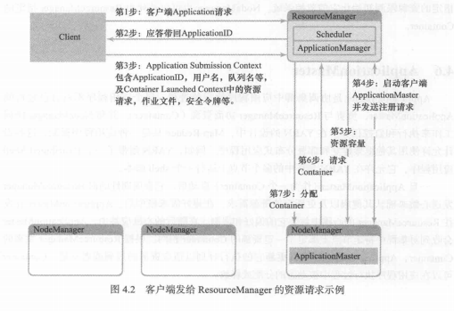
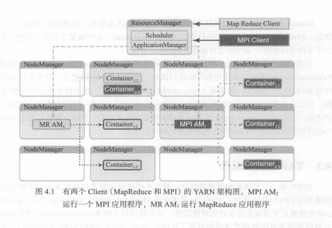
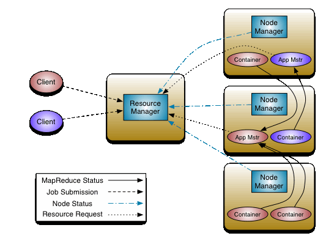
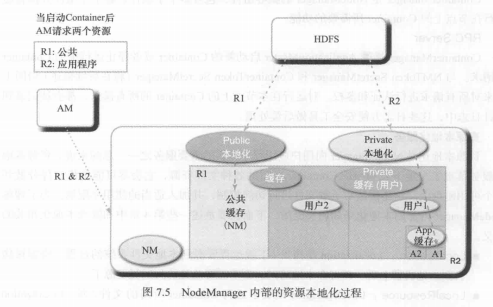
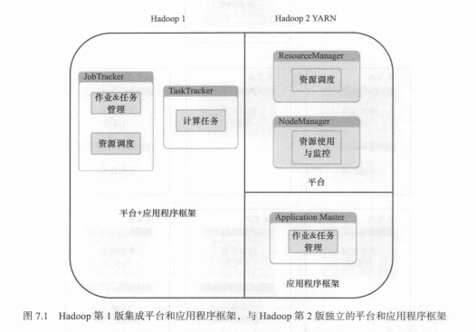
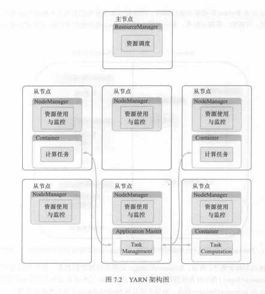
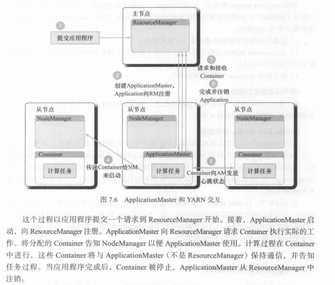
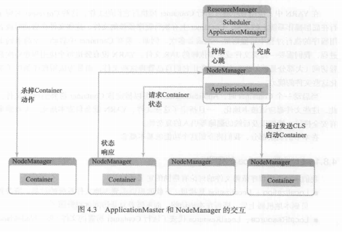

## 1. 前言

YARN的发展阶段

### 1.0 阶段-1：Ad Hoc集群出现前

> 在少量几个节点上手工建立一个集群，将数据载入HDFS中，通过运行MapReduce任务来计算并获的感兴趣的结果，然后拆掉集群。这一时期，并没有在HDFS中持久化存储数据，因为当时还没有这种迫切需求。

### 1.1 阶段0：Ad Hoc集群时期

> 在上一个阶段的基础上，实现了持久化的HDFS集群。Yahoo安装并运营了一个共享的HDFS实例，并将一些数据集载入其中，供他人使用。这一时期，支持多用户环境，文件和命名空间配额，以及其他改进多租户操作的特性。

### 1.2 阶段1：Hadoop on Demand(HOD)

> 在商用硬件的共享集群上提供和管理`MapReduce`和`HDFS`实例的系统。HOD使用传统的`资源管理器（Torque）`和`集群调度器（Maui）`一起来分配共享节点池上的Hadoop集群。

一个典型的HOD用户会话过程如下：

1. 用户调用`HOD Shell`，向`Torque`提交一个适当规模的计算集群描述请求。
2. `Torque`会让请求排队等待，直到有节点可用。一旦节点可用，`Torque`在其中一个计算几点上启动名为`RingMaster`的首进程。
3. `RingMaster`是一个HOD组件，它通过`ResourceManager`接口来运行`HODRing`组件，每个分配的计算节点中都包含`HODRing`。
4. `HODRing`初始化之后，会与`RingMaster`通信以获取Hadoop命令，并遵照执行。一旦`Hadoop`的守护进程开始启动，`HODRing`会向`RingMaster`注册，提供关于守护进程的信息。
5. HOD客户端保持与`RingMaster`的通信，找出`JobTracker`和`HDFS`守护进程所在的位置。
6. 一旦一切就绪，用户知道了`JobTracker`和`HDFS`的位置，HOD会退出并允许用户在相应的集群上执行他的数据运算。
7. 当运行完数据运算作用后，用户即可释放集群。

优点是：

1. 可维持性好；
2. 日志管理功能；
3. 多用户和单用户多集群功能；
4. 配置机制方便；
5. 空闲集群的自动释放。

缺点是：

1. 没有考虑到数据本地化，即不支持`位置感知`（将计算移动到数据所在的位置）；
2. 集群使用率不高。

### 1.3 阶段2：共享计算集群的黎明

属于Apache Hadoop 1.x。此阶段为共享MapReduce集群阶段。

> 由于HOD架构掌握的信息太少，无法对分配作出智能决策。它的资源粒度太粗糙等缺点。因此发展为包含共享HDFS实例的MapReduce集群模型。
>
> `JobTraker`：一个中央守护进程，负责运行集群上的所有作业。
>
> `TaskTracker`：系统里的从进程，根据JobTracker的指令来执行任务。

优点是：

1. 中央`JobTracker`守护进程
2. `JobTracker`内存管理
3. 已完成作业的管理
4. 中心调度器
5. 恢复和升级
6. 单个节点上的隔离
7. 安全性
8. 身份认证和访问控制
9. 各种集群管理功能

缺点是：

1. 扩展性瓶颈
2. 可靠性和可用性不足
3. 对编程模型多样性的支持，仅支持MapReduce，难以扩展到其他编程模型。
4. 用户日志管理
5. 敏捷性不够好

### 1.4 阶段3：YARN的出现

> 前一个阶段的`JobTracker`扩展性不好，需要重写，以及其他不足之处，促使YARN的诞生。
>
> YARN的全称是Yet Another Resource Negotiator
>
> 优点是：
>
> 1. 可扩展性
> 2. 可维持性
> 3. 多租户
> 4. 位置感知
> 5. 集群使用率高
> 6. 安全和可审计的操作
> 7. 可靠性和可用性
> 8. 对编程模型多样性的支持
> 9. 灵活的资源模型
> 10. 向后兼容

YARN的工作流程大约如下：

可以认为是，将调度和资源管理从第1版中的MapReduce中分离出来了，成为了YARN。

## 2. 安装

分为单机部署、伪分布式部署、和分布式部署。

## 3. 核心组件和概念

YARN的工作流程图如下：

### 3.1 `ResourceManager`

`ResourceManager`，主要职责是调度，即它在竞争的应用程序之间分配系统中的可用资源，但不关注每个应用程序的状态管理（有`AppolicationMaster`负责）。为了适应不同的策略，RM有一个可插拔的调度器来应用不同的算法，Hadoop 2.x中支持3中调度器：`FIFO`、`Capacity`、`Fair`。

### 3.2 `NodeManager`

管理Hadoop集群中独立的计算节点，负责管理和监控节点和`Container`。职责包括：

1. 与`ResourceManager`保持通信

2. 管理`Container`的生命周期，监控每个`Container`的资源使用（内存，CPU）情况

3. 跟踪节点健康状况等。

4. 负责资源本地化，即负责安全地下载和组织Contianer所需的各种文件资源，它会尽可能地将文件分散到各个可用磁盘上。有3种类型的本地化：PUBLIC资源的本地化、PRIVATE/APPLICATION资源的本地化

   本地化的过程如下图所示：

   

### 3.3 `ApplicationMaster`

`ApplicationMaster`，一个应用会启动一个`ApplicationMaster`（通常称之为`Container0`），它的职责是与`ResourceManager`协商资源（`Container`），并好`NodeManager`协同工作来执行和监控任务。

### 3.4 `Contianer`

`Contianer`，是对资源的抽象，是单个节点上如RAM、CPU核和磁盘等物理资源的集合。单个节点上可以有多个`Container`。可以修改`Container`的内存、CPU大小。每个节点可以看做由多个`Container`构成。

`Container`代表了集群中单个节点上的一组资源（内存，CPU），由`NodeManager`监控，由`ResourceManager`调度。在运行过程中可以动态的请求或释放`Container`。

`资源模型`，一个应用可以通过`ApplicationMaster`请求非常具体的资源，如：

 	1. 资源名称
 	2. 内存量
 	3. CPU（核数/类型）
 	4. 其他资源，如`disk/network I/O`、GPU等

### 3.5 `Scheduler`

`Scheduler`，可插拔的调度器组件，支持`FIFO（先入先出）`，`Capacity`和`Fair`。

1. FIFO调度器，即”先来先服务“，不考虑作业的优先级和范围。**适合低负载集群，不适合大型的共享集群。**
2. Capacity调度器，容量调度，配置一个或多个队列，保证每个队列的最小资源使用值。通过`ACL（访问控制列表）`用来控制哪些用户可以向各个队列提交作业。多余的容量会优先分配给那些最饥饿的（最满的）队列。在每个队列内部使用层次化的`FIFO`来调度多个应用程序。
3. Fair调度器，公平调度，将资源公平的分配给应用，使得所有应用在平均情况下随着时间得到相等份额的资源。

## 4. YARN架构

Hadoop 1和Hadoop2架构对比

YARN的架构图如下：

## 5. 工作流程

工作流程在上面也提到过多次，大致如下图所示：

1. 客户端提交application请求
2. 应答带回`ApplicationID`
3. `Application Submission Context`包含`ApplicationID`，用户名，队列名等，及`Container Launched Context`中的资源请求，作业文件，安全令牌等。
4. 启动应用对应的`ApplicationMaster`，并向`ResourceManager`发送注册请求
5. 资源容量请求
6. `ApplicationMaster`向`ResourceManager`请求`Container`
7. `ResourceManager`分配`Container`给`ApplicationMaster`
8. `ApplicationMaster`传递`Container`给NM来启动`Container`
9. `ApplicationMaster`请求`Container`的状态，`Container`响应状态信息给ApplicationMaster