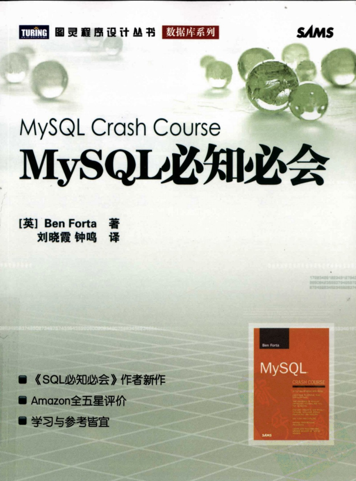
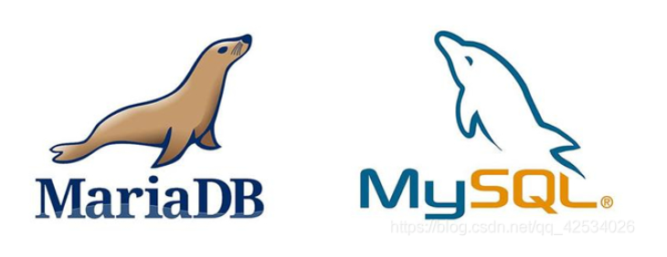
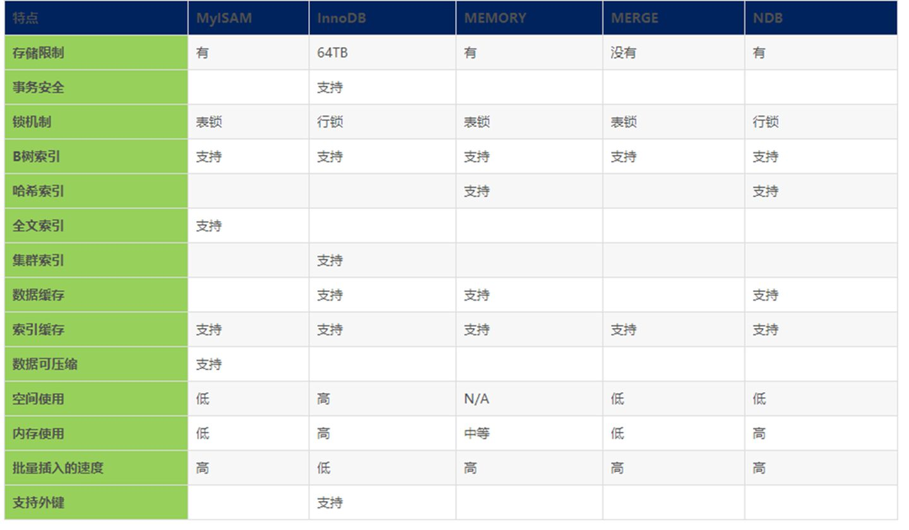

# 1. 数据库基础概念

**1.1 数据库（database）**

保存有组织的数据的容器（通常是一个文件或一组文件）。数据库软件应该称为`数据库管理系统（DBMS）`，而数据库是通过DBMS创建和操纵的容器。

**1.2 表（table）**

某种特定类型数据的结构化清单。如顾客表不应和订单表存储在同一个数据库的同一个表中。

**1.3 模式（schema）**

关于数据库和表的布局及特性的信息，即数据库和表的元数据信息。

**1.4 列（column）**

表由列组成，列中存储着表中某部分的信息。列是表中的一个字段。所有表都是由一个或多个列组成的。

**1.5 数据类型（datatype）**

所容许的数据的类型。每列都有相应的数据类型，它限制该列中存储的数据。

**1.6 行（row）**

表中的数据是按行存储的，一条记录就是一行。

**1.7 主键（primary key）**

表中的每一行都应该有可以标识自己的一列（或一组列），其值能够唯一地区分表中的每个行。

列要称为主键，需要满足以下条件：

1. 任意两行都不具有相同的主键值
2. 每行都必须具有一个主键值（主键列不允许NULL值）

好习惯：

1. 不更新主键列中的值
2. 不重用主键列的值
3. 不在主键列中使用可能会更改的值。

**1.8 SQL（Structure Query Language）**

结构化查询语言，专门用来与数据库通信的语言。

# 2. MySQL简介

MySQL是一种DBMS。DBMS分为两类：一类是基于共享文件系统的DBMS，另一类是基于客户机-服务器的DBMS（如MySQL、Oracle、Microsoft SQL Server等）。

客户机-服务器的数据库，即客户机软件发送关于数据的请求，然后由数据库服务器来处理这些请求。

## MySQL的版本

- 4 --- InnoDB引擎，增加事务处理、并、改进全文本搜索等的支持。
- 4.1 --- 对函数库、子查询、集成帮助等的支持。
- 5 --- 存储过程、触发器、游标、视图等的支持。
- 8 --- 

## MySQL 与MariaDB

[MySQL历史，名称由来及版本](https://blog.csdn.net/qq_42534026/article/details/105315731)

因为MySQL最初是由某开源公司发布的，但是最终落到了Oracle公司的手里，**MySQL的创始人麦克尔·维德纽斯**担心Oracle可能会不再支持MySQL社区版（MySQL唯一免费的版本），因此他以MySQL为基础，成立了分支计划MariaDB。



## MySQL的引擎




## MySQL的工具

MySQL命令行

MySQL Adiministrator：一个图形交互客户机，用来简化MySQL服务器的管理。

MySQL Query Browser：一个图形交互客户机，用来编写和执行MySQL命令。

# 3. 使用MySQL

按照惯例，SQL的关键字使用大写，表名列名使用小写，便于阅读和区分。

在处理SQL语句时，其中所有空格都会被忽略。SQL语句可以在一行上给出，也可以分成许多行。分成多行更容易阅读和调试。

## 完全限定的表名和列名

某些情况下可能会使用完全限定的名字来引用表或列，如：

```sql
SELECT products.prod_name
FROM products;

SELECT products.prod_name
FROM crashcourse.products;
```


# 4. MySQL常用语句

## 查看库表相关信息

```sql
# 选择数据库
USE 数据库名;
# 列出所有数据库
SHOW DATABASES;
# 列出当前数据库下的所有表
SHOW tables;
# 列出某表的所有列和数据类型等
SHOW COLUMNS FROM 表名;
# 上一条的快捷方式
DESCRIBE 表名;
SHOW STATUS
SHOW CREATE DATABASE 库名
SHOW CREATE TABLE 表名
# 查看用户权限
SHOW GRANTS
SHOW ERRORS
SHOW WARNINGS
```

## 检索数据

```sql
SELECT 列名, ...
FROM 表名, ...
[WHERE ...]
[UNION ...]
[GROUP BY ...]
[HAVING ...]
[ORDER BY 列1,... [ASC|DESC]]
[LIMIT start,n| LIMIT n OFFSET start];

# 使用通配符*，可以检索表中的所有列，但是检索不需要的列通常会降低检索和应用程序的性能。
SELECT * ...
# 去重
SELECT DISTINCT 列 FROM 表;
```


更新已存在表的模式（schema）

```sql
ALER TABLE 表名
(
    # 增加列
	ADD  列名 数据类型 [NULL|NOT NULL] [约束条件],
    # 修改字段类型
    MODIFY COLUMN 列名 字段类型;
    # 修改字段名，类型等
    CHANGE 旧列名 新列名 字段类型 [NULL|NOT NULL] [其他约束条件],
    # 删除列
  	DROP column 列名,
);
```

将事务处理写到数据库

```sql
commit;
```

创建索引

```sql
CREATE INDEX 索引名 ON 表名 (列名 [ASC|DESC], ...);
```

创建存储过程

```sql
CREATE PROCEDURE 过程名(参数列表)
BEGIN
...
END;
```

创建表

```sql
CREATE TABLE 表名
(
	列名 字段类型 [NULL|NOT NULL] [其他约束条件],
    列名 字段类型 [NULL|NOT NULL] [其他约束条件],
);
```

向系统添加新的用户

```sql
CREATE USER 用户名[@主机名] [IDENTIFIED BY [PASSWORD] '这是密码'];
```

创建一个或多个表上的新视图

```sql
CREATE [OR REPLACE] VIEW 视图名
AS
SELECT ...;
```

删除表中的一行或多行。

```sql
DELETE FROM 表名 [WHERE ...];
```

永久地删除数据库对象

```sql
DROP DATABASE|INDEX|PROCEDURE|TABLE|TRIGGER|USER|VIEW 名字;
```

给表增加一行或多行

```sql
INSERT INTO 表名 [(列名1, 列名2, ...)] VALUES(值1,值2);
```

插入select的结果到一个表

```sql
INSERT INTO 表名1 [(列1,列2,...)]
SELECT 列1,列2, ... FROM 表名2, ... [WHERE ...];
```

撤销一个事务处理块

```sql
ROLLBACK [TO 保留点的名字];
```

为使用ROLLBACK语句设立保留点

```sql
SAVEPOINT 保留点1;
```

从一个或多个表中检索数据

```sql
SELECT 列名, ...
FROM 表名, ...
[WHERE ...]
[UNION ...]
[GROUP BY ...]
[HAVING ...]
[ORDER BY ...]
[LIMIT n,m| LIMIT M OFFSET n];
```

开启一个新的事务块

```sql
START TRANSACTION;
```

更新表中的一行或多行

```sql
UPDATE 表名
SET 列1=值1, 列2=值2, ...
[WHERE ...];
```

