# 一、分布式服务案例

## 1.1 分布式系统的架构演变过程

一般来说，网站由小变大的过程，基本都是：单机架构，集群架构，分布式架构。

### 单机系统

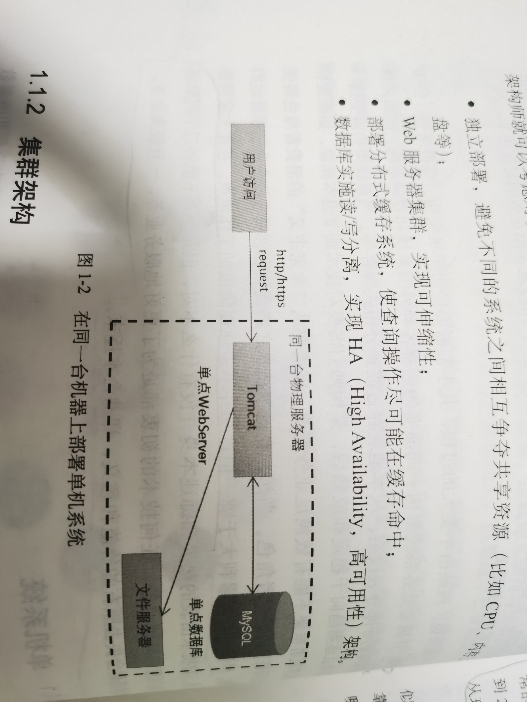

### 集群架构

当一台服务器的处理能力接近或超出其容量上时，要么用一台性能更强的服务器（纵向扩容），要么用多台服务器，即集群技术（横向扩容）。目前实用的做法是，通过增加新的服务器来分散并发访问量，从而实现可伸缩性和高可用架构。


上图是常见的web集群架构。可以通过`DNS轮询`或`Keepalived`来实现Nginx的高可用。

当业务发展到一定阶段，用户规模上来之后，架构师就需要考虑对现有网站架构作出以下两点调整：

- 利用`CDN（content delivery network）`加速系统响应
- 业务垂直化（按业务功能拆分），降低耦合，从而实现分而治之的管理。

#### Q 如何通过DNS轮询实现Nginx的高可用？

TODO

### 拆系统之业务垂直化

业务垂直化，就是按照业务功能拆分出多个业务模块。例如，一般大型电商网站都会拆分出首页，用户，搜索，广告，购物，订单，商品，收益结算等子系统，再由不同的团队负责承建，独立管理，独立部署。

拆分粒度越细，耦合越小，容错性越好，每个业务子系统的职责就越清晰。但是，拆分粒度过细，则维护成本将会很高，这一点需要权衡。

到了这一步，就已经是分布式系统了。

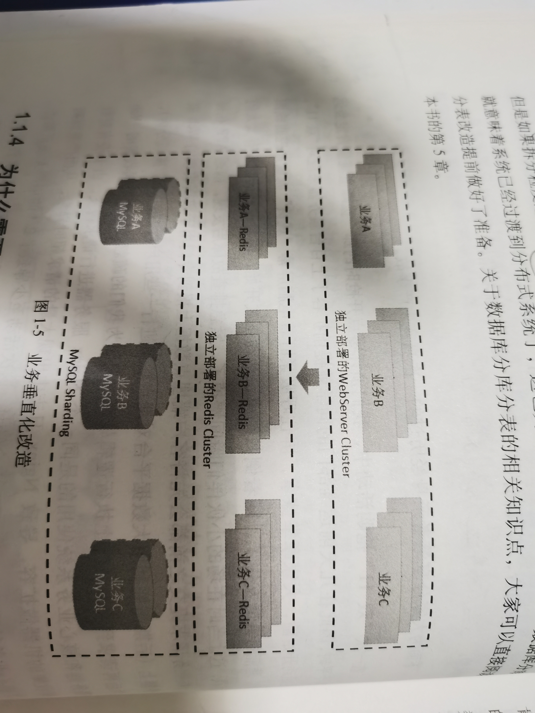


### 为什么需要实现服务化架构

`服务化架构`（`Service Oriented Ambiguity，SOA`），这与微服务还有所不同。

`SOA` 也叫`面向服务的架构`，从单体服务到 `SOA` 的演进，需要结合`水平拆分`及`垂直拆分`。

- `垂直拆分`：把一个应用拆成松耦合的多个独立的应用，让应用可以独立部署，有独立的团队进行维护
- `水平拆分`：把一些通用的，会被很多上层服务调用的模块独立拆分出去，形成一个共享的基础服务，这样拆分可以对一些性能瓶颈的应用进行单独的优化和运维管理，也在一定程度上防止了垂直拆分的重复造轮子。


`SOA `强调用统一的协议进行服务间的通信，服务间运行在彼此独立的硬件平台但是需通过统一的协议接口相互协作，也即将应用系统服务化。举个易懂的例子，单体服务如果相当于一个快餐店，所有的服务员职责都是一样的，又要负责收银结算，又要负责做汉堡，又要负责端盘子，又要负责打扫，服务员之间不需要有交流，用户来了后，服务员从前到后负责到底。`SOA` 相当于让服务员有职责分工，收银员负责收银，厨师负责做汉堡，保洁阿姨负责打扫等，所有服务员需要用同一种语言交流，方便工作协调。

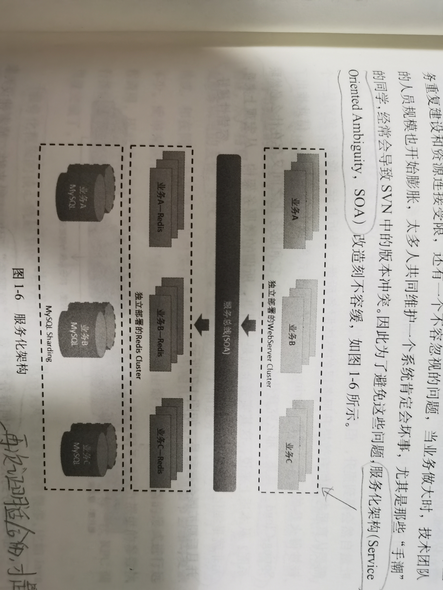

### 服务拆分粒度之微服务

通过服务化架构，可以避免共享业务的重复建设，资源连接瓶颈等问题的出现。

从本质上来说，微服务和服务化完全就是一回事，所谓的微服务架构，从宏观上来看，无非就是喜欢服务拆分过程中的粒度，粒度越细，业务耦合越小，容错性越好，并且后期扩展越容易。那到底如何拆分才能称之为微服务呢？

以子系统为维度进行服务拆分，没个准的，看自己情况吧，没有个准确的界限。

#### 服务化与RPC

`RPC（Remote Procedure Call，远程过程调用）`是一种协议。服务化其实只是一个抽象的概念，而`RPC`才是用于实现服务调用的关键。

`RPC`分为客户端（服务调用方）和服务端（服务提供方）。服务化框架的核心就是RPC，目前成熟的`RPC`实现方案有很多，如`Java RMI`，`WebService`，`Hessian`，`Finagle`等。

完成一次`RPC`调用主要经历如下三个步骤：

- 底层的网络通信协议处理
- 解决寻址问题
- 请求/响应过程中参数的序列化和反序列化。

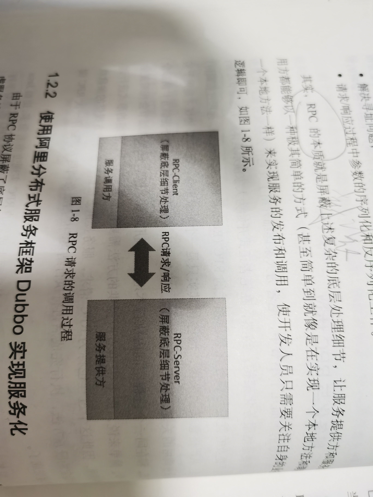

阿里的分布式服务框架`Dubbo`即是一个`RPC`框架，也是一个服务治理框架，`Dubbo`的服务调用如下图所示：


1. `provider（服务提供者）`成功启动后，会向注册中心注册指定的服务
2. `consumer（服务调用方）`在启动后，便可以向注册中心订阅目标服务(服务提供者的地址列表)
3. 当注册中心通知`consumer`之后，然后在本地根据负载均衡算法从地址列表中，选择其中的某一个节点
4. 进行`RPC`调用，如果调用失败则自动Failover到其他服务节点上。
5. 推送监控信息给监控系统。

警惕Dubbo因超时和重试引起的系统雪崩：

假设有1000个并发请求同时对服务A进行RPC调用，但都因为超时导致服务调用失败，由于Dubbo默认的`Failover`机制，共将产生3000次并发请求对服务A进行调用，这是系统正常压力的3倍，若处于峰值流量时情况可能还要更糟糕，大量的并发重试请求很可能直接将Dubbo的容量撑爆，甚至影响到后端存储系统，导致资源连接被耗尽，从而引发系统出现雪崩。

除了`Failover`，Dubbo还有如下容错方案：

- 服务调用失败时，重试其他服务节点，通常用于读操作
- 只发起一次调用，失败立即报错，通常用于非幂等性的写操作
- 失败安全，出现异常时直接忽略，通常用于写入审计日志等操作
- 失败自动恢复，后台记录失败请求，定时重发，通常用于消息通知操作
- 并行调用多个服务节点，成功1个即返回，通常用于实时性要求较高的读操作


#### 服务治理

服务治理的三个基本要素：

- 服务的动态注册与发现
- 服务的扩容评估
- 服务的升级级处理，牺牲部分功能来保证系统的核心服务不受影响。

**为什么需要注册中心呢？**

当服务变得越来越多时，如果把服务的调用地址（`URL`）配置在服务调用方，那么URL的配置管理变得非常麻烦，因此引入注册中心的目的就是实现服务的动态注册和发现，让服务的位置更加透明，这样服务调用方将得到解脱，并且`在客户端实现负载均衡和Failover`将会大大降低对硬件负载均衡的依赖，从而减少企业的支出成本。

#### 分布式事务

分布式事务一直就是业界没有彻底解决的一个技术难题，没有通用的解决方案。最后，通过保证最终一致性，哪怕数据会出现不一致的短暂窗口又有什么关系？

## 1.2 分布式调用跟踪系统

也就是，全链路调用监控。为了梳理清楚服务之间的依赖关系和调用顺序。

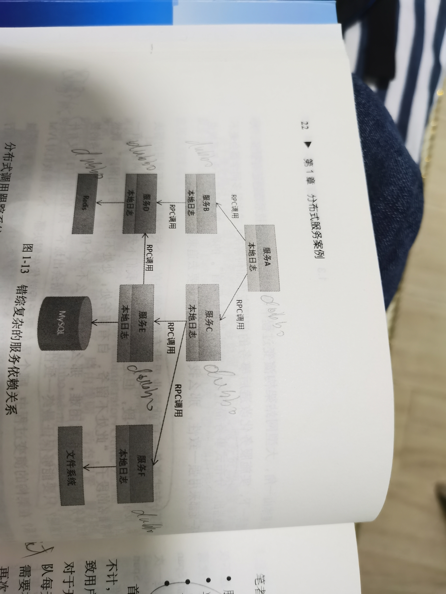

分布式调用跟踪系统都是根据`Google`的`Dapper`论文作为理论依据的。这篇论文要求分布式调用跟踪系统的四个关键设计目标：

- 服务性能低损耗
- 业务代码低侵入
- 监控界面可视化
- 数据分析准实时

通过收集埋点数据（一般包括，`TraceID`，`SpanID`，`ParentSpanID`，`RpcContext`），来分析调用链情况。通过Dubbo可以实现不侵入RPC端的业务代码，即在Dubbo中进行埋点。其中的`TraceID`是全局唯一的（可以根据`uuid`，主机名，`ip`，随机值，时间戳等方式来生成）

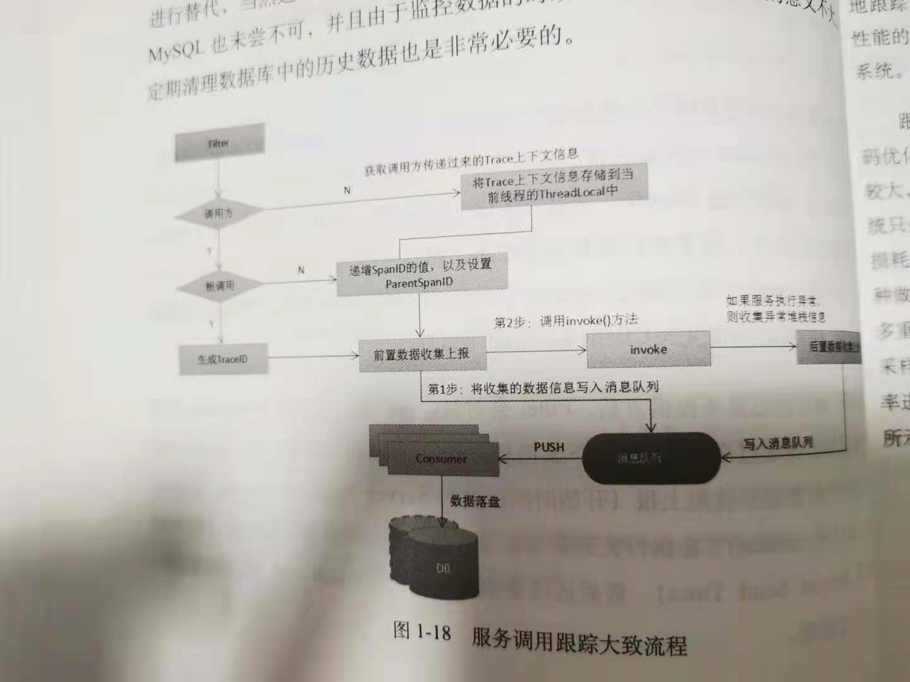

# 二、大流量限流/消峰案例

## 2.1 分布式系统为什么需要进行流量管制

天猫、淘宝这种级别的大型互联网电商网站，主要的技术挑战来自于庞大的用户规模所带来的大流量和高并发，在“双十一”，“双十二”等大促场景下尤为明显。如果不对流量进行合理管制，肆意放任大流量冲击系统，那么将导致一系列的问题出现，比如一些可用的连接资源被耗尽，分布式缓存的容量被撑爆，数据库吞吐量降低，最终必然导致系统产生雪崩效应。

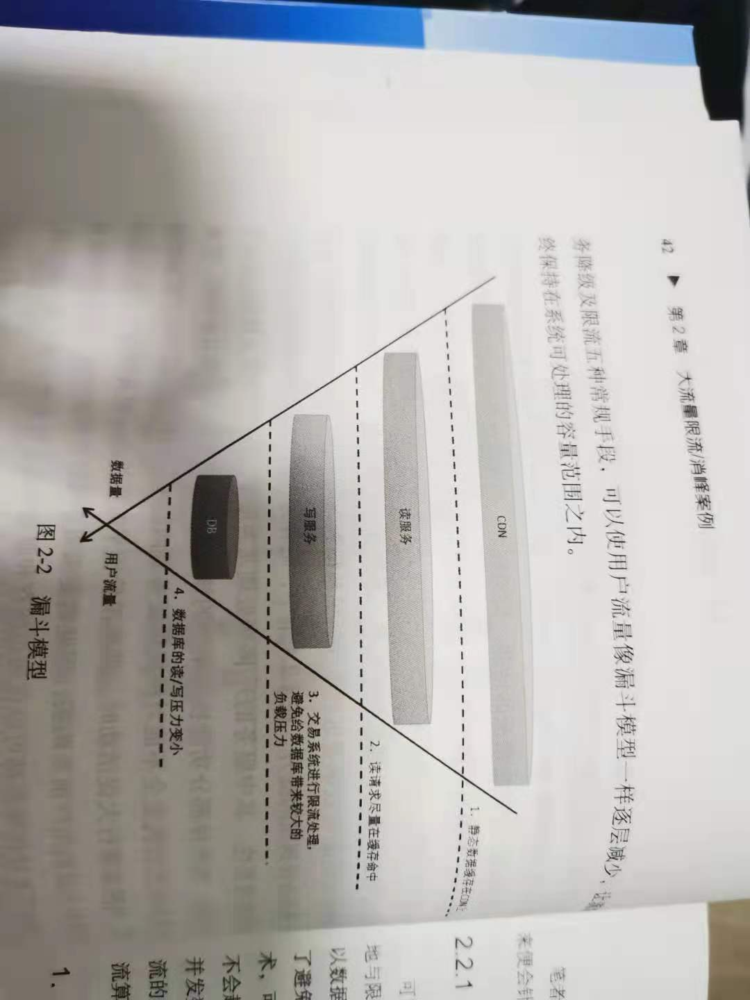

作者总结了以下五种分布式系统应对高并发，大流量的常规手段：

- 扩容

- 动静分离

- 缓存

- 服务降级

- 限流。常见算法有令牌桶算法，漏桶算法，计数器算法

  - 令牌桶算法（token buket）。流入固定，流出不定。因为可以攒令牌，所以可以应对突发流量。
    - 每秒会有r个令牌放入桶内
    - 桶的容量固定不变为b，如果桶满了在放入令牌，则溢出（新添加的令牌被丢弃）
    - 当一个n字节的请求包到达时，将消耗n个令牌，然后在发送该数据包
    - 若桶中可用令牌数小于n，则该数据包将会被执行限流处理
  - 漏桶算法（leaky buket）。流入不定，流出固定。即使遇到突发流量，也快速处理。==我的感觉就像MQ。==
    - 以任意速率向桶中流入水滴
    - 桶的容量固定不变，如果桶满了则溢出（新流入的水滴被丢弃）
    - 按照固定的速率从桶中流出水滴
  - 计数器算法。指定的SKU在单位时间内允许被抢购的次数。例如，限流规则为10秒5000次，如果10秒之内这个SKU的抢购次数达到了5000次，则拒绝后续抢购请求，10秒后，限流逻辑可以重置这个SKU的可抢购次数。

  限流的实现示例

  - 使用Google的Guava实现平均速率限流
  - 使用nginx实现接入层限流

## 2.2 消峰（业务上进行消峰）

消峰，指的就是对峰值流量进行分散处理，避免在同一时间段内产生较大的用户流量冲击系统，从而降低系统的负载压力。

- 活动分时段实现消峰
- 通过答题验证实现消峰。如12306验证码。

## 2.3 异步调用

如何才能更好的实现解耦？

通过消息中间件（Message Queue，MQ）实现异步调用是在分布式环境下解决系统之间的耦合和大流量消峰的重要手段。常见的MQ产品有ActiveMQ，Kafka，RocketMQ，HornetQ，RabbitMQ，ZeroMQ等。

完全可以使用消息传递来替代RPC调用。消息模型有两种：Point-2-Point（P2P，点对点）模型和Publish/Subscribe（pub/sub，发布/订阅模型）。一个pull获得消息，一个是push获得消息。

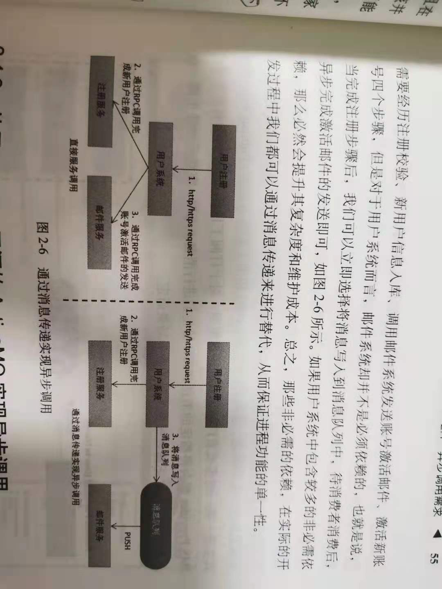

RabbitMQ的网络架构图如下所示：


MQ的基本功能：

- 实现异步调用
- 实现系统间解耦


# 三、分布式配置管理服务案例

在对数据库进行读/写操作时，开发人员在程序中应该尽量使用数据库连接池（DB ConnectionPool）技术，以实现资源复用和限制单机能够申请到的最大并发连接数。

配置管理可以分为：

## 3.1 本地配置

- 将配置信息耦合在业务代码中
- 将配置信息配置在配置文件中

## 3.2 集中化配置

集中式配置的好处：

- 配置信息统一管理
- 动态获取/更新配置信息
- 降低运维人员的运维成本
- 降低配置出错率

简单来说，分布式配置管理服务的本质就是典型的发布/订阅模式，获取配置信息的一方为订阅方，发布配置消息的一方为推送方。

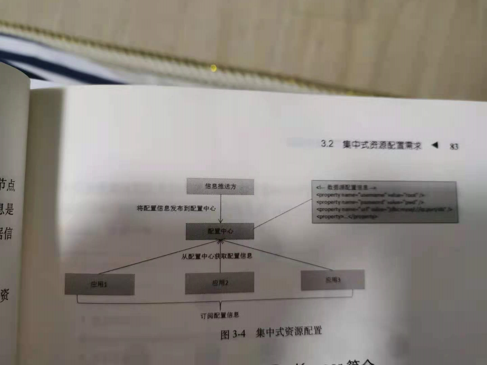


### 分布式一致性协调服务ZooKeeper

每个子节点称为Znode，Znode有两种类型（持久节点和临时节点）。zookeeper的配置文件中，`server:A=B:C:D`用于标识不同ZooKeeper节点的配置，A为节点编号，B为接地IP，C为节点与Leader节点的通信端口，D为选举端口。

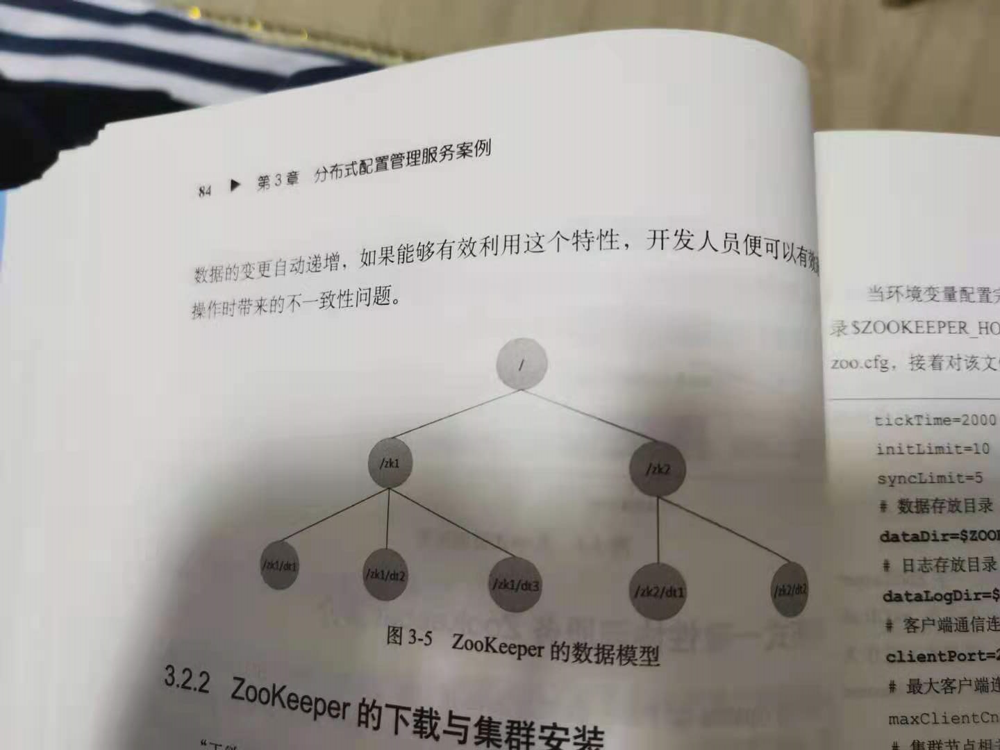

简单来说，我们将配置信息发布到Znode目录上后，由客户端负责消息订阅，一旦配置信息发生变更，所有Watch目标Znode的ZooKeeper客户端都会感知到，那么当重新获取配置信息后，我们便可以在程序中执行一些自定义的逻辑处理，如下图所示。

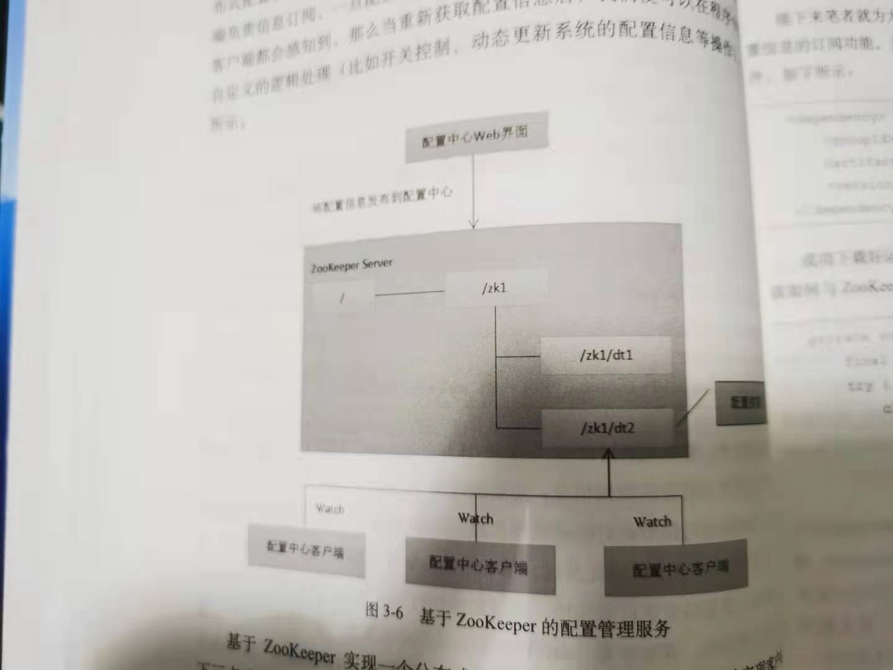

### 使用淘宝Diamond实现分布式配置管理服务


Diamond的整体架构如下：


### 使用百度Disconf实现分布式配置管理服务

pass

# 四、大促场景下热点数据的读/写优化案例

在秒杀，限时抢购这种大促场景下，由于峰值流量较大，大量的并发读/写操作一定会导致后端的存储系统产生性能瓶颈。

## 4.1 缓存技术

经常使用的缓存主要分为：

- 本地缓存，如Ehcache。
  - Ehcache的本质是同一个进程内的缓存技术，会共享JVM中有限的内存资源。即缓存在进程内部。
  - off-heap（堆外内存）技术。对于Java开发人员而言，Java程序只能运行在JVM内部，JVM将数据从物理内存复制到JVM的heap中。使用off-heap即，JVM内是一个引用，实际的数据放在JVM的heap之外的物理内存中。
- 分布式缓存，如MemCache，Redis

## 4.2 高性能分布式缓存Redis

### 使用Redis集群实现数据水平化存储

想要使用Redis集群，则需要使用到一致性hash算法，如下图所示：

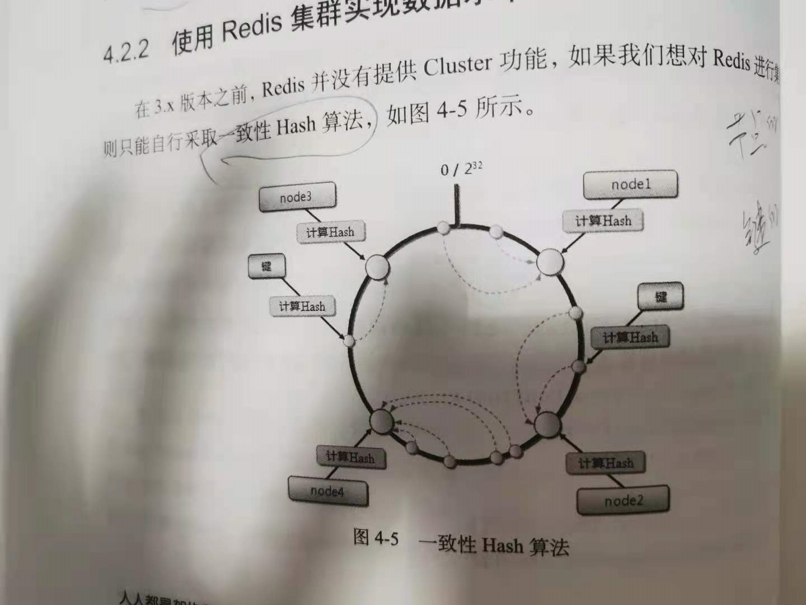

Redis集群节点中一共包含16384（2^14)个slot，不同的Redis节点内各自维护一小段slot，用于存储不同区间的数据。


## 4.3 同一热卖商品高并发读

也就是常说的，热点key缓存击穿问题。在某一时间段（如双11， 双12）用户流量巨大，尤其是针对这些热卖商品，那读/写量更是大的很，那么怎么避免缓存击穿呢？

- 基于Redis集群多写多读方案。同一份商品数据被冗余存储到所有的缓存节点上，无论用户流量有多大，在并发环境下，客户端都可以根据加工后的key，采用轮询或随机等方式实现数据访问。在这种情况如何保证多写的一致性？用ZooKeeper来配置同一热卖商品的key，客户端监听Znode的变化，变化后所有客户端全量更新本地持有的key即可。

- 本地缓存+Redis集群的多级缓存方案。将热点key写入本地缓存，然后先访问本地缓存，没有的话，再去访问Redis。

  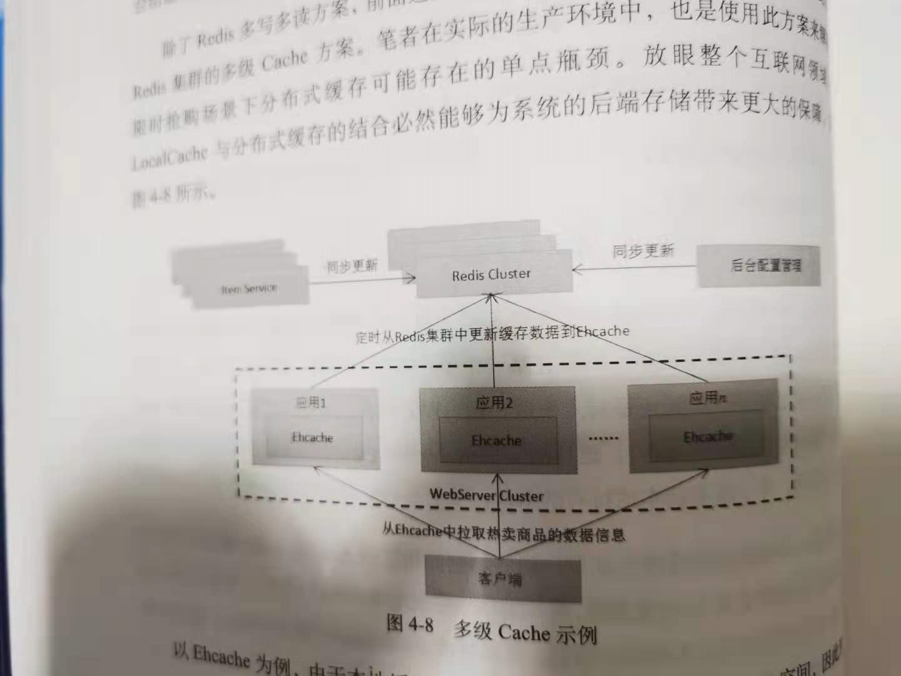

  在实施多级缓存方案时，可以设置定时轮询时间，定时从分布式缓存中pull最新的缓存数据，更新到本地中。千万不要为本地缓存设置ttl策略，因为这种做法会造成：用户流量过大时，一旦本地缓存的ttl过期，那么着大量的用户流量就全都流入Redis了，造成吞吐量下降。

  可以引入消息队列来缩短本地缓存和分布式缓存之间数据不一致的窗口期，如下图所示。

  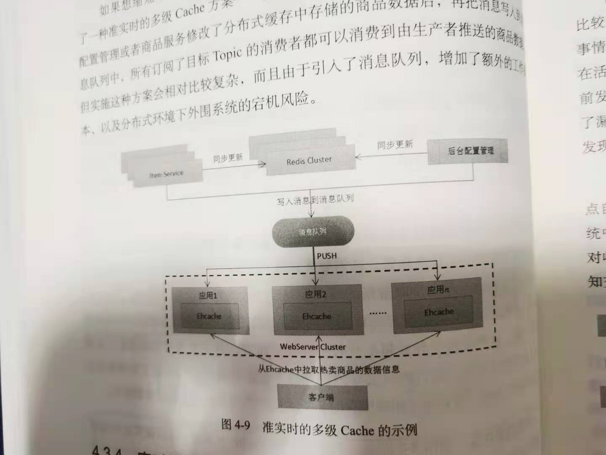

  热点自动发现法案的一种架构如下图所示：

  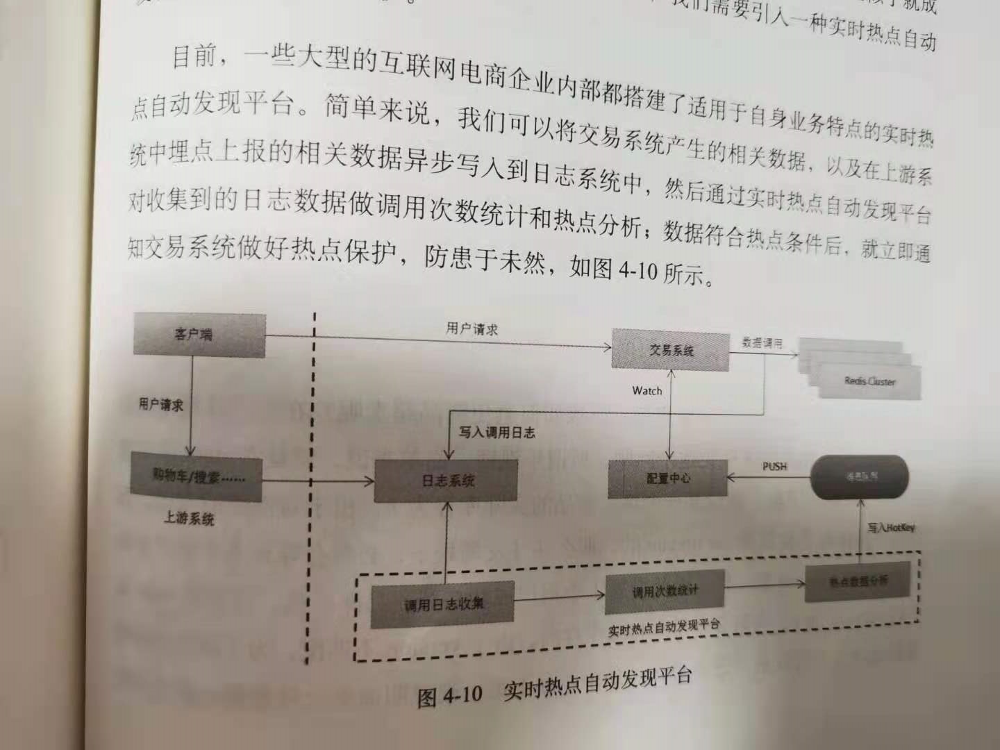

## 4.4 同一热卖商品高并发写

因为在并发写MySQL之类的关系型数据库时，热卖商品，大量的并发更新热点数据都是针对同一行的，这必然引起大量的线程相互竞争InnoDB的行锁，并发越大等待的线程越多，严重影响数据库的TPS，甚至会造成系统雪崩。为了避免数据库沦为瓶颈，我们可以：

- 将热卖商品的库存扣减操作移致关系型数据库外
- 或合理控制并发写的流量


### 避免关系型数据库出现超卖

解决方法有：

- 乐观锁

  乐观锁方法一：

  在需要写的表中建立一个version字段。

  t1时刻，多个用户都获取到了热卖商品的库存为n，

  t2时刻，当第一个用户成功扣减商品库存后，version的值加1，

  t3时刻，第二个用户提交扣减库存时，由于version不匹配，扣减库存失败。

  ```sql
  UPDATE item SET version=version+1, stock=stock-1 WHERE item_id=1 AND version="+ version +";
  ```

  乐观锁方法二：

  利用“实际库存数>=扣减库存数”作为条件来代替version匹配，实现乐观锁，防止超卖。

  ```sql
  UPDATE item SET stock=stock-1 WHERE item_id=1 AND stock>=1;
  ```

  

- 悲观锁。即必须获取到锁之后在操作，认为不获取锁的话，一定会被他人修改。


### 避免在Redis中出现超卖

方法一，使用分布式锁，避免Redis出现超卖

分布式锁自身必须满足如下3个要求：

- 在任何情况下分布式锁都不能沦为系统瓶颈
- 不能产生死锁
- 支持锁重入

目前较为常用的是ZooKeeper和Redis实现分布式锁（Redission或setnx）。更新完Redis之后又该如何同步到数据库中呢？使用MQ，如下图所示。此时并发写入数据库的流量可控。

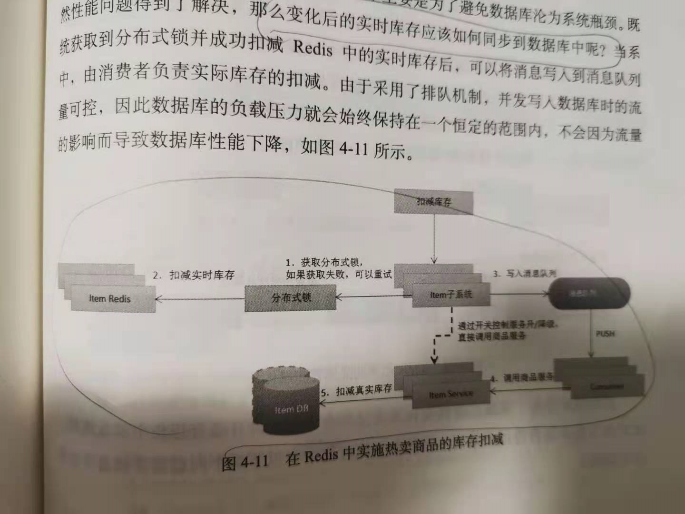


如下图所示，还以是批量提交扣减请求，减少获取分布式锁的次数，来提高效率。但是，当商品库存不足扣减时，这一批库存扣减操作都会失败。

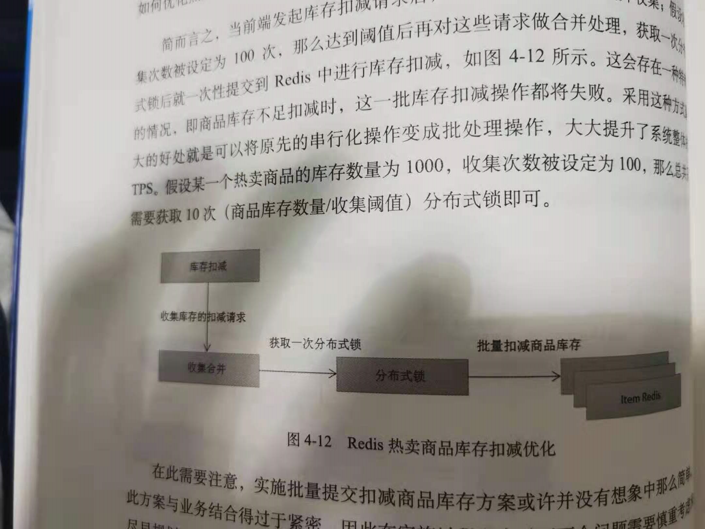

方式二，使用乐观锁避免Redis超卖

一.乐观锁和悲观锁的概念
悲观锁：

  很悲观，认为什么时候都会出问题，所以在每次拿数据的时候都会上锁其他线程想要访问数据时候，都需要阻塞挂起。Java中synchronized的思想也是悲观锁。

乐观锁：

  很乐观，认为什么时候都不会出现问题，更新数据的时候去判断一下，在此期间是否有人修改过这个数据。


通过Redis的Watch命令来实现乐观锁。


```shell
127.0.0.1:6379> set money 100
OK
127.0.0.1:6379> watch money # 监听money这个键
OK
127.0.0.1:6379> multi # 开启事务
OK
127.0.0.1:6379> set money 90
QUEUED
127.0.0.1:6379> set count 1
OK
# 如果在此事务提交前，检测到money被人修改了，那么事务提交失败
127.0.0.1:6379> exec # 提交事务
(nil)
127.0.0.1:6379> unwatch # 解除监听money这个键
```


# 五、数据库分库分表案例


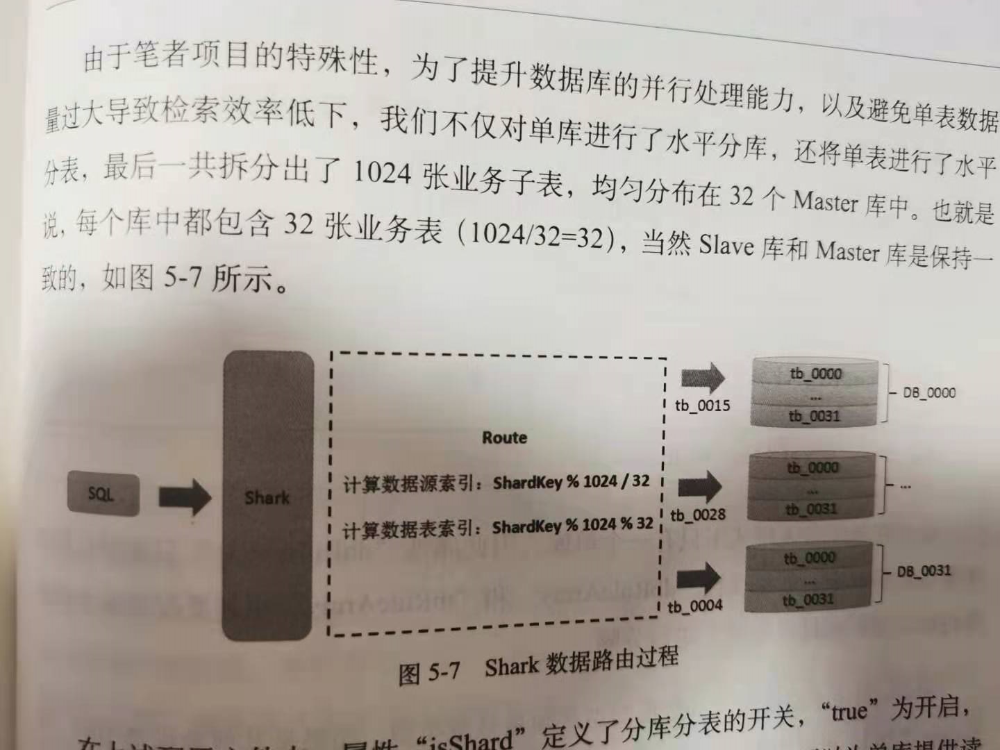


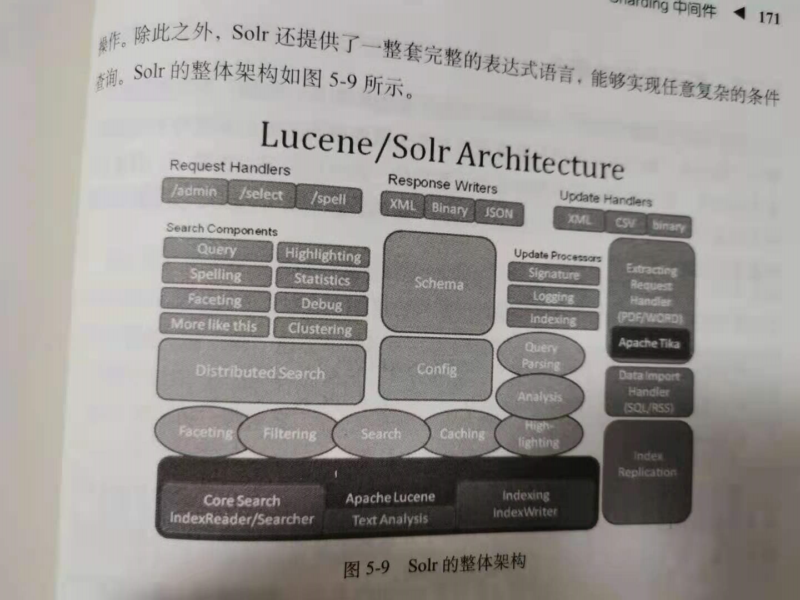


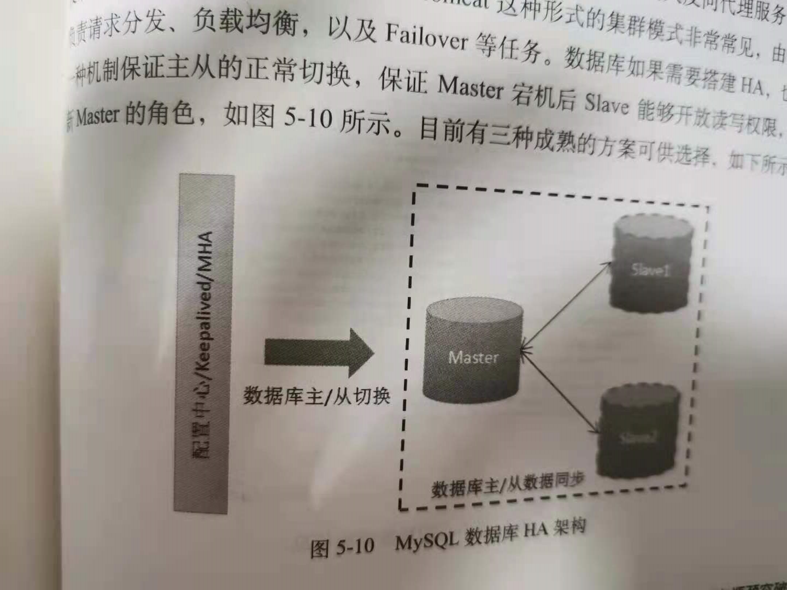


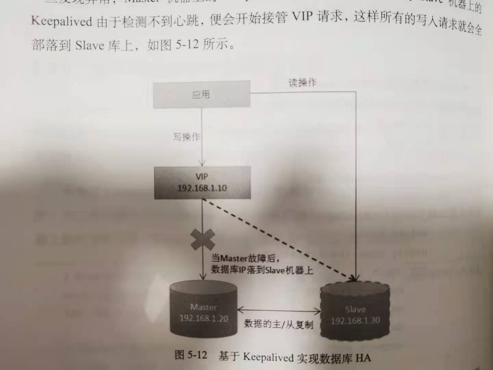


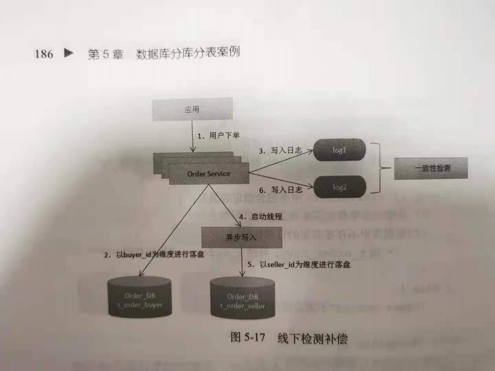


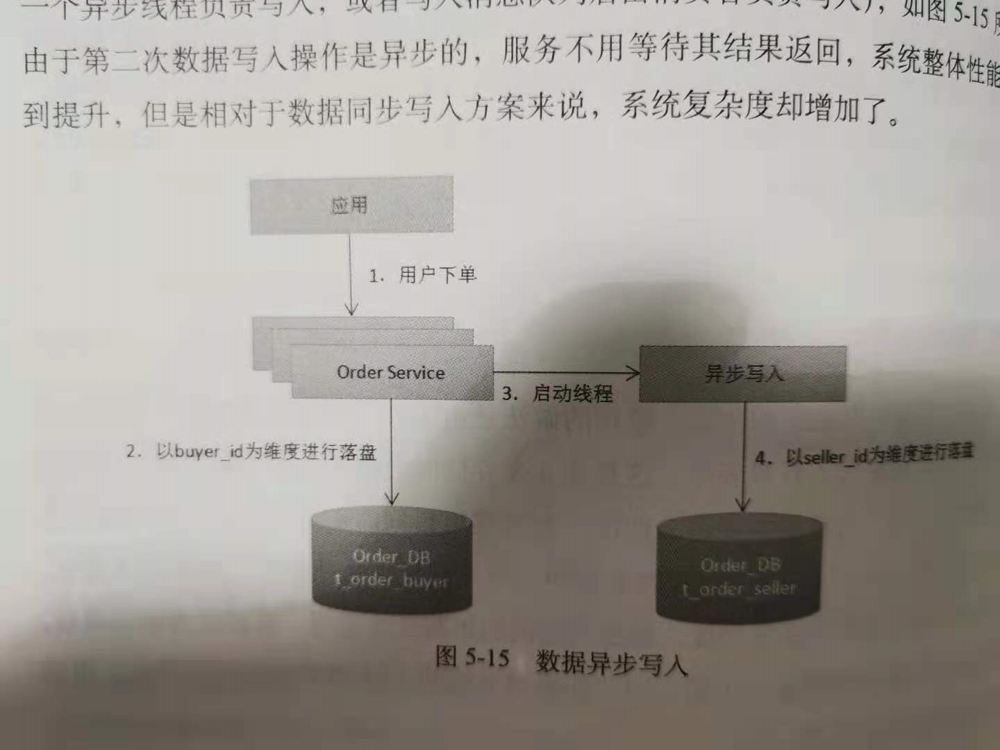


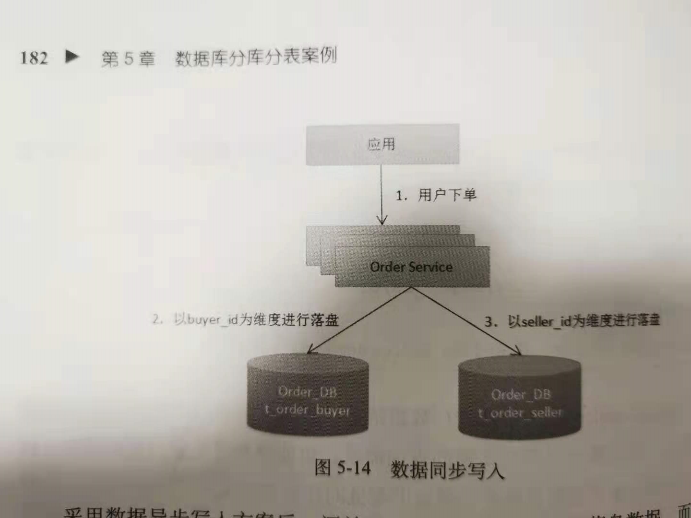


