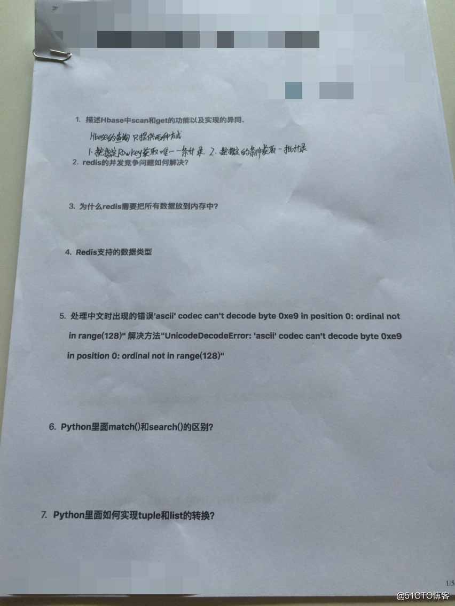
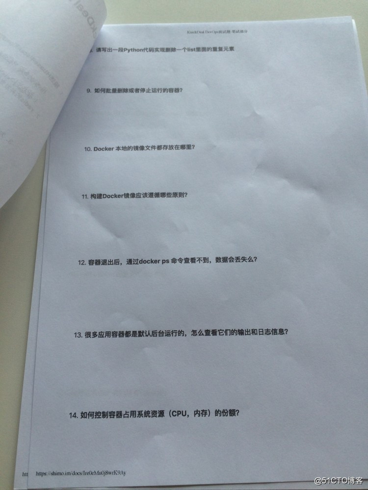
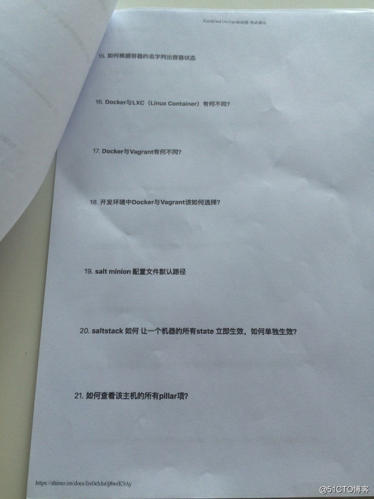
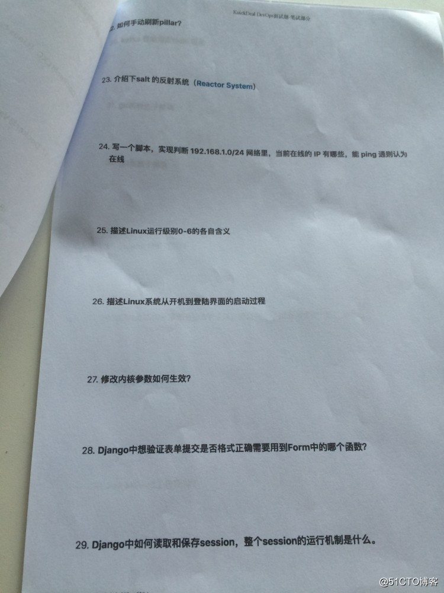
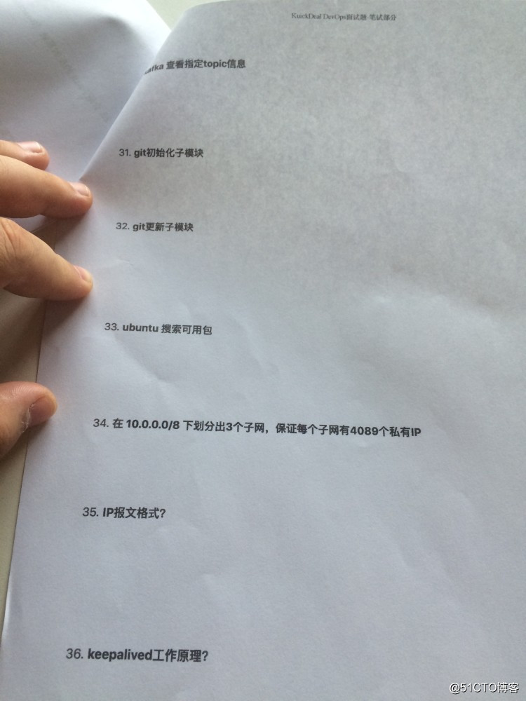
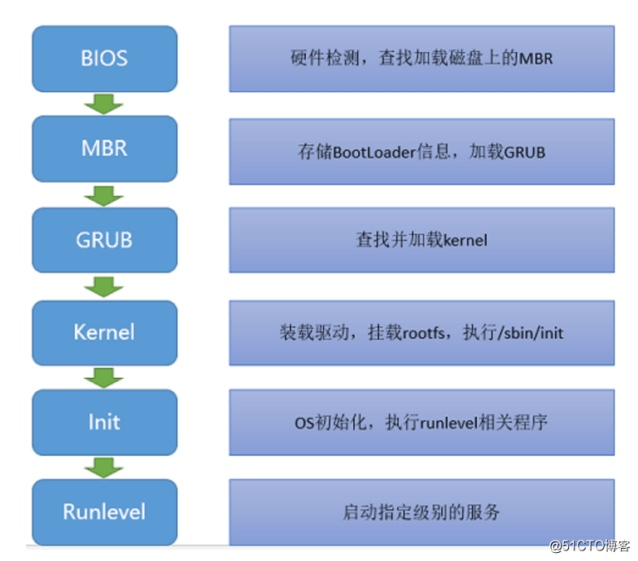

### python中生成随机数，第一次[1,2,3]，以后仍然[1,2,3]，怎么做到？（赢时胜）

使用numpy

### **numpy.random.RandomState()**

伪随机数产生器的种子

对于某一个伪随机数发生器，只要该种子（seed）相同，产生的随机数序列就是相同的

### Python静态方法、类方法和实例方法区别？（赢时胜）

### Python内存泄露，如何避免，如何优化？（赢时胜）

有__del__() 函数的对象间的循环引用是导致内存泄漏的主凶。

不使用一个对象时使用:del object 来删除一个对象的引用计数就可以有效防止内存泄漏问题。

通过Python 扩展模块gc 来查看不能回收的对象的详细信息。

可以通过sys.getrefcount(obj) 来获取对象的引用计数，并根据返回值是否为0 来判断是否内存泄漏。

### Python 递归实现累加（赢时胜）

```python
def for_sum(n):
	"""
	累加求和
	1 + 2 + ... + n
	"""
    if n == 0:
        return 0
    return for_sum(n-1) + n
```

最快的就是数据方法求和了， (1+n)*n / 2

### MySQL索引（赢时胜）

TODO

### MySQL查询重复数据（赢时胜）

MYSQL查询重复记录的方法很多，下面就为您介绍几种最常用的[MYSQL](http://database.51cto.com/art/201011/235030.htm)查询重复记录的方法，希望对您学习MYSQL查询重复记录方面能有所帮助。

| rowId | peopleId |
| ----- | -------- |
|       |          |


1、查找表中多余的重复记录，重复记录是根据单个字段（peopleId）来判断

```sql
select * from people   
where peopleId in (select peopleId from people group by peopleId having count(peopleId) > 1)
```

2、删除表中多余的重复记录，重复记录是根据单个字段（peopleId）来判断，只留有rowid最小的记录

```sql
delete from people   
where peopleId in (select peopleId from people group by peopleId   having count(peopleId) > 1)   
and rowid not in (select min(rowid) from people group by peopleId having count(peopleId )>1)
```

3、查找表中多余的重复记录（多个字段）

```sql
select * from vitae a   
where (a.peopleId,a.seq) in (select peopleId,seq from vitae group by peopleId,seq having count(*) > 1)   
```


4、删除表中多余的重复记录（多个字段），只留有rowid最小的记录

```sql
delete from vitae a   
where (a.peopleId,a.seq) in (select peopleId,seq from vitae group by peopleId,seq having count(*) > 1)   
and rowid not in (select min(rowid) from vitae group by peopleId,seq having count(*)>1)   
```


5、查找表中多余的重复记录（多个字段），不包含rowid最小的记录

```sql
select * from vitae a   
where (a.peopleId,a.seq) in (select peopleId,seq from vitae group by peopleId,seq having count(*) > 1)   
and rowid not in (select min(rowid) from vitae group by peopleId,seq having count(*)>1)   
```


### 100G文件，每行1个数字，如何快速计算出每个数字的出现次数？（赢时胜）

map/reduce， 分而治之，将大文件分成多个小文件，最后再将结合合并。类似于下题。

> 有一个1G大小的一个文件，里面每一行是一个词，词的大小不超过16字节，内存限制大小是1M。返回频数最高的100个词。 
>
> 　　方案：顺序读文件中，对于每个词x，取hash(x)%5000，然后按照该值存到5000个小文件（记为x0,x1,...x4999）中。这样每个文件大概是200k左右。 
>
> 　　如果其中的有的文件超过了1M大小，还可以按照类似的方法继续往下分，直到分解得到的小文件的大小都不超过1M。 对每个小文件，统计每个文件中出现的词以及相应的频率（可以采用trie树/hash_map等），并取出出现频率最大的100个词（可以用含100个结点的最小堆），并把100个词及相应的频率存入文件，这样又得到了5000个文件。下一步就是把这5000个文件进行归并（类似与归并排序）的过程了。 

### Nginx如何实现故障转移的，如何配置，原理呢？(第三石科技)

Nginx默认就是有故障转移的，只要在upstream里配置了多个host，默认的proxy_next_upstream

```
server  
{  
     listen       80;  
     server_name   www.yourdomain.com 192.168.203.42;  
     index index.html index.htm;  
     root   /data/htdocs/www;    
 
    location /  
    {  
     #故障转移的条件：如果后端的服务器返回502、504、执行超时等错误，自动将请求转发到upstream负载均衡池中的另一台服务器，实现故障转移。  
     proxy_next_upstream http_502 http_504 error timeout invalid_header;  
     
     proxy_send_timeout 10s;    # 代理发送超时时间
     proxy_read_timeout 10s;    # 代理接收超时时间
     proxy_next_upstream_tries 3;      # 重试次数

     proxy_cache cache_one;  
       
     #对不同的HTTP状态码设置不同的缓存时间  
     proxy_cache_valid   200 304 12h;  
       
     #以域名、URI、参数组合成Web缓存的Key值，Nginx根据Key值哈希，存储缓存内容到二级缓存目录内  
     proxy_cache_key $host$uri$is_args$args;  
     proxy_set_header Host   $host;  
     proxy_set_header X-Forwarded-For   $remote_addr;  
     proxy_pass http://backend_server;  
     expires       1d;  
    }  
} 

```


### 高并发的前提下，Session应当如何存储？(第三石科技)

### Celery了解吗？(第三石科技)

并发异步xx

### 用Redis实现限制爬虫，1秒最多只能请求10次，如何做？(第三石科技)

在Redis中set ip 请求次数 ex 1。

就是以请求的ip为键，值是请求次数，过期时间1秒。如果1秒超过了10次，那么就再创建一个"date"+ip 的键，值随意，过期时间24小时，表示这个ip 24小时之后才能再访问。


## **2018年企业运维开发经典面试题**

面试题如下：










### 1、描述Hbase中scan和get的功能以及实现的异同

HBase的查询实现只提供两种方式： 1、按指定RowKey获取唯一一条记录，get方法（org.apache.hadoop.hbase.client.Get） 2、按指定的条件获取一批记录，scan方法（org.apache.hadoop.hbase.client.Scan） 实现条件查询功能使用的就是scan方式

### 2、redis的并发竞争问题如何解决

方案一：可以使用独占锁的方式，类似操作系统的mutex机制。（网上有例子，http://blog.csdn.net/black_ox/article/details/48972085不过实现相对复杂，成本较高）

方案二：使用乐观锁的方式进行解决（成本较低，非阻塞，性能较高）

### 3、为什么redis需要把所有数据放到内存中

redis为了达到最快的读写速度将数据都读到内存中，并通过异步的方式将数据写入磁盘。所以redis具有快速和持久化的特征。如果不将数据放在内存中，磁盘I/O速度会严重影响redis的性能。如果使用了最大使用的内存，则数据已有记录数达到内存限值后不能继续插入新值。

### 4、redis支持的数据类型

Redis支持五种数据类型：string（字符串），hash（哈希），list（列表），set（集合）及zset(sorted set：有序集合)。

### 5、处理中文时出现错误‘ascil’ codec can't decode byte 0xe9 in position 0:ordinal not in range(128) 解决办法“UnicodeDecodeError”:'ascli' codec decode byte 0xe9 in posttion 0:ordinal not in range(128)

解决办法，在该python文件的前面加上如下几句，问题得到解决。

import sys
default_encoding = 'utf-8'
if sys.getdefaultencoding() != default_encoding:
reload(sys)
sys.setdefaultencoding(default_encoding)

### 6、python里面match()和search()的区别

match()函数只检测RE是不是在string的开始位置匹配，search()会扫描整个string查找匹配；
也就是说match()只有在0位置匹配成功的话才有返回，如果不是开始位置匹配成功的话，match()就返回none。
例如：
print(re.match('super', 'superstition').span()) 会返回(0, 5)
而print(re.match('super', 'insuperable')) 则返回None
search()会扫描整个字符串并返回第一个成功的匹配：
例如：print(re.search('super', 'superstition').span())返回(0, 5)
print(re.search('super', 'insuperable').span())返回(2, 7)
其中span函数定义如下，返回位置信息：
span([group]): 
返回(start(group), end(group))。

### 7、python里面如何实现tuple和list的转换

Python中，tuple和list均为内置类型，
以list作为参数将tuple类初始化，将返回tuple类型
tuple([1,2,3]) #list转换为tuple
以tuple作为参数将list类初始化，将返回list类型
list((1,2,3)) #tuple转换为list

### 8、请写出一段python代码实现删除一个list里面的重复元素

我写的代码：

list1 = [5,1,3,1,6,2,3]

list2 = []

for i in list1:
if i not in list2:
list2.append(i)
else:
continue
list1=list2

网上给出的答案：
for i in list1:
if i not in list2:
list2.append(i)
else:
continue

### 9、如何批量删除或者停止运行的容器

docker rm -f $(docker ps -a)

### 10、docker本地镜像文件放在哪

/var/lib/docker

### 11、构建docker镜像应该遵循哪些规则

整体原则上，尽量保持镜像功能的明确和内容的精简，要点包括： 
尽量选取满足需求但较小的基础系统镜像，例如docker.io/centos7
清理编译生成文件、安装包的缓存等临时文件
安装各个软件是要指定准确的版本号，并避免引入不需要的依赖
应用尽量使用系统的库和依赖
使用dockerfile创建镜像时要添加.dockerignore文件或使用干净的工作目录

### 12、容器退出后，通过docker ps 命令查不到，数据会丢失吗

不会

### 13、docker查看日志

docker logs -f 容器id

### 14、如何控制容器占用系统资源（cpu、内存）的份额

：在使用 docker create 命令创建容器或使用 docker run 创建并启动容器的时候，可以使用 -c|--cpu-shares[=0] 参数来调整容器使用 CPU 的权重；使用 -m|--memory[=MEMORY] 参数来调整容器使用内存的大小。

### 15、如何根据容器的名字列出容器状态

docker status 容器id

### 16、docker与LXC有何不同

lxc 是 Linux 内核容器虚拟化的一项技术，可以实现资源的隔离和控制，也就是对 Cgroup 和 Namespace 两个属性的控制。对于 docker 而言，它发展到现在不仅仅是容器的代名词了，不过它的基础技术是需要依赖内核的 Cgroup 和 Namespace 特性。docker 出现之初，便是采用了 lxc 技术作为 docker 底层，对容器虚拟化的控制。后来随着 docker 的发展，它自己封装了 libcontainer （golang 的库）来实现 Cgroup 和 Namespace 控制，从而消除了对 lxc 的依赖。总结一下，lxc 是早期版本 docker 的一个基础组件，docker 主要用到了它对 Cgroup 和 Namespace 两个内核特性的控制。

### 17、docker与Vagrant有何不同

Vagrant适合用来管理虚拟机，而docker适合用来管理应用环境。

### 18、开发环境中docker与vagrant如何选择

Docker是应用执行环境，不是虚拟机，对于宿主来说只是个隔离的进程；而Vagrant是虚拟机辅助软件，使用Vagrant既使用虚拟机，因此所运行的是一个完整操作系统。这是最本质的区别。

Docker运行需要依托Linux内核，因此对于Windows, OSX系统而言，需要有一个Linux虚拟机运行起来，才可以使用Docker。因此在这种环境下，从单一虚拟机角度来说，Docker和Vagrant没有占用资源的差别。对于 Linux工作环境来说，那就没有这个问题，使用Docker要比Vagrant轻量级很多。

而在OSX, Windows下使用Docker和Vagrant开发，很重要的一个问题在于共享文件目录上。之前大家在这两个系统上安装的Docker环境都是通过Docker Toolbox （ https://docs.docker.com/toolbox/overview/ ）来安装配置的，它使用的是Virtualbox，对于共享主机文件目录到Docker环境上有一些问题，大多数情况能用，但是部分情况会出故障。所以相对于 Docker Toolbox的环境而言，如果需要一些文件目录监控等高级功能，vagrant更适合开发。

但是，这个问题现在已经解决，Docker刚刚发布了Docker for Mac/Windows (beta) （https://docs.docker.com/docker-for-mac/），这将不在使用Virtualbox，而是使用 xhype (OSX), Hyper-V (Windows 10) 来运行一个更为精简的Linux (Alpine)。由于使用了操作系统原生虚拟框架，因此共享目录上的种种问题得到了解决，此外 Alpine 的使用，让Linux虚拟机加载更为迅速。所以在这种情况下，使用 Docker 要比 Vagrant 有更多的优势。

所以，从未来角度看，Docker是大势所趋。

### 19、salt minion配置文件的默认路径

/etc/salt/minion

### 20、如何手动刷新pillar

在master端定义，指定给对应的minion。可以使用saltuitl.refresh_pillar刷新。

### 21、介绍下salt的反射系统

略

### 22、写一个脚本，判断192.168.1.0/24网络里，当前在线ip有哪些

\#!/bin/bash
for ip in `seq 1 255`
do
{
ping -c 1 192.168.1.$ip > /dev/null 2>&1
if [ $? -eq 0 ]; then
echo 192.168.1.$ip UP
else
echo 192.168.1.$ip DOWN
fi
}&
done
wait

### 23、描述linux运行级别0-6的含义

0：关机

1：单用户模式

2：无网络支持的多用户模式

3：有网络支持的多用户模式（文本模式，工作中最常使用的模式）

4：保留，未使用

5：有网络支持有X-Window支持的多用户模式

6：重新引导系统，即重启

24、linux开机过程



### 25、修改内核如何生效

source /etc/profile

### 26、Django中想验证表单提交是否格式正确需要用到Form中哪个函数

is_valid()函数方法，用于检查表单提交是否正确。

### 27、Django中如何读取和保存session，整个session的运行机制是什么

说到session的运行机制，就一定要先说一下cookie这一段信息。一般情况下cookies都是我们的浏览器生成的（显然可以人为修改），用于服务器对户进行筛选和维护，但是这个听上去很好吃的东西，能存的东西有点少而且容易被别人利用。这时候基于cookies的session的意义就比较明显了，在客户端的cookies中我们只保存session id，而将完整信息以加密信息的形式保存到服务器端，这样服务器可以根据session id相对安全的在数据库中查询用户的更细致的信息和状态。

### 28、kafka查看指定topic信息

bin/kafka-topics.sh --zookeeper node01:2181 --describe --topic t_cdr

### 29、git初始化和更新子模块

git submodule init 初始化子模块
git submodule update 更新子模块

### 30、ubuntu搜索可用包

apt-cache search package-name

### 31、在10.0.0.8/8中划分出3个子网，保证每个子网有4089个私有ip

略，本人不太精通子网划分

### 32、ip报文格式

版本：IP协议的版本，目前的IP协议版本号为4，下一代IP协议版本号为6。

首部长度：IP报头的长度。固定部分的长度（20字节）和可变部分的长度之和。共占4位。最大为1111，即10进制的15，代表IP报头的最大长度可以为15个32bits（4字节），也就是最长可为15*4=60字节，除去固定部分的长度20字节，可变部分的长度最大为40字节。

服务类型：Type Of Service。

总长度：IP报文的总长度。报头的长度和数据部分的长度之和。

标识：唯一的标识主机发送的每一分数据报。通常每发送一个报文，它的值加一。当IP报文长度超过传输网络的MTU（最大传输单元）时必须分片，这个标识字段的值被复制到所有数据分片的标识字段中，使得这些分片在达到最终目的地时可以依照标识字段的内容重新组成原先的数据。

标志：共3位。R、DF、MF三位。目前只有后两位有效，DF位：为1表示不分片，为0表示分片。MF：为1表示“更多的片”，为0表示这是最后一片。

片位移：本分片在原先数据报文中相对首位的偏移位。（需要再乘以8）

生存时间：IP报文所允许通过的路由器的最大数量。每经过一个路由器，TTL减1，当为0时，路由器将该数据报丢弃。TTL 字段是由发送端初始设置一个 8 bit字段.推荐的初始值由分配数字 RFC 指定，当前值为 64。发送 ICMP 回显应答时经常把 TTL 设为最大值 255。

协议：指出IP报文携带的数据使用的是那种协议，以便目的主机的IP层能知道要将数据报上交到哪个进程（不同的协议有专门不同的进程处理）。和端口号类似，此处采用协议号，TCP的协议号为6，UDP的协议号为17。ICMP的协议号为1，IGMP的协议号为2.

首部校验和：计算IP头部的校验和，检查IP报头的完整性。

源IP地址：标识IP数据报的源端设备。

目的IP地址：标识IP数据报的目的地址。

### 33、keepalived工作原理

Keepalived提供了很好的高可用性保障服务，它可以检查服务器的状态，如果有服务器出现问题，Keepalived会将其从系统中移除，当这台服务器可以正常工作后，Keepalived再将其放入服务器群中，这个过程是Keepalived自动完成的，不需要人工干涉，我们只需要修复出现问题的服务器

**Keepalived是如何工作的？**

以检测web服务器为例，Keepalived从3个层次来检测服务器的状态

**（1）IP层**

看网络是否正常

网络层（3）：Keepalived通过ICMP协议向服务器集群中的每一个节点发送一个ICMP数据包(有点类似与Ping的功能)，如果某个节点没有返回响应数据包，那么认为该节点发生了故障，Keepalived将报告这个节点失效，并从服务器集群中剔除故障节点。

**（2）TCP层**

看web服务器端口是否正常

传输层（4）：Keepalived在传输层里利用了TCP协议的端口连接和扫描技术来判断集群节点的端口是否正常，比如对于常见的WEB服务器80端口。或者SSH服务22端口，Keepalived一旦在传输层探测到这些端口号没有数据响应和数据返回，就认为这些端口发生异常，然后强制将这些端口所对应的节点从服务器集群中剔除掉。

**（3）应用层**

看应用程序是否正常

应用层（5）：，Keepalived的运行方式也更加全面化和复杂化，用户可以通过自定义Keepalived工作方式，例如：可以通过编写程序或者脚本来运行Keepalived，而Keepalived将根据用户的设定参数检测各种程序或者服务是否允许正常，如果Keepalived的检测结果和用户设定的不一致时，Keepalived将把对应的服务器从服务器集群中剔除。

> 最近因为工作,使用了keepalived,说一下我的理解。
>
> 主机A； ip地址: ipA ；mac地址: macA 
>
> 备机B ；ip地址: ipB ；mac地址: macB
>
> 虚拟ip地址: vip
>
> keepalived分别安装在主机A和备机B上,双方启动以后,主机A就会向==局域网内==发送arp响应包,该arp响应包的ip地址被设为vip,mac地址被设为macA,所有接收的此报文的电脑就会将这个对应关系写入自己的ARP缓存表中,下次访问vip时,就会根据对应的mac地址访问到主机A
>
> 当备机B监听到主机A挂了的时候,就会向局域网内发送arp响应包,并将arp响应包的ip地址设为vip,mac地址设为macB,所有接收的此报文的电脑就会将这个对应关系写入自己的ARP缓存表中,下次访问vip时,就会根据对应的mac地址访问到备机B
>
> 这样就实现了高可用
>
> 主机A和备机B之间通过VRRP协议实现监听和选举

